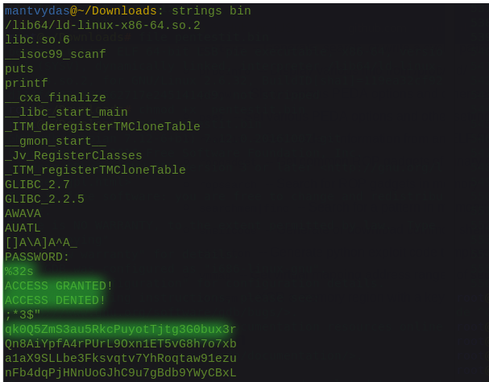
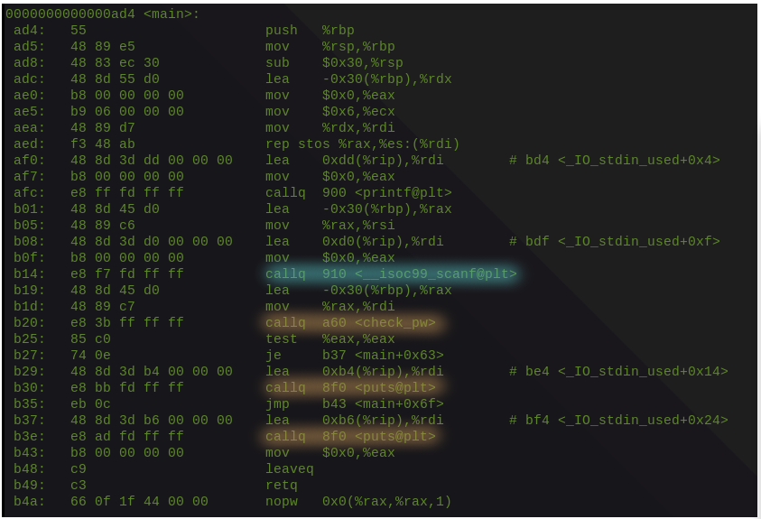
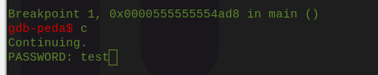
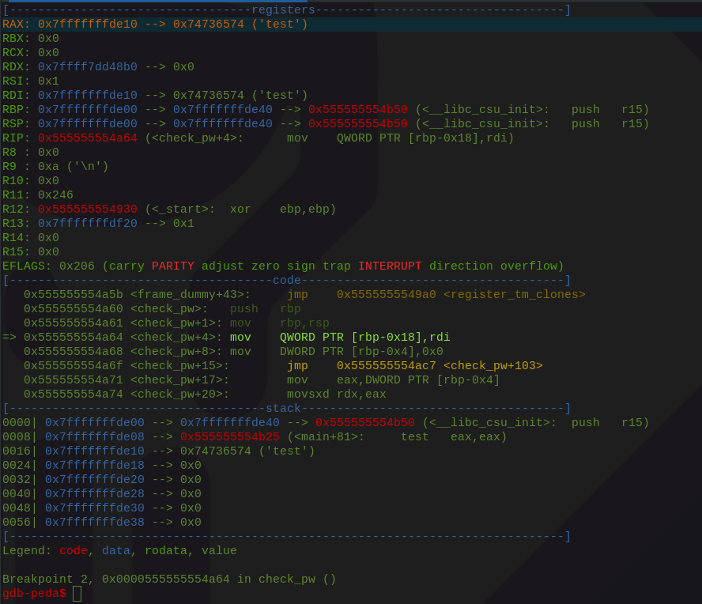
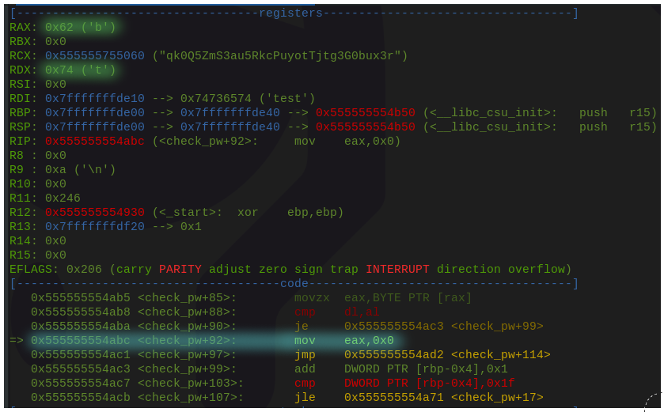
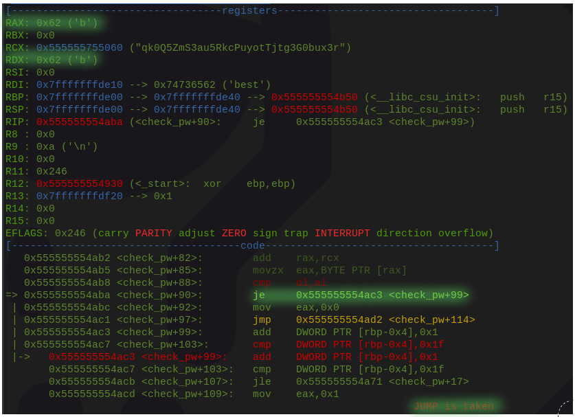

# Reversing Password Checking Routine

## Context

A couple of my internet fellas were working on a CTF that presented them a binary file, which had the flag inside they had to retrieve. I jumped on this without expecting much, but anyway.

## Triage

I did a quick `file bin` to check what type of file it was:


The file was a non-stripped out linux binary file, which means debugging will be easier since we will be able to see original function names used in the binary.

## Strings

I ran the file through strings `strings bin` to see if anything stood out:



We can notice some interesting things that we can make some assumptions about - notably the following strings:

* ACCESS GRANTED/ACCESS DENIED - possibly will need to enter a password somewhere in the binary and these messages will be printed to the user depending on if the provded password is correct/incorrect.
* some long strings - maybe something interesting encoded here or maybe those strings are used as part of the password decryption algorithm?
* a string `%32s` - maybe a C string output format \(32 characters\)?

Simply running the file prompted for a password and failed with an error message `ACCESS DENIED`:


## Disassembly

Let's have a quick look at the disassembly of the file and look at its `main` function:

```text
objdump -d bin | more
```



Note the following from the above screenshot:

* We can see that at offset `b14` \(cyan\) there is a C function `scanf` called which reads from the standard input.
* instruction at `b20` \(orange\) calls a `check_pw` routine - we can assume that the input captured from the instruction at `b14` will be passed to `check_pw` function to decide if the string received from the standard input matches the password the binary is protected with or not
* instruction at `b25` carries out a check against the `eax` register and based on if eax==0 or eax!=0, it will  either take a jump to instructions at `b27` \(if eax==0\) or continue executing instructions at `b29` if eax!=0. Pressumably, the jumps are carried out based on if the provided password is correct or incorrect.

## GDB

* Let's look at the file through GDB with Peda plugin
  * Let's set a break point on the main function 
  * Do a quick `disas` of the `main` function to remind ourselves once again what the routine for password checking was
  * Let's set a breakpoint `check_pw` routine as well

```text
gdb bin
b main
disas
b check_pw
```


Let's hit `c` to continue running the program until the `scanf` function is called and then provide it with some dummy password, say `test`:



### Check\_pw Routine: Round 1

Once the password is entered, the program breaks on `check_pw`:



If we skip through instructions one by one and keep observing how register values change over time and what instructions are executed, we will soon end up at `check_pw+88`:


Note this from the above screenshot:

* current instruction at `check_pw+88: cmp dl, al` - al and dl register values are being compared
* register `rax` and `rdx` values are `b` and `t` respectively \(organge at the top\). If you followed the register values whilst stepping through the code, you would notice that the value in the rdx is actually the first letter of our password **`t`**`est`. Having said this, it looks like the binary is checking if the first character of the  provided password is actually an ascii **`b`**
* If `dl==al`, the code should jump to `check_pw+99` as seen at offset `check_pw+90`

However, stepping through the instructions further, we can see that the jump is NOT taken - the program continues executing instructions at offset `check_pw+92` - suggesting the first character of the password does NOT start with a **`t`**:



### Check\_pw Routine: Round 2

What if we rerun the program and supply it with a password **`b`**`est` this time \(replacing the first `t` with `b`, since the binary seemed to be expecting to see in the `dl` register\)?

Well, this time the `cmp al,dl` sets the `zero` flag to `true` and the jump at `check_pw+90` is taken - suggesting that the first character of the password is indeed a **`b`**:



If we repeat this process 32 more times \(remember the `%32s` string discussed previously?\), we will eventually get the full password:


Going back to the long strings we saw earlier - they were indeed used in the password decryption routine, but going through the algorithm is out of scope for today:


Now, there is probably a better/automated way of solving this, so if you know a better way, I would like to hear about it!

