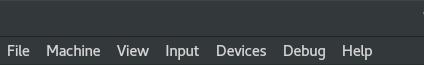
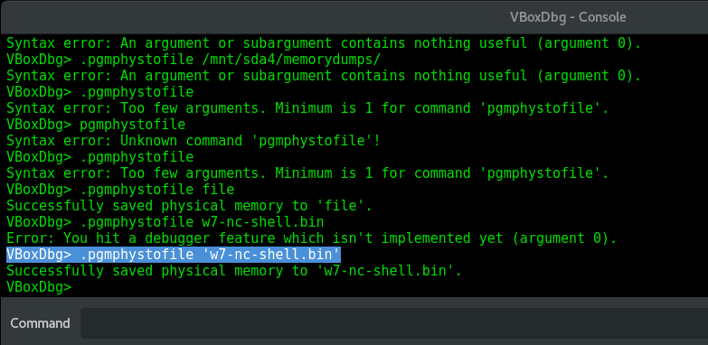

# Dump Virtual Box Memory

## List Available VMs

```erlang
cd "C:\Program Files\Oracle\VirtualBox\"
.\VBoxManage.exe list vms

...
"win1002 debugee" {5f176ebb-a0cc-4dc7-9c6f-988fcbcca867}
...
```

## Enable Debug Mode


```bash
mantvydas@~: virtualbox --startvm 'yourVMName or VM UUID' --dbg
```


## Dump VM Memory

Launch the VirtualBox debug console by navigating to "Debug" menu an select "Command Line":



Once you select "Command Line", you will be presented with a console that looks like this:



To create a memory dump, issue the below command \(also highlighted in the above graphic\):


```text
VBoxDbg> .pgmphystofile 'w7-nc-shell.bin'
```


## Persistence

If you want the debug options to be always available, you can:

* export `VBOX_GUI_DBG_ENABLED=true` before launching the VM or
* put export `VBOX_GUI_DBG_ENABLED=true` in your `.bashrc` or `/etc/environment` 

