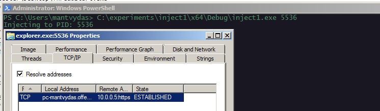
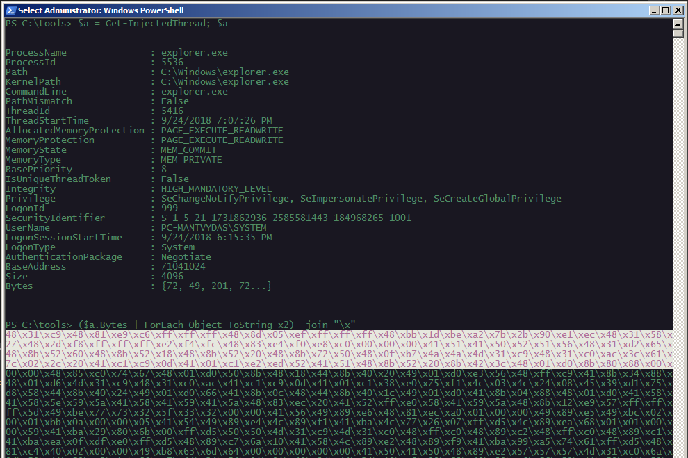
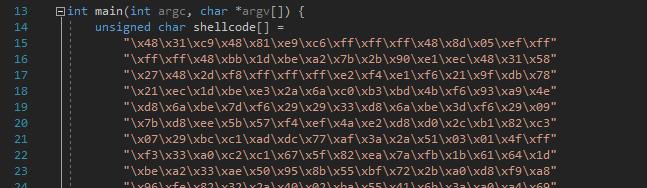
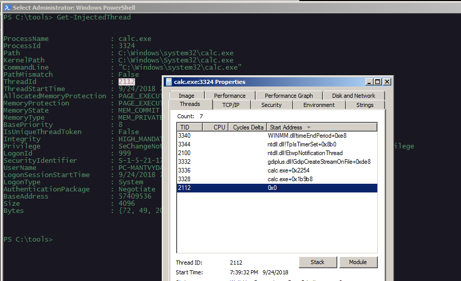
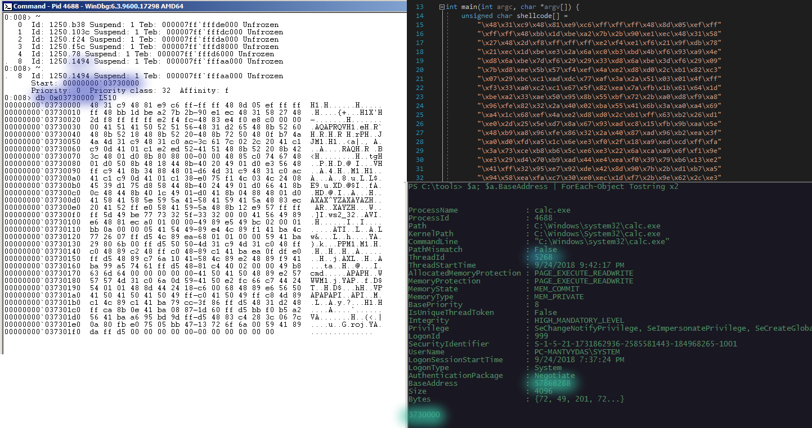
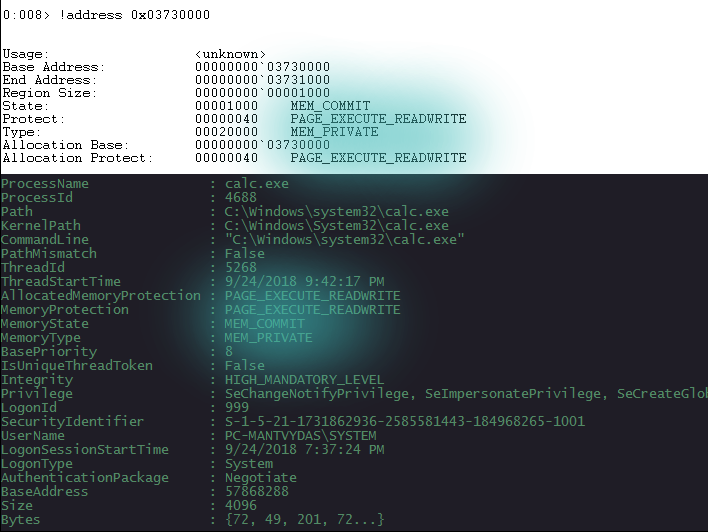

# Exploring Injected Threads

## Injecting Shellcode

Firstly, let's use an [injector](../offensive-security/code-injection-process-injection/process-injection.md) program we wrote earlier to inject some shellcode into a process that will give us a reverse shell. In this case, we are injecting the shellcode into explorer.exe:



## Detecting Injection

Now that we have injected the code into a new thread of the explorer.exe process, let's scan all the running processes for any injected threads using [Get-InjectedThreads.ps1](https://gist.github.com/jaredcatkinson/23905d34537ce4b5b1818c3e6405c1d2):

```csharp
$a = Get-InjectedThread; $a
```

Looks like the injected thread was successfully detected:


## Cross-checking Shellcode

Lets check the payload found in the injected thread:

```csharp
($a.Bytes | ForEach-Object tostring x2) -join "\x"
```



and cross-verify it with the shellcode specified in our injector binary. We see they match as expected:



## Inspecting with WinDBG

In order to inspect the newly created thread that executes the above shellcode with WinDBG, we need to know the injected thread id. For this, we use Process Explorer and note the newly created thread's ID which is `2112`. Note the `ThreadId` is also shown in the output of Get-InjectedThread powershell script:



We can get all the threads for a process being debugged in WinDBG with `~` command:


Additionally, in order to inspect the bytes stored/executed in the injected thread, we need to get the thread's `StartAddress` which can be retrieved with  `~.` command when in the context of the thread of interest.

Below graphic shows the injected thread's contents with WinDBG:



The above also highlights the thread `0x1494 = 5268` ID. That thread is then inspected for its `StartAddress`, which happened to be `0x03730000 = 57868288`. 

For reference, the original shellcode bytes are displayed in the upper right corner. Bottom right corner shows the output of the `Get-InjectedThreads` indicating `ThreadId` and `StartAddress` in decimal.

## How Get-InjectedThreads detects code injection?

One of the things Get-InjectedThreads does in order to detect code injection is: 

* it enumerates all the threads in each running process on the system
* performs the following checks on memory regions holding those threads: `MemoryType == MEM_IMAGE && MemoryState == MEM_COMMIT` 
* If the condition is not met, it means that the code, running from the thread being inspected, does not have a corresponding image file on the disk, suggesting the code may be injected directly to memory.

Below graphic shows details of the memory region containing the injected thread using WinDBG and Get-InjectedThreads. Note the Type/MemoryType and State/MemoryState in WinDBG/Get-InjectedThreads outputs respectively:



## References







