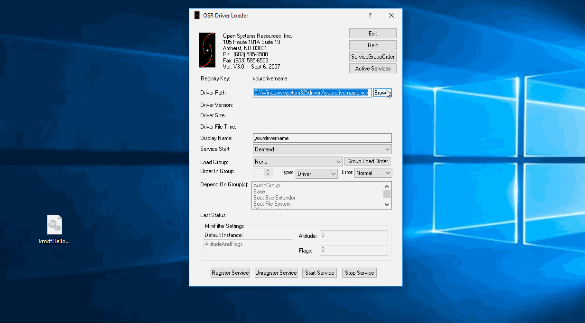
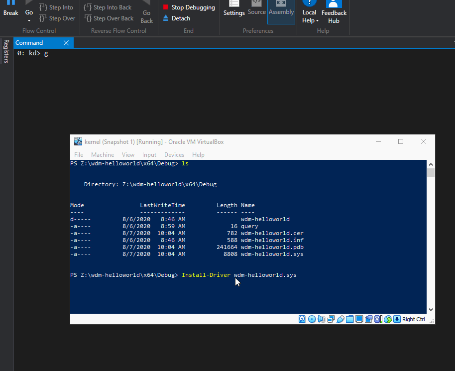
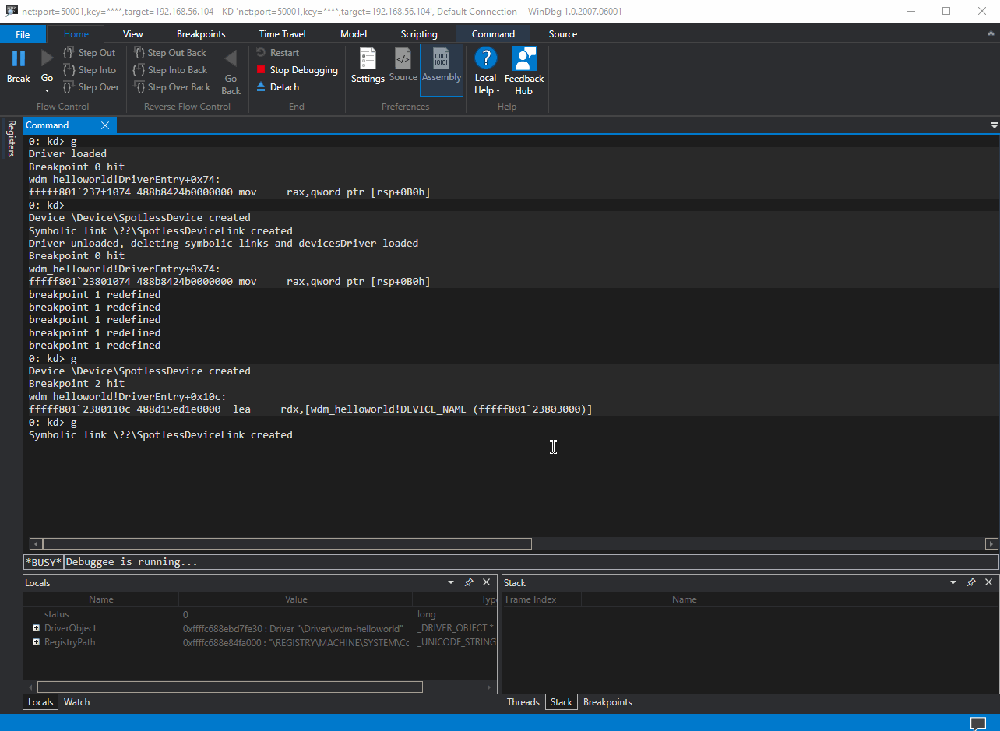

# Loading Windows Kernel Driver for Debugging

## Loading a Driver with OSR Driver Loader

On the system where you want to load your driver \(debugee\), from an elevated command prompt, disable the driver integrity checks so that we can load our unsigned drivers onto Windows 10:

```text
bcdedit /set nointegritychecks on; bcdedit /set testsigning on
```


Once you have rebooted the system, open up the [OSR Loader](https://www.osronline.com/article.cfm%5Earticle=157.htm) and load the driver as shown below:



Note that my driver name was `kmdfHelloDriver`. We can now confirm the driver loaded successfully by debugging the kernel:

```text
0: kd> db kmdfHelloDriver
```


Additionally, we can check it this way by showing some basic details about the loaded module:

```text
0: kd> ln kmdfHelloDriver
```


If we check it via the service configuration manager, we also see that our driver is now loaded and running:

```text
sc.exe query kmdfHelloDriver
```


## Loading a Driver via Command Prompt + WinDBG

The benefit of loading a kernel driver this way is that it does not rely on OSR Driver Loader or any other 3rd party tools and also is much more efficient.


**Important**  
In order for this technique to work, the WinDBG debugger needs to be attached to the debugee.


### Preparing Powershell Profile

On the debuggee, launch an elevated powershell console and do the following:

```text
notepad $PROFILE.AllUsersAllHosts
```

in the powershell profile, add the following powershell function:

```csharp
function Install-Driver($name)
{
	$cleanName = $name -replace ".sys|.\\", ""

	sc.exe stop $cleanName
	sc.exe delete $cleanName

	cp $name c:\windows\system32\drivers\ -verbose -force
	sc.exe create $cleanName type= kernel start= demand error= normal binPath= c:\windows\System32\Drivers\$cleanName.sys DisplayName= $cleanName

	sc.exe start $cleanName
}
```

The above function `Install-Driver` takes one parameter `$name`, which signifies a driver name that we want to install. 

The function `Install-Driver` will:

* Attempt to stop the service \(unload the driver\) if it's already running \(no error checking\)
* Attempt to delete the service \(no error checking\)
* Copy the driver from the current directory to c:\windows\system32\drivers
* Create a service for the driver
* Start the service \(load the driver\)

Below screenshot shows the two steps explained above:



Once the powershell profile is saved, close the powershell console and open it again for the function `Install-Driver` to become usable.


### Loading the Driver

Navigate to the folder that contains the .sys file of the driver you want to install, which in my case is `wdm-helloworld.sys` in Z:\wdm-helloworld\x64\Debug:


Now, we can install the driver by simply invoking:

```csharp
Install-Driver wdm-helloworld.sys
```



### Stepping through Source Code

If we have source code for the driver we want to debug, we can load its source code and step through it in WinDBG.  Load the source code via the `Source > Open Source File` and re-load the driver again using `Install-Driver` function:



