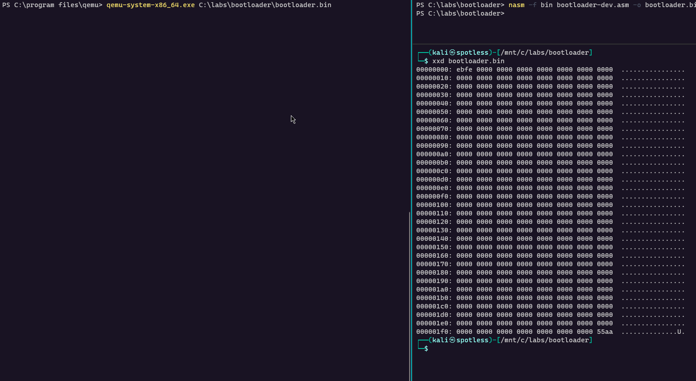

# Writing a Custom Bootloader

The purpose of this lab is to:

* Familiarize with bootloaders - what it is, who loads it, when, how and where
* Familiarize with some BIOS interrupts
* Learn how to write a simple valid bootloader (it does not have to do anything useful)
* Try [Qemu](https://www.qemu.org/download/) and exercise assembly and [NASM](https://www.nasm.us)
* Attempt to bake the bootloader into a USB stick and try to boot it

## Bootloader Overview

* Bootloader is a program that is loaded into computer's Random Access Memory (RAM) by the BIOS, after it finishes with its Power-On Self Test (POST);
* Bootloader's primary purpose is to help computer find the Operating System it needs to load. Most of the time though, it means loading a second bootloader, because the first bootloader has a size limit of 512 bytes;
* When BIOS needs to load an OS, it goes through the available devices on the system such as HDDs / CD-ROM / USB / Floppy and checks if any of them are bootable and contain a bootloader by:
  1. Reading in the first 512 bytes (boot sector) from the medium and storing them at computer memory location `0x7c00`;
  2. Checking if the last 2 bytes are `0xaa55` - the magic number signifying to the BIOS that it's a bootable disk that contains a bootloader;
* Once the bootloader is found, the BIOS transfers code execution to `0x7c00` and the bootloader code gets executed;
* In Windows, the bootloader loads the second stage loader called `NTLDR`, which eventually loads the Windows kernel image `c:\Windows\System32\ntoskrnl.exe`;
* During bootloader's execution, the processor operates in 16 bit mode (real mode), meaning the bootloader can only use 16 bit registers in its code.

To re-inforce the fact that bootloaders reside in the first sector of a bootable device, see below screenshot of a hex dump of the first sector of a HDD, that has Windows 10 installed on it. As a reminder, note the last 2 bytes `0xAA55` that indicate, that this sector contains a bootloader and the medium is bootable:

.png>)

## First Bootloader&#x20;

Let's create our first bootable sector that will be 512 bytes in size, using assembly code written in [NASM](https://www.nasm.us):

.png>)

Key aspects of the above code:

1. Line 2 - instructs NASM to generate code for CPU operating in 16 bit mode
2. Lines 5-6 - the bootloader's code, which is simply an infinite loop
3. Line 11 - `times 510 - ($-$$) db 0` - instructs NASM to fill the space between instruction `jmp loop` (2 bytes in size) and the last two bytes `0xaa55` (line 13, signifies the magic bytes of the boot sector) with `0x00` 508 null bytes, to make sure that the boot sector is exactly 512 bytes in size.

How does NASM know it needs to pad the binary with 508 null bytes?

* $ - address of the current instruction - `jmp loop` (2 bytes)
* \$$ - address of the start of our code section - 0x00 when the binary is on the disk

Given the above, `times 510 - ($-$$) db 0` reads as - pad the binary with 00 bytes 508 times: 510 - (2-0) = 508.&#x20;

Visually, our first booloader binary, once compiled, should have the structure like the graphic on the left:

.png>)


In the above screenshot on the right, we can see the structure of how a real-life bootloader should look like, but for this lab, we're going to ignore it.


Again, note that the total size of the bootloader is 512 bytes:

* 2 bytes for instructions jmp loop
* 508 NULL bytes
* 2 magic bytes

If we compile the following bootloader code:


```csharp
; Instruct NASM to generate code that is to be run on CPU that is running in 16 bit mode
bits 16

; Infinite loop
loop:
    jmp loop

; Fill remaining space of the 512 bytes minus our instrunctions, with 00 bytes
; $ - address of the current instruction
; $$ - address of the start of the image .text section we're executing this code in
times 510 - ($-$$) db 0
; Bootloader magic number
dw 0xaa55
```


...with NASM like so:

```
nasm -f bin bootloader-dev.asm -o bootloader.bin
```

...and dump the bytes of `bootloader.bin`, we can confirm that our bootloader file structure is as follows - 2 bytes for the `jmp loop` instruction (`eb fe`) at offset 0, followed by 510 null bytes and 2 magic bytes `0x55aa` at the end, making up a total of 512 bytes:

.png>)

## Emulate the Bootloader

We can now check if we can load our bootloader with qemu:

```
cd c:\program files\qemu
qemu-system-x86_64.exe C:\labs\bootloader\bootloader.bin
```

Below shows how our bootloader is executed from the hard disk and goes into an infinite loop:



## Bootloader Location in Memory

As mentioned previously, BIOS reads in the boot sector (512 bytes), containing the bootloader, from a bootable device into computer memory. It's known that bootloader gets stored at the memory location `0x7c00` as shown in the below graphic:

.png>)

We can confirm that the bootloader code is placed at `0x7c00` by performing two simple tests.

### Test 1

Let's take a look at the below code:


```csharp
bits 16

; Define a label X that is a memory offset of the start of our code.
; It points to a character B.
x:
    db "B"

; Move offset of x to bx
mov bx, x

; Add 0x7c00 to bx - it's universally known that BIOS loads bootloaders to this location.
; add bx, 0x7c00

; Move contents of bx to al
mov al, [bx]

; Prepare interrupt to print a character in TTY mode and issue the interrupt.
mov ah, 0x0e
int 0x10                                                

times 510 - ($-$$) db 0
dw 0xaa55
```



Note the line 12 with instrunctions `add bx, 0x7c00` is commented out - we will uncomment it in Test 2 and confirm that the bootloader is indeed loaded at `0x7c00`.


...which does the following:

* Creates a label `X` that is a memory offset to the character `B` from **the start of** **computer** **memory.** Important to highlight - label offset is not relative to the start of our code location in memory, but from the start of computer memory.
* Populate `bx` with the offset of the label `x` (0 in our case) with the aim to make `bx` point to the character `B`.
* Dereference `bx` (take the value from memory address pointed to by the `bx`) and put it in `al`
* Issue a BIOS interrupt and attempt to print the value of `al` to the screen, which one could expect to be the character `B`, but as we will soon see, will not be the case.


**Remember**\
****The CPU treats assembly labels (like our label `x`) as offsets from the start of computer memory and not from the start of the memory location where our code is loaded to.


We can compile the above code with `nasm -f bin .\bootloader-x.asm -o bootloader.bin` and launch it with `qemu-system-x86_64.exe C:\labs\bootloader\bootloader.bin` and see the result:

.png>)

Note how instead of seeing the character `B`, we actually see a character `S`, which suggests that we are simply reading the wrong memory location and our character `B` is not stored in memory where we thought it was.

For reference, this is a snippet of the hex dump of our `bootloader.bin` we've just compiled:

.png>)

In the above screenshot, note that the very first byte (offset 0 while it's on disk) is `42`, which is a letter `B` in ASCII - the character our label `x` is pointing to, which we wanted to print to the screen with Test 1, but failed. Let's look at the Test 2.

### Test 2

Test 1 confirmed that we do not know where the character `B` is located in memory. Let's now take the same code we used in the Test 1 and uncomment the instruction `add bx, 0x7c00` in line 12, which adds `0x7c00` to our label `x`:


```cpp
bits 16

; Define a label X that is a memory offset of the start of our code.
; It points to a character B.
x:
    db "B"

; Move offset of x to bx
mov bx, x

; Add 0x7c00 to bx - it's universally known that BIOS loads bootloaders to this location.
add bx, 0x7c00

; Move contents of bx to al
mov al, [bx]

; Prepare interrupt to print a character in TTY mode and issue the interrupt.
mov ah, 0x0e
int 0x10                                                

times 510 - ($-$$) db 0
dw 0xaa55
```


...and re-compile the above code with `nasm -f bin .\bootloader-x.asm -o bootloader.bin` and launch it with `qemu-system-x86_64.exe C:\labs\bootloader\bootloader.bin`:

.png>)

...we can now see that the character `B` is finally printed to the screen, which confirms that our bootlaoder code (and the character `B`) is located at memory location `0x7c00`.

Indeed, if we inspect the qemu process memory, that has our bootloader loaded and running, search for the bytes `42bb 0000 8a07 b40e cd10 0000` (the starting bytes of our bootloader, as seen in the hex dump on the right hand side highlighted in lime), we can see that our bootloader resides at 44D**07C00**:

.png>)

Note that in the above screenshot, the character `B` **** (in red) is our character `B` that we print to the screen, that sits at the start of our bootloader - at offsets `0x0` in a raw binary on the disk and `0x07c00` when it's loaded to memory by the BIOS as a bootloader, or in the case of emulation with qemu - at `0x44d`**`07c00`**.

### `org 0x7c00` / NASM org directive

Test 2 confirms we now know where our bootloader is loaded in memory, but adding `0x7c00` to our operations each time we need to reference some label is not ideal. Lukcily, we can instruct NASM to calculate offsets to the labels in our code in relation to the memory address of our liking (i.e `0x7c00`), by utilising the directive `org 0x7c00`. This simply tells NASM that we expect our program to be loaded at `0x7c00` and it's almost like we're saying to NASM: "Hey, please keep in mind that we expect this code to be located at `0x7c00`, so whenever you calculate any offsets for us, please calculate those in relation to that `0x7c00` - much appreciated".

Let's take the code from Test 1 (with lines 14-15 comented out, that we uncommented in the Test 2) and add `org 0x7c00` before our code - in line 4:

```cpp
bits 16

; Tell NASM that we expect our bootloader to be laoded at this address, hence offsets should be calculated in relation to this address
org 0x7c00

; Define a label X that is a memory offset of the start of our code.
; It points to a character B.
x:
    db "B"

; Move offset of x to bx
mov bx, x

; Add 0x7c00 to bx - it's universally known that BIOS loads bootloaders to this location.
; add bx, 0x7c00

; Move contents of bx to al
mov al, [bx]

; Prepare interrupt to print a character in TTY mode and issue the interrupt
mov ah, 0x0e
int 0x10                                                

times 510 - ($-$$) db 0
dw 0xaa55
```

Compile it, run it and check the results - the `B` character is still printed:

.png>)

## Baking Bootloader to USB Key + ASCII Art

Malware is known to have tampered with a system's Master Boot Records (MBR) in the past, so I wanted to see if I could bake my bootloader into a USB key and load it on my computer. For this, I felt that some ASCII art was needed in order to make this exercise worthwile.

Below is the bootloader code that draws some simple ASCII art:

```cpp
; Instruct NASM to generate code that is to be run on CPU that is running in 16 bit mode
bits 16

; Tell NASM that we expect our bootloader to be laoded at this address, hence offsets should be calculated in relation to this address
org 0x7c00

; Set background and foreground colour
mov ah, 0x06    ; Clear / scroll screen up function
xor al, al      ; Number of lines by which to scroll up (00h = clear entire window)
xor cx, cx      ; Row,column of window's upper left corner
mov dx, 0x184f  ; Row,column of window's lower right corner
mov bh, 0x4e    ; Background/foreground colour. In our case - red background / yellow foreground (https://en.wikipedia.org/wiki/BIOS_color_attributes)
int 0x10        ; Issue BIOS video services interrupt with function 0x06

; Move label's bootloaderBanner memory address to si
mov si, bootloaderBanner
; Put 0x0e to ah, which stands for "Write Character in TTY mode" when issuing a BIOS Video Services interrupt 0x10
mov ah, 0x0e
loop:
    ; Load byte at address si to al
    lodsb
    ; Check if al==0 / a NULL byte, meaning end of a C string
    test al, al
    ; If al==0, jump to end, where the bootloader will be halted
    jz end
    ; Issue a BIOS interrupt 0x10 for video services
    int 0x10                                                
    ; Repeat
    jmp loop
end:
    ; Halt the program until the next interrupt
    hlt
bootloaderBanner: db "          uuUUUUUUUUuu",13,10,"     uuUUUUUUUUUUUUUUUUUuu",13,10,"    uUUUUUUUUUUUUUUUUUUUUUu",13,10,"  uUUUUUUUUUUUUUUUUUUUUUUUUUu",13,10,"  uUUUUUUUUUUUUUUUUUUUUUUUUUu",13,10,"  uUUUU       UUU       UUUUu",13,10, "   UUU        uUu        UUU",13,10,"   UUUu      uUUUu     uUUU",13,10,"    UUUUuuUUU     UUUuuUUUU",13,10, "     UUUUUUU       UUUUUUU",13,10, "       uUUUUUUUuUUUUUUUu",13,10,"           uUUUUUUUu",13,10,"         UUUUUuUuUuUUU",13,10,"           UUUUUUUUU",13,10,13,10,"  Hacked by @spotheplanet at ired.team", 0

; Fill remaining space of the 512 bytes minus our instrunctions, with 00 bytes
; $ - address of the current instruction
; $$ - address of the start of the image .text section we're executing this code in
times 510 - ($-$$) db 0
; Bootloader magic number
dw 0xaa55         
```

...which we can now compile, dump the bytes to the USB key's (drive `D:\` in my case) boot sector using `dd` utility on Linux or `HxD` on Windows:

.gif>)

We can now restart our computer and instruct it to boot from the USB, or reconfigure the BIOS bootable device search order and make USB drives a priority.

Shortly, the BIOS will determine that our USB key contains a bootloader and transfer CPU control to it, at which point, we will be greeted with our ASCII art:

.png>)

## References

[https://www.cs.bham.ac.uk/\~exr/lectures/opsys/10\_11/lectures/os-dev.pdf](https://www.cs.bham.ac.uk/\~exr/lectures/opsys/10\_11/lectures/os-dev.pdf)
















