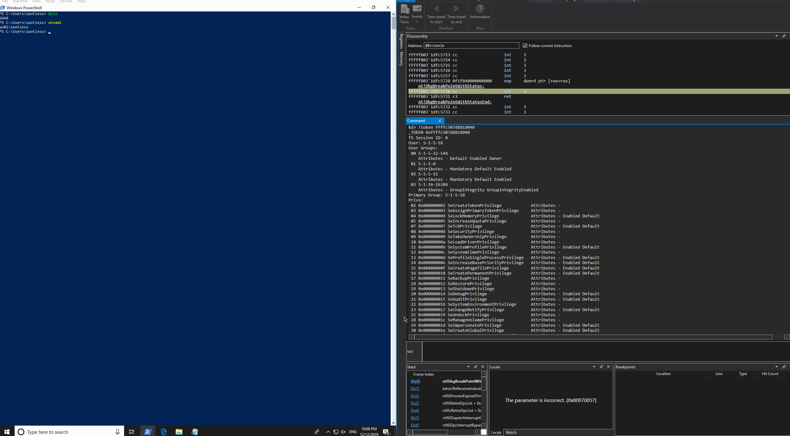

# Token Abuse for Privilege Escalation in Kernel

The purpose of this lab is to understand at a high level \(will not be writing any kernel code, rather playing around with WinDBG\) how kernel exploits abuse tokens for privilege escalation. 

I will look briefly into two techniques:

* [Token stealing/replacement](how-kernel-exploits-abuse-tokens-for-privilege-escalation.md#1-replacing-tokens-for-privilege-escalation) - low privileged token is replaced with a high privileged token
* [Token privilege adjustment](how-kernel-exploits-abuse-tokens-for-privilege-escalation.md#2-modifying-token-privileges) - adding and enabling more privileges to an existing token

## Key Structures

Before proceeding, there's a couple of kernel memory structures we need to know about.

### \_EPROCESS

`_EPROCESS` is a kernel memory structure that describes system processes \(or in other words - each process running on a system has its corresponding `_EPROCESS` object somewhere in the kernel\) as we know them as it contains details such as process image name, which desktop session it is running in, how many open handles to other kernel objects it has, what access token it has and much more. 

Below is a snippet of the structure:

```erlang
dt _eprocess
```


### \_TOKEN 

`_TOKEN` is a kernel memory structure that describes process's security context and contains information such as process token privileges, logon id, session id, token type \(i.e primary vs. impersonation\) and much more. 

Below is a snippet of the `_TOKEN` structure:

```erlang
dt _token
```


Let's now see how we can use the above information about processes and tokens to elevate a medium integrity process to a system integrity process the way kernel exploits do it.

## 1. Replacing Tokens for Privilege Escalation

One way kernel exploits escalate privileges is by replacing a low privileged token with a high privileged token. Below are some key points in explaining the exploitation process:

* Each process running on the system has its corresponding `_EPROCESS` kernel structure
* `_EPROCESS` structure contains a pointer to a `_TOKEN` memory structure that describes process's security context
* Kernel exploit finds address of the `_TOKEN` structure of a low privileged process - the one it wants to escalate from
* Kernel exploit finds address of the `_TOKEN` structure of a privileged process, running as `NT\SYSTEM`
* Kernel exploit replaces the low privileged process's token with the high privileged token

In this lab, I'm going to replace the authentication token of a low privileged `powershell` process with a high privileged token of the `system` process \(always a PID 4\) following the above described process, except I will do it manually using WinDBG.


My lab is running Windows 10 x64 1903


Below is an attempt to visually represent the above described process with a high level diagram:


* Boxes with blue headings represent a `MEDIUM` integrity process, running as `WS02\spotless` 
  * `WS02` is my lab machine name 
  * `spotless` is a low privileged local user. 
* Boxed with red headings indicate a `SYSTEM` integrity process, effectively running as `NT\SYSTEM` 
  * `WS02$` is my lab computer account 
  * `OFFENSE` is the domain the machine is a member of
* Red dotted line signifies that the low privileged process `powershell` will assume the high privileged token from the process `system` once the `_TOKEN` kernel memory structure is manipulated.

Let's now try to see how we can replace process tokens using WinDBG.

### Listing Processes

First off, listing all running processes on the system in WinDBG can be done like so:

```erlang
!process 0 0
```

Below is a snippet of some of the processes running on the system and highlighted are addresses pointing to `_EPROCESS` structures for given processes:


### Medium Integrity Process

Next, let's launch `powershell` \(this is the process for which we will replace the low privileged token with a high privileged token\) as a medium integrity/non-elevated process \(in my case running as a local non-admin user `ws02\spotless`\) and get its process ID:


Let's get a process summary in WinDBG for our `powershell` process with PID 2648 \(0xa58\):

```erlang
!process a58 0
```

Below confirms we're looking at our powershell.exe process. Note the `_EPROCESS` location `ffffdc8fbe1f1080`:


### Finding Powershell Token

Once we have powershell's `_EPROCESS` location in the kernel, we can inspect its contents like so:

```erlang
kd> dt _eprocess ffffdc8fbe1f1080
```

Since we're interested in swapping the token, the key member of the `_EPROCESS` memory structure we are after is `Token` located at offset `0x358`:



Note that offset`0x358` suggests it's pointer to `_EX_FAST_REF` memory structure and we will come back to this shortly.


Let's read memory contents of the pointer the `_EPROCESS.Token` is pointing to, which is ``ffffc507`dab7799f`` in my case:

```erlang
kd> dq ffffdc8fbe1f1080+0x358 l1
ffffdc8f`be1f13d8  ffffc507`dab7799f
```

If we try inspecting the memory location ``ffffc507`dab7799f`` with `!token ffffc507dab7799f` command, we are told that this address does not point to a token object, which we may find a bit odd:


However, this is where the `_EX_FAST_REF` comes into play. It was pointed out earlier that `_EPROCESS.Token` actually points to a `_EX_FAST_REF` structure rather than a `_TOKEN` structure.

Let's overlay the address stored in `_EPROCESS.Token` which is ``ffffdc8f`be1f13d8`` \(`_EPROCESS` location plus the `Token` member offset \(`ffffdc8fbe1f1080+0x358`\)\) with the `_EX_FAST_REF` structure and see what's inside:

```erlang
kd> dt _EX_FAST_REF ffffdc8fbe1f1080+0x358
ntdll!_EX_FAST_REF
   +0x000 Object           : 0xffffc507`dab7799f Void
   +0x000 RefCnt           : 0y1111
   +0x000 Value            : 0xffffc507`dab7799f
```

Notice how all three members have the same offset and `Object` and `Value` are pointing to the same address, but the interesting piece is the `RefCnt` with 4 bits on \(equals to 0xF, which looks like it is the last digit of both `Object` and `Value` members are pointing to - 0xffffc507\`dab7799**f**\). 

If we inspect the `_EX_FAST_REF` without data, based on the symbols, it's defined like so:

```erlang
ntdll!_EX_FAST_REF
   +0x000 Object           : Ptr64 Void
   +0x000 RefCnt           : Pos 0, 4 Bits
   +0x000 Value            : Uint8B
```

Which indicates and confirms that the last 4 bits \(the last hex digit of the `Object` or `Value`\) of the value pointed to by members `Object` and `Value` \(in my case ``0xffffc507`dab7799f``\) is used to denote the reference count to this token, which means it's not part of the token address, which means we should be able to zero it out and get an actual `_TOKEN` structure address for our powershell process.

Essentially, if `Object` and `Value` are ``0xffffc507`dab7799f``, we should be able to just swap the last `f` with `0` which would give us ``0xffffc507`dab77990`` and it should be our `_TOKEN` address.

In fact, if we inspect our powershell process with a more verbose output like so:

```erlang
!process ffffdc8fbe1f1080 1 
// or !process 0xa58 1
```

..we see that indeed the `Token` is pointing to ``0xffffc507`dab77990`` - note the last digit is `0` rather than `f`, which confirms that we can always zero out the last digit pointed to by `_EX_FAST_REF` to get the effective `_TOKEN` structure address:


We can mask out the last digit with a bitwise `AND` operation as shown below:

```erlang
kd> ? (ffffc507dab7799f & 0xFFFFFFF0); !token (ffffc507dab7799f & 0xFFFFFFF0)
```


Now, if we try the `!token` command again with the last digit of `_EPROCESS.Token->Value` set to 0, we no longer see the error message suggesting there's no token at that address and we start seeing some actual token details like user group it belongs to, etc.:


### Confirming SIDs

We can double check we're actually looking at the right token - the SID's seen in the output of `whoami /all` and the `!token (ffffc507dab7799f & 0xFFFFFFF0)` match:


### Finding SYSTEM Token

Now let's find the address of the high privileged `_TOKEN` - the token that our low privileged powershell process will assume.

Below shows some information about the `SYSTEM` process - we're interested in it's `_TOKEN` location which is at `ffffc507d8818040` as shown below:

```erlang
kd> !process 4 1
Searching for Process with Cid == 4
PROCESS ffffdc8fbdad3040
    SessionId: none  Cid: 0004    Peb: 00000000  ParentCid: 0000
    DirBase: 001aa002  ObjectTable: ffffc507d88032c0  HandleCount: 3042.
    Image: System
    VadRoot ffffdc8fbdad1170 Vads 8 Clone 0 Private 21. Modified 76433. Locked 0.
    DeviceMap ffffc507d8818eb0
    Token                             ffffc507d8818040
```

### Swapping Tokens

We now have all the required information to successfully swap the powershell process token \(located at `ffffdc8fbe1f1080+0x358`\) with that held by the `SYSTEM` process \(`ffffc507d8818040`\) by simply writing the `SYSTEM` process's token address to the the `_EPROCESS.Token` of our powershell process:

```erlang
eq ffffdc8fbe1f1080+0x358 ffffc507d8818040
```

Below shows the above in action and how prior to the token manipulation, the powershell was running as `ws02\spotless` and `nt authority\system` after:



## 2. Modifying Token Privileges

Another interesting \(and abused for privilege escalation\) member of the `_TOKEN`structure is `Privileges` at offset `0x040`, defined as `_SEP_TOKEN_PRIVILEGES` structure:

```erlang
dt _token 0xffffc507dab77990
```


### Enabling Existing Privileges

We can overlay our low privileged powershell token address + offset 0x40 to inspect the `_sep_token_privileges` structure:

```erlang
dt _sep_token_privileges 0xffffc507dab77990+0x40
```

In essence, `_sep_token_privileges` shows which privileges the token has and which of them are enabled/disabled - the info that we can also check from the userland with `whoami /priv`. 

Note how `_sep_token_privileges` `Present` and `Enabled` values do not match and this is what results in Enabled/Disabled privileges that we see in the `whoami /priv` `State` column:


We can manipulate the kernel memory and make `Present` and `Enabled` values match like so:

```erlang
eq 0xffffc507dab77990+0x40+8 0x00000006`02880000
```

After manipulating the memory and matching the `Present` and `Enabled` values, we can now see how all the privileges in the `State` column of the `whoami /priv` output are `Enabled`:


### Adding More Privileges

Let's see if we can try to add more privileges to that exsiting token rather than just enabling those that already exist. 

How do we know what is a valid value in the `Present` field that would give us more/elevated privileges? We can get a good hint by inspecting the `Present` value of the `SYSTEM` process \(PID 4\) token:

```erlang
!process  4 1
sep_token_privileges 0x40+ffffde8fe9a06040
```


From the above, `Present` value is ``0x0000001f`f2ffffbc`` - this represents all the privileges the SYSTEM process token has. 

Let's see if we can assign this value to our powershell process's token to both `Present` and `Enabled` fields. If successful, we should have all the SYSTEM privileges enabled for our low privileged powershell process running in the context of the user `ws02\spotless`:

```erlang
kd> eq 0x40+ffffde8ff8cde5f0+8 0x0000001f`f2ffffbc
kd> eq 0x40+ffffde8ff8cde5f0 0x0000001f`f2ffffbc
```

Let's check if the new values got assigned to our `_sep_token_privileges` structure:

```erlang
kd> dt _sep_token_privileges 0x40+ffffde8ff8cde5f0
nt!_SEP_TOKEN_PRIVILEGES
   +0x000 Present          : 0x0000001f`f2ffffbc
   +0x008 Enabled          : 0x0000001f`f2ffffbc
   +0x010 EnabledByDefault : 0x40800000
```

Running `whoami /priv` now shows that we have all the SYSTEM privileges and all of them are enabled:


## References







