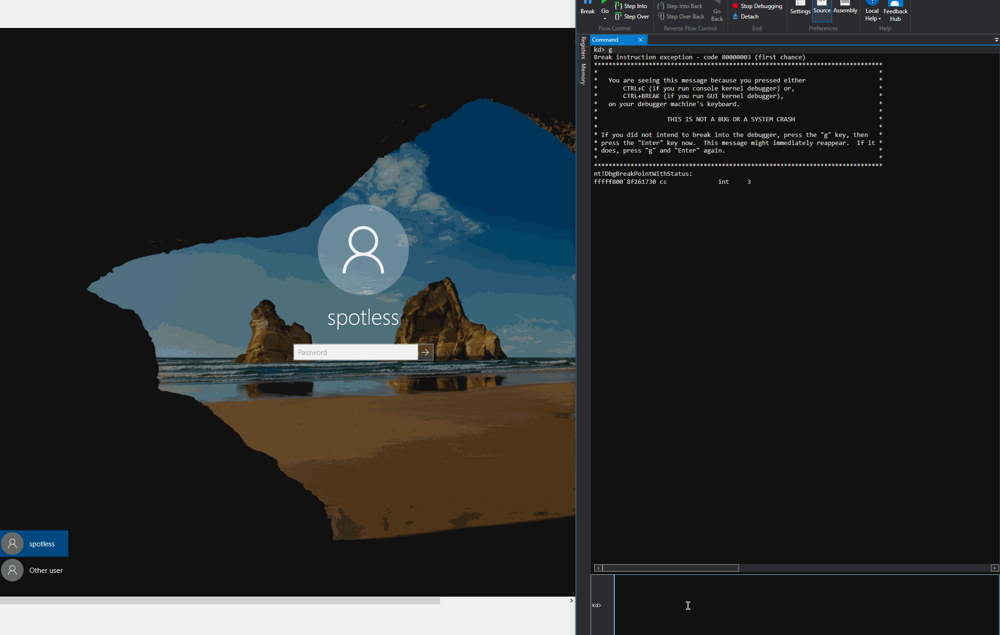

# Interrupt Descriptor Table - IDT

## At a Glance

* Interrupts could be thought of as `notifications` to the CPU that tells it that `some event` happened on the system. Classic examples of interrupts are hardware interrupts such as mouse button or keyboard key presses, network packet activity and hardware generated exceptions such as a division by zero or a breakpoint - interrupts 0x00 and 0x03 respectively
* Once the CPU gets interrupted, it stops doing what it was doing and responds to the new interrupt 
* CPU knows how to respond and what kernel routines to execute for the newly received interrupt by looking up Interrupt Service Routines \(ISR\) that are found in the Interrupt Descriptor Table \(IDT\)
* IDT is a list of IDT descriptor entries which are 8 or 16 bytes in size depending on the architecture 
* Pointer to IDT is stored in an `IDTR` register for each physical processor or in other words, each processor has its own `IDTR` register pointing to its own Interrupt Descriptor Table


Offsets across different screenshots and windbg output may differ due to the fact that I rebooted the debugee a couple of times during the time these notes were taken.

The notes are based on debugging a kernel of a 64 bit Windows, running in a VM with 1 CPU.


## IDT Location

We can check where the Interrupt Descriptor Table is located in kernel by reading the register `IDTR`:

```text
r idtr
```


As noted later, the command `!idt` allows us to dump the Interrupt Descriptor Table contents and it also confirms that the IDT is located at ``fffff803`536dda00`` as shown below:


## Dumping IDT

We can dump the IDT and see addresses of Interrupt Service Routines for a given interrupt. Below is a snippet of the Interrupt Descriptor Table:

```erlang
kd> !idt

Dumping IDT: fffff80091456000

00:	fffff8008f37e100 nt!KiDivideErrorFaultShadow
01:	fffff8008f37e180 nt!KiDebugTrapOrFaultShadow	Stack = 0xFFFFF8009145A9E0
02:	fffff8008f37e200 nt!KiNmiInterruptShadow	Stack = 0xFFFFF8009145A7E0
03:	fffff8008f37e280 nt!KiBreakpointTrapShadow
...
90:	fffff8008f37f680 i8042prt!I8042MouseInterruptService (KINTERRUPT ffffd4816353e8c0)
a0:	fffff8008f37f700 i8042prt!I8042KeyboardInterruptService (KINTERRUPT ffffd4816353ea00)
...
```

Below shows the IDT dumping and ISR code execution in action:

* IDT table is dumped with `!idt`
* IRS entry point for the interrupt `a0` is located at `fffff8008f37f700`
  * This is the routine that gets executed first inside the kernel when a keyboard event such as a keypress is registered on the OS 
  * Eventually, the routine `i8042prt!I8042KeyboardInterruptService` \(inside the actual keyboard driver\) is hit once the code at `fffff8008f37f700` is finished
* Putting a breakpoint on 

  `i8042prt!I8042KeyboardInterruptService`

* Once the breakpoint is set, a key is pressed on the OS login prompt and our breakpoint is hit, confirming that 

  `i8042prt!I8042KeyboardInterruptService` indeed handles keyboard interrupts



Below is a heavily simplified diagram illustrating all of the above events taking place:

* the keyboard interrupt `0xa0` occurs
* IDT table using index `0x0a` is looked up \([IDT address + 0xa0 \* 0x10](interrupt-descriptor-table-idt.md#idt-entry-for-the-keyboard-interrupt-0xa0)\) and the [ISR Entry Point is resolved](interrupt-descriptor-table-idt.md#isr-for-the-keyboard-interrupt-a0) and code jumps to it
* after some hoops, the code is eventually redirected to the keyboard driver where the interrupt gets handled in `i8042prt!I8042KeyboardInterruptService`


## IDT Entry

IDT is made up of IDT entries `_KIDTENTRY64` which is a kernel memory structure and is defined like so:

```erlang
kd> dt nt!_KIDTENTRY64
   +0x000 OffsetLow        : Uint2B
   +0x002 Selector         : Uint2B
   +0x004 IstIndex         : Pos 0, 3 Bits
   +0x004 Reserved0        : Pos 3, 5 Bits
   +0x004 Type             : Pos 8, 5 Bits
   +0x004 Dpl              : Pos 13, 2 Bits
   +0x004 Present          : Pos 15, 1 Bit
   +0x006 OffsetMiddle     : Uint2B
   +0x008 OffsetHigh       : Uint4B
   +0x00c Reserved1        : Uint4B
   +0x000 Alignment        : Uint8B
```

Members `OffsetLow`, `OffsetMiddle` and `OffsetHigh` at offsets 0x000, 0x006 and 0x008 make up the virtual address in the kernel and it's where the code execution will be transferred to by the CPU once that particular interrupt takes place - in other words - this is the Interrupt Service Routine's \(ISR\) entry point.

## IDT Entry for the Keyboard Interrupt 0xa0

As an example, let's inspect the IDT entry for the keyboard interrupt which is located at index `a0` in the IDT table as discovered earlier:

```erlang
!idt a0
```


From earlier, we also know that the IDT resides at `fffff803536dd000`:

```erlang
kd> r idtr
idtr=fffff803536dd000
```

We can get the location of the `a0` IDT entry by adding `0xa0*0x10` \(interrupt index `a0` times `0x10` since a descriptor entry is 16 bytes in size\) to the IDT table address `fffff803536dd000`, which gives us ``fffff803`536dda00``:

```erlang
kd> dq idtr + (0xa0*0x10) L2
fffff803`536dda00  51568e00`0010e700 00000000`fffff803
```

With the above information, we can overlay the `a0` interrupt descriptor entry with `_KIDTENTRY64` and inspect `a0` IDT entry's content:

```erlang
kd> dt _kidtentry64 (idtr + (0xa0*0x10))
ntdll!_KIDTENTRY64
   +0x000 OffsetLow        : 0xe700
   +0x002 Selector         : 0x10
   +0x004 IstIndex         : 0y000
   +0x004 Reserved0        : 0y00000 (0)
   +0x004 Type             : 0y01110 (0xe)
   +0x004 Dpl              : 0y00
   +0x004 Present          : 0y1
   +0x006 OffsetMiddle     : 0x5156
   +0x008 OffsetHigh       : 0xfffff803
   +0x00c Reserved1        : 0
   +0x000 Alignment        : 0x51568e00`0010e700
```

## ISR for the Keyboard Interrupt a0

Based on the above IDT entry for the keyboard interrupt, the below [re-enforces](interrupt-descriptor-table-idt.md#idt-entry) that the combination of Offset\(High\|Middle\|Low\) form the virtual address of the Interrupt Service Routine \(ISR\) entry point - the code that will be executed when `a0` interrupt is triggered by the keyboard:


Below shows the instructions at ``fffff803`5156e700`` \(ISR entry point\) to be executed by the CPU once interrupt `a0` is triggered:

* FFFFFFFFFFFFFF**A0** will be pushed on the stack 
* jump to ``fffff803`5156ea40`` will happen


...and eventually, the `i8042prt!I8042KeyboardInterruptService` will be hit and below confirms it - firstly, the breakpoint is hit for ``fffff803`5156e700`` and `i8042prt!I8042KeyboardInterruptService` is hit immediately after:


## \_KINTERRUPT

`_KINTERRUPT` is a kernel memory structure that holds information about an interrupt. The key member of this structure for this lab is the member located at offset `0x18` - it's a pointer to the `ServiceRoutine` - the routine \(inside the associated driver\) that is responsible for actually handling the interrupt:

```erlang
dt nt!_KINTERRUPT
   +0x000 Type             : Int2B
   +0x002 Size             : Int2B
   +0x008 InterruptListEntry : _LIST_ENTRY
   +0x018 ServiceRoutine   : Ptr64     unsigned char 
   ...
   +0x0f8 Padding          : [8] UChar
```

As an example - from earlier, we know that the ISR for keyboard interrupts is located at `ffffd4816353ea00`, therefore we can inspect the `_KINTERRUPT` structure of that our interrupt by overlaying it with memory contents at `ffffd4816353ea00`:

```erlang
dt nt!_KINTERRUPT ffffd4816353ea00
```

This allows us to confirm that the `ServiceRoutine` is again pointing correctly to `i8042prt!I8042KeyboardInterruptService` inside the keyboard driver: 


## Finding \_KINTERRUPT

In order to manually find the location of `_KINTERRUPT` for a given interrupt, we need to leverage the following memory locations and structures.

Process Control Region or PCR \(`_KPCR` memory structure in kernel\) stores information about a given processor:

```erlang
kd> dt _KPCR
ntdll!_KPCR
   +0x000 NtTib            : _NT_TIB
   +0x000 GdtBase          : Ptr64 _KGDTENTRY64
   +0x008 TssBase          : Ptr64 _KTSS64
   +0x010 UserRsp          : Uint8B
   +0x018 Self             : Ptr64 _KPCR
   +0x020 CurrentPrcb      : Ptr64 _KPRCB
   +0x028 LockArray        : Ptr64 _KSPIN_LOCK_QUEUE
   +0x030 Used_Self        : Ptr64 Void
   +0x038 IdtBase          : Ptr64 _KIDTENTRY64
   +0x040 Unused           : [2] Uint8B
   +0x050 Irql             : UChar
   +0x051 SecondLevelCacheAssociativity : UChar
   +0x052 ObsoleteNumber   : UChar
   +0x053 Fill0            : UChar
   +0x054 Unused0          : [3] Uint4B
   +0x060 MajorVersion     : Uint2B
   +0x062 MinorVersion     : Uint2B
   +0x064 StallScaleFactor : Uint4B
   +0x068 Unused1          : [3] Ptr64 Void
   +0x080 KernelReserved   : [15] Uint4B
   +0x0bc SecondLevelCacheSize : Uint4B
   +0x0c0 HalReserved      : [16] Uint4B
   +0x100 Unused2          : Uint4B
   +0x108 KdVersionBlock   : Ptr64 Void
   +0x110 Unused3          : Ptr64 Void
   +0x118 PcrAlign1        : [24] Uint4B
   +0x180 Prcb             : _KPRCB
```

`_KPCR` location can be found like this:

```erlang
kd> ? @$pcr
Evaluate expression: -8781847822336 = fffff803`51148000

kd> !pcr
KPCR for Processor 0 at fffff80351148000:
    Major 1 Minor 1
	NtTib.ExceptionList: fffff803536dffb0
	    NtTib.StackBase: fffff803536de000
	   NtTib.StackLimit: 0000000000000000
...snip...
```

Inside the `_KPCR`, at offset `0x180` there is a member that points to a Process Control Block memory structure `_KPRCB` which contains information about the state of a processor.

The key member we're interested when trying to find the `_KINTERRUPT` memory location for a given interrupt is `InterruptObject` as it contains a list of pointers to a list of `_KINTERRUPT` objects.  `InterrupObject` is located at offset `0x2e80` as shown below:

```erlang
kd> dt _KPRCB
ntdll!_KPRCB
   +0x000 MxCsr            : Uint4B
   +0x004 LegacyNumber     : UChar
   +0x005 ReservedMustBeZero : UChar
   ....
   +0x2e80 InterruptObject  : [256] Ptr64 Void //256 pointers max as noted earlier
   ....
```

With the above knowledge, we can now find the `_KINTERRUPT` location for the keyboard interrupt `a0`:

```erlang
dt @$pcr nt!_KPCR Prcb.InterruptObject[a0]
```

Below confirms that the `_KINTERRUPT` for the interrupt `a0` we found manually matches that given by the `!idt` command:


## References



















