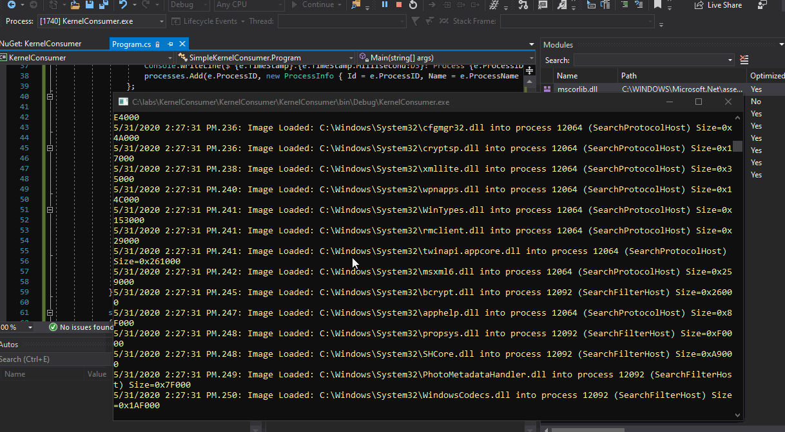

# ETW: Event Tracing for Windows 101

## Terminology

* `Event Tracing for Windows (ETW)` is a Windows OS logging mechanism for troubleshooting and diagnostics, that allows us to tap into an enormous number of events that are generated by the OS every second
* `Providers` are applications that can generate some event logs
* `Keywords` are event types the provider is able to serve the consumers with
* `Consumers` are applications that subscribe and listen to events  emitted by providers
* `Tracing session` records events from one or more providers
* `Contollers` are applications that can start a trace session and enable or disable providers in that trace session

## Logman

Logman.exe is a native Windows command-line utility, which is considered to be a `Controller`. Below, some of the concepts mentioned earlier are explored.

### Listing Providers

We can see all the providers registered to Windows like so:

```text
logman query providers
```


### Provider Information

We can get more information about the provider with `logman query $providerName|$provider`.

One of the many built-in interesting providers available to us in Windows is **Microsoft-Windows-Kernel-Process**, so let's check it out:

```text
logman query providers Microsoft-Windows-Kernel-Process
logman query providers "{22FB2CD6-0E7B-422B-A0C7-2FAD1FD0E716}"
```


As we can tell from the above `keywords`, this provider could provide us with some process, thread and image \(load/unload as we will see later\) related events.


Use [ETWExplorer](https://github.com/zodiacon/EtwExplorer) for a deep provider inspection, and see what events and more importantly data it can provide. 


Below shows Microsoft-Windows-Kernel-Process being inspected with ETWExplorer with some information, which looks like something Sysmon and other similar security monitoring oriented tools could use:


### Creating a Tracing Session

Let's now try to create a trace session called `spotless-tracing`:

```text
logman create trace spotless-tracing -ets
```

We can see our session is now created:


We can query the tracing session and see some information about it:

```text
logman query spotless-tracing -ets
```

Note that at the moment, although the tracing session is running, it is not recording any events as we have not yet subscribed to any providers:


### Subscribing to Microsoft-Windows-Kernel-Process

Inside the `spotless-tracing` tracing session, let's subscribe to events about `PROCESSES` and `IMAGES` provided by the provider `Microsoft-Windows-Kernel-Process` and see what they look like.

In order to subscribe to those events, we first need to refer back to `Microsoft-Windows-Kernel-Process` available `keywords` \(event types of this provider\) and add `0x10` \(`WINEVENT_KEYWORD_PROCESS`\) to `0x40` \(`WINEVENT_KEYWORD_IMAGE`\), which gives us the total of `0x50`:


We can now register a provider to the tracing session and ask it to emit events that map back to events `WINEVENT_KEYWORD_PROCESS` and `WINEVENT_KEYWORD_IMAGE`:

```text
logman update spotless-tracing -p Microsoft-Windows-Kernel-Process 0x50 -ets
```

If we query the tracing session again, we see it now has `Microsoft-Windows-Kernel-Process`provider registered and listening to the two event types pertaining to processes \(start/exit\) and images \(load/unload\):

```text
logman query spotless-tracing -ets
```


### Checking the .etl Log

After the tracing session has run for some time, we can check the log file  by opening it with the Windows Event Viewer.

We can see process creation events \(event ID 1\):


Image load events \(event ID 5\):


Image unload events \(event ID 6\):


### Removing Providers from a Tracing Session

We can remove a provider from a tracing session like so:

```text
logman update trace spotless-tracing --p Microsoft-Windows-Kernel-Process 0x50 -ets
```

Note that the kernel provider is no longer associated with the `spotless-tracing` tracing session:


### Killing the Tracing Session

We can kill the entire tracing session like so:

```text
logman stop spotless-tracing -ets
```

...and the tracing session is no longer present on the system:


### Listing Providers a Process is Registered with

We can check what providers any currently running process is registered with, meaning that process will be writing events to those providers.

Below shows how we can check which providers our current powershell console is registered with \(`$pid` gives the current powershell console process id\):

```text
logman query providers -pid $pid
```


## Consuming Events via Code

Thanks to [Pavel Yosifovich](https://github.com/zodiacon), we can use the below C\# code to subscribe to a kernel provider, that will feed our console program with process related events: 

```csharp
# code by Pavel Yosifovich, https://github.com/zodiacon/DotNextSP2019/blob/master/SimpleKernelConsumer/Program.cs
using Microsoft.Diagnostics.Tracing;
using Microsoft.Diagnostics.Tracing.Parsers;
using Microsoft.Diagnostics.Tracing.Session;
using System;
using System.Collections.Generic;
using System.Diagnostics;
using System.Linq;
using System.Text;
using System.Threading;
using System.Threading.Tasks;

namespace SimpleKernelConsumer {
	class ProcessInfo {
		public int Id { get; set; }
		public string Name { get; set; }
	}

	class Program {
		static void Main(string[] args) {
			var processes = Process.GetProcesses().Select(p => new ProcessInfo {
				Name = p.ProcessName,
				Id = p.Id
			}).ToDictionary(p => p.Id);

			using (var session = new TraceEventSession(Environment.OSVersion.Version.Build >= 9200 ? "MyKernelSession" : KernelTraceEventParser.KernelSessionName)) {
				session.EnableKernelProvider(KernelTraceEventParser.Keywords.Process | KernelTraceEventParser.Keywords.ImageLoad);
				var parser = session.Source.Kernel;

				parser.ProcessStart += e => {
					Console.ForegroundColor = ConsoleColor.Green;
					Console.WriteLine($"{e.TimeStamp}.{e.TimeStamp.Millisecond:D3}: Process {e.ProcessID} ({e.ProcessName}) Created by {e.ParentID}: {e.CommandLine}");
					processes.Add(e.ProcessID, new ProcessInfo { Id = e.ProcessID, Name = e.ProcessName });
				};
				parser.ProcessStop += e => {
					Console.ForegroundColor = ConsoleColor.Red;
					Console.WriteLine($"{e.TimeStamp}.{e.TimeStamp.Millisecond:D3}: Process {e.ProcessID} {TryGetProcessName(e)} Exited");
				};

				parser.ImageLoad += e => {
					Console.ForegroundColor = ConsoleColor.Yellow;
					var name = TryGetProcessName(e);
					Console.WriteLine($"{e.TimeStamp}.{e.TimeStamp.Millisecond:D3}: Image Loaded: {e.FileName} into process {e.ProcessID} ({name}) Size=0x{e.ImageSize:X}");
				};

				parser.ImageUnload += e => {
					Console.ForegroundColor = ConsoleColor.DarkYellow;
					var name = TryGetProcessName(e);
					Console.WriteLine($"{e.TimeStamp}.{e.TimeStamp.Millisecond:D3}: Image Unloaded: {e.FileName} from process {e.ProcessID} ({name})");
				};

				Task.Run(() => session.Source.Process());
				Thread.Sleep(TimeSpan.FromSeconds(60));
			}

			string TryGetProcessName(TraceEvent evt) {
				if (!string.IsNullOrEmpty(evt.ProcessName))
					return evt.ProcessName;
				return processes.TryGetValue(evt.ProcessID, out var info) ? info.Name : string.Empty;
			}
		}
	}
}
```

Don't forget to install the package:


If we compile and run the code, we will now see events flowing in:



## Notes

From an attacker's perspective, if you are up against some EDR or logging capability, you may be able to blind the system by killing their tracing session or removing certain providers from their tracing session.

From a defender's perspective, you may want to:

* learn about the additional telemetry you could get from ETW
* think about detections that target attackers trying to tamper with your telemetry through ETW

## References







[Microsoft-Windows-Threat-Intelligence](https://pastebin.com/6VGHjGjH) Provider Manifest as [mentioned](https://twitter.com/FancyCyber/status/1267536407272345602) by @FancyCyber:


