# Parsing PE File Headers with C++

## Context

In this lab I'm writing a simple Portable Executable \(PE\) file header parser for 32bit binaries, using C++ as the programming language of choice. The lab was inspired by the techniques such as reflective DLL injection and process hollowing which both deal with various parts of the PE files.

The purpose of this lab is two-fold:

* Get a bit more comfortable with C++
* Get a better understanding of PE file headers

This lab is going to be light on text as most of the relevant info is shown in the [code](pe-file-header-parser-in-c++.md#code) section, but I will touch on the piece that confused me the most in this endevour - parsing the DLL imports.

Below is a graphic showing the end result - a program that parses a 32bit cmd.exe executable and spits out various pieces of information from various PE headers as well as DLL imports.

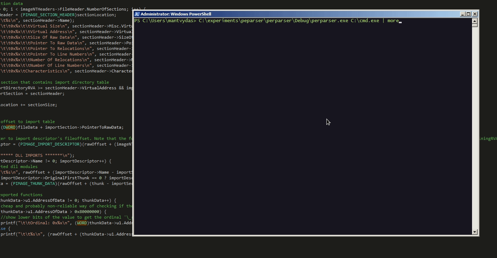


* The code is not able to parse 64bit executables correctly. This will not be fixed.
* The code was not meant to be clean and well organised - it was not the goal of this lab
* The parser is not full-blown - it only goes through the main headers and DLL imports, so no exports, relocations or resources will be touched.


## The Big Hurdle

For the most part of this lab, header parsing was going smoothly, until it was time to parse the DLL imports. The bit below is the final solution that worked for parsing out the DLL names and their functions:

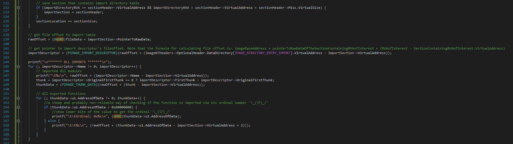

Parsing out imported DLLs and their functions requires a good number of offset calculations that initially may seem confusing and this is the bit I will try to put down in words in these notes.

So how do we go about extracting the DLL names the binary imports and the function names that DLL exports?

## Definitions

First off, we need to define some terms:

* `Section` - a PE header that defines various sections contained in the PE. Some sections are `.text` - this is where the assembly code is stored, `.data` contains global and static local variables, etc.
* File item - part of a PE file, for example a code section `.text`
* Relative Virtual Address \(RVA\) - address of some file item in memory minus the base address of the image.
* Virtual Address \(VA\) - virtual memory address of some file item in memory without the image base address subtracted.
  * For example, if we have a VA `0x01004000` and we know that the image base address is `0x0100000`, the RVA is `0x01004000 - 0x01000000 = 0x0004000`.
* `Data Directories` - part of the `Optional Header` and contains RVAs to various tables - exports, resources and most importantly for this lab - dll imports table. It also contains size of the table.

## Calculating Offsets

If we look at the notepad.exe binary using CFF Explorer \(or any other similar program\) and inspect the `Data Directories` from under the `Optional Header` , we can see that the Import Table is located at RVA `0x0000A0A0` that according to CFF Explorer happens to live in the `.text` section:


Indeed, if we look at the `Section Headers` and note the values `Virtual Size` and `Virtual Address` for the `.text` section:


and check if the `Import Directory RVA` of `0x0000A0A0` falls into the range of .text section with this conditional statement in python:

```csharp
0x000a0a0 > 0x00001000 and 0x000a0a0 < 0x00001000 + 0x0000a6fc
```

...we can confirm it definitely does fall into the .text section's range:

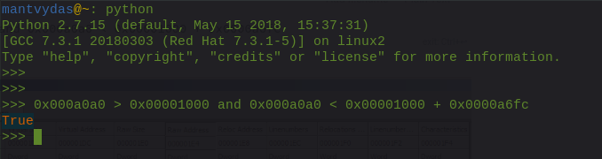

### PIMAGE\_IMPORT\_DESCRIPTOR

In order to read out DLL names that this binary imports, we first need to populate a data structure called `PIMAGE_IMPORT_DESCRIPTOR` with revlevant data from the binary, but how do we find it?

We need to translate the `Import Directory RVA` to the file offset - a place in the binary file where the DLL import information is stored. The way this can be achieved is by using the following formula:

$$
offset = imageBase + text.RawOffset + (importDirectory.RVA - text.VA)
$$

where `imageBase` is the start address of where the binary image is loaded, `text.RawOffset` is the `Raw Address` value from the `.text` section, `text.VA` is `Virtual Address` value from the `.text` section and `importDirectory.RVA` is the `Import Directory RVA` value from `Data Directories` in `Optional Header`.


If you think about what was discussed so far and the above formula for a moment, you will realise that:

* `imageBase` in our case is 0 since the file is not loaded to memory and we are inspecting it on the disk
* import table is located in `.text` section of the binary. Since the binary is not loaded to disk, we need to know the file offset of the `.text` section in relation to the `imageBase`
* `imageBase + text.RawOffset` gives us the file offset to the `.text` section - we need it, because remember - the import table is inside the `.text` section
* Since `importDirectory.RVA`, as mentioned earlier, lives in the `.text` section, `importDirectory.RVA - text.VA` gives us the offset of the import table relative to the start of the `.text` section
* We take the value of `importDirectory.RVA - text.VA` and add it to the `text.RawOffset` and we get the offset of the import table in the raw `.text` data.


Below is some simple powershell to do the calculations for us to get the file offset that we can later use for filling up the `PIMAGE_IMPORT_DESCRIPTOR` structure with:


```csharp
PS C:\Users\mantvydas> $fileBase = 0x0
PS C:\Users\mantvydas> $textRawOffset = 0x00000400
PS C:\Users\mantvydas> $importDirectoryRVA = 0x0000A0A0
PS C:\Users\mantvydas> $textVA = 0x00001000
PS C:\Users\mantvydas>
PS C:\Users\mantvydas> # this points to the start of the .text section
PS C:\Users\mantvydas> $rawOffsetToTextSection = $fileBase + $textRawOffset
PS C:\Users\mantvydas> $importDescriptor = $rawOffsetToTextSection + ($importDirectoryRVA - $textVA)
PS C:\Users\mantvydas> [System.Convert]::ToString($importDescriptor, 16)

// this is the file offset we are looking for for PIMAGE_IMPORT_DESCRIPTOR
94a0
```


If we check the file offset 0x95cc, we can see we are getting close to a list of imported DLL names - note that at we can see the VERSION.dll starting to show - that is a good start:

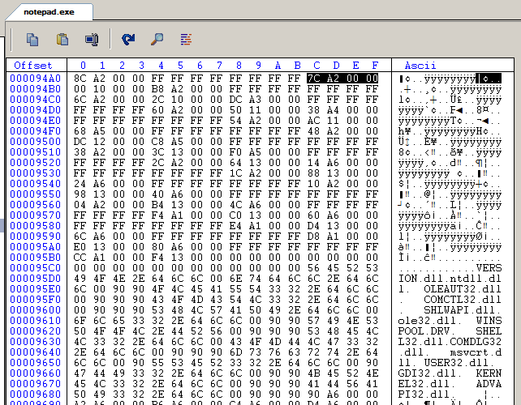

Now more importantly, note the value highlighted at offset `0x000094ac` - `7C A2 00 00` \(reads A2 7C due to little indianness\) - this is important. If we consider the layout of the `PIMAGE_IMPORT_DESCRIPTOR` structure, we can see that the fourth member of the structure \(each member is a DWORD, so 4 bytes in size\) is `DWORD Name`, which implies that `0x000094ac` contains something that should be useful for us to get our first imported DLL's name:


Indeed, if we check the Import Directory of notepad.exe in CFF Explorer, we see that the `0xA27C` is another RVA to the DLL name, which happens to be ADVAPI32.dll - and we will manually [verify](pe-file-header-parser-in-c++.md#first-dll-name) this in a moment:

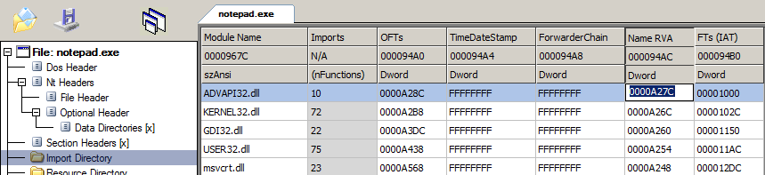

If we look closer at the ADVAPI32.dll import details and compare it with the hex dump of the binary at 0x94A0, we can see that the 0000a27c is surrounded by the same info we saw in CFF Explorer for the ADVAPI32.dll:


### First DLL Name

Let's see if we can translate this `Name RVA 0xA27c` to the file offset using the technique we used earlier and finally get the first imported DLL name. 

This time the formula we need to use is:

$$
offset = imageBase + text.RawOffset + (nameRVA - text.VA)
$$

where `nameRVA` is `Name RVA` value for ADVAPI32.dll from the Import Directory and `text.VA` is the `Virtual Address` of the `.text` section.

Again, some powersehell to do the RVA to file offset calculation for us:

```csharp
# first dll name
$nameRVA = 0x0000A27C
$firstDLLname = $rawOffsetToTextSection + ($nameRVA - $textVA)
[System.Convert]::ToString($firstDLLname, 16)
967c
```

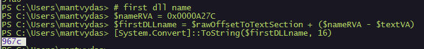

If we check offset `0x967c` in our hex editor - success, we found our first DLL name:


### DLL Imported Functions

Now in order to get a list of imported functions from the given DLL, we need to use a structure called `PIMAGE_THUNK_DATA32`which looks like this:

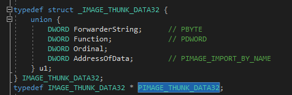

In order to utilise the above structure, again, we need to translate an RVA of the `OriginalFirstThunk` member of the structure `PIMAGE_IMPORT_DESCRIPTOR` which in our case was pointing to `0x0000A28C`:

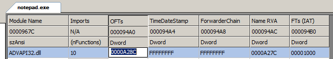

If we use the same formula for calculating RVAs as previously and use the below Powershell to calculate the file offset, we get:

```csharp
# first thunk
$firstThunk = $rawOffsetToTextSection + (0x0000A28C - $textVA)
[System.Convert]::ToString($firstThunk, 16)

968c
```


At that offset 968c+4 \(+4 because per `PIMAGE_THUNK_DATA32` structure layout, the second member is called `Function` and this is the member we are interested in\), we see a couple more values that look like RVAs - `0x0000a690` and `0x0000a6a2`:


If we do a final RVA to file offset conversion for the second \(we could do the same for 0x0000a690\) RVA 0x0000a6a2:

```csharp
$firstFunction = $rawOffsetToTextSection + (0x0000A6A2 - $textVA)
[System.Convert]::ToString($firstFunction, 16)
9aa2
```

Finally, with the file offset 0x9aa2, we get to see a second \(because we chose the offset a6a2 rather than a690\) imported function for the DLL ADVAPI32.  
Note that the function name actually starts 2 bytes further into the file, so the file offset 9aa2 becomes 9aa2 + 2 = 9aa4 - currently I'm not sure what the reason for this is:


Cross checking the above findings with CFF Explorer's Imported DLLs parser, we can see that our calculations were correct - note the OFTs column and the values a6a2 and a690 we referred to earlier:


## Code

The below code shows how to loop through the file in its entirety to parse all the DLLs and all of their imported functions.

```cpp
#include "stdafx.h"
#include "Windows.h"
#include <iostream>

int main(int argc, char* argv[]) {
	const int MAX_FILEPATH = 255;
	char fileName[MAX_FILEPATH] = {0};
	memcpy_s(&fileName, MAX_FILEPATH, argv[1], MAX_FILEPATH);
	HANDLE file = NULL;
	DWORD fileSize = NULL;
	DWORD bytesRead = NULL;
	LPVOID fileData = NULL;
	PIMAGE_DOS_HEADER dosHeader = {};
	PIMAGE_NT_HEADERS imageNTHeaders = {};
	PIMAGE_SECTION_HEADER sectionHeader = {};
	PIMAGE_SECTION_HEADER importSection = {};
	IMAGE_IMPORT_DESCRIPTOR* importDescriptor = {};
	PIMAGE_THUNK_DATA thunkData = {};
	DWORD thunk = NULL;
	DWORD rawOffset = NULL;

	// open file
	file = CreateFileA(fileName, GENERIC_ALL, FILE_SHARE_READ, NULL, OPEN_EXISTING, FILE_ATTRIBUTE_NORMAL, NULL);
	if (file == INVALID_HANDLE_VALUE) printf("Could not read file");
	
	// allocate heap
	fileSize = GetFileSize(file, NULL);
	fileData = HeapAlloc(GetProcessHeap(), 0, fileSize);
	
	// read file bytes to memory
	ReadFile(file, fileData, fileSize, &bytesRead, NULL);

	// IMAGE_DOS_HEADER
	dosHeader = (PIMAGE_DOS_HEADER)fileData;
	printf("******* DOS HEADER *******\n");
	printf("\t0x%x\t\tMagic number\n", dosHeader->e_magic);
	printf("\t0x%x\t\tBytes on last page of file\n", dosHeader->e_cblp);
	printf("\t0x%x\t\tPages in file\n", dosHeader->e_cp);
	printf("\t0x%x\t\tRelocations\n", dosHeader->e_crlc);
	printf("\t0x%x\t\tSize of header in paragraphs\n", dosHeader->e_cparhdr);
	printf("\t0x%x\t\tMinimum extra paragraphs needed\n", dosHeader->e_minalloc);
	printf("\t0x%x\t\tMaximum extra paragraphs needed\n", dosHeader->e_maxalloc);
	printf("\t0x%x\t\tInitial (relative) SS value\n", dosHeader->e_ss);
	printf("\t0x%x\t\tInitial SP value\n", dosHeader->e_sp);
	printf("\t0x%x\t\tInitial SP value\n", dosHeader->e_sp);
	printf("\t0x%x\t\tChecksum\n", dosHeader->e_csum);
	printf("\t0x%x\t\tInitial IP value\n", dosHeader->e_ip);
	printf("\t0x%x\t\tInitial (relative) CS value\n", dosHeader->e_cs);
	printf("\t0x%x\t\tFile address of relocation table\n", dosHeader->e_lfarlc);
	printf("\t0x%x\t\tOverlay number\n", dosHeader->e_ovno);
	printf("\t0x%x\t\tOEM identifier (for e_oeminfo)\n", dosHeader->e_oemid);
	printf("\t0x%x\t\tOEM information; e_oemid specific\n", dosHeader->e_oeminfo);
	printf("\t0x%x\t\tFile address of new exe header\n", dosHeader->e_lfanew);

	// IMAGE_NT_HEADERS
	imageNTHeaders = (PIMAGE_NT_HEADERS)((DWORD)fileData + dosHeader->e_lfanew);
	printf("\n******* NT HEADERS *******\n");
	printf("\t%x\t\tSignature\n", imageNTHeaders->Signature);
	
	// FILE_HEADER
	printf("\n******* FILE HEADER *******\n");
	printf("\t0x%x\t\tMachine\n", imageNTHeaders->FileHeader.Machine);
	printf("\t0x%x\t\tNumber of Sections\n", imageNTHeaders->FileHeader.NumberOfSections);
	printf("\t0x%x\tTime Stamp\n", imageNTHeaders->FileHeader.TimeDateStamp);
	printf("\t0x%x\t\tPointer to Symbol Table\n", imageNTHeaders->FileHeader.PointerToSymbolTable);
	printf("\t0x%x\t\tNumber of Symbols\n", imageNTHeaders->FileHeader.NumberOfSymbols);
	printf("\t0x%x\t\tSize of Optional Header\n", imageNTHeaders->FileHeader.SizeOfOptionalHeader);
	printf("\t0x%x\t\tCharacteristics\n", imageNTHeaders->FileHeader.Characteristics);

	// OPTIONAL_HEADER
	printf("\n******* OPTIONAL HEADER *******\n");
	printf("\t0x%x\t\tMagic\n", imageNTHeaders->OptionalHeader.Magic);
	printf("\t0x%x\t\tMajor Linker Version\n", imageNTHeaders->OptionalHeader.MajorLinkerVersion);
	printf("\t0x%x\t\tMinor Linker Version\n", imageNTHeaders->OptionalHeader.MinorLinkerVersion);
	printf("\t0x%x\t\tSize Of Code\n", imageNTHeaders->OptionalHeader.SizeOfCode);
	printf("\t0x%x\t\tSize Of Initialized Data\n", imageNTHeaders->OptionalHeader.SizeOfInitializedData);
	printf("\t0x%x\t\tSize Of UnInitialized Data\n", imageNTHeaders->OptionalHeader.SizeOfUninitializedData);
	printf("\t0x%x\t\tAddress Of Entry Point (.text)\n", imageNTHeaders->OptionalHeader.AddressOfEntryPoint);
	printf("\t0x%x\t\tBase Of Code\n", imageNTHeaders->OptionalHeader.BaseOfCode);
	//printf("\t0x%x\t\tBase Of Data\n", imageNTHeaders->OptionalHeader.BaseOfData);
	printf("\t0x%x\t\tImage Base\n", imageNTHeaders->OptionalHeader.ImageBase);
	printf("\t0x%x\t\tSection Alignment\n", imageNTHeaders->OptionalHeader.SectionAlignment);
	printf("\t0x%x\t\tFile Alignment\n", imageNTHeaders->OptionalHeader.FileAlignment);
	printf("\t0x%x\t\tMajor Operating System Version\n", imageNTHeaders->OptionalHeader.MajorOperatingSystemVersion);
	printf("\t0x%x\t\tMinor Operating System Version\n", imageNTHeaders->OptionalHeader.MinorOperatingSystemVersion);
	printf("\t0x%x\t\tMajor Image Version\n", imageNTHeaders->OptionalHeader.MajorImageVersion);
	printf("\t0x%x\t\tMinor Image Version\n", imageNTHeaders->OptionalHeader.MinorImageVersion);
	printf("\t0x%x\t\tMajor Subsystem Version\n", imageNTHeaders->OptionalHeader.MajorSubsystemVersion);
	printf("\t0x%x\t\tMinor Subsystem Version\n", imageNTHeaders->OptionalHeader.MinorSubsystemVersion);
	printf("\t0x%x\t\tWin32 Version Value\n", imageNTHeaders->OptionalHeader.Win32VersionValue);
	printf("\t0x%x\t\tSize Of Image\n", imageNTHeaders->OptionalHeader.SizeOfImage);
	printf("\t0x%x\t\tSize Of Headers\n", imageNTHeaders->OptionalHeader.SizeOfHeaders);
	printf("\t0x%x\t\tCheckSum\n", imageNTHeaders->OptionalHeader.CheckSum);
	printf("\t0x%x\t\tSubsystem\n", imageNTHeaders->OptionalHeader.Subsystem);
	printf("\t0x%x\t\tDllCharacteristics\n", imageNTHeaders->OptionalHeader.DllCharacteristics);
	printf("\t0x%x\t\tSize Of Stack Reserve\n", imageNTHeaders->OptionalHeader.SizeOfStackReserve);
	printf("\t0x%x\t\tSize Of Stack Commit\n", imageNTHeaders->OptionalHeader.SizeOfStackCommit);
	printf("\t0x%x\t\tSize Of Heap Reserve\n", imageNTHeaders->OptionalHeader.SizeOfHeapReserve);
	printf("\t0x%x\t\tSize Of Heap Commit\n", imageNTHeaders->OptionalHeader.SizeOfHeapCommit);
	printf("\t0x%x\t\tLoader Flags\n", imageNTHeaders->OptionalHeader.LoaderFlags);
	printf("\t0x%x\t\tNumber Of Rva And Sizes\n", imageNTHeaders->OptionalHeader.NumberOfRvaAndSizes);

	// DATA_DIRECTORIES
	printf("\n******* DATA DIRECTORIES *******\n");
	printf("\tExport Directory Address: 0x%x; Size: 0x%x\n", imageNTHeaders->OptionalHeader.DataDirectory[0].VirtualAddress, imageNTHeaders->OptionalHeader.DataDirectory[0].Size);
	printf("\tImport Directory Address: 0x%x; Size: 0x%x\n", imageNTHeaders->OptionalHeader.DataDirectory[1].VirtualAddress, imageNTHeaders->OptionalHeader.DataDirectory[1].Size);

	// SECTION_HEADERS
	printf("\n******* SECTION HEADERS *******\n");
	// get offset to first section headeer
	DWORD sectionLocation = (DWORD)imageNTHeaders + sizeof(DWORD) + (DWORD)(sizeof(IMAGE_FILE_HEADER)) + (DWORD)imageNTHeaders->FileHeader.SizeOfOptionalHeader;
	DWORD sectionSize = (DWORD)sizeof(IMAGE_SECTION_HEADER);
	
	// get offset to the import directory RVA
	DWORD importDirectoryRVA = imageNTHeaders->OptionalHeader.DataDirectory[IMAGE_DIRECTORY_ENTRY_IMPORT].VirtualAddress;

	// print section data
	for (int i = 0; i < imageNTHeaders->FileHeader.NumberOfSections; i++) {
		sectionHeader = (PIMAGE_SECTION_HEADER)sectionLocation;
		printf("\t%s\n", sectionHeader->Name);
		printf("\t\t0x%x\t\tVirtual Size\n", sectionHeader->Misc.VirtualSize);
		printf("\t\t0x%x\t\tVirtual Address\n", sectionHeader->VirtualAddress);
		printf("\t\t0x%x\t\tSize Of Raw Data\n", sectionHeader->SizeOfRawData);
		printf("\t\t0x%x\t\tPointer To Raw Data\n", sectionHeader->PointerToRawData);
		printf("\t\t0x%x\t\tPointer To Relocations\n", sectionHeader->PointerToRelocations);
		printf("\t\t0x%x\t\tPointer To Line Numbers\n", sectionHeader->PointerToLinenumbers);
		printf("\t\t0x%x\t\tNumber Of Relocations\n", sectionHeader->NumberOfRelocations);
		printf("\t\t0x%x\t\tNumber Of Line Numbers\n", sectionHeader->NumberOfLinenumbers);
		printf("\t\t0x%x\tCharacteristics\n", sectionHeader->Characteristics);

		// save section that contains import directory table
		if (importDirectoryRVA >= sectionHeader->VirtualAddress && importDirectoryRVA < sectionHeader->VirtualAddress + sectionHeader->Misc.VirtualSize) {
			importSection = sectionHeader;
		}
		sectionLocation += sectionSize;
	}

	// get file offset to import table
	rawOffset = (DWORD)fileData + importSection->PointerToRawData;
	
	// get pointer to import descriptor's file offset. Note that the formula for calculating file offset is: imageBaseAddress + pointerToRawDataOfTheSectionContainingRVAofInterest + (RVAofInterest - SectionContainingRVAofInterest.VirtualAddress)
	importDescriptor = (PIMAGE_IMPORT_DESCRIPTOR)(rawOffset + (imageNTHeaders->OptionalHeader.DataDirectory[IMAGE_DIRECTORY_ENTRY_IMPORT].VirtualAddress - importSection->VirtualAddress));
	
	printf("\n******* DLL IMPORTS *******\n");	
	for (; importDescriptor->Name != 0; importDescriptor++)	{
		// imported dll modules
		printf("\t%s\n", rawOffset + (importDescriptor->Name - importSection->VirtualAddress));
		thunk = importDescriptor->OriginalFirstThunk == 0 ? importDescriptor->FirstThunk : importDescriptor->OriginalFirstThunk;
		thunkData = (PIMAGE_THUNK_DATA)(rawOffset + (thunk - importSection->VirtualAddress));
		
		// dll exported functions
		for (; thunkData->u1.AddressOfData != 0; thunkData++) {
			//a cheap and probably non-reliable way of checking if the function is imported via its ordinal number ¯\_(ツ)_/¯
			if (thunkData->u1.AddressOfData > 0x80000000) {
				//show lower bits of the value to get the ordinal ¯\_(ツ)_/¯
				printf("\t\tOrdinal: %x\n", (WORD)thunkData->u1.AddressOfData);
			} else {
				printf("\t\t%s\n", (rawOffset + (thunkData->u1.AddressOfData - importSection->VirtualAddress + 2)));
			}
		}
	}

    return 0;
}
```



## Output Screenshots

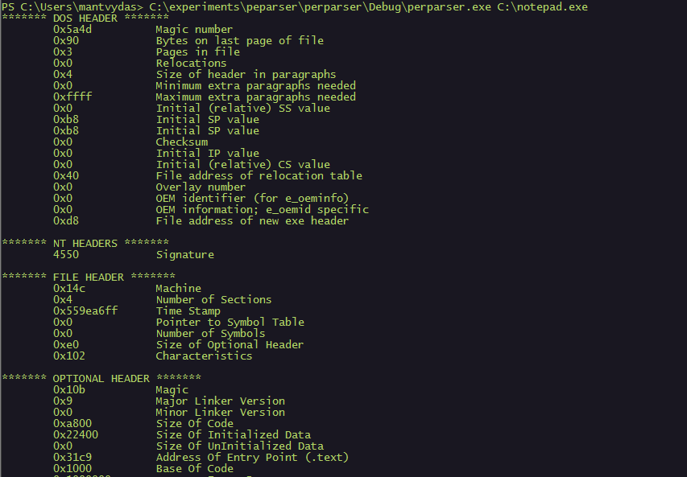

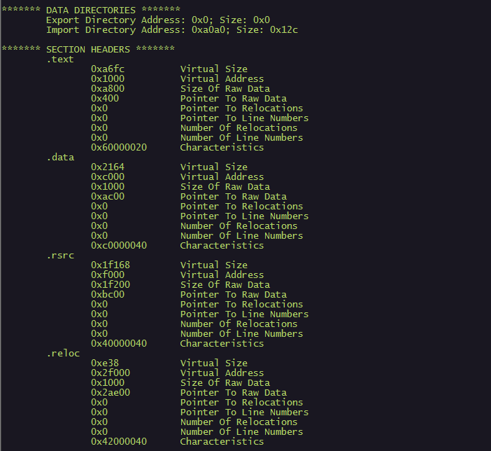

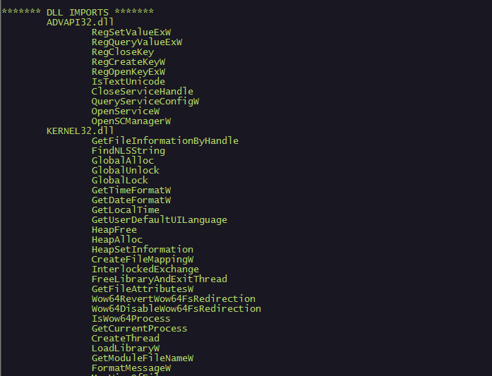


## References











