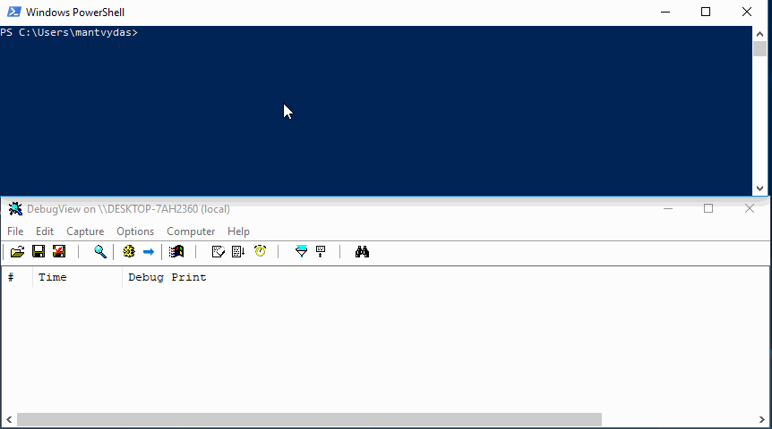
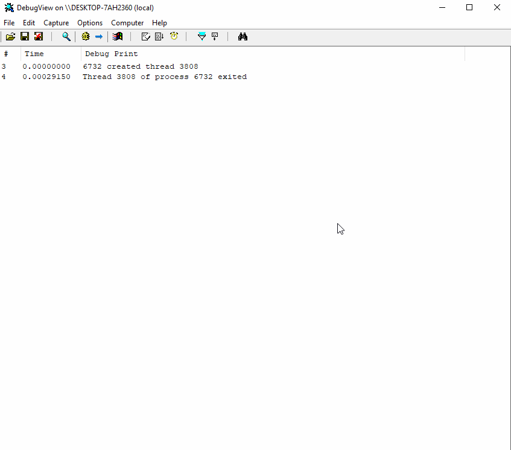

# Subscribing to Process Creation, Thread Creation and Image Load Notifications from a Kernel Driver

This is a quick lab to play with some of the interesting notifications that kernel drivers can subscribe to:

* [`PsSetCreateProcessNotifyRoutine`](subscribing-to-process-creation-thread-creation-and-image-load-notifications-from-a-kernel-driver.md#pssetcreateprocessnotifyroutine) - notifies the driver about new/terminated processes
* [`PsSetCreateProcessNotifyRoutineEx`](subscribing-to-process-creation-thread-creation-and-image-load-notifications-from-a-kernel-driver.md#pssetcreateprocessnotifyroutineex) - notifies the driver about new processes being created, allows to kill them before they can run
* [`PsSetCreateThreadNotifyRoutine`](subscribing-to-process-creation-thread-creation-and-image-load-notifications-from-a-kernel-driver.md#pssetcreatethreadnotifyroutine) - notifies the driver about new/terminated threads
* [`PsSetLoadImageNotifyRoutine`](subscribing-to-process-creation-thread-creation-and-image-load-notifications-from-a-kernel-driver.md#pssetloadimagenotifyroutine) - notifies the driver about DLLs loaded by processes

## PsSetCreateProcessNotifyRoutine

`PsSetCreateProcessNotifyRoutine` takes two parameters:

```cpp
NTSTATUS PsSetCreateProcessNotifyRoutine(
  // pointer to a function to be called when a process is spawned or terminated
  PCREATE_PROCESS_NOTIFY_ROUTINE NotifyRoutine,
  // specifies whether to subscribe or unsubscribe from this event
  BOOLEAN                        Remove
);
```

Below is a snippet that shows how the routine `sCreateProcessNotifyRoutine` \(line 2\) gets registered for new/terminated process notifications on line 24:

```cpp
// handle incoming notifications about new/terminated processes
void sCreateProcessNotifyRoutine(HANDLE ppid, HANDLE pid, BOOLEAN create)
{
	if (create)
	{
		PEPROCESS process = NULL;
		PUNICODE_STRING parentProcessName = NULL, processName = NULL;
		
		PsLookupProcessByProcessId(ppid, &process);
		SeLocateProcessImageName(process, &parentProcessName);

		PsLookupProcessByProcessId(pid, &process);
		SeLocateProcessImageName(process, &processName);

		DbgPrint("%d %wZ\n\t\t%d %wZ", ppid, parentProcessName, pid, processName);
	}
	else
	{
		DbgPrint("Process %d lost child %d", ppid, pid);
	}
}

// register sCreateProcessNotifyRoutine function to receive notifications about new/terminated processes
PsSetCreateProcessNotifyRoutine(sCreateProcessNotifyRoutine, FALSE);
```

Below shows how the routine `sCreateProcessNotifyRoutine` gets executed when a new process hostname.exe \(PID 2892\) is spawned by powershell \(PID 7176\). Additionally, it shows that the process 7176 \(hostname\) terminated:



## PsSetLoadImageNotifyRoutine

`PsSetLoadImageNotifyRoutine` only takes one parameter - a pointer to a function that will handle notifications about DLLs that processes running on the system loaded:

```text
NTSTATUS PsSetLoadImageNotifyRoutine(
  PLOAD_IMAGE_NOTIFY_ROUTINE NotifyRoutine
);
```

Below indicates that the routine `sLoadImageNotifyRoutine` is going to handle our notifications as registered with `PsSetLoadImageNotifyRoutine` on line 14:

```cpp
// handle incoming notifications about module loads
void sLoadImageNotifyRoutine(PUNICODE_STRING imageName,	HANDLE pid, PIMAGE_INFO imageInfo)
{
	UNREFERENCED_PARAMETER(imageInfo);
	PEPROCESS process = NULL;
	PUNICODE_STRING processName = NULL;
	PsLookupProcessByProcessId(pid, &process);
	SeLocateProcessImageName(process, &processName);

	DbgPrint("%wZ (%d) loaded %wZ", processName, pid, imageName);
}

// register sLoadImageNotifyRoutinefunction to receive notifications new DLLs being loaded to processes
PsSetLoadImageNotifyRoutine(sLoadImageNotifyRoutine);
```

Testing the driver - once we open a notepad.exe, our driver gets notified about all the modules that notepad.exe loaded:


## PsSetCreateThreadNotifyRoutine

`PsSetCreateThreadNotifyRoutine` only takes one parameter - a pointer to a function that will handle notifications about new or killed threads across all the system processes:

```text
NTSTATUS PsSetCreateThreadNotifyRoutine(
  PCREATE_THREAD_NOTIFY_ROUTINE NotifyRoutine
);
```

Below indicates that the routine `sCreateThreadNotifyRoutine` is going to handle our notifications as registered with `PsSetCreateThreadNotifyRoutine` on line 15:

```cpp
// handle incoming notifications about new/terminated processes
void sCreateThreadNotifyRoutine(HANDLE pid, HANDLE tid, BOOLEAN create)
{
	if (create)
	{
		DbgPrint("%d created thread %d", pid, tid);
	}
	else
	{
		DbgPrint("Thread %d of process %d exited", tid, pid);
	}
}

// register sCreateThreadNotifyRoutine to receive notifications about thread creation / termination
PsSetCreateThreadNotifyRoutine(sCreateThreadNotifyRoutine);
```

Testing the driver now, we can see we are indeed geting notified about new and terminated threads across processes on our system:


## PsSetCreateProcessNotifyRoutineEx

`PsSetCreateProcessNotifyRoutineEx` takes two arguments:

```cpp
NTSTATUS PsSetCreateProcessNotifyRoutineEx(
  // pointer to a function to be called when a process is spawned 
  PCREATE_PROCESS_NOTIFY_ROUTINE_EX NotifyRoutine,
  // specifies whether to subscribe or unsubscribe from this event
  BOOLEAN                           Remove
);
```

Below is a snippet that shows how the routine `sCreateProcessNotifyRoutineEx` \(line 3\) gets registered for new process notifications on line 19. Processes with commandline containing `notepad` in them will be killed by setting the `createInfo.reationStatus` member to `STATUS_ACCESS_DENIED` \(line 13\):

```cpp
// handle incoming notifications about new/terminated processes and kill
// processes that have "notepad" in their commandline arguments
void sCreateProcessNotifyRoutineEx(PEPROCESS process, HANDLE pid, PPS_CREATE_NOTIFY_INFO createInfo)
{
	UNREFERENCED_PARAMETER(process);
	UNREFERENCED_PARAMETER(pid);
	
	if (createInfo != NULL)
	{
		if (wcsstr(createInfo->CommandLine->Buffer, L"notepad") != NULL)
		{
			DbgPrint("[!] Access to launch notepad.exe was denied!");
			createInfo->CreationStatus = STATUS_ACCESS_DENIED;
		}
	}
}

// subscribe sCreateProcessNotifyRoutineEx to new / terminated process notifications
PsSetCreateProcessNotifyRoutineEx(sCreateProcessNotifyRoutineEx, FALSE);
```


If `PsSetCreateProcessNotifyRoutineEx` is not working in your driver, you will need to add a `/integritycheck` switch in your linker configuration



Below shows how an attempt to spawn notepad.exe is blocked by our driver:



## Code

Belos is the full working driver code that registers all the callback routines mentioned above:

```cpp
#include <Ntifs.h>
#include <ntddk.h>
#include <wdm.h>

DRIVER_DISPATCH HandleCustomIOCTL;
#define IOCTL_SPOTLESS CTL_CODE(FILE_DEVICE_UNKNOWN, 0x2049, METHOD_BUFFERED, FILE_ANY_ACCESS)
UNICODE_STRING DEVICE_NAME = RTL_CONSTANT_STRING(L"\\Device\\SpotlessDevice");
UNICODE_STRING DEVICE_SYMBOLIC_NAME = RTL_CONSTANT_STRING(L"\\??\\SpotlessDeviceLink");

void sCreateProcessNotifyRoutine(HANDLE ppid, HANDLE pid, BOOLEAN create)
{
	if (create)
	{
		PEPROCESS process = NULL;
		PUNICODE_STRING parentProcessName = NULL, processName = NULL;
		
		PsLookupProcessByProcessId(ppid, &process);
		SeLocateProcessImageName(process, &parentProcessName);

		PsLookupProcessByProcessId(pid, &process);
		SeLocateProcessImageName(process, &processName);

		DbgPrint("%d %wZ\n\t\t%d %wZ", ppid, parentProcessName, pid, processName);
	}
	else
	{
		DbgPrint("Process %d lost child %d", ppid, pid);
	}
}

void sCreateProcessNotifyRoutineEx(PEPROCESS process, HANDLE pid, PPS_CREATE_NOTIFY_INFO createInfo)
{
	UNREFERENCED_PARAMETER(process);
	UNREFERENCED_PARAMETER(pid);
	
	if (createInfo != NULL)
	{
		if (wcsstr(createInfo->CommandLine->Buffer, L"notepad") != NULL)
		{
			DbgPrint("[!] Access to launch notepad.exe was denied!");
			createInfo->CreationStatus = STATUS_ACCESS_DENIED;
		}
	}
}

void sLoadImageNotifyRoutine(PUNICODE_STRING imageName,	HANDLE pid, PIMAGE_INFO imageInfo)
{
	UNREFERENCED_PARAMETER(imageInfo);
	PEPROCESS process = NULL;
	PUNICODE_STRING processName = NULL;
	PsLookupProcessByProcessId(pid, &process);
	SeLocateProcessImageName(process, &processName);

	DbgPrint("%wZ (%d) loaded %wZ", processName, pid, imageName);
}

void sCreateThreadNotifyRoutine(HANDLE pid, HANDLE tid, BOOLEAN create)
{
	if (create)
	{
		DbgPrint("%d created thread %d", pid, tid);
	}
	else
	{
		DbgPrint("Thread %d of process %d exited", tid, pid);
	}
}

void DriverUnload(PDRIVER_OBJECT dob)
{
	DbgPrint("Driver unloaded, deleting symbolic links and devices");
	IoDeleteDevice(dob->DeviceObject);
	IoDeleteSymbolicLink(&DEVICE_SYMBOLIC_NAME);
	PsSetCreateProcessNotifyRoutine(sCreateProcessNotifyRoutine, TRUE);
	PsRemoveLoadImageNotifyRoutine(sLoadImageNotifyRoutine);
	PsRemoveCreateThreadNotifyRoutine(sCreateThreadNotifyRoutine);
	PsSetCreateProcessNotifyRoutineEx(sCreateProcessNotifyRoutineEx, TRUE);
}

NTSTATUS HandleCustomIOCTL(PDEVICE_OBJECT DeviceObject, PIRP Irp)
{
	UNREFERENCED_PARAMETER(DeviceObject);
	PIO_STACK_LOCATION stackLocation = NULL;
	CHAR *messageFromKernel = "ohai from them kernelz";

	stackLocation = IoGetCurrentIrpStackLocation(Irp);
	
	if (stackLocation->Parameters.DeviceIoControl.IoControlCode == IOCTL_SPOTLESS)
	{
		DbgPrint("IOCTL_SPOTLESS (0x%x) issued", stackLocation->Parameters.DeviceIoControl.IoControlCode);
		DbgPrint("Input received from userland: %s", (char*)Irp->AssociatedIrp.SystemBuffer);
	}

	Irp->IoStatus.Information = strlen(messageFromKernel);
	Irp->IoStatus.Status = STATUS_SUCCESS;
	
	DbgPrint("Sending to userland: %s", messageFromKernel);
	RtlCopyMemory(Irp->AssociatedIrp.SystemBuffer, messageFromKernel, strlen(Irp->AssociatedIrp.SystemBuffer));
	
	IoCompleteRequest(Irp, IO_NO_INCREMENT);

	return STATUS_SUCCESS;
}

NTSTATUS MajorFunctions(PDEVICE_OBJECT DeviceObject, PIRP Irp)
{
	UNREFERENCED_PARAMETER(DeviceObject);

	PIO_STACK_LOCATION stackLocation = NULL;
	stackLocation = IoGetCurrentIrpStackLocation(Irp);

	switch (stackLocation->MajorFunction)
	{
	case IRP_MJ_CREATE:
		DbgPrint("Handle to symbolink link %wZ opened", DEVICE_SYMBOLIC_NAME);
		break;
	case IRP_MJ_CLOSE:
		DbgPrint("Handle to symbolink link %wZ closed", DEVICE_SYMBOLIC_NAME);
		break;
	default:
		break;
	}
	
	Irp->IoStatus.Information = 0;
	Irp->IoStatus.Status = STATUS_SUCCESS;
	IoCompleteRequest(Irp, IO_NO_INCREMENT);

	return STATUS_SUCCESS;
}

NTSTATUS DriverEntry(PDRIVER_OBJECT DriverObject, PUNICODE_STRING RegistryPath) 
{
	UNREFERENCED_PARAMETER(DriverObject);
	UNREFERENCED_PARAMETER(RegistryPath);
	
	NTSTATUS status	= 0;

	// routine that will execute when our driver is unloaded/service is stopped
	DriverObject->DriverUnload = DriverUnload;
	
	// routine for handling IO requests from userland
	DriverObject->MajorFunction[IRP_MJ_DEVICE_CONTROL] = HandleCustomIOCTL;
	
	// routines that will execute once a handle to our device's symbolik link is opened/closed
	DriverObject->MajorFunction[IRP_MJ_CREATE] = MajorFunctions;
	DriverObject->MajorFunction[IRP_MJ_CLOSE] = MajorFunctions;
	
	DbgPrint("Driver loaded");

	// subscribe to notifications
	PsSetCreateProcessNotifyRoutine(sCreateProcessNotifyRoutine, FALSE);
	PsSetLoadImageNotifyRoutine(sLoadImageNotifyRoutine);
	PsSetCreateThreadNotifyRoutine(sCreateThreadNotifyRoutine);
	PsSetCreateProcessNotifyRoutineEx(sCreateProcessNotifyRoutineEx, FALSE);
	DbgPrint("Listeners isntalled..");

	IoCreateDevice(DriverObject, 0, &DEVICE_NAME, FILE_DEVICE_UNKNOWN, FILE_DEVICE_SECURE_OPEN, FALSE, &DriverObject->DeviceObject);
	if (!NT_SUCCESS(status))
	{
		DbgPrint("Could not create device %wZ", DEVICE_NAME);
	}
	else 
	{
		DbgPrint("Device %wZ created", DEVICE_NAME);
	}

	status = IoCreateSymbolicLink(&DEVICE_SYMBOLIC_NAME, &DEVICE_NAME);
	if (NT_SUCCESS(status))
	{
		DbgPrint("Symbolic link %wZ created", DEVICE_SYMBOLIC_NAME);
	}
	else
	{
		DbgPrint("Error creating symbolic link %wZ", DEVICE_SYMBOLIC_NAME);
	}
	
	return STATUS_SUCCESS;
}
```

## References







