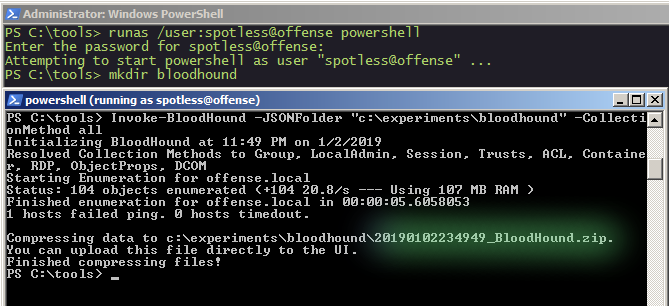
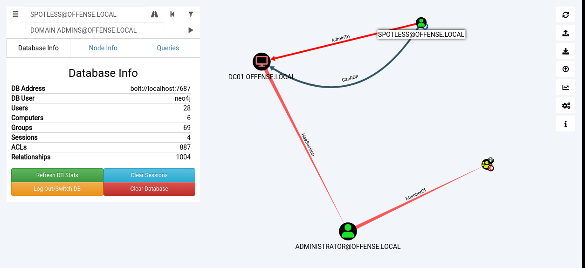
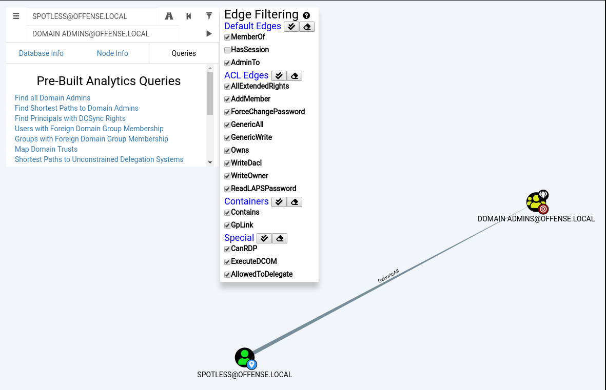

# BloodHound with Kali Linux: 101

This lab is to see what it takes to install BloodHound on Kali Linux as well as a brief exploration of the UI, understanding what it shows and how it can help a pentester/redteamer to escalate privileges in order to reach their objectives.

## What is BloodHound

> BloodHound is a single page Javascript web application, built on top of [Linkurious](http://linkurio.us/), compiled with [Electron](http://electron.atom.io/), with a [Neo4j](https://neo4j.com/)database fed by a PowerShell ingestor.
>
> BloodHound uses graph theory to reveal the hidden and often unintended relationships within an Active Directory environment. Attackers can use BloodHound to easily identify highly complex attack paths that would otherwise be impossible to quickly identify. Defenders can use BloodHound to identify and eliminate those same attack paths. Both blue and red teams can use BloodHound to easily gain a deeper understanding of privilege relationships in an Active Directory environment.
>
> BloodHound is developed by [@\_wald0](https://www.twitter.com/_wald0), [@CptJesus](https://twitter.com/CptJesus), and [@harmj0y](https://twitter.com/harmj0y).
>
> From [https://github.com/BloodHoundAD/BloodHound](https://github.com/BloodHoundAD/BloodHound)

## Installing BloodHound

It is surprising easy to install bloodhound these days from Kali Linux:


```csharp
apt-get install bloodhound
```


Part of the installation process, neo4j database management solution that is required for BloodHound will also be installed that will need to be configured.

## Configuring BloodHound

Once the installation is complete, we need to configure neo4j - mainly just change default passwords, so let's run:


```csharp
neo4j console
```



and navigate to [http://localhost:7474/](http://localhost:7474/) to set up a DB user account by changing default passwords from **neo4j:neo4j** to something else - we will need those credentials when launching BloodHound itself.

## Running BloodHound


```text
bloodhound
```


Login with your previously set credentials from neo4j:


## Enumeration & Data Ingestion

BloodHound is a data visualisation tool, meaning without any data is not at all useful. BloodHound is very good at visualising Active Directory object relationships and various permissions between those relationships. 

In order for BloodHound to do its magic, we need to enumerate a victim domain. The enumeration process produces a JSON file that describes various relationships and permissions between AD objects as mentioned earlier, which can then be imported to BloodHound. Once the resulting JSON file is ingested/imported to BloodHound, it will allow us to visually see the ways \(if any\) how Active Directory and its various objects can be \(ab\)used to elevate privileges, ideally to Domain Admin.

### SharpHound

The tool that does the aforementioned AD enumeration is called [SharpHound](https://github.com/BloodHoundAD/BloodHound/tree/master/Ingestors).

I tried running the SharpHound \(the BloodHound ingestor, just a confusing name\) from an account that was not a domain member, so I got the following message:


If you are on a machine that is a member, but you are authenticated as a local user, but have credentials for a domain user, get a shell for that user like so:


```csharp
runas /user:spotless@offense powershell

// if machine is not a domain member
runas /netonly /user:spotless@offense powershell
```


We can now proceed to AD enumeration:


```csharp
. .\SharpHound.ps1
Invoke-BloodHound -CollectionMethod All -JSONFolder "c:\experiments\bloodhound"
```


The above command will produce the previously mentioned JSON file, albeit zipped:



We can now take the .zip file that was generated by Invoke-BloodHound and just drag and drop it to the BloodHound interface for ingestion. Once the ingestion is complete, we can play around with Pre-canned queries that actually visualise the provided data:


## Execution

Once the data is ingested, as mentioned, we can play around with the built in queries to find things like `All Domain Admins`,  `Shortest Path to Domain Admins` and similar, that may help us as an attacker to escalate privileges and compromise the entire domains/forest.

### Example \#1: User to Exchange Trusted Subsytem

A contrived and maybe not entirely realistic, but still - the below shows how an attacker could assume privileges of `Exchange Trusted Subsystem` group when on the victim network as user spotless:


The above indicates that `offense\spotless` is admin to the `DC01$` \(could use mimikatz to pass the machine account hash to get an elevated shell\) where `offense\administrator` session is observed \(dump lsass or token impersonation for administrator\) and this way assume rights of the Exchange Trusted Subsystem group!

What exactly is the Exchange Trusted Subsystem?

```css
net group "Exchange Trusted Subsystem"
Group name     Exchange Trusted Subsystem
Comment        This group contains Exchange servers that run Exchange cmdlets on behalf of users via the management serv
ice. Its members have permission to read and modify all Exchange configuration, as well as user accounts and groups. Thi
s group should not be deleted.
```

### Example \#2: User to Domain Admin via AdminTo and MemberOf

The below shows how the user spotless could assume privileges of a Domain Admin.

Similarly to the previous example, spotless is admin of the DC01$ where admin session is established. If that session is compromised \(it is\), it makes the user spotless a Domain Admin:



### Example \#3: User to Domain Admin via Weak ACEs

The below shows how the user spotless can become a Domain Admin by [abusing weak ACEs](abusing-active-directory-acls-aces.md#genericall-on-group) of the said group. In this particular example, the user spotless can essentially add themselves to domain admins group with `net group "domain admins" spotless /add /domain` and it is gamer over:



See my previous lab that explores some of the ways of manually exploiting and abusing Active Directory ACL/ACE misconfiguration of privileges such as `AddMember`, `GenericWrite`, `GenericAll` and similar:



## References



