# PowerView: Active Directory Enumeration

This lab explores a couple of common cmdlets of PowerView that allows for Active Directory/Domain enumeration.

## Get-NetDomain

Get current user's domain:

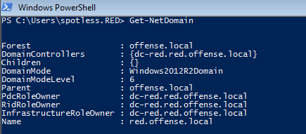

## Get-NetForest

Get information about the forest the current user's domain is in:

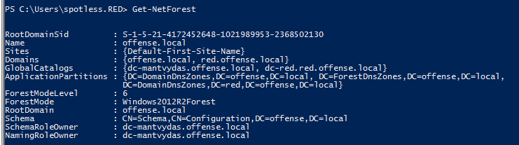

## Get-NetForestDomain

Get all domains of the forest the current user is in:

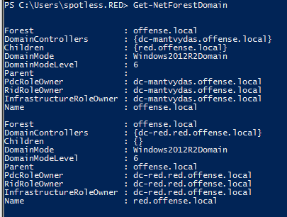

## Get-NetDomainController

Get info about the DC of the domain the current user belongs to:

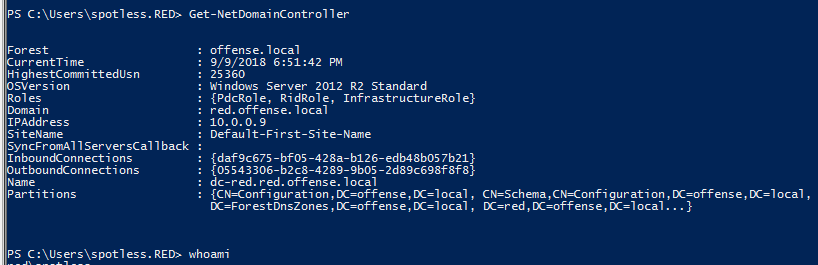

## Get-NetGroupMember

Get a list of domain members that belong to a given group:

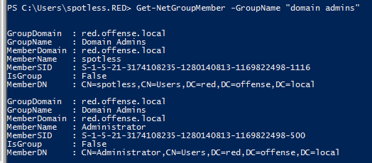

## Get-NetLoggedon

Get users that are logged on to a given computer:

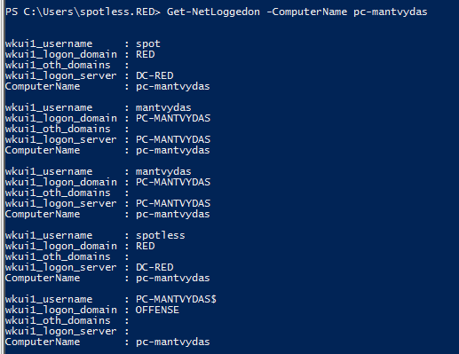

## Get-NetDomainTrust

Enumerate domain trust relationships of the current user's domain:

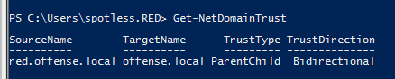

## Get-NetForestTrust

Enumerate forest trusts from the current domain's perspective:

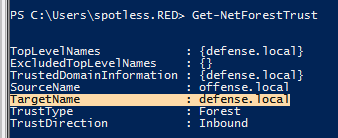

## Get-NetProcess

Get running processes for a given remote machine:

```csharp
Get-NetProcess -ComputerName dc01 -RemoteUserName offense\administrator -RemotePassword 123456 | ft
```

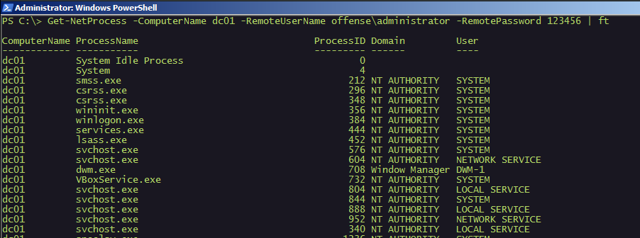

## Invoke-MapDomainTrust

Enumerate and map all domain trusts:

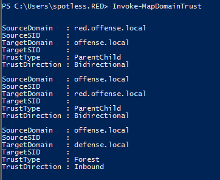

## Invoke-ShareFinder

Enumerate shares on a given PC - could be easily combines with other scripts to enumerate all machines in the domain:

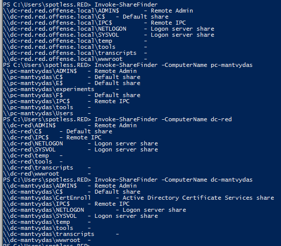

## Invoke-UserHunter

Find machines on a domain or users on a given machine that are logged on:

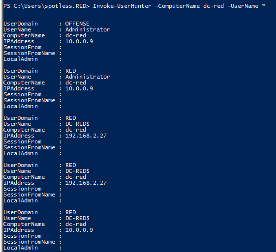

## References



