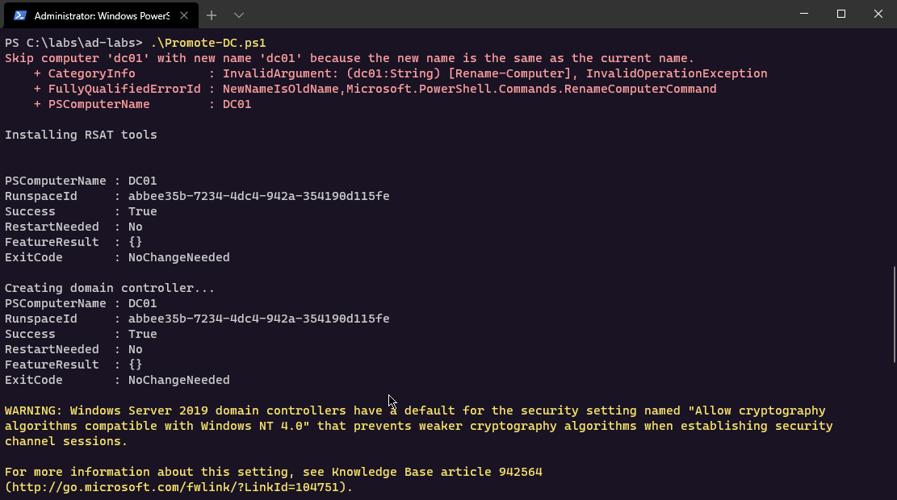

# Active Directory Lab with Hyper-V and PowerShell

Below are some notes with a couple of simple Powershell scripts that I use to:

* Promote a computer to Domain Controller
* Create an Active Directory \(AD\) domain `offense.local`
* Join computer to `offense.local` domain
* Create users in `offense.local` domain


The scripts are not intended to fully automate building of the Active Directory lab, rather they serve as cheatsheets that suit most of my needs most of the time.


I use Hyper-V to run my virtual machines \(VM\) which I installed manually:

* WS01 - Windows 10
* DC01 - Windows Server 2019


## Promote Computer to Domain Controller

Below script establishes a Powershell Remoting session to the `DC01` VM using credentials `administrator:123456` \(I set that password on `DC01` manually before running this script\) and does the following:

* Congifures the IP/DNS addresses - Domain Controller `DC01` will have a static IP `10.0.0.6`;
* Installs AD services and management tools;
* Creates a domain `offense.local`.


You may need to change the passwords depending on your password policies.



```csharp
$plainPassword = "123456"
$password = $plainPassword | ConvertTo-SecureString -asPlainText -Force
$credential = New-Object System.Management.Automation.PSCredential("administrator", $password)

$session = New-PSSession -Vmname dc01 -Credential $credential -Verbose

$code = {
    $plainPassword = "123456"
    $password = $plainPassword | ConvertTo-SecureString -asPlainText -Force
    $credential = New-Object System.Management.Automation.PSCredential("administrator", $password)

    netsh int ip set address "ethernet" static 10.0.0.6 255.255.255.0 10.0.0.6 1
    netsh int ip set dns "ethernet" static 10.0.0.6 primary 

    $domainName = "offense"
    $domain = "$domainName.local"

    Write-Host "Installing management tools"
    Import-Module ServerManager
    Add-WindowsFeature RSAT-AD-PowerShell,RSAT-AD-AdminCenter

    Write-Host "Deploying Active Directory Domain..."
    Install-WindowsFeature AD-domain-services, DNS -IncludeAllSubFeature -IncludeManagementTools -Restart
    Import-Module ADDSDeployment
    Install-ADDSForest `
    -SafeModeAdministratorPassword $password `
    -CreateDnsDelegation:$false `
    -DatabasePath "C:\Windows\NTDS" `
    -DomainMode "7" `
    -DomainName $domain `
    -DomainNetbiosName $domainName `
    -ForestMode "7" `
    -InstallDns:$true `
    -LogPath "C:\Windows\NTDS" `
    -NoRebootOnCompletion:$true `
    -SysvolPath "C:\Windows\SYSVOL" `
    -Force:$true

    Restart-Computer -Force -Verbose
}

Invoke-Command -Session $session -ScriptBlock $code
```




## Join Computer to Domain

Below script establishes a Powershell Remoting session to the `WS01` VM using credentials `mantvydas:123456` \(I set that password on `WS01` manually before running this script\) and does the following:

* Configures IP/DNS settings - the workstation `WS01` will have a static IP `10.0.0.7` and a DNS pointing to `10.0.0.6`, which is our `DC01`;
* Adds computer to the domain.


```csharp
$plainPassword = "123456"
$password = $plainPassword | ConvertTo-SecureString -asPlainText -Force
$credential = New-Object System.Management.Automation.PSCredential("mantvydas", $password)

$session = New-PSSession -Vmname ws01 -Credential $credential -Verbose

$code = {
    netsh int ip set address "ethernet" static 10.0.0.7 255.255.255.0 10.0.0.6 1
    netsh int ip set dns "ethernet" static 10.0.0.6 primary

    $plainPassword = "123456"
    $password = $plainPassword | ConvertTo-SecureString -asPlainText -Force
    $credential = New-Object System.Management.Automation.PSCredential("administrator", $password)    
    Add-computer -computername ws01 -domain offense.local -domaincredential $credential -Verbose -Restart
}

Invoke-Command -Session $session -ScriptBlock $code
```


## Create Domain Users

Below script establishes a Powershell Remoting session to the `DC01` VM and does the following:

* Creates some domain users
* Sets their passwords to `123456`


```csharp
$plainPassword = "123456"
$password = $plainPassword | ConvertTo-SecureString -asPlainText -Force
$credential = New-Object System.Management.Automation.PSCredential("offense\administrator", $password)

$session = New-PSSession -Vmname dc01 -Credential $credential -Verbose

$code = {
    $plainPassword = "123456"
    $password = $plainPassword | ConvertTo-SecureString -asPlainText -Force
    $credential = New-Object System.Management.Automation.PSCredential("offense\administrator", $password)
    
    # Create users
    "spotless", "sandy", "bob" | % { New-ADUser $_ }
    
    # Reset users' passwords
    Get-ADUser -Filter *  -Properties samaccountname | select -exp samaccountname  | ? {$_ -notmatch "krb|guest"} | ForEach-Object { Write-host Changing password for $_ to $plainPassword; net user $_ $plainPassword | out-null }
}

Invoke-Command -Session $session -ScriptBlock $code
```


Before running this script, the password policy needs to be manually updated on `DC01`:

* Minimum password length: `0`
* Password must meet complexity requirements: `disabled`



Don't forget to run `gpupdate.exe` on the `DC01` for the new password policy to take affect. This step is mandatory before running `Create-Users.ps1` script, otherwise the user passwords will not be changed.


## Setting up Kali in Enhanced Session Mode

Execute the below in kali:

```bash
sudo git clone https://github.com/mimura1133/linux-vm-tools /opt/linux-vm-tools
sudo chmod 0755 /opt/linux-vm-tools/kali/2020.x/install.sh
sudo /opt/linux-vm-tools/kali/2020.x/install.sh
sudo reboot -f
```

Execute the below on the host OS with Hyper V, that is hosting your kali VM:

```bash
Set-VM "KALI02" -EnhancedSessionTransportType HVSocket
```

