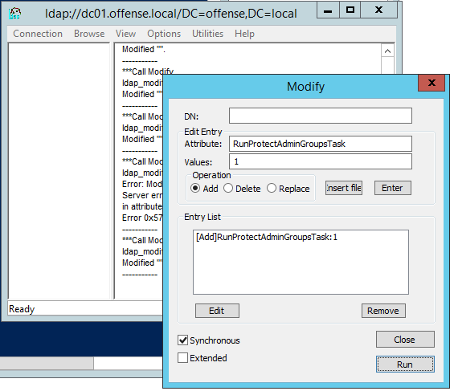
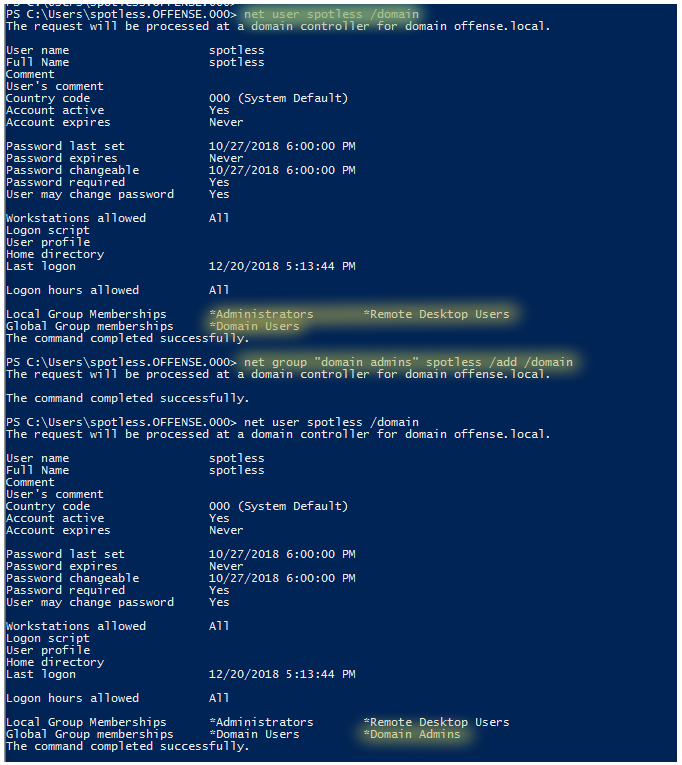

# Backdooring AdminSDHolder for Persistence

## AdminSDHolder

`AdminSDHolder` is a special AD container with some "default" security permissions that is used as a template for protected AD accounts and groups \(like Domain Admins, Enterprise Admins, etc.\) to prevent their accidental and unintended modifications, and to keep them secure.

Once you have agained Domain Admin privileges, `AdminSDHolder` container can be abused by backdooring it by giving your user `GenericAll` privileges, which effectively makes that user a Domain Admin.

## Execution

Backdooring the AdminSDHolder container by adding an ACL that provides user `spotless` with `GenericAll` rights for `Domain Admins` group:

```csharp
Add-ObjectAcl -TargetADSprefix 'CN=AdminSDHolder,CN=System' -PrincipalSamAccountName spotless -Verbose -Rights All
```


This is actually what happens to the container - the security ACLs get updated and `spotless` gets all the privileges:


After 60+ minutes, the changes will propagate automatically, but if you want to force it \(if you are testing this in your labs\), you can do it via ldp.exe by Modifying DN like so:



Now, confirming that the user spotless has got `GenericAll` privileges against `Domain Admins` group:

```csharp
Get-ObjectAcl -SamAccountName "Domain Admins" -ResolveGUIDs | ?{$_.IdentityReference -match 'spotless'}
```


We can now hop back to the Domain Admins any time we want to:



In fact, we do not even need to be part of DA group, we still have full access to the DC:


## References









