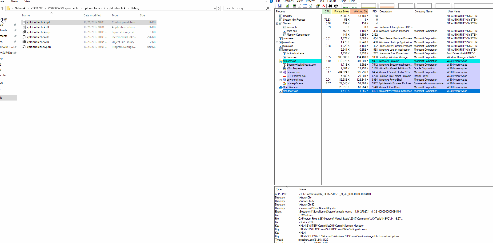

# Executing Code as a Control Panel Item through an Exported Cplapplet Function

This is a quick note that shows how to execute code in a .cpl file, which is a regular DLL file representing a Control Panel item.

The .cpl file needs to export a function `CplApplet` in order to be recognized by Windows as a Control Panel item.

Once the DLL is compiled and renamed to .CPL, it can simply be double clicked and executed like a regular Windows .exe file.

## Code


```cpp
// dllmain.cpp : Defines the entry point for the DLL application.
#include "stdafx.h"
#include <Windows.h>

//Cplapplet
extern "C" __declspec(dllexport) LONG Cplapplet(
	HWND hwndCpl,
	UINT msg,
	LPARAM lParam1,
	LPARAM lParam2
)
{
	MessageBoxA(NULL, "Hey there, I am now your control panel item you know.", "Control Panel", 0);
	return 1;
}

BOOL APIENTRY DllMain( HMODULE hModule,
                       DWORD  ul_reason_for_call,
                       LPVOID lpReserved
                     )
{
    switch (ul_reason_for_call)
    {
    case DLL_PROCESS_ATTACH:
	{
		Cplapplet(NULL, NULL, NULL, NULL);
	}
    case DLL_THREAD_ATTACH:
    case DLL_THREAD_DETACH:
    case DLL_PROCESS_DETACH:
        break;
    }
    return TRUE;
}
```


Once the DLL is compiled, we can see our exported function `Cplapplet`:


## Demo

Below shows that double-clicking the .cpl item is enough to launch it:




CPL file can also be launched with `control.exe <pathtothe.cpl>` like so:


or with rundll32:


```text
rundll32 shell32, Control_RunDLL \\VBOXSVR\Experiments\cpldoubleclick
\cpldoubleclick\Debug\cpldoubleclick.cpl
```



## References







