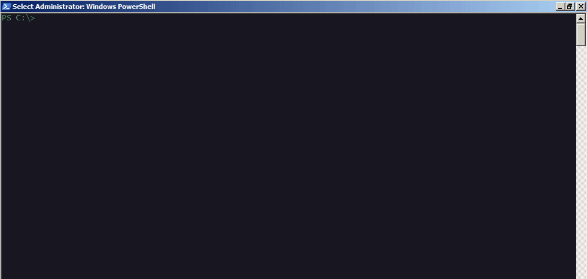
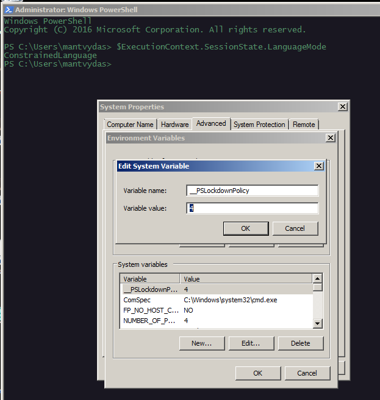
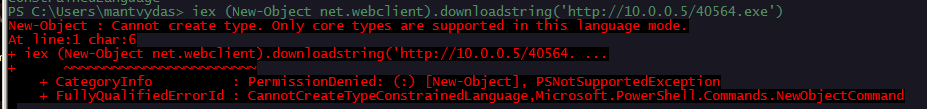
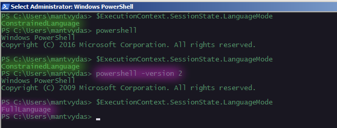

# Powershell Constrained Language Mode ByPass

Constrained Language Mode in short locks down the nice features of Powershell usually required for complex attacks to be carried out.

## Powershell Inside Powershell

For fun - creating another powershell instance inside powershell without actually spawning a new `powershell.exe` process:



## Constrained Language Mode

Enabling constrained language mode, that does not allow powershell execute complex attacks (i.e. mimikatz):

```csharp
[Environment]::SetEnvironmentVariable(‘__PSLockdownPolicy‘, ‘4’, ‘Machine‘)
```

Checking constrained language mode is enabled:

```csharp
PS C:\Users\mantvydas> $ExecutionContext.SessionState.LanguageMode
ConstrainedLanguage
```



With `ConstrainedLanguage`, trying to download a file from remote machine, we get `Access Denied`:



However, if you have access to the system and enough privileges to change environment variables, the lock can be lifted by removing the variable `__PSLockdownPolicy` and re-spawning another powershell instance.

### Powershell Downgrade

If you have the ability to downgrade to Powershell 2.0, this can allow you to bypass the `ConstrainedLanguage`mode. Note how `$ExecutionContext.SessionState.LanguageMode` keeps returning `ConstrainedLangue` in powershell instances that were not launched with `-version Powershell 2` until it does not:



## System32 Bypass

[Carrie Roberts](https://twitter.com/OrOneEqualsOne) discovered and wrote in her post [https://www.blackhillsinfosec.com/constrained-language-mode-bypass-when-pslockdownpolicy-is-used/](https://www.blackhillsinfosec.com/constrained-language-mode-bypass-when-pslockdownpolicy-is-used/) that there's another way to bypass the contrained language mode and it's super easy - the path from where your script is being executed, needs to contain the string `system32`, meaning even if you rename the script to `system32.ps1`, it should work, so let's try it and confirm it works:

```
PS>.\test.ps1; mv .\test.ps1 system32.ps1; .\system32.ps1
ConstrainedLanguage
FullLanguage

PS>cat .\system32.ps1
$ExecutionContext.SessionState.LanguageMode
```

## References








