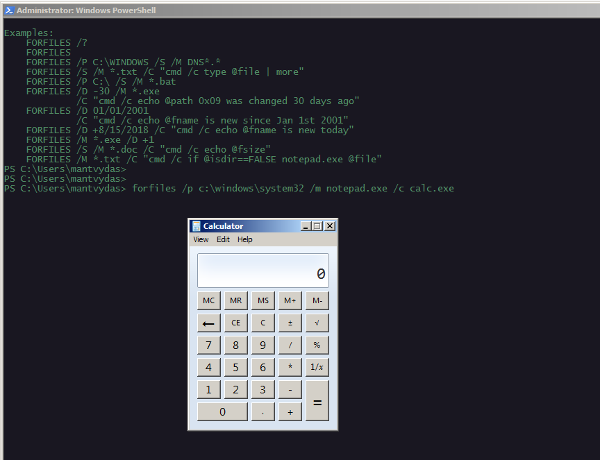
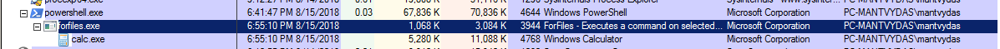
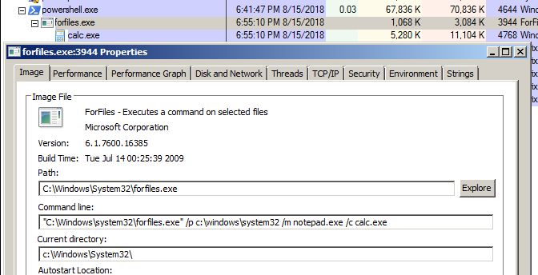

# T1202: Forfiles Indirect Command Execution

This technique launches an executable without a cmd.exe.

## Execution

```csharp
forfiles /p c:\windows\system32 /m notepad.exe /c calc.exe
```



## Observations

Defenders can monitor for process creation/commandline logs to detect this activity:





## References



