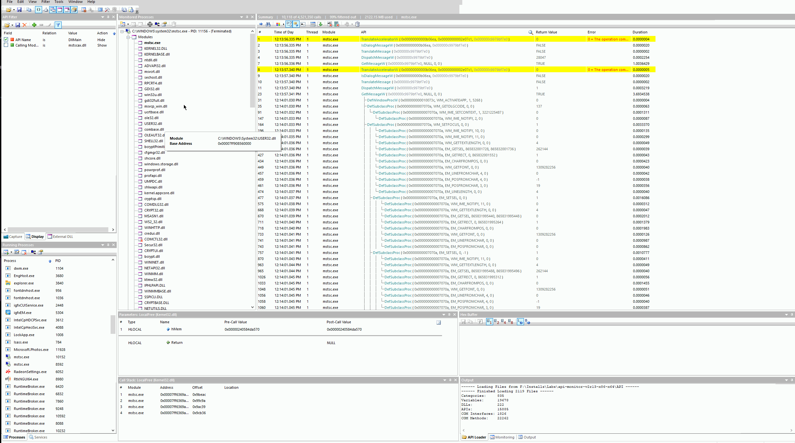
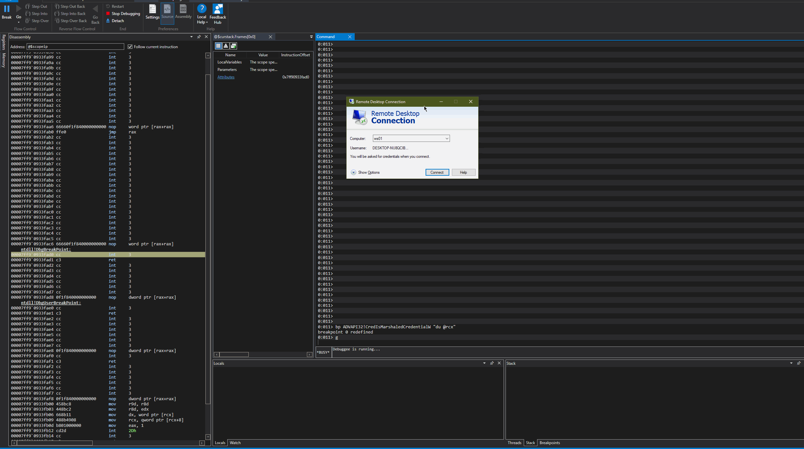
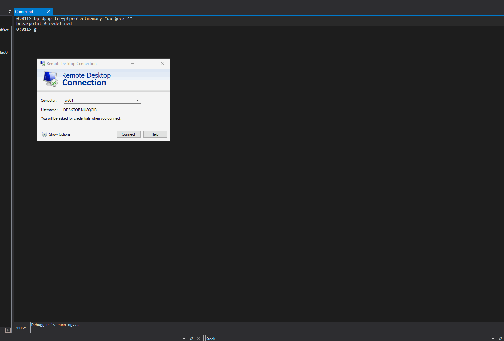
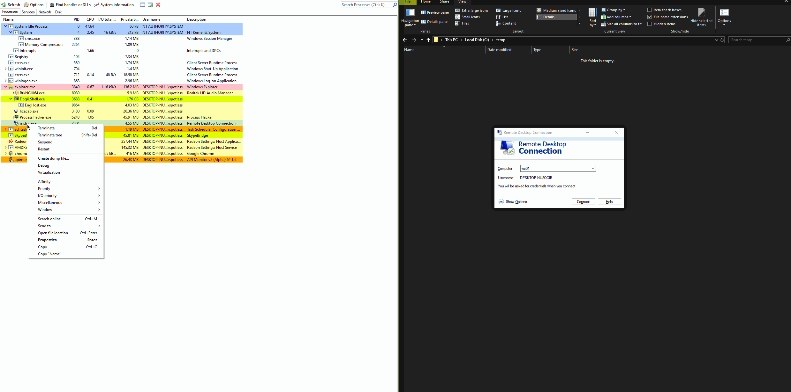
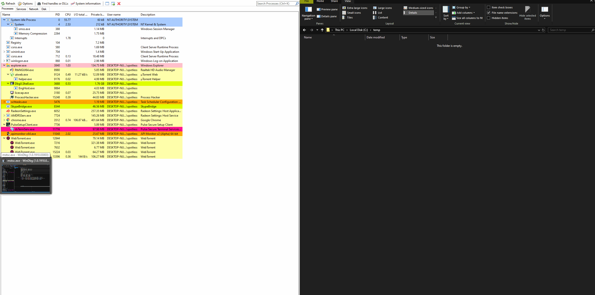

# API Monitoring for Offensive Tooling


WIP


[Rio Sherri](https://twitter.com/0x09al) recently posted about his new tool [RdpThief](https://www.mdsec.co.uk/2019/11/rdpthief-extracting-clear-text-credentials-from-remote-desktop-clients/) which I thought was simple and genius. It allows offensive operators to steal RDP credentials by:

* injecting into the RDP client mstc.exe
* hooking its functions responsible for dealing with user supplied credentials
* intercepting the supplied username, password, hostname 
* writing intercepted credentials and hostname a file for reading later.

I wanted to get a better feel of the process of discovering functions to be hooked, so these are some quick notes of me tinkering with [API Monitor](http://www.rohitab.com/apimonitor) and WinDBG and reproducing some of the steps Rio took during his research and development of [RdpThief](https://github.com/0x09AL/RdpThief). These notes will serve as a reference for future on how to identify and hook interesting functions for offensive tooling.

## Execution

If we launch mstc.exe and attempt connecting to a remote host WS01:


We are prompted to enter credentials. I used `desktop-nu8qcib\spotless` as a username:


If API monitor was attached to mstc.exe when we tried to authenticate to the remote host WS01, we should now have a huge list of API calls invoked by mstsc.exe and its module logged.

### Intercepting Username

If we search for a string `spotless`, we will find some functions that took `spotless` as a string argument and one of those functions will be `CredIsMarshaledCredentialW` as shown below: 




In WinDBG, if we put a breakpoint on `ADVAPI32!CredIsMarshaledCredentialW` and print out its first and only argument \(stored in RCX register for 64bit architecture\), we will see `DESKTOP-NU8QCIB\spotless` printed out:

```c
bp ADVAPI32!CredIsMarshaledCredentialW "du @rcx"
```




### Intercepting Hostname

To find the hostname of the RDP connection, find API calls made that took `ws01` \(our hostname\) as a string argument. Although RdpThief hooks `SSPICLI!SspiPrepareForCredRead` \(hostname supplied as a second argument\), another function that could be considered for hooking is `CredReadW` \(hostname a the first argument\) as seen below:


If we jump back to WinDBG and set another breakpoint for `CredReadW` and attempt to RDP to our host `ws01`, we get a hit:

```cpp
bp ADVAPI32!CredReadW "du @rcx"
```


Out of curiosity, let's also put a breakpoint on `SSPICLI!SspiPrepareForCredRead` and once it's hit, print out the second argument supplied to the function, which is stored in the RDX register:

```text
bp SSPICLI!SspiPrepareForCredRead
du @rdx
```


### Intercepting Password

We now know the functions required to hook for intercepting the username and the hostname. What's left is hooking the function that deals with the user supplied passoword and from Rio's article, we know it's the DPAPI CryptProtectMemory. 

Weirdly, searching for a string with my password resulted in nothing. Reviewing `CryptProtectMemory` calls manually in API Monitor showed no plaintext password although there were multiple calls to the function. I could see the password already encrypted - note how the size of the encrypted blob is 32 bytes - we will come back to this in WinDBG:


I could, however, see the unencrypted password in the `CryptUnprotectMemory` call, so I guess this is another function you could consider hooking for nefarious purposes:


Let's now check what we can see in WinDBG if we hit the breakpoint on `CryptProtectMemory` and print out a unicode string starting 4 bytes into the address \(first 4 bytes indicate the size of the encrypted data\) pointed by RCX register:

```cpp
bp dpapi!cryptprotectmemory "du @rcx+4"
```

Below shows the plain text password on a second break:




Earlier, I emphasized the 32 bytes encrypted blob seen in `CryptProtectMemory` function call and also mentioned the 4 byte offset into RCX that holds the size of the encrypted blob - below shows and confirms that - first 4 bytes found at RCX are 0x20 or 32 in decimal:


## Demo

Compiling RdpThief provides us with 2 DLLs for 32 and 64 bit architectures. Let's inject the 64 bit DLL into mstc.exe with Process Hacker and attempt to connect to `ws01`:



Also, I wanted to confirm if my previous hypothesis about hooking `CredReadW` for intercepting the hostname was possible, so I made some quick changes to the RdpThief's project to test it - commented out the `_SspiPrepareForCredRead` signature and hooked `CreadReadW` with a new function called `HookedCredReadW` which will pop a message box each time `CredReadW` is called and print its first argument as the message box text. Also, it will update the `lpServer` variable which is later written to the file creds.txt together with the username and password:


Of course, we need to register the new hook `HookedCredReadW` and unregist the old hook `_SspiPrepareForCredRead`:


Compiling and injecting the new RdpThief DLL confirms that the `CredReadW` can be used to intercept the the hostname:



## References









